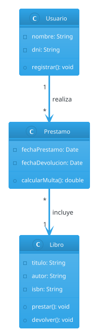
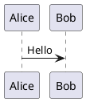
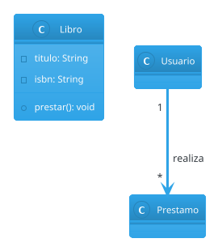

# Guía Completa: Diagramas de Clases en PlantUML

:::{seealso}
Editor online para crear el dibujo y exportar imágenes disponible en [PlantUML Online](https://www.plantuml.com/plantuml/uml/)
:::

:::{tip}
PlantUML se integra con la mayoría de IDEs (VS Code, IntelliJ, Eclipse) mediante extensiones, lo que permite previsualizar los diagramas mientras se codifican.
:::

## ¿Qué es un Diagrama de Clases?

Un **diagrama de clases** es una representación visual de las clases, atributos, métodos y relaciones entre clases en un sistema orientado a objetos. Es parte esencial de UML (Lenguaje Unificado de Modelado) y se usa para el diseño y la documentación de software.

Un diagrama de clases muestra:

- **Clases**: Los bloques constructivos del sistema
- **Atributos**: Las propiedades o datos de cada clase
- **Métodos**: Las operaciones que puede realizar cada clase
- **Relaciones**: Cómo las clases se conectan entre sí

---

## ¿Qué es PlantUML?

**PlantUML** es una herramienta que permite crear diagramas a partir de texto plano. Es ideal para programadores porque permite versionar diagramas y mantenerlos junto al código fuente.

### Ventajas de usar PlantUML

- **Versionable**: Los archivos de texto plano se integran con Git
- **Reproducible**: El mismo código genera siempre el mismo diagrama
- **Portable**: No requiere software propietario de diseño
- **Automatizable**: Se puede integrar en pipelines de CI/CD

---

## Estructura básica de un archivo PlantUML

```{code} plantuml
:caption: Estructura básica
@startuml

' Aquí van las definiciones de clases, interfaces y relaciones
' Los comentarios empiezan con comilla simple

@enduml
```

Todo diagrama comienza con `@startuml` y termina con `@enduml`. Opcionalmente, se puede nombrar el diagrama:

```{code} plantuml
:caption: Diagrama con nombre
@startuml mi_diagrama

class MiClase

@enduml
```

---

## Cómo definir una clase

### Sintaxis básica

```{code} plantuml
:caption: Definición de clase con atributos y métodos
class Persona {
  -nombre: String
  -edad: int
  +hablar(): void
}
```

### Sintaxis alternativa (estilo Java)

PlantUML también acepta la notación de tipo al estilo Java:

```{code} plantuml
:caption: Notación estilo Java
class Persona {
  -String nombre
  -int edad
  +void hablar()
}
```

### Miembros estáticos y finales

```{code} plantuml
:caption: Miembros estáticos y constantes
class Configuracion {
  {static} -instancia: Configuracion
  {static} +obtenerInstancia(): Configuracion
  
  {field} MAX_CONEXIONES: int = 100
}
```

Los miembros estáticos se muestran subrayados en el diagrama. Para constantes, usá `{field}` o simplemente escribí el valor.

:::{table} Convenciones de visibilidad
:label: tbl-visibilidad-plantuml

| Símbolo | Visibilidad | Descripción |
| :---: | :--- | :--- |
| `+` | público (`public`) | Accesible desde cualquier clase |
| `-` | privado (`private`) | Solo accesible desde la misma clase |
| `#` | protegido (`protected`) | Accesible desde subclases |
| `~` | paquete (`package`) | Accesible dentro del mismo paquete |

:::

---

## Interfaces

### Definición básica

```{code} plantuml
:caption: Definición de interfaz
interface Volador {
  +volar(): void
}
```

### Interfaz con múltiples métodos

```{code} plantuml
:caption: Interfaz completa
interface Comparable<T> {
  +compareTo(otro: T): int
  +equals(obj: Object): boolean
}
```

### Notación abreviada

Para interfaces simples, se puede usar notación de círculo:

```{code} plantuml
:caption: Notación de círculo (lollipop)
interface Serializable

class Documento
Documento -|> Serializable
```

---

## Herencia y relaciones

PlantUML ofrece varias formas de representar las relaciones entre clases. Las flechas pueden escribirse de izquierda a derecha o viceversa.

### Herencia (generalización)

La herencia representa una relación "es un". Se denota con una flecha con triángulo vacío.

```{code} plantuml
:caption: Herencia con extends
class Animal
class Perro extends Animal
```

O bien con flechas:

```{code} plantuml
:caption: Herencia con notación de flecha
@startuml
Animal <|-- Perro
Animal <|-- Gato
Animal <|-- Pajaro
@enduml
```

### Implementación de interfaz

La implementación muestra que una clase cumple con el contrato de una interfaz. Se representa con línea punteada y triángulo vacío.

```{code} plantuml
:caption: Implementación de interfaz
@startuml
interface Volador {
  +volar(): void
}

class Pajaro {
  -nombre: String
  +volar(): void
}

Volador <|.. Pajaro
@enduml
```

### Asociación

La asociación representa una relación "usa a" o "conoce a". Se denota con una flecha simple.

```{code} plantuml
:caption: Asociación simple
@startuml
class Persona {
  -nombre: String
}

class Direccion {
  -calle: String
  -numero: int
}

Persona --> Direccion : vive en
@enduml
```

### Composición

La composición es una relación "tiene un" fuerte donde el componente no puede existir sin el contenedor. Se representa con un diamante relleno.

```{code} plantuml
:caption: Composición (relación fuerte)
@startuml
class Auto {
  -patente: String
}

class Motor {
  -cilindrada: int
}

Auto *-- Motor : tiene
@enduml
```

:::{note}
En la composición, si se destruye el `Auto`, también se destruye el `Motor`. El motor no tiene sentido fuera del contexto del auto.
:::

### Agregación

La agregación es una relación "tiene un" débil donde el componente puede existir independientemente. Se representa con un diamante vacío.

```{code} plantuml
:caption: Agregación (relación débil)
@startuml
class Departamento {
  -nombre: String
}

class Profesor {
  -legajo: int
}

Departamento o-- Profesor : emplea
@enduml
```

:::{note}
En la agregación, un `Profesor` puede existir sin pertenecer a un `Departamento`, y puede cambiar de departamento.
:::

### Dependencia

La dependencia indica que una clase usa otra temporalmente (por ejemplo, como parámetro de método). Se representa con línea punteada.

```{code} plantuml
:caption: Dependencia
@startuml
class Impresora {
  +imprimir(doc: Documento): void
}

class Documento {
  -contenido: String
}

Impresora ..> Documento : usa
@enduml
```

### Tabla resumen de relaciones

:::{table} Tipos de relaciones UML en PlantUML
:label: tbl-relaciones-plantuml

| Relación | Símbolo | Descripción | Ejemplo |
| :--- | :---: | :--- | :--- |
| Herencia | `<\|--` | "es un" | `Animal <\|-- Perro` |
| Implementación | `<\|..` | implementa interfaz | `Volador <\|.. Pajaro` |
| Asociación | `-->` | "conoce a" | `Persona --> Direccion` |
| Composición | `*--` | "tiene un" (fuerte) | `Auto *-- Motor` |
| Agregación | `o--` | "tiene un" (débil) | `Departamento o-- Profesor` |
| Dependencia | `..>` | "usa" temporalmente | `Impresora ..> Documento` |

:::

---

## Clase abstracta

Las clases abstractas se declaran con la palabra clave `abstract` y se muestran en itálica.

```{code} plantuml
:caption: Clase abstracta
abstract class Figura {
  #nombre: String
  +area(): float
  +perimetro(): float
  {abstract} +dibujar(): void
}
```

:::{tip}
Los métodos abstractos se marcan con `{abstract}` y no tienen implementación. Las subclases deben implementarlos.
:::

---

## Cardinalidad (multiplicidad)

La cardinalidad indica cuántas instancias participan en una relación.

```{code} plantuml
:caption: Relaciones con cardinalidad
@startuml
class Empresa {
  -nombre: String
}

class Empleado {
  -legajo: int
}

class Proyecto {
  -codigo: String
}

Empresa "1" -- "1..*" Empleado : contrata
Empleado "1..*" -- "*" Proyecto : trabaja en
@enduml
```

:::{table} Notaciones de cardinalidad
:label: tbl-cardinalidad

| Notación | Significado |
| :---: | :--- |
| `1` | Exactamente uno |
| `0..1` | Cero o uno (opcional) |
| `*` | Cero o más |
| `1..*` | Uno o más |
| `n..m` | Entre n y m |

:::

---

## Enumeraciones

Las enumeraciones se definen con la palabra clave `enum`.

```{code} plantuml
:caption: Definición de enum
@startuml
enum DiaSemana {
  LUNES
  MARTES
  MIERCOLES
  JUEVES
  VIERNES
  SABADO
  DOMINGO
}

enum EstadoPedido {
  PENDIENTE
  PROCESANDO
  ENVIADO
  ENTREGADO
  CANCELADO
}

class Pedido {
  -fecha: Date
  -estado: EstadoPedido
}

Pedido --> EstadoPedido
@enduml
```

---

## Genéricos (Templates)

PlantUML soporta la notación de genéricos.

```{code} plantuml
:caption: Clases genéricas
@startuml
class Lista<T> {
  -elementos: T[]
  +agregar(elemento: T): void
  +obtener(indice: int): T
  +tamanio(): int
}

class Mapa<K, V> {
  +poner(clave: K, valor: V): void
  +obtener(clave: K): V
  +contieneClave(clave: K): boolean
}

class ListaEnteros {
}

Lista <|-- ListaEnteros : <<bind>> T::Integer
@enduml
```

---

## Notas y comentarios en el diagrama

Las notas agregan documentación visual al diagrama.

```{code} plantuml
:caption: Notas en el diagrama
@startuml
class Usuario {
  -id: int
  -email: String
  +validarEmail(): boolean
}

note left of Usuario : Esta clase representa\na un usuario del sistema

note right of Usuario::validarEmail
  Verifica que el email
  tenga formato válido
end note

note "Nota flotante" as N1
Usuario .. N1
@enduml
```

---

## Ejemplo completo

```{code} plantuml
:caption: Diagrama de clases completo
@startuml

abstract class Figura {
  +area(): float
}

class Rectangulo {
  -base: float
  -altura: float
  +area(): float
}

class Circulo {
  -radio: float
  +area(): float
}

Figura <|-- Rectangulo
Figura <|-- Circulo

@enduml
```

---

## Estilos mínimos (opcional)

```{code} plantuml
:caption: Configuración de estilos
skinparam classAttributeIconSize 0
skinparam shadowing true
skinparam classFontColor DarkGreen
```

Estos parámetros cambian el estilo visual del diagrama.

---

## Buenas prácticas

:::{tip}
- Usá nombres significativos para clases y atributos.
- No satures el diagrama con detalles irrelevantes.
- Agrupá clases relacionadas con `package` si el sistema es grande.
:::

```{code} plantuml
:caption: Agrupación con packages
package "Sistema de Usuarios" {
  class Usuario
  class Rol
}
```

---

## Ejemplo completo: Sistema de Biblioteca

Este ejemplo integra todos los conceptos vistos en un diagrama realista.

```{code} plantuml
:caption: Sistema de gestión de biblioteca
@startuml
skinparam classAttributeIconSize 0

' Enumeraciones
enum EstadoLibro {
  DISPONIBLE
  PRESTADO
  EN_REPARACION
  PERDIDO
}

enum TipoUsuario {
  ESTUDIANTE
  DOCENTE
  ADMINISTRATIVO
}

' Interfaces
interface Prestable {
  +prestar(usuario: Usuario): boolean
  +devolver(): void
  +estaDisponible(): boolean
}

' Clases abstractas
abstract class Persona {
  #dni: String
  #nombre: String
  #email: String
  +{abstract} validar(): boolean
}

' Clases concretas
class Usuario {
  -tipo: TipoUsuario
  -fechaAlta: Date
  -prestamosActivos: int
  +puedeRetirar(): boolean
  +validar(): boolean
}

class Bibliotecario {
  -legajo: int
  -turno: String
  +registrarPrestamo(p: Prestamo): void
  +validar(): boolean
}

class Libro {
  -isbn: String
  -titulo: String
  -anioPublicacion: int
  -estado: EstadoLibro
  +prestar(usuario: Usuario): boolean
  +devolver(): void
  +estaDisponible(): boolean
}

class Autor {
  -nombre: String
  -nacionalidad: String
}

class Editorial {
  -nombre: String
  -pais: String
}

class Prestamo {
  -fechaPrestamo: Date
  -fechaDevolucion: Date
  -fechaLimite: Date
  +estaVencido(): boolean
  +calcularMulta(): float
}

class Biblioteca {
  -nombre: String
  -direccion: String
  +buscarLibro(titulo: String): Libro[]
  +registrarUsuario(u: Usuario): void
}

' Relaciones
Persona <|-- Usuario
Persona <|-- Bibliotecario

Prestable <|.. Libro

Libro --> EstadoLibro
Usuario --> TipoUsuario

Libro "1..*" -- "1..*" Autor : escrito por
Libro "*" -- "1" Editorial : publicado por

Prestamo "1" --> "1" Libro : sobre
Prestamo "1" --> "1" Usuario : a
Prestamo "1" --> "1" Bibliotecario : registrado por

Biblioteca "1" *-- "*" Libro : contiene
Biblioteca "1" o-- "*" Usuario : atiende

@enduml
```

---

## Control de disposición (Layout)

PlantUML intenta organizar automáticamente los elementos, pero se puede influir en la disposición.

### Dirección de las flechas

```{code} plantuml
:caption: Flechas y disposición
@startuml
' Flechas horizontales (doble guión)
A -- B
C -- D

' Flechas verticales (guión simple, orientación por defecto)
E - F

' Dirección explícita
left to right direction

class Izquierda
class Derecha
Izquierda --> Derecha
@enduml
```

### Ocultar elementos

```{code} plantuml
:caption: Ocultar secciones
@startuml
hide empty members
hide circle

class Simple {
  -dato: int
}
@enduml
```

---

## Estereotipos y decoradores

Los estereotipos añaden información semántica a las clases.

```{code} plantuml
:caption: Estereotipos personalizados
@startuml
class ControladorUsuario <<Controller>> {
  +listar(): List<Usuario>
  +crear(datos: Map): Usuario
}

class ServicioEmail <<Service>> {
  +enviar(destinatario: String, mensaje: String): void
}

class RepositorioUsuario <<Repository>> {
  +guardar(u: Usuario): void
  +buscarPorId(id: int): Usuario
}

class Usuario <<Entity>> {
  -id: int
  -nombre: String
}

ControladorUsuario --> ServicioEmail
ControladorUsuario --> RepositorioUsuario
RepositorioUsuario --> Usuario
@enduml
```

---

## Patrones de diseño comunes

### Patrón Singleton

```{code} plantuml
:caption: Patrón Singleton
@startuml
class Configuracion {
  {static} -instancia: Configuracion
  -propiedades: Map<String, String>
  -Configuracion()
  {static} +obtenerInstancia(): Configuracion
  +obtenerPropiedad(clave: String): String
}

note right of Configuracion
  Constructor privado
  impide instanciación externa
end note
@enduml
```

### Patrón Observer

```{code} plantuml
:caption: Patrón Observer
@startuml
interface Observador {
  +actualizar(evento: Evento): void
}

interface Sujeto {
  +agregarObservador(o: Observador): void
  +eliminarObservador(o: Observador): void
  +notificar(): void
}

class SensorTemperatura {
  -temperatura: float
  -observadores: List<Observador>
  +agregarObservador(o: Observador): void
  +eliminarObservador(o: Observador): void
  +notificar(): void
  +setTemperatura(t: float): void
}

class PanelDisplay {
  -ultimaLectura: float
  +actualizar(evento: Evento): void
  +mostrar(): void
}

class AlertaEmail {
  -umbral: float
  +actualizar(evento: Evento): void
}

Sujeto <|.. SensorTemperatura
Observador <|.. PanelDisplay
Observador <|.. AlertaEmail

SensorTemperatura --> "*" Observador : notifica a
@enduml
```

### Patrón Strategy

```{code} plantuml
:caption: Patrón Strategy
@startuml
interface EstrategiaOrdenamiento {
  +ordenar(lista: List<T>): List<T>
}

class OrdenamientoBurbuja {
  +ordenar(lista: List<T>): List<T>
}

class OrdenamientoRapido {
  +ordenar(lista: List<T>): List<T>
}

class OrdenamientoMerge {
  +ordenar(lista: List<T>): List<T>
}

class Contexto {
  -estrategia: EstrategiaOrdenamiento
  +setEstrategia(e: EstrategiaOrdenamiento): void
  +ejecutarOrdenamiento(lista: List<T>): List<T>
}

EstrategiaOrdenamiento <|.. OrdenamientoBurbuja
EstrategiaOrdenamiento <|.. OrdenamientoRapido
EstrategiaOrdenamiento <|.. OrdenamientoMerge

Contexto --> EstrategiaOrdenamiento : usa
@enduml
```

---

## Estilos avanzados

### Colores y temas

```{code} plantuml
:caption: Personalización de colores
@startuml
skinparam class {
  BackgroundColor<<Entity>> LightYellow
  BackgroundColor<<Service>> LightBlue
  BackgroundColor<<Repository>> LightGreen
  BorderColor Black
  ArrowColor DarkBlue
}

skinparam stereotypeCBackgroundColor<<Entity>> Yellow
skinparam stereotypeCBackgroundColor<<Service>> Blue

class Usuario <<Entity>> {
  -id: int
}

class ServicioUsuario <<Service>> {
  +buscar(id: int): Usuario
}

class RepositorioUsuario <<Repository>> {
  +guardar(u: Usuario): void
}

ServicioUsuario --> RepositorioUsuario
RepositorioUsuario --> Usuario
@enduml
```

### Temas predefinidos

PlantUML incluye varios temas listos para usar:

```{code} plantuml
:caption: Uso de temas
@startuml
!theme cerulean

class Usuario {
  -nombre: String
}

class Perfil {
  -avatar: String
}

Usuario --> Perfil
@enduml
```

Algunos temas disponibles: `cerulean`, `materia`, `sketchy`, `blueprint`, `plain`.

---

## Incrustar diagramas PlantUML en archivos Markdown de GitHub

Esta sección explica cómo incluir diagramas PlantUML en documentos Markdown en repositorios de GitHub.

### Método 1: PlantUML Proxy URL (Recomendado)

GitHub no renderiza PlantUML directamente, pero podés usar el servidor público de PlantUML como proxy:

````markdown

````

**Ventajas:**
- Se actualiza automáticamente cuando modificás el archivo `.puml`
- No requiere generar imágenes manualmente
- Versionable: el código PlantUML está en el repo

**Desventajas:**
- Requiere conexión a internet para visualizar
- Dependencia de servidor externo

#### Paso a paso:

**1. Crear archivo PlantUML en el repositorio:**

Estructura de carpetas sugerida:
```
mi-proyecto/
├── README.md
├── docs/
│   └── arquitectura.md
└── diagramas/
    ├── biblioteca.puml
    └── clases-dominio.puml
```

**2. Contenido de `diagramas/biblioteca.puml`:**



**3. Referenciar en `README.md` o cualquier `.md`:**

```markdown
## Arquitectura del Sistema

El siguiente diagrama muestra las clases principales:


```

**Importante:** Reemplazar `usuario/repo/main` con tu información:
- `usuario`: tu usuario de GitHub
- `repo`: nombre del repositorio
- `main`: rama (puede ser `master`, `develop`, etc.)

### Método 2: PlantUML Encoded URL

Para diagramas cortos, podés codificar el PlantUML directamente en la URL:

**1. Codificar tu diagrama:**

Visitar [PlantUML Web Server](http://www.plantuml.com/plantuml/uml/) y copiar el código codificado de la URL.

Ejemplo de código PlantUML:


**2. URL generada:**
```
http://www.plantuml.com/plantuml/png/SoWkIImgAStDuNBAJrBGjLDmpCbCJbMmKiX8pSd9vt98pKi1IW80
```

**3. Usar en Markdown:**

```markdown

```

**Ventajas:**
- No requiere archivos separados
- Funciona inmediatamente

**Desventajas:**
- Difícil de mantener (URL codificada no es legible)
- No recomendado para diagramas complejos

### Método 3: Exportar como imagen (Control total)

Para proyectos que requieren control total sobre las imágenes:

**1. Generar imagen localmente:**

```bash
# Instalar PlantUML (requiere Java)
# En Linux/Mac con brew:
brew install plantuml

# En Windows, descargar JAR de plantuml.com

# Generar SVG (recomendado por escalabilidad)
plantuml -tsvg diagramas/biblioteca.puml

# O generar PNG
plantuml -tpng diagramas/biblioteca.puml
```

**2. Estructura de carpetas:**

```
mi-proyecto/
├── README.md
├── diagramas/
│   ├── biblioteca.puml        # Fuente versionable
│   └── rendered/
│       └── biblioteca.svg     # Imagen generada
```

**3. Agregar al `.gitignore` (opcional):**

Si querés versionar solo el `.puml` y regenerar imágenes en CI/CD:

```gitignore
diagramas/rendered/*.svg
diagramas/rendered/*.png
```

**4. Referenciar en Markdown:**

```markdown

```

**Ventajas:**
- No depende de servicios externos
- Control total sobre el renderizado
- Funciona offline

**Desventajas:**
- Requiere regenerar manualmente (o con CI/CD)
- Imágenes pueden quedar desactualizadas

### Método 4: GitHub Actions para auto-generar imágenes (Avanzado)

Automatizar la generación de imágenes cada vez que se actualiza un `.puml`:

**1. Crear workflow `.github/workflows/plantuml.yml`:**

```yaml
name: Generate PlantUML Diagrams

on:
  push:
    paths:
      - 'diagramas/**.puml'
  pull_request:
    paths:
      - 'diagramas/**.puml'

jobs:
  generate:
    runs-on: ubuntu-latest
    steps:
      - name: Checkout code
        uses: actions/checkout@v3
        
      - name: Generate diagrams
        uses: cloudbees/plantuml-github-action@master
        with:
          args: -v -tsvg diagramas/*.puml -o rendered
          
      - name: Commit generated images
        run: |
          git config --local user.email "action@github.com"
          git config --local user.name "GitHub Action"
          git add diagramas/rendered/*.svg
          git diff --quiet && git diff --staged --quiet || git commit -m "Auto-generate PlantUML diagrams"
          git push
```

**2. Resultado:**
- Cada commit que modifica `.puml` regenera automáticamente las imágenes
- Las imágenes se commitean al repo
- Los README.md ven siempre la última versión

### Mejores prácticas para GitHub Markdown

#### 1. Estructura de carpetas recomendada

```
proyecto/
├── README.md
├── docs/
│   ├── arquitectura.md
│   └── diseño.md
└── diagramas/
    ├── README.md               # Índice de diagramas
    ├── dominio/
    │   ├── clases.puml
    │   └── relaciones.puml
    ├── secuencia/
    │   └── flujo-prestamo.puml
    └── rendered/               # Si usás Método 3
        ├── clases.svg
        └── flujo-prestamo.svg
```

#### 2. Usar `cache=no` en URLs de proxy

Para asegurar que GitHub muestre la última versión:

```markdown

```

Sin `cache=no`, GitHub puede mostrar versión en caché.

#### 3. Agregar texto alternativo descriptivo

```markdown

```

El texto alternativo:
- Mejora accesibilidad
- Se muestra si la imagen no carga
- Ayuda a motores de búsqueda

#### 4. Crear índice de diagramas

En `diagramas/README.md`:

```markdown
# Diagramas del Proyecto

## Dominio

- [Clases principales](dominio/clases.puml) - Modelo de dominio básico
  
  

- [Relaciones](dominio/relaciones.puml) - Asociaciones entre entidades

  

## Secuencias

- [Flujo de préstamo](secuencia/flujo-prestamo.puml)

  
```

#### 5. Comentar archivos `.puml` extensamente



### Solución de problemas comunes en GitHub

#### Problema: Imagen no se muestra en GitHub

**Posibles causas:**

1. **URL incorrecta:**
   - Verificar que la rama sea correcta (`main` vs `master`)
   - Verificar que el path al archivo sea correcto
   - Usar `raw.githubusercontent.com`, NO `github.com`

2. **Archivo `.puml` con errores:**
   - Probar en [PlantUML Web Server](http://www.plantuml.com/plantuml/uml/)
   - Verificar sintaxis con `plantuml -syntax archivo.puml`

3. **Servidor PlantUML caído:**
   - Probar URL directamente en navegador
   - Considerar servidor alternativo: `https://kroki.io/plantuml/svg/...`

#### Problema: Cambios no se reflejan

**Solución:** Agregar `cache=no` y refrescar navegador con Ctrl+F5.

```markdown

```

#### Problema: Diagrama muy grande en GitHub

**Solución 1:** Usar HTML en Markdown (GitHub lo soporta):

```html

```

**Solución 2:** Dividir en múltiples diagramas más pequeños.

#### Problema: Necesito diagrama privado

**Solución:** Usar Método 3 (exportar imagen) en repositorio privado. El Método 1 (proxy) no funciona con repos privados porque `raw.githubusercontent.com` requiere autenticación.

### Comparación de métodos

| Método | Versionable | Auto-actualiza | Offline | Privado | Dificultad |
|--------|-------------|----------------|---------|---------|------------|
| 1. Proxy URL | ✅ | ✅ | ❌ | ❌ | Fácil |
| 2. Encoded URL | ❌ | ❌ | ❌ | ✅ | Fácil |
| 3. Exportar imagen | ✅ | ❌ | ✅ | ✅ | Media |
| 4. GitHub Actions | ✅ | ✅ | ✅ | ✅ | Difícil |

**Recomendación general:**
- **Repositorio público + diagrama simple:** Método 1 (Proxy URL)
- **Repositorio privado:** Método 3 (Exportar) + Método 4 (Actions)
- **Diagrama muy corto (< 5 líneas):** Método 2 (Encoded)

### Ejemplo completo: README.md con PlantUML

```markdown
# Sistema de Biblioteca

Sistema para gestión de préstamos de libros desarrollado en Java.

## Arquitectura

### Diagrama de clases del dominio

El siguiente diagrama muestra las entidades principales y sus relaciones:


**Descripción:**
- `Libro`: Representa un material prestable
- `Usuario`: Cliente de la biblioteca
- `Prestamo`: Relación entre usuario y libro con fechas

### Diagrama de secuencia: Realizar préstamo

Flujo de operaciones cuando un usuario solicita un libro:


## Código fuente

Ver [diagramas/](diagramas/) para código PlantUML completo.

## Instalación

\```bash
git clone https://github.com/usuario/repo.git
cd repo
./gradlew build
\```
```

### Plantilla de archivo `.puml` para GitHub

```plantuml
@startuml
' ============================================
' Nombre: diagrama-ejemplo.puml
' Proyecto: Sistema de Biblioteca
' Descripción: [Describir qué muestra el diagrama]
' Versión: 1.0
' Última modificación: 2024-04-14
' ============================================

' Configuración de estilo
!theme cerulean
skinparam classAttributeIconSize 0

' ============================================
' CLASES PRINCIPALES
' ============================================

class Libro {
  -titulo: String
  -autor: String
  -isbn: String
  --
  +prestar(): void
  +devolver(): void
}

class Usuario {
  -nombre: String
  -dni: String
  --
  +registrar(): void
}

' ============================================
' RELACIONES
' ============================================

' Un usuario puede tener múltiples préstamos activos
Usuario "1" --> "*" Prestamo : realiza

' Cada préstamo está asociado a exactamente un libro
Prestamo "*" --> "1" Libro : incluye

@enduml
```



### Recursos adicionales para GitHub

- [PlantUML Cheat Sheet](https://plantuml.com/sitemap-language-specification)
- [PlantUML Web Server](http://www.plantuml.com/plantuml/uml/) - Para probar diagramas
- [Awesome PlantUML](https://github.com/plantuml/awesome-plantuml) - Recursos y ejemplos
- [Kroki](https://kroki.io/) - Servidor alternativo para renderizar PlantUML

---

## Ejercicios propuestos

```{exercise}
:label: ej-plantuml-1
Creá un diagrama de clases para un sistema de e-commerce que incluya: `Producto`, `Carrito`, `Usuario`, `Pedido` y `MetodoPago` (como interfaz). Incluí cardinalidades apropiadas.
```

```{exercise}
:label: ej-plantuml-2
Modelá un sistema de gestión de hospital con: `Persona` (abstracta), `Paciente`, `Medico`, `Enfermero`, `Cita`, `Especialidad` (enum). Usá herencia y composición donde corresponda.
```

```{exercise}
:label: ej-plantuml-3
Diseñá el patrón Factory Method para crear diferentes tipos de documentos (`PDF`, `Word`, `HTML`) usando una interfaz `Documento` y una clase abstracta `CreadorDocumento`.
```

---

## Referencias y recursos adicionales

:::{seealso}
- [Documentación oficial de PlantUML](https://plantuml.com/class-diagram)
- [Guía de referencia rápida](https://plantuml.com/guide)
- [Galería de ejemplos](https://real-world-plantuml.com/)
:::
