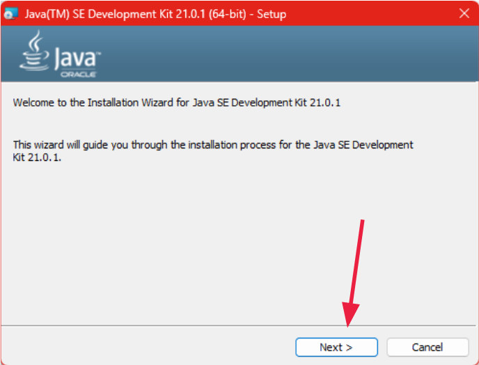
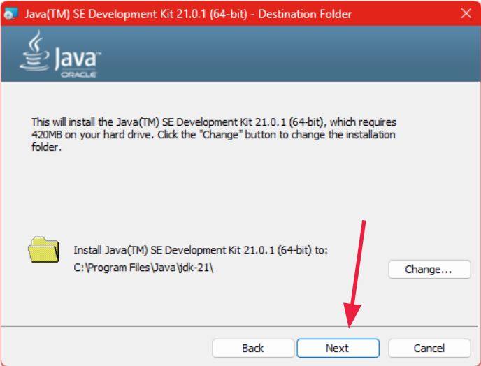
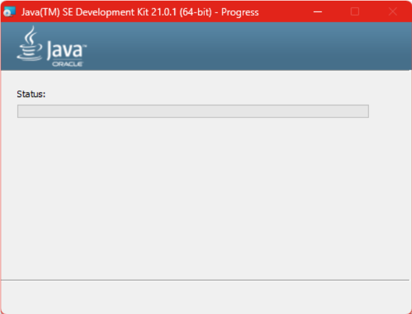
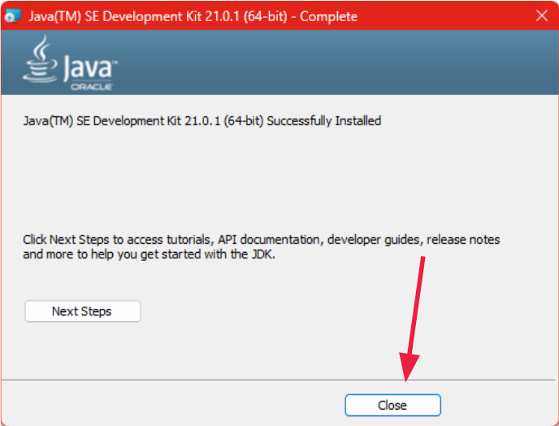

# Instalación paso a paso JDK

## Descarga

Durante la cursada, utilizaremos la versión del [JDK 21](https://download.oracle.com/java/21/latest/jdk-21_windows-x64_bin.exe),
la misma es una versión de [soporte extendido (LTS)](https://www.oracle.com/java/technologies/java-se-support-roadmap.html) por lo que es más conservadora en cambios.

:::{note}
Java es un lenguaje en constante cambio, esta forma de liberar al público las mejoras facilita que aquellos
que no puedan tomar el riesgo de probar algo experimental puedan utilizarlo de manera más segura.

Dejando la posibilidad a que los desarrolladores experimenten con las mejoras.
:::

## Instalador

### Paso 1


### Paso 2


### Paso 3


### Paso 4


### Paso 5

- **En Windows**: reiniciar.
- **En Linux**: abrir una nueva terminal.

## Verificación

Ejecuten en una terminal, en donde debiera de leer algo parecido a:

```{code} sh
:caption: Verificación de instalación de Java
$> java --version
openjdk 21.0.6 2025-01-21 LTS
OpenJDK Runtime Environment Temurin-21.0.6+7 (build 21.0.6+7-LTS)
OpenJDK 64-Bit Server VM Temurin-21.0.6+7 (build 21.0.6+7-LTS, mixed mode, sharing)
```

:::{warning}
Si ven "`Command not found`" prueben reiniciar o [abran hilo](https://github.com/orgs/INGCOM-UNRN-PII/discussions/new?category=preguntas-y-respuestas).

De no funcionar, puede que sea necesario agregar manualmente información al `$PATH`. Lo vemos puntualmente de ser necesario.
:::

## Verificación II

Con el archivo `HolaApp.java` a mano:

```{code} java
:filename: HolaApp.java
public class HolaApp {
   public static void main(String[] args) {
       System.out.printf("Hola %s!\n", "mundo");
   }
}
```

:::{tip}
Ya vamos a ver qué es todo esto.
:::

```{code} sh
:caption: Compilación y ejecución
$> javac HolaApp.java
$> java HolaApp
```

:::{important}
Esto último **_tiene_** que funcionar, ya que es la base de todo el resto de la materia.
:::
