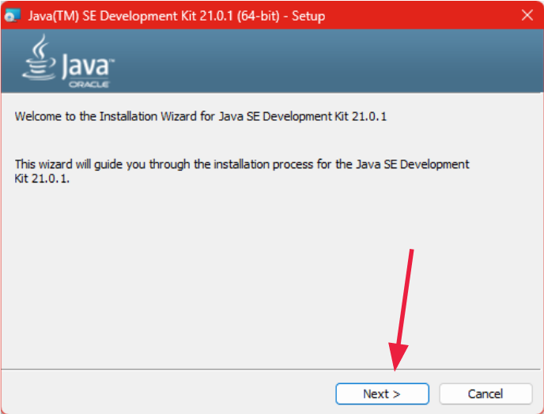
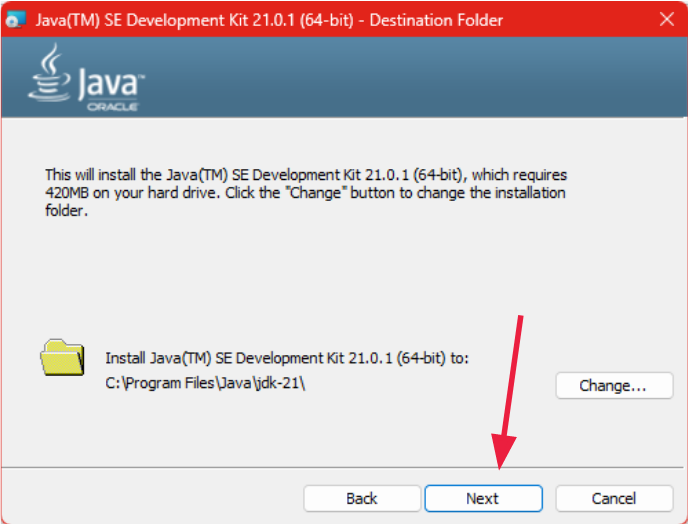
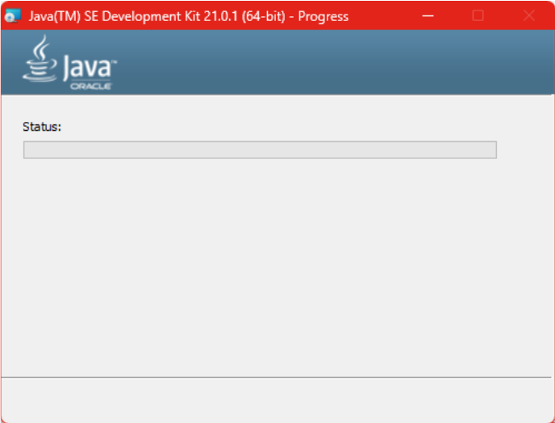
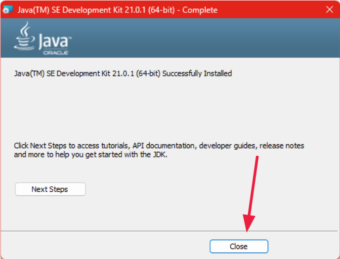

# Instalación paso a paso JDK

Para poder programar en Java, necesitamos instalar el Java Development Kit (JDK). Este paquete incluye el compilador y las herramientas necesarias para ejecutar nuestros programas.

## 1. Descarga

Durante la cursada, utilizaremos la versión del [JDK 21 de Oracle](https://download.oracle.com/java/21/latest/jdk-21_windows-x64_bin.exe) (enlace para Windows). Esta es una versión de [soporte extendido (LTS)](https://www.oracle.com/java/technologies/java-se-support-roadmap.html), lo que garantiza mayor estabilidad.

:::{note}
Java es un lenguaje en constante evolución. Las versiones LTS (Long Term Support) facilitan trabajar en un entorno seguro y conservador, ideal para aprender sin lidiar con características experimentales inestables.
:::

## 2. Instalación por Plataforma

### En Windows

Ejecutá el instalador descargado (`.exe`). El proceso es bastante directo, pero aquí detallamos lo que ocurre en cada paso:

1. **Pantalla de bienvenida**: Inicio de la instalación. Hacé clic en *Next*.
   

2. **Ubicación de instalación**: Por defecto se instalará en `C:\Program Files\Java\jdk-21`. Recomendamos dejar esta ruta por defecto y hacer clic en *Next*.
   

3. **Progreso**: Esperá a que se copien los archivos. En este punto, el instalador está configurando automáticamente la variable de entorno `PATH` en tu sistema para que puedas usar Java desde cualquier terminal.
   

4. **Finalización**: Instalación exitosa. Una vez completado, hacé clic en *Close*.
   

**¡Importante!** Para que Windows reconozca los cambios en el entorno de consola, es necesario **reiniciar la computadora**.

### En Linux (Ubuntu/Debian)

En sistemas Linux, es preferible utilizar el gestor de paquetes de la distribución. Abrí una terminal y ejecutá:

```bash
sudo apt update
sudo apt install openjdk-21-jdk
```

Una vez finalizado, abrí una nueva terminal para asegurar que el entorno esté actualizado.

---

## 3. Verificación del entorno

El instalador debería haber agregado los binarios de Java a la variable de entorno `$PATH` de tu sistema operativo. Esto permite ejecutar los comandos `java` y `javac` desde cualquier ubicación.

Abrí una terminal (PowerShell en Windows, Bash en Linux) y ejecutá:

```{code} sh
:caption: Verificación de instalación de Java
$> java --version
java 21.0.6 2025-01-21 LTS
Java(TM) SE Runtime Environment (build 21.0.6+7-LTS-162)
Java HotSpot(TM) 64-Bit Server VM (build 21.0.6+7-LTS-162, mixed mode, sharing)
```

:::{note} Variaciones esperadas
Si usaste el instalador de Oracle en Windows, la salida será como la mostrada arriba. Si estás en Linux usando `openjdk-21-jdk`, o instalaste Eclipse Temurin, la salida dirá `OpenJDK` o `Temurin` en lugar de `Java(TM) SE`. Ambas salidas confirman que el JDK 21 está instalado y son completamente válidas para la cursada.
:::

:::{warning} ¿Problemas?
Si ves el error "`Command not found`" o "`java no se reconoce como un comando interno o externo`", probá reiniciar tu computadora. De no funcionar, puede que sea necesario agregar manualmente la ruta de Java a la variable `$PATH`. Si esto ocurre, [abrí un hilo en Discussions](https://github.com/orgs/INGCOM-UNRN-PII/discussions/new?category=preguntas-y-respuestas) para recibir asistencia.
:::

## 4. Prueba final de compilación

Vamos a asegurarnos de que no solo podemos ejecutar Java, sino también compilar código fuente. Creá un archivo de texto llamado `HolaApp.java` con el siguiente contenido:

```{code} java
:filename: HolaApp.java
public class HolaApp {
   public static void main(String[] args) {
       System.out.printf("Hola %s!\n", "mundo");
   }
}
```

Luego, abrí una terminal en la misma carpeta donde creaste el archivo y ejecutá:

```{code} sh
:caption: Compilación y ejecución
$> javac HolaApp.java
$> java HolaApp
```

:::{important}
Si el comando final devuelve `Hola mundo!`, tu entorno base está perfectamente configurado y listo para el TP1.
:::