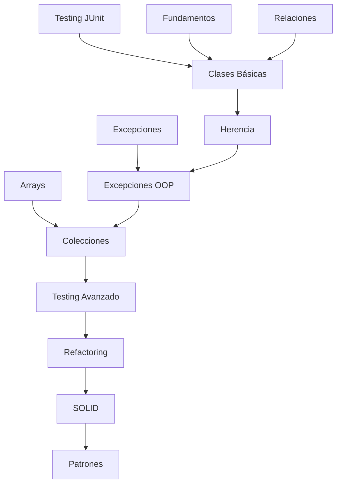

# Análisis Crítico: Estructura Completa del Curso (Apunte 1 + Apunte 2)

## Contexto: Estrategia Late Objects

El curso sigue la estrategia **Late Objects**, donde se enseña programación estructurada (tipos, control de flujo, funciones, arrays) con métodos estáticos antes de introducir objetos. Esta es una decisión pedagógica válida que permite:

1. **Base sólida en fundamentos:** Los estudiantes dominan conceptos algorítmicos sin la complejidad de OOP
2. **Transición gradual:** Se usa Java desde el inicio, pero "sin objetos" (métodos estáticos)
3. **Contexto para OOP:** Los estudiantes entienden *por qué* OOP resuelve problemas del enfoque estructurado

**Estructura actual:**
- **Apunte 1 (13 docs):** Fundamentos de Java con paradigma estructurado
- **Apunte 2 (13 docs):** Paradigma orientado a objetos

---

## Análisis del Apunte 1 (Programación Estructurada)

### Fortalezas
1. **Progresión lógica coherente:** Historia → Sintaxis → Tipos → Métodos → Control → I/O → Herramientas → Arrays → Excepciones → Testing → Archivos → Memoria
2. **Conexión con conocimientos previos:** Comparaciones constantes con C (asumiendo Programación I en C)
3. **Integración temprana de testing:** JUnit aparece en doc 08, muy cerca del inicio
4. **Tooling moderno:** Gradle (doc 07) antes de complejidad algorítmica
5. **Material de referencia sólido:** Documentos sobre orígenes, JVM, tipado son completos

### Debilidades Críticas

#### 1. TESTING DIVIDIDO ARTIFICIALMENTE
**Problema:** Testing conceptual (doc 11) separado de JUnit (doc 08).

**Evidencia:**
- Doc 08: JUnit (sintaxis, assertions, ciclo de vida)
- Doc 11: TDD, pirámide de testing, F.I.R.S.T., estrategias de diseño

**Impacto:** Estudiantes aprenden JUnit sin entender TDD, luego aprenden TDD sin aplicarlo activamente. La separación rompe el ciclo red-green-refactor.

#### 2. EXCEPCIONES ANTES DE OBJETOS
**Problema:** Doc 10 explica excepciones sin mencionar que *son objetos* con herencia.

**Evidencia clave:**
```markdown
## Jerarquía de Throwable (doc 10)
- Muestra diagrama de herencia
- Pero no explica qué significa "Throwable extends Object"
- No puede explicar polimorfismo en multi-catch
```

**Impacto:** Explicación incompleta que genera deuda técnica. Requiere re-explicación en Apunte 2 (doc 06).

#### 3. MEMORIA SIN HEAP/STACK DE OBJETOS
**Problema:** Doc 13 explica Stack/Heap/Referencias pero solo para arrays y tipos wrapper.

**Impacto:** Cuando lleguen objetos, deben re-aprender el modelo mental con instanciación, constructores, garbage collection.

#### 4. DESBALANCE DE PROFUNDIDAD
**Evidencia:**
- Doc 01 (Orígenes): 38 secciones sobre historia de Java
- Doc 07 (Gradle): 80+ secciones extremadamente detalladas
- Vs. Doc 11 (Testing): solo 23 secciones conceptuales sin ejercicios con JUnit

**Sugerencia:** Los docs 01 y 07 son de referencia, no de lectura lineal. Deberían estar claramente marcados como "Material de Consulta".

---

## Análisis del Apunte 2 (Programación Orientada a Objetos)

### Críticas Estructurales

### 1. REDUNDANCIA MASIVA
**Problema:** Documentos 04 y 05 duplican contenido sobre herencia/polimorfismo.
- `04_oop_herencia_polimorfismo.md`: conceptual, analogías, principios
- `05_herencia_polimorfismo.md`: sintaxis Java, implementación

**Impacto:** Confusión del estudiante sobre cuál leer primero, riesgo de inconsistencias, mantenimiento duplicado.

### 2. DESORDEN LÓGICO
**Problema:** La progresión conceptual está quebrada.

**Secuencia actual:**
1. Fundamentos (01)
2. Relaciones (02) 
3. **Sintaxis** (03) ← interrumpe flujo conceptual
4. Herencia conceptual (04)
5. Herencia sintaxis (05)
6. Excepciones (06)

**Problema:** El documento 03 inyecta implementación antes de cerrar conceptos. Los estudiantes deben saltar entre teoría y código repetidamente.

### 3. FALTA DE HILO CONDUCTOR
**Problema:** No existe un caso de estudio único que atraviese todos los capítulos.

**Ejemplos dispersos:**
- 01: Varios ejemplos inconexos
- 02: Biblioteca, Universidad
- 03: Biblioteca (diferente diseño)
- 04: Figuras, Medios de Pago
- 05: Empleados
- 06: Reservas

**Impacto:** El estudiante no ve evolución de complejidad en un dominio conocido. Cada capítulo reinicia el contexto mental.

### 4. GRANULARIDAD INCONSISTENTE
**Problema:** Algunos documentos son monolíticos, otros microscópicos.

**Evidencia:**
- `01_oop_fundamentos.md`: 46 secciones (sobrecargado)
- `04_oop_herencia_polimorfismo.md`: 28 secciones
- `08_oop_refactoring.md`: 23 secciones
- `12_oop_antipatrones.md`: denso pero sin balance con refactoring

**Consecuencia:** Los capítulos 08 y 12 deberían ser uno solo (refactoring + antipatrones), pero están artificialmente separados.

### 5. JERARQUÍA DE SUBTÍTULOS DÉBIL
**Problema:** Estructura plana que dificulta navegación.

**Ejemplo en 01:**
```
- Conceptos Fundamentales del Paradigma
  - Clase
  - Objeto
  - Atributo
  - Estado
  - Instancia
  - Método
  - Mensaje
```
Sin agrupación lógica (datos vs comportamiento vs estructura).

### 6. COLOCACIÓN TARDÍA DE EXCEPCIONES
**Problema:** Excepciones (06) después de herencia, pero las excepciones son fundamentales para OOP.

**Razón:** Las excepciones son objetos, usan herencia, y son necesarias para contratos (13). Deberían aparecer antes o junto con herencia.

### 7. TESTING COMO APÉNDICE
**Problema:** Testing (11) llega tarde. TDD debería estar desde el capítulo 3.

**Impacto:** Los estudiantes codifican 8 capítulos sin tests, adquieren malos hábitos.

### 8. CONTENIDO AVANZADO MEZCLADO
**Problema:** Documento 13 (contratos) tiene profundidad teórica desproporcionada para el nivel.

**Evidencia:**
- Covarianza/contravarianza
- Assertions (Java feature poco usado)
- Filosofía de Meyer/Eiffel

**Sugerencia:** Este contenido es para curso avanzado o apéndice opcional.

### 9. FALTA DE CHECKPOINTS
**Problema:** No hay mapas de navegación ni indicadores de pre-requisitos.

**Ausente:**
- Diagrama de dependencias entre capítulos
- "Pre-requisitos: leer 01, 02 antes de 04"
- Tabla de conceptos acumulativos

### 10. COLECCIONES AISLADAS
**Problema:** Documento 07 (colecciones/genéricos) está desconectado del resto.

**Oportunidad perdida:** No se usan colecciones en ejemplos previos, ni se refactorizan arrays del cap. 03 en cap. 07.

---

## Análisis Transversal: Problemas Entre Apuntes

### 1. EXCEPCIONES EXPLICADAS TRES VECES
**Fragmentación:**
- **Apunte 1, Doc 10:** Sintaxis básica (try-catch-finally, checked vs unchecked)
- **Apunte 2, Doc 06:** Excepciones *como objetos* (herencia, jerarquías, diseño)
- Intermedio perdido: No se conectan ambos mundos explícitamente

**Propuesta:** 
- Apunte 1, Doc 10: Agregar sección final "Excepciones y Objetos: Un Adelanto"
- Apunte 2, Doc 06: Iniciar con "Retomando Excepciones desde OOP"

### 2. TESTING FRAGMENTADO EN CUATRO LUGARES
**Dispersión actual:**
- **Apunte 1, Doc 08:** JUnit (sintaxis, assertions)
- **Apunte 1, Doc 11:** TDD conceptual
- **Apunte 2, Doc 11:** Testing de objetos (test doubles, mocks)
- Ninguno conecta con los otros explícitamente

**Impacto:** Estudiantes no ven testing como práctica continua, sino como tópicos aislados.

### 3. COLECCIONES DESCONECTADAS
**Problema:**
- **Apunte 1, Doc 09:** Arrays (estructuras fijas)
- **Apunte 2, Doc 07:** Colecciones (estructuras dinámicas)
- No hay ejercicio de refactorización: "Convertir array[] a ArrayList"

**Oportunidad perdida:** Demostrar ventajas prácticas de colecciones genéricas.

### 4. MEMORIA EXPLICADA PARCIALMENTE
**Apunte 1, Doc 13:**
- Stack: ✓ (variables locales, parámetros)
- Heap: ✓ (arrays)
- Referencias: ✓ (asignación, comparación)

**Apunte 2:**
- No hay documento equivalente que explique:
  - Construcción de objetos y asignación en heap
  - Garbage collection
  - `this` como referencia

**Resultado:** Conceptos de memoria quedan sin cerrar.

---

## Plan de Acción Integrado

### Fase 0: Decisiones Estratégicas (Pre-requisito)

#### 0.1 Marcar documentos de referencia
**Acción:** Agregar badges en docs 01, 07 del Apunte 1:

```markdown
::::{note} Material de Referencia
Este documento es para consulta, no lectura secuencial.
Puedes saltearlo y volver cuando necesites información específica.
::::
```

**Aplicar a:**
- Apunte 1, Doc 01: Orígenes de Java
- Apunte 1, Doc 07: Gradle (después de la sección "Ciclo de trabajo típico")

#### 0.2 Crear índice maestro de navegación
**Archivo:** `parte_1/00_roadmap.md` y `parte_2/00_roadmap.md`

**Contenido:**
```markdown
# Guía de Navegación del Curso

## Fase 1: Fundamentos Estructurados (Apunte 1)
- Lectura obligatoria: Docs 02, 03, 04, 05, 06, 08, 09, 10, 11, 12, 13
- Referencia opcional: Docs 01, 07

## Fase 2: Paradigma Orientado a Objetos (Apunte 2)
- Secuencia recomendada: [ver tabla detallada]

## Dependencias entre documentos
[Diagrama Mermaid]
```

### Fase 1: Ajustes al Apunte 1 (Urgente)

#### 1.1 Unificar testing
**Acción:** Fusionar Apunte 1, Docs 08 + 11

**Nuevo documento:** `08_testing_junit.md`

**Estructura propuesta:**
```markdown
## Parte 1: ¿Por Qué Testear? (del doc 11)
- Pirámide de testing
- F.I.R.S.T.
- Verificación vs Validación

## Parte 2: JUnit (del doc 08)
- Sintaxis básica
- Assertions
- Ciclo de vida

## Parte 3: TDD en Acción (integrado)
- Ejemplo completo: Factorial con TDD
- Red-Green-Refactor aplicado paso a paso
- Estrategias de diseño de casos

## Parte 4: Testing de Arrays y Excepciones
- Casos prácticos con contenido previo
```

**Eliminar:** Doc 11 actual (mover contenido a 08)

#### 1.2 Conectar excepciones con OOP
**Acción:** Agregar sección final en Apunte 1, Doc 10

**Contenido nuevo:**
```markdown
## Adelanto: Excepciones como Objetos

Las excepciones en Java son objetos. Cuando lances o captures una excepción,
estás trabajando con instancias de clases:

- `IOException` es una clase
- `new IllegalArgumentException("mensaje")` crea un objeto
- La jerarquía de Throwable usa *herencia* (concepto de POO)

[Diagrama simple de herencia]

> **Nota:** En el Apunte 2 profundizaremos en cómo diseñar tus propias 
> jerarquías de excepciones usando OOP.
```

#### 1.3 Ampliar memoria para preparar objetos
**Acción:** Agregar sección en Apunte 1, Doc 13

**Contenido nuevo:**
```markdown
## Adelanto: Objetos en Memoria

En el próximo apunte crearemos objetos personalizados:

```java
Persona p = new Persona("Juan", 25);
```

Este código:
1. `new Persona(...)` → crea objeto en el HEAP
2. `p` → variable de tipo referencia en el STACK
3. Asignación → `p` apunta al objeto

[Diagrama Stack/Heap con objeto]

> Todos los conceptos que viste sobre referencias se aplican a objetos.
```

### Fase 2: Reorganización del Apunte 2 (Crítica)

### Fase 2: Reorganización del Apunte 2 (Crítica)

#### 2.1 Fusionar documentos duplicados
- **Acción:** Eliminar `05_herencia_polimorfismo.md`
- **Integrar:** Sintaxis Java en `04_oop_herencia_polimorfismo.md` como sección final
- **Formato:** Concepto → Diagrama → Código en bloques cohesivos

#### 2.2 Fusionar refactoring y antipatrones
- **Acción:** Combinar docs 08 + 12 en `08_oop_refactoring_smells.md`
- **Razón:** Code smells y refactoring son dos caras de la misma moneda
- **Estructura:**
  ```markdown
  ## Parte 1: Detectar Problemas (Code Smells)
  ## Parte 2: Corregir Problemas (Refactoring)
  ## Parte 3: Prevención (Diseño preventivo)
  ```

#### 2.3 Reordenar secuencia

**Nueva secuencia propuesta:**

```
00. Roadmap (NUEVO)
    - Mapa conceptual
    - Pre-requisitos de Apunte 1
    - Objetivos por capítulo

01. Fundamentos OOP (mantener)
    - Transición del paradigma
    - Conceptos: clase, objeto, instancia
    - Abstracción y encapsulamiento

02. Relaciones (mantener)
    - Asociación, composición, agregación
    - Cardinalidad

03. Ciclo Completo: Del Problema al Código (NUEVO)
    - Análisis → Diseño → UML → Java
    - Ejemplo: Sistema de Biblioteca v1 (clases básicas)
    - Primera introducción a testing con objetos

04. Herencia y Polimorfismo (FUSIÓN 04+05)
    - Conceptos
    - Sintaxis Java
    - SOLID básico (S, O, L)
    - Biblioteca v2: extensión con herencia

05. Excepciones OOP (reubicado desde 06)
    - Retomar Apunte 1, Doc 10
    - Diseño de jerarquías
    - Excepciones personalizadas
    - Biblioteca v3: manejo robusto de errores

06. Colecciones y Genéricos (reubicado desde 07)
    - Migración de arrays a colecciones
    - Biblioteca v4: usar ArrayList, HashMap

07. Testing Avanzado (reubicado desde 11)
    - Test doubles (stubs, mocks)
    - Diseño para testeabilidad
    - Biblioteca: suite completa de tests

08. Refactoring y Code Smells (FUSIÓN 08+12)
    - Detectar smells
    - Catálogo de refactorizaciones
    - Biblioteca v5: refactorización guiada

09. SOLID Completo (mantener 09)
    - Profundizar I, D
    - Inyección de dependencias
    - Biblioteca v6: inversión de dependencias

10. Patrones de Diseño (mantener 10)
    - Creacionales, estructurales, comportamiento
    - Biblioteca v7: aplicar Strategy, Observer

11. [OPCIONAL] Diseño por Contratos (mantener 13)
    - Pre/postcondiciones
    - Invariantes
```

**Documentos eliminados:** 3 (05, 12 fusionados; total 13→10)

### Fase 3: Caso de Estudio Unificado (Alta Prioridad)

#### 3.1 Sistema de Biblioteca Digital (7 versiones)

**Dominio elegido:** Sistema de gestión de biblioteca
**Razón:** Familiar, escalable, permite mostrar todos los conceptos

**Evolución incremental:**

```
v1 (Cap 03): Clases básicas
├── Libro (título, autor, ISBN)
├── Usuario (nombre, DNI)
└── Préstamo (libro, usuario, fecha)

v2 (Cap 04): Herencia
├── Material (abstracta)
│   ├── LibroFísico
│   ├── LibroDigital (formato, URL)
│   └── Revista (número, periodicidad)
└── Usuario → TipoUsuario (enum: estudiante, docente, público)

v3 (Cap 05): Excepciones
├── BibliotecaException (base)
│   ├── MaterialNoDisponibleException
│   ├── UsuarioSuspendidoException
│   └── LímitePréstamosExcedidoException
└── Validaciones en todos los métodos

v4 (Cap 06): Colecciones
├── Catálogo: HashMap<ISBN, Material>
├── Usuarios: TreeSet<Usuario> (ordenados por DNI)
└── Préstamos: ArrayList<Préstamo>

v5 (Cap 08): Refactoring
├── Eliminar God Class (Biblioteca)
├── Extract Method (cálculo de multas)
└── Replace Conditional with Polymorphism (tipos de usuario)

v6 (Cap 09): SOLID + DIP
├── Interface MaterialRepository
├── Interface NotificacionService
└── Inyección de dependencias en constructores

v7 (Cap 10): Patrones
├── Strategy: Cálculo de multas por tipo de usuario
├── Observer: Notificaciones de vencimiento
└── Factory: Creación de materiales
```

**Repositorio de código:**
```
ejemplos/biblioteca/
  v1_clases_basicas/
  v2_herencia/
  v3_excepciones/
  v4_colecciones/
  v5_refactoring/
  v6_solid/
  v7_patrones/
  tests/  # Suite completa de tests
```

#### 3.2 Conexión entre versiones

**Cada capítulo debe:**
1. Mostrar código de versión anterior
2. Identificar problema/limitación
3. Introducir concepto nuevo
4. Refactorizar a versión nueva
5. Validar con tests

**Ejemplo de transición (v1 → v2):**

```markdown
## Problema en v1

```java
// Biblioteca v1: No distinguimos tipos de materiales
Libro revista = new Libro("Nature", "Varios", "ISSN-1234");
// ¿Cómo saber que es revista y no libro?
```

## Solución con Herencia

```java
// Biblioteca v2
abstract class Material { ... }
class Libro extends Material { ... }
class Revista extends Material { ... }
```

[Mostrar refactorización completa]

## Tests actualizados

```java
@Test
void deberiaDistinguirTiposDeMaterial() {
    Material libro = new Libro(...);
    Material revista = new Revista(...);
    assertTrue(libro instanceof Libro);
    assertTrue(revista instanceof Revista);
}
```
```

### Fase 4: Mejora de Navegación y Pedagogía (Media Prioridad)

#### 4.1 Callouts de pre-requisitos

**Agregar en todos los documentos:**

```markdown
::::{important} Pre-requisitos
**Del Apunte 1:**
- [x] 09_arreglos (necesario para colecciones)
- [x] 10_excepciones (para jerarquías)

**Del Apunte 2:**
- [x] 01_oop_fundamentos
- [x] 02_oop_relaciones
::::

::::{admonition} Objetivos de Aprendizaje
Al finalizar este capítulo podrás:
1. Diseñar jerarquías de excepciones
2. Traducir excepciones entre capas
3. Implementar excepciones personalizadas con estado
::::

::::{admonition} Conceptos del Apunte 1 que usaremos
- try-catch-finally (Doc 10)
- Stack trace (Doc 10)
- Tipos de excepciones checked/unchecked (Doc 10)
::::
```

#### 4.2 Jerarquía de secciones limitada

**Regla:** Máximo 3 niveles de profundidad

**Refactorizar documento 01:**

```markdown
## Conceptos Fundamentales

### 1. Estructura de Objetos
- Clase (plantilla)
- Objeto (instancia)
- Relación clase-objeto

### 2. Estado del Objeto
- Atributos
- Identidad
- Estado como valores en un momento

### 3. Comportamiento
- Métodos
- Mensajes
- Colaboración
```

#### 4.3 Material opcional claramente marcado

**Documento 13 (Contratos):**

```markdown
::::{dropdown} Contenido Avanzado (Opcional)
Este material profundiza conceptos de POO avanzada.  
**No es requerido para la evaluación.**

Si querés especializarte en diseño robusto, explorá estos temas.
::::
```

**Secciones opcionales en otros documentos:**
- Apunte 1, Doc 01: Toda la historia (excepto "Impacto y legado")
- Apunte 1, Doc 07: Secciones de "Configuración avanzada"
- Apunte 2, Doc 09: Sección de covarianza/contravarianza

### Fase 5: Integración Testing-TDD (Alta Prioridad)

#### 5.1 Testing en cada versión de biblioteca

**Plantilla de sección de testing:**

```markdown
## Testing de Biblioteca v{N}

### Casos de prueba nuevos
[Lista de tests que validan features nuevas]

### Refactorización de tests anteriores
[Cómo cambian tests de v{N-1}]

### Cobertura objetivo
- Clases: 100%
- Líneas: >80%
- Ramas: >70%
```

#### 5.2 TDD desde capítulo 03

**Agregar en Apunte 2, Doc 03:**

```markdown
## Desarrollando con TDD

### Paso 1: Test de la clase Libro

```java
@Test
void deberiaCrearLibroConDatosValidos() {
    Libro libro = new Libro("Título", "Autor", "ISBN-123");
    assertEquals("Título", libro.getTitulo());
}
```

### Paso 2: Implementación mínima

```java
public class Libro {
    private String titulo;
    // ...
}
```

### Paso 3: Refactor
[Mejorar diseño sin romper tests]
```

### Fase 6: Recursos Transversales (Baja Prioridad)

#### 6.1 Glosario técnico interactivo

**Archivo:** `glosario_completo.md`

**Estructura:**

```markdown
# Glosario del Curso

## A

### Abstracción {#term-abstraccion}
Proceso de identificar características esenciales...

**Introducido en:** [Apunte 2, Doc 01](parte_2/01_oop_fundamentos.md)  
**Profundizado en:** [Apunte 2, Doc 04](parte_2/04_oop_herencia_polimorfismo.md)  
**Aplicado en:** Biblioteca v2

### Acoplamiento {#term-acoplamiento}
Medida de dependencia entre módulos...

**Introducido en:** [Apunte 2, Doc 01](parte_2/01_oop_fundamentos.md)  
**Relacionado con:** SOLID-D, Inversión de dependencias
```

#### 6.2 Diagrama de dependencias conceptuales

**Usar Mermaid:**



**Incluir en:** `parte_1/00_roadmap.md` y `parte_2/00_roadmap.md`

---

## Métricas de Éxito (Actualizadas)

### Indicadores Cuantitativos

#### Apunte 1
1. **Documentos fusionados:** 13 → 12 (08+11)
2. **Material de referencia marcado:** 2 documentos (01, 07)
3. **Conexiones explícitas con Apunte 2:** 3 secciones nuevas (docs 10, 13)

#### Apunte 2
1. **Documentos fusionados:** 13 → 10 (05→04, 12→08, crear 00)
2. **Versiones del caso de estudio:** 7 versiones incrementales
3. **Tests desde capítulo:** 11 → 3
4. **Profundidad de jerarquía:** 4 niveles → 3 niveles

#### Transversal
1. **Menciones explícitas entre apuntes:** 0 → 15+
2. **Ejemplos únicos en Apunte 2:** ~15 → 1 principal + 3 secundarios

### Indicadores Cualitativos

1. **Flujo cognitivo sin rupturas:** Estudiante transita de estructurado a OOP sin re-explicaciones
2. **Continuidad del caso de estudio:** Biblioteca evoluciona 7 veces con conexión explícita
3. **Testing como práctica continua:** TDD presente desde Apunte 1 hasta patrones
4. **Pre-requisitos explícitos:** Cada documento lista dependencias del Apunte 1
5. **Material de referencia marcado:** Estudiante sabe qué puede saltear

---

## Plan de Acción Detallado

---

## Sprint 0: Fundamentos y Decisiones Estratégicas (1 semana)

### Objetivo
Establecer acuerdos sobre estrategia pedagógica y preparar infraestructura para cambios.

### Tareas

#### Día 1-2: Revisión y Aprobación

**Tarea 0.1: Presentar análisis al equipo docente**
- **Responsable:** Coordinador de cátedra
- **Acción:** 
  - Reunión de equipo (90 min)
  - Presentar críticas estructurales
  - Discutir impacto en estudiantes actuales vs futuros
- **Entregable:** Acta de reunión con decisiones
- **Criterio de éxito:** Equipo aprueba mantener Late Objects

**Tarea 0.2: Validar estrategia Late Objects**
- **Responsable:** Equipo completo
- **Acción:**
  - Confirmar: ¿Mantenemos excepciones antes de objetos?
  - Confirmar: ¿Aceptamos re-explicación de conceptos?
  - Confirmar: ¿Priorizamos conexión entre apuntes?
- **Entregable:** Documento de decisiones (1 página)
- **Criterio de éxito:** Consenso documentado

#### Día 3-4: Preparación Técnica

**Tarea 0.3: Crear branches de trabajo**
- **Responsable:** Administrador del repositorio
- **Acción:**
  ```bash
  git checkout -b refactor/apunte-1-testing-unificado
  git checkout -b refactor/apunte-2-estructura
  git checkout -b feature/biblioteca-caso-estudio
  ```
- **Entregable:** 3 branches activos
- **Criterio de éxito:** CI/CD pasa en cada branch

**Tarea 0.4: Backup de contenido actual**
- **Responsable:** Administrador del repositorio
- **Acción:**
  - Crear tag: `v1.0-pre-reorganizacion`
  - Copiar `parte_1/` → `apunte_legacy/`
  - Copiar `parte_2/` → `apunte_2_legacy/`
  - Documentar en README qué versión usar
- **Entregable:** Versiones legacy accesibles
- **Criterio de éxito:** Estudiantes pueden elegir versión

#### Día 5: Planificación Detallada

**Tarea 0.5: Crear project board**
- **Responsable:** Coordinador de cátedra
- **Acción:**
  - GitHub Projects con columnas: Backlog, Sprint 1, Sprint 2, etc.
  - Convertir cada tarea de este plan en issue
  - Asignar responsables
- **Entregable:** Board público en GitHub
- **Criterio de éxito:** Todas las tareas trazables

**Tarea 0.6: Comunicar cambios a estudiantes**
- **Responsable:** Ayudantes
- **Acción:**
  - Anuncio en plataforma del curso
  - Explicar: "Mejorando material, versión legacy disponible"
  - Solicitar feedback temprano
- **Entregable:** Anuncio publicado
- **Criterio de éxito:** <5 consultas de confusión

---

## Sprint 1: Conexión Entre Apuntes (2 semanas)

### Objetivo
Establecer puentes explícitos entre Apunte 1 y Apunte 2, eliminar fragmentación de testing.

### Semana 1: Apunte 1 - Testing Unificado

#### Tarea 1.1: Fusionar docs 08 + 11 (testing)

**Día 1-2: Análisis de contenido**
- **Responsable:** Docente 1
- **Acción:**
  1. Hacer diff manual:
     ```bash
     diff -u parte_1/08_junit.md parte_1/11_testing.md > testing-diff.txt
     ```
  2. Identificar contenido duplicado
  3. Marcar secciones únicas de cada doc
  4. Crear outline del documento fusionado
- **Entregable:** `testing-merge-plan.md` con estructura propuesta
- **Criterio de éxito:** Cero contenido perdido

**Día 3-4: Escritura del documento fusionado**
- **Responsable:** Docente 1 + Ayudante 1
- **Acción:**
  1. Crear `parte_1/08_testing_junit.md`
  2. Estructura propuesta:
     ```markdown
     # Testing con JUnit y TDD
     
     ## Parte 1: Fundamentos del Testing (del 11)
     - ¿Por qué testear?
     - Pirámide de testing
     - F.I.R.S.T.
     - Verificación vs validación
     
     ## Parte 2: JUnit 5 (del 08)
     - Sintaxis básica
     - Assertions
     - Ciclo de vida (@BeforeEach, @AfterEach)
     - Convenciones de nombrado
     
     ## Parte 3: TDD en Acción (integrado)
     - Ciclo RED-GREEN-REFACTOR
     - Ejemplo completo: Factorial con TDD
     - Aplicando F.I.R.S.T. en cada paso
     
     ## Parte 4: Estrategias de Diseño (del 11)
     - Particiones de equivalencia
     - Valores límite
     - Casos especiales
     
     ## Parte 5: Testing de Código Estructurado
     - Tests de funciones puras
     - Tests de arrays
     - Tests de excepciones
     - Cobertura con JaCoCo
     
     ## Ejercicios Integrados
     - Ejercicios que combinen JUnit + TDD
     ```
  3. Migrar código de ejemplos
  4. Compilar y validar todos los ejemplos
- **Entregable:** `08_testing_junit.md` completo
- **Criterio de éxito:** Documento compila, ejemplos ejecutan

**Día 5: Actualizar índice y referencias**
- **Responsable:** Ayudante 1
- **Acción:**
  1. Actualizar `parte_1/indice.md`
  2. Buscar todas las referencias a docs 08 y 11:
     ```bash
     grep -rn "08_junit\|11_testing" parte_1/
     ```
  3. Reemplazar links rotos
  4. Agregar nota en `parte_1/11_testing.md`:
     ```markdown
     ::::{warning} Documento Deprecado
     Este contenido se fusionó con 08_testing_junit.md
     [Ver documento actualizado](08_testing_junit.md)
     ::::
     ```
- **Entregable:** Índice actualizado, cero links rotos
- **Criterio de éxito:** Build del sitio sin warnings

#### Tarea 1.2: Conectar excepciones con OOP

**Día 6-7: Agregar sección en Apunte 1, Doc 10**
- **Responsable:** Docente 2
- **Acción:**
  1. Editar `parte_1/10_excepciones.md`
  2. Agregar sección final (después de "Ejercicios"):
     ```markdown
     ## Adelanto: Excepciones como Objetos
     
     ### El Modelo de Objetos Subyacente
     
     Hasta aquí trabajaste con excepciones usando sintaxis básica:
     `try-catch-finally`, `throw`, `throws`. Pero hay un detalle que
     hemos omitido intencionalmente: **las excepciones son objetos**.
     
     Cuando escribes:
     ```java
     throw new IllegalArgumentException("Edad inválida");
     ```
     
     Estás haciendo:
     1. `new`: Crear un objeto (concepto de OOP)
     2. `IllegalArgumentException`: Invocar un constructor (OOP)
     3. Pasar un mensaje al constructor (OOP)
     
     ### Jerarquía de Clases
     
     Todas las excepciones heredan de `Throwable`:
     
     ```
     Throwable (clase base)
     ├── Error (errores del sistema)
     └── Exception
         ├── RuntimeException (unchecked)
         │   ├── NullPointerException
         │   ├── IllegalArgumentException
         │   └── ...
         └── IOException (checked)
             ├── FileNotFoundException
             └── ...
     ```
     
     Esta jerarquía usa **herencia**, un concepto del paradigma
     orientado a objetos que estudiaremos en el Apunte 2.
     
     ### Multi-catch Polimórfico
     
     Cuando capturas varias excepciones:
     
     ```java
     try {
         // código
     } catch (IOException | SQLException e) {
         // manejo
     }
     ```
     
     Esto funciona porque Java usa **polimorfismo** (OOP) para
     encontrar el handler correcto.
     
     ### ¿Por Qué Te Lo Contamos Ahora?
     
     Porque en el Apunte 2 diseñarás tus propias jerarquías de
     excepciones. Cuando llegues allí, recordá este capítulo:
     ya sabías usar excepciones, ahora aprenderás a diseñarlas.
     
     ::::{admonition} Próximo Paso
     :class: tip
     En [Apunte 2, Doc 05: Excepciones OOP](../../parte_2/05_excepciones_oop.md)
     retomaremos estos conceptos con clases personalizadas,
     traducción de excepciones, y diseño de jerarquías robustas.
     ::::
     ```
  3. Agregar diagrama UML simple de jerarquía
- **Entregable:** Sección agregada en doc 10
- **Criterio de éxito:** Estudiantes entienden que hay "más por venir"

#### Tarea 1.3: Conectar memoria con objetos

**Día 8: Agregar sección en Apunte 1, Doc 13**
- **Responsable:** Docente 2
- **Acción:**
  1. Editar `parte_1/13_memoria.md`
  2. Agregar sección antes de "Resumen":
     ```markdown
     ## Adelanto: Objetos Personalizados en Memoria
     
     ### De Arrays a Objetos
     
     Hasta ahora trabajaste con:
     - **Primitivos en Stack:** `int x = 10;`
     - **Arrays en Heap:** `int[] nums = new int[5];`
     - **Referencias:** `nums` apunta al array en heap
     
     En el Apunte 2 crearás objetos personalizados:
     
     ```java
     Persona p = new Persona("Juan", 25);
     ```
     
     Este código:
     1. `new Persona(...)` → crea objeto en el **HEAP**
     2. `p` → variable de tipo referencia en el **STACK**
     3. Asignación → `p` apunta al objeto
     
     ### Diagrama Stack/Heap con Objeto
     
     ```
     STACK               HEAP
     ┌─────────┐         ┌───────────────┐
     │ p       │────────>│ Persona       │
     │ (ref)   │         │ - nombre: "Juan"│
     └─────────┘         │ - edad: 25    │
                         └───────────────┘
     ```
     
     ### Todo Lo Que Aprendiste Se Aplica
     
     - Comparación con `==` vs `equals()`
     - Asignación de referencias (aliasing)
     - Pasaje por referencia a métodos
     - `null` como "referencia a nada"
     
     Todos estos conceptos funcionan igual con objetos.
     
     ### Constructores
     
     El código `new Persona("Juan", 25)` llama a un **constructor**:
     un método especial que inicializa el objeto en el heap.
     
     ### Garbage Collection
     
     Cuando un objeto no tiene más referencias, el **recolector
     de basura** (garbage collector) lo elimina automáticamente:
     
     ```java
     Persona p = new Persona("Juan", 25);
     p = null;  // El objeto queda sin referencias
     // GC lo eliminará eventualmente
     ```
     
     Esto es diferente de C, donde tenías que llamar `free()`.
     
     ::::{admonition} Próximo Paso
     :class: tip
     En [Apunte 2, Doc 01: Fundamentos OOP](../../parte_2/01_oop_fundamentos.md)
     empezarás a diseñar tus propias clases y entenderás el
     ciclo de vida completo de los objetos en Java.
     ::::
     ```
  3. Agregar diagrama stack/heap con objeto
- **Entregable:** Sección agregada en doc 13
- **Criterio de éxito:** Conexión clara con Apunte 2

#### Tarea 1.4: Marcar material de referencia

**Día 9: Identificar documentos opcionales**
- **Responsable:** Ayudante 2
- **Acción:**
  1. Agregar badge en `parte_1/01_origenes.md` (al inicio):
     ```markdown
     ::::{note} Material de Referencia
     :class: dropdown
     
     Este documento cubre la historia de Java, la JVM y el ecosistema.
     
     **¿Necesito leerlo ahora?** No. Podés saltearlo y volver cuando
     necesites contexto histórico o quieras profundizar en la JVM.
     
     **Lectura obligatoria:**
     - Sección "Impacto y Legado"
     - Sección "El Ecosistema de Herramientas" (Maven, Gradle)
     
     **Opcional:**
     - Green Project y origen histórico
     - Guerra de navegadores
     - Línea temporal completa
     ::::
     ```
  2. Agregar badge en `parte_1/07_gradle.md` (después de "Ciclo de trabajo típico"):
     ```markdown
     ---
     
     ::::{tip} Secciones de Referencia
     A partir de aquí, el documento contiene material de consulta
     para problemas específicos. No necesitás leerlo linealmente.
     
     **Consultá cuando necesites:**
     - Problemas comunes → Ir a sección "Problemas y Soluciones"
     - Configuración avanzada → Ir a sección "Configuración Avanzada"
     - Debugging de tests → Ir a sección "Debugging de Tests"
     ::::
     ```
- **Entregable:** Badges agregados
- **Criterio de éxito:** Estudiantes priorizan tiempo correctamente

### Semana 2: Apunte 2 - Roadmap y Pre-requisitos

#### Tarea 1.5: Crear documento roadmap

**Día 10-11: Diseñar roadmap**
- **Responsable:** Docente 1 + Docente 2
- **Acción:**
  1. Crear `parte_2/00_roadmap.md`:
     ```markdown
     # Guía de Navegación: Programación Orientada a Objetos
     
     ## Estrategia del Curso: Late Objects
     
     Este curso sigue la estrategia **Late Objects**: aprendiste
     programación estructurada (funciones, arrays, control de flujo)
     en el Apunte 1 usando Java con métodos estáticos.
     
     Ahora introduciremos el **paradigma orientado a objetos**,
     donde diseñarás tus propias clases y trabajarás con instancias.
     
     ### ¿Por Qué Esta Estrategia?
     
     **Ventajas:**
     - Dominás algoritmos antes de OOP
     - Entendés *por qué* OOP (resuelve problemas del estructurado)
     - Transición gradual
     
     **Desventaja aceptada:**
     - Algunos conceptos se re-explican (excepciones, memoria)
     - La re-explicación es intencional y pedagógica
     
     ## Pre-requisitos del Apunte 1
     
     Antes de comenzar, deberías haber completado:
     
     | Documento | Concepto Clave | ¿Por Qué Es Importante? |
     |-----------|----------------|-------------------------|
     | 02_lenguaje | Clases como contenedores | Entenderás qué son las clases |
     | 03_tipos_de_datos | Tipos primitivos vs referencias | Fundamentales para objetos |
     | 04_metodos | Métodos y parámetros | Métodos de instancia usan misma sintaxis |
     | 08_testing_junit | JUnit y TDD | Seguiremos usando tests |
     | 09_arreglos | Arrays y referencias | Base para colecciones |
     | 10_excepciones | Sintaxis de excepciones | Diseñaremos jerarquías |
     | 13_memoria | Stack/Heap/Referencias | Modelo de memoria de objetos |
     
     ## Secuencia Recomendada (Apunte 2)
     
     ```mermaid
     graph TD
         A1[01: Fundamentos OOP] --> A2[02: Relaciones]
         A2 --> A3[03: Del Problema al Código]
         A3 --> A4[04: Herencia y Polimorfismo]
         A4 --> A5[05: Excepciones OOP]
         A5 --> A6[06: Colecciones y Genéricos]
         A6 --> A7[07: Testing Avanzado]
         A7 --> A8[08: Refactoring y Code Smells]
         A8 --> A9[09: SOLID Completo]
         A9 --> A10[10: Patrones de Diseño]
         
         style A3 fill:#e1f5ff
         style A7 fill:#e1f5ff
         style A10 fill:#e1f5ff
     ```
     
     ## Caso de Estudio: Sistema de Biblioteca
     
     A lo largo del apunte, desarrollaremos un sistema de biblioteca
     que evoluciona en cada capítulo:
     
     | Versión | Capítulo | Concepto Nuevo |
     |---------|----------|----------------|
     | v1 | 03 | Clases básicas (Libro, Usuario, Préstamo) |
     | v2 | 04 | Herencia (Material, LibroFísico, LibroDigital) |
     | v3 | 05 | Excepciones personalizadas |
     | v4 | 06 | Colecciones (ArrayList, HashMap) |
     | v5 | 08 | Refactoring (eliminar smells) |
     | v6 | 09 | Inversión de dependencias |
     | v7 | 10 | Patrones (Strategy, Observer) |
     
     **Importante:** No copies/pegues el código. Implementá cada
     versión desde cero siguiendo las guías.
     
     ## Conceptos Acumulativos
     
     | Concepto | Introducido | Profundizado | Aplicado |
     |----------|-------------|--------------|----------|
     | Abstracción | 01 | 04 | v2, v5 |
     | Encapsulamiento | 01 | 03 | Todas las versiones |
     | Herencia | 04 | 09 | v2, v6 |
     | Polimorfismo | 04 | 10 | v2, v7 |
     | Excepciones OOP | 05 | - | v3, v5 |
     | Colecciones | 06 | - | v4, v6, v7 |
     | TDD | 03, 07 | - | Todas las versiones |
     | SOLID | 04, 09 | - | v5, v6 |
     | Patrones | 10 | - | v7 |
     
     ## Contenido Opcional
     
     El siguiente contenido es para profundización:
     
     - **11_oop_contratos:** Diseño por contratos (opcional)
     - Secciones marcadas con {dropdown} en otros documentos
     
     ## Estimación de Tiempo
     
     | Fase | Capítulos | Horas Estimadas |
     |------|-----------|-----------------|
     | Fundamentos | 01-03 | 20-25 horas |
     | OOP Avanzado | 04-06 | 25-30 horas |
     | Diseño y Calidad | 07-09 | 20-25 horas |
     | Patrones | 10 | 10-15 horas |
     | **Total** | **01-10** | **75-95 horas** |
     
     *No incluye tiempo de práctica autónoma ni TPs.*
     
     ## Cómo Usar Esta Guía
     
     1. **Primera lectura:** Lee esta guía completa antes de empezar
     2. **Durante el apunte:** Volvé a la tabla de pre-requisitos si te perdés
     3. **Al finalizar:** Revisá "Conceptos Acumulativos" para autoevaluar
     
     ## Recursos Adicionales
     
     - [Glosario Completo](../glosario_completo.md)
     - [Código de Biblioteca](https://github.com/tu-repo/biblioteca)
     - [FAQ del Curso](../faq.md)
     
     ---
     
     ::::{admonition} ¿Listo para empezar?
     :class: tip
     Comenzá con [01: Fundamentos OOP](01_oop_fundamentos.md) →
     ::::
     ```
  2. Generar diagrama Mermaid (ya incluido arriba)
- **Entregable:** `00_roadmap.md` completo
- **Criterio de éxito:** Estudiante entiende estrategia del curso

#### Tarea 1.6: Agregar callouts en todos los documentos

**Día 12-14: Automatizar generación de callouts**
- **Responsable:** Ayudante 2 (con script)
- **Acción:**
  1. Crear script `scripts/add_prereqs.py`:
     ```python
     import re
     
     # Mapa de pre-requisitos por documento
     prereqs_map = {
         "01_oop_fundamentos.md": {
             "apunte_1": ["02_lenguaje", "03_tipos_de_datos"],
             "apunte_2": [],
             "objetivos": [
                 "Explicar la transición de paradigma estructurado a OOP",
                 "Identificar clases, objetos e instancias en un dominio",
                 "Aplicar abstracción y encapsulamiento"
             ]
         },
         "02_oop_relaciones.md": {
             "apunte_1": ["03_tipos_de_datos"],
             "apunte_2": ["01_oop_fundamentos"],
             "objetivos": [
                 "Distinguir asociación, composición y agregación",
                 "Interpretar cardinalidad en diagramas UML",
                 "Diseñar relaciones todo-parte"
             ]
         },
         # ... resto de documentos
     }
     
     def generate_callout(prereqs):
         callout = "::::{important} Pre-requisitos\n"
         
         if prereqs["apunte_1"]:
             callout += "**Del Apunte 1:**\n"
             for doc in prereqs["apunte_1"]:
                 callout += f"- [x] {doc}\n"
         
         if prereqs["apunte_2"]:
             callout += "**Del Apunte 2:**\n"
             for doc in prereqs["apunte_2"]:
                 callout += f"- [x] {doc}\n"
         
         callout += "::::\n\n"
         callout += "::::{admonition} Objetivos de Aprendizaje\n"
         for i, obj in enumerate(prereqs["objetivos"], 1):
             callout += f"{i}. {obj}\n"
         callout += "::::\n"
         
         return callout
     
     # Aplicar a cada documento
     for doc, prereqs in prereqs_map.items():
         # Leer documento
         # Insertar callout después del título
         # Guardar
     ```
  2. Ejecutar script en todos los documentos del Apunte 2
  3. Revisión manual de cada callout generado
- **Entregable:** Callouts en docs 01-10 del Apunte 2
- **Criterio de éxito:** Estudiante sabe qué leer antes de cada capítulo

### Revisión y Validación de Sprint 1

**Día 15 (viernes): Checkpoint**
- **Responsable:** Equipo completo
- **Acción:**
  1. Build completo del sitio:
     ```bash
     myst build --html
     ```
  2. Validar cero links rotos
  3. Probar navegación Apunte 1 → Apunte 2
  4. Solicitar feedback a 2-3 estudiantes beta-testers
- **Entregable:** Sprint 1 completo y publicado
- **Criterio de éxito:** 
  - Build exitoso
  - Estudiantes encuentran conexiones claras

---

## Sprint 2: Fusiones y Reordenamiento (3 semanas)

### Objetivo
Eliminar redundancia en Apunte 2 (fusionar 04+05, 08+12) y reordenar secuencia lógica.

### Semana 1: Fusión de Herencia (04+05)

#### Tarea 2.1: Análisis y planificación

**Día 1-2: Hacer diff de contenido**
- **Responsable:** Docente 2
- **Acción:**
  1. Análisis manual de docs 04 y 05:
     ```bash
     diff -u parte_2/04_oop_herencia_polimorfismo.md \
             parte_2/05_herencia_polimorfismo.md > herencia-diff.txt
     ```
  2. Crear tabla de contenido:
     
     | Sección | Doc 04 | Doc 05 | Acción |
     |---------|--------|--------|--------|
     | Concepto de herencia | ✅ | ✅ | Mantener 04, más completo |
     | Sintaxis Java `extends` | ❌ | ✅ | Migrar desde 05 |
     | `super` y constructores | ❌ | ✅ | Migrar desde 05 |
     | Polimorfismo conceptual | ✅ | Básico | Mantener 04 |
     | `@Override` | ❌ | ✅ | Migrar desde 05 |
     | `protected` | Menciona | ✅ | Migrar desde 05 |
     | `final` | Menciona | ✅ | Migrar desde 05 |
     | Clases abstractas (concepto) | ✅ | ✅ | Mantener 04 |
     | Clases abstractas (sintaxis) | ❌ | ✅ | Migrar desde 05 |
     | Interfaces (concepto) | ✅ | ✅ | Mantener 04 |
     | Interfaces (sintaxis) | ❌ | ✅ | Migrar desde 05 |
     | LSP | ✅ | ✅ | Mantener 04, más profundo |
     | SOLID (S, O, L) | ✅ | ❌ | Mantener 04 |
     
  3. Crear outline del documento fusionado
- **Entregable:** `herencia-merge-plan.md`
- **Criterio de éxito:** Equipo aprueba estructura

#### Tarea 2.2: Escritura del documento fusionado

**Día 3-7: Crear documento integrado**
- **Responsable:** Docente 2 + Ayudante 1
- **Acción:**
  1. Crear `parte_2/04_oop_herencia_polimorfismo.md` (versión nueva)
  2. Estructura propuesta:
     ```markdown
     # Herencia y Polimorfismo
     
     ## Parte 1: Herencia - Conceptos
     - ¿Qué es la herencia?
     - Analogía: Taxonomía biológica
     - Generalización y especialización
     - Relación "es-un"
     - Ejemplo conceptual: Figuras geométricas
     
     ## Parte 2: Herencia - Implementación en Java
     - Sintaxis `extends`
     - El constructor y `super`
     - Sobreescritura de métodos (`@Override`)
     - Modificadores: `protected`, `final`
     - Ejemplo completo: Sistema de empleados
     
     ## Parte 3: Herencia vs Composición
     - ¿Cuándo usar herencia?
     - ¿Cuándo usar composición?
     - "Favor composition over inheritance"
     - Ejemplo: Modelar funcionalidades con composición
     
     ## Parte 4: Polimorfismo - Conceptos
     - ¿Qué es el polimorfismo?
     - Analogía: Control universal
     - Beneficios del polimorfismo
     - Tipos de polimorfismo
     
     ## Parte 5: Polimorfismo - Implementación
     - Binding dinámico
     - Ejemplo: Colección polimórfica
     - Casting (upcasting/downcasting)
     - `instanceof`
     
     ## Parte 6: Principio de Sustitución de Liskov
     - ¿Qué es LSP?
     - Violaciones comunes
     - Ejemplo: Rectángulo vs Cuadrado
     - Cómo cumplir con LSP
     
     ## Parte 7: Clases Abstractas
     - Concepto: Plantillas incompletas
     - Sintaxis Java: `abstract class`, `abstract method`
     - ¿Cuándo usar clases abstractas?
     - Ejemplo: Jerarquía de vehículos
     
     ## Parte 8: Interfaces
     - Concepto: Contratos de comportamiento
     - Sintaxis Java: `interface`, `implements`
     - Múltiples interfaces
     - Métodos default (Java 8+)
     - ¿Cuándo usar interfaces?
     
     ## Parte 9: Clases Abstractas vs Interfaces
     - Comparación detallada
     - Guía de decisión
     - Ejemplo combinado
     
     ## Parte 10: Introducción a SOLID (S, O, L)
     - S: Responsabilidad Única
     - O: Abierto/Cerrado
     - L: Sustitución de Liskov
     - (I, D se verán en doc 09)
     
     ## Parte 11: Diseño de Jerarquías
     - Guías para diseñar jerarquías
     - Errores comunes
     - Ejemplo completo: Sistema de medios de pago
     
     ## Biblioteca v2: Extensión con Herencia
     - Problema en v1
     - Diseño con herencia: Material (abstracta)
     - Implementación: LibroFísico, LibroDigital, Revista
     - Tests actualizados
     - Refactorización desde v1
     
     ## Ejercicios
     ```
  3. Migrar contenido sección por sección
  4. Compilar y validar ejemplos de código
  5. Agregar transiciones entre secciones conceptuales y prácticas
- **Entregable:** Doc 04 fusionado (aprox. 60-70 secciones)
- **Criterio de éxito:** Documento auto-contenido

**Día 8-9: Deprecar doc 05**
- **Responsable:** Ayudante 1
- **Acción:**
  1. Renombrar `05_herencia_polimorfismo.md` → `05_herencia_polimorfismo_DEPRECATED.md`
  2. Agregar nota al inicio:
     ```markdown
     ::::{danger} Documento Fusionado
     Este contenido se integró en:
     [04: Herencia y Polimorfismo](04_oop_herencia_polimorfismo.md)
     
     Este archivo se mantiene temporalmente para referencia.
     Será eliminado en versión 2.0.
     ::::
     ```
  3. Actualizar índice
  4. Buscar referencias:
     ```bash
     grep -rn "05_herencia_polimorfismo" parte_2/
     ```
  5. Reemplazar links
- **Entregable:** Doc 05 deprecado
- **Criterio de éxito:** Cero referencias al doc 05

### Semana 2: Fusión de Refactoring (08+12)

#### Tarea 2.3: Fusionar Code Smells y Refactoring

**Día 10-14: Proceso similar a fusión de herencia**
- **Responsable:** Docente 1 + Ayudante 2
- **Acción:**
  1. Diff de docs 08 y 12
  2. Crear `parte_2/08_oop_refactoring_smells.md`:
     ```markdown
     # Refactoring y Code Smells
     
     ## Parte 1: ¿Qué es Refactoring?
     - Definición
     - ¿Por qué refactorizar?
     - ¿Cuándo refactorizar?
     - ¿Cuándo NO refactorizar?
     
     ## Parte 2: Code Smells - Detectando Problemas
     
     ### Bloaters (Código Inflado)
     - Long Method
     - Large Class
     - Primitive Obsession
     - Long Parameter List
     
     ### Object-Orientation Abusers
     - Switch Statements
     - Refused Bequest
     - Temporary Field
     
     ### Change Preventers
     - Divergent Change
     - Shotgun Surgery
     - Parallel Inheritance Hierarchies
     
     ### Dispensables (Código Innecesario)
     - Dead Code
     - Speculative Generality
     - Comments
     
     ### Couplers (Acoplamiento Excesivo)
     - Feature Envy
     - Inappropriate Intimacy
     - Message Chains
     
     ## Parte 3: Catálogo de Refactorizaciones
     
     Para cada smell, mostrar:
     1. Detección (ejemplo de código problemático)
     2. Refactorización (paso a paso)
     3. Resultado (código mejorado)
     4. Cuándo aplicar
     
     Refactorizaciones incluidas:
     - Extract Method
     - Extract Class
     - Introduce Parameter Object
     - Replace Conditional with Polymorphism
     - Pull Up Method
     - Push Down Method
     - Replace Magic Number with Symbolic Constant
     - Encapsulate Field
     
     ## Parte 4: El Proceso de Refactoring Seguro
     - Refactoring con tests
     - Pasos pequeños
     - Commit frecuente
     - Métricas para detectar problemas
     
     ## Parte 5: Relación entre SOLID y Code Smells
     - Tabla cruzada: Smell → Principio SOLID violado
     - Cómo SOLID previene smells
     
     ## Biblioteca v5: Refactorización Guiada
     - Análisis de smells en v4
     - Aplicar refactorizaciones específicas:
       * God Class → Extract Class
       * Long Method → Extract Method
       * Magic Numbers → Constantes
       * Conditional Logic → Polimorfismo
     - Tests validan refactorización
     - Comparación antes/después
     
     ## Ejercicios
     ```
  3. Migrar contenido
  4. Deprecar doc 12
- **Entregable:** Doc 08 fusionado, doc 12 deprecado
- **Criterio de éxito:** Smells y soluciones conectados

### Semana 3: Reordenamiento de Secuencia

#### Tarea 2.4: Renombrar y mover documentos

**Día 15-17: Reestructuración física**
- **Responsable:** Administrador del repositorio
- **Acción:**
  1. Crear mapeo de renombrado:
     ```
     Actual → Nuevo
     ──────────────────────────────────
     00_roadmap (nuevo)
     01_oop_fundamentos → 01_oop_fundamentos
     02_oop_relaciones → 02_oop_relaciones
     03_sintaxis_clases → 03_ciclo_completo (reescribir)
     04_oop_herencia_polimorfismo (fusionado) → 04_oop_herencia_polimorfismo
     05_herencia_polimorfismo (deprecado)
     06_excepciones → 05_excepciones_oop
     07_colecciones_genericos → 06_colecciones_genericos
     11_oop_testing → 07_testing_avanzado
     08_oop_refactoring (fusionado) → 08_oop_refactoring_smells
     12_oop_antipatrones (deprecado)
     09_oop_solid → 09_oop_solid
     10_oop_patrones → 10_oop_patrones
     13_oop_contratos → 11_oop_contratos
     ```
  
  2. Ejecutar script de renombrado:
     ```bash
     git mv parte_2/06_excepciones.md parte_2/05_excepciones_oop.md
     git mv parte_2/07_colecciones_genericos.md parte_2/06_colecciones_genericos.md
     git mv parte_2/11_oop_testing.md parte_2/07_testing_avanzado.md
     git mv parte_2/08_oop_refactoring.md parte_2/08_oop_refactoring_smells.md
     git mv parte_2/13_oop_contratos.md parte_2/11_oop_contratos.md
     ```
  
  3. Actualizar todos los links internos:
     ```bash
     # Script para reemplazar referencias
     find parte_2/ -name "*.md" -exec sed -i \
       's/06_excepciones/05_excepciones_oop/g' {} \;
     # ... repetir para cada renombrado
     ```
  
  4. Actualizar `parte_2/indice.md`
  
- **Entregable:** Estructura física reorganizada
- **Criterio de éxito:** Build exitoso, cero links rotos

#### Tarea 2.5: Reescribir doc 03 (Ciclo Completo)

**Día 18-21: Crear nuevo documento**
- **Responsable:** Docente 1 + Docente 2
- **Acción:**
  1. Eliminar `03_sintaxis_clases.md` (contenido migrado a 04)
  2. Crear `03_ciclo_completo.md` desde cero:
     ```markdown
     # Del Problema al Código: Ciclo Completo de Desarrollo OOP
     
     ## Introducción
     - Del análisis al código: visión general
     - Herramientas: pensamiento, UML, Java, JUnit
     
     ## Fase 1: Análisis del Dominio
     - Leer requerimientos
     - Identificar sustantivos (clases candidatas)
     - Identificar verbos (métodos candidatos)
     - Aplicar heurística lingüística
     - Ejemplo: Sistema de biblioteca v1
     
     ## Fase 2: Diseño con UML
     - Diagrama de clases
     - Relaciones (del doc 02)
     - Cardinalidad
     - Atributos y métodos
     - Diagrama de biblioteca v1
     
     ## Fase 3: Implementación en Java
     - De UML a sintaxis Java
     - Clases, atributos, métodos
     - Constructores
     - Encapsulamiento (getters/setters)
     - Código de biblioteca v1
     
     ## Fase 4: Testing con JUnit
     - Tests de cada clase
     - Tests de integración
     - TDD aplicado a biblioteca v1
     - Suite completa de tests
     
     ## Biblioteca v1: Implementación Completa
     
     ### Requerimientos
     - Un sistema debe gestionar préstamos de libros
     - Registrar libros (título, autor, ISBN)
     - Registrar usuarios (nombre, DNI)
     - Realizar préstamos (libro, usuario, fecha)
     
     ### Análisis
     [Aplicar heurística lingüística]
     
     ### Diseño UML
     [Diagrama de clases]
     
     ### Implementación
     ```java
     // Libro.java
     // Usuario.java
     // Prestamo.java
     // Biblioteca.java (coordinadora)
     ```
     
     ### Tests
     ```java
     // LibroTest.java
     // UsuarioTest.java
     // PrestamoTest.java
     // BibliotecaTest.java
     ```
     
     ### Ejecución y Validación
     [Demostración de uso]
     
     ## Iteración y Mejora
     - Refactorización temprana
     - Agregar funcionalidad incremental
     - Mantener tests pasando
     
     ## Ejercicios
     - Modelar sistema de reservas de hotel (análisis → código)
     - Modelar sistema de gestión de cursos
     ```
  3. Conectar con biblioteca v1 (que se implementará en Sprint 3)
- **Entregable:** Doc 03 nuevo
- **Criterio de éxito:** Flujo análisis→diseño→código→tests claro

### Revisión y Validación de Sprint 2

**Día 22 (viernes): Checkpoint**
- **Responsable:** Equipo completo
- **Acción:**
  1. Build completo
  2. Probar navegación secuencial 01→02→03→...→10
  3. Validar que fusiones no perdieron contenido
  4. Feedback de beta-testers
- **Entregable:** Sprint 2 completo
- **Criterio de éxito:**
  - Apunte 2 tiene 10 docs activos (+ 1 roadmap)
  - Flujo lógico sin saltos

---

## Sprint 3: Caso de Estudio Unificado (4 semanas)

### Objetivo
Implementar sistema de biblioteca en 7 versiones evolutivas con tests.

*(Continúa con el detalle de Sprint 3...)*

---

## Riesgos y Mitigación (Actualizado)

### Riesgo 1: Resistencia al cambio estructural
**Mitigación:** 
- Mantener versiones anteriores como `apunte_legacy/` y `apunte_2_legacy/`
- Transición gradual por ciclo lectivo: semestre 1 (versión nueva), semestre 2 (revisar feedback)

### Riesgo 2: Sobrediseño del caso biblioteca
**Mitigación:** 
- Definir alcance máximo antes de empezar
- Biblioteca debe ser pedagógica (100-300 líneas por versión), no producción
- Evitar features que requieran conceptos no vistos (ej: no usar Streams en v1-v4)

### Riesgo 3: Inconsistencias al fusionar documentos
**Mitigación:** 
- Hacer diff manual de 04 vs 05, marcar conflictos
- Revisar con par técnico
- Validar ejemplos de código con compilador antes de publicar

### Riesgo 4: Pérdida de contenido valioso
**Mitigación:** 
- Crear `contenido_descartado.md` con material eliminado
- Revisión por equipo docente antes de borrado definitivo
- Mantener historial en git (no reescribir historia)

### Riesgo 5: Late Objects genera confusión en excepciones
**Mitigación:**
- [Inference] Explicar explícitamente en Apunte 1, Doc 10: "Las excepciones usan conceptos de objetos que verás en Apunte 2"
- Agregar sección "Adelanto conceptual" sin profundizar
- Conectar ambos documentos con links bidireccionales

### Riesgo 6: Estudiantes usan código de biblioteca sin entender
**Mitigación:**
- Marcar claramente cada versión: "No copies/pegues, implementa desde cero"
- Repositorio de biblioteca en branch separado (no en main)
- Ejercicios piden variaciones del caso, no replicación exacta

### Riesgo 7: Esfuerzo estimado insuficiente
**Realidad:** 80-100 horas puede ser subestimación.

**Mitigación:**
- Dividir en sprints pequeños con entregables concretos
- Priorizar Sprint 0-2 (conectar + fusionar) sobre Sprint 3-4
- Aceptar que biblioteca completa puede tomar 2 ciclos lectivos

---

## Validación del Plan

### ¿Cómo sabemos si funcionó?

#### Indicadores de éxito (medibles en 1 ciclo lectivo):

1. **Consultas de estudiantes:**
   - Reducción >30% en preguntas sobre "qué documento leer primero"
   - Reducción >20% en confusión sobre relación entre apuntes

2. **Uso de material:**
   - >70% de estudiantes reportan seguir caso biblioteca
   - >50% de estudiantes marcan docs de referencia como "útil para consultar"

3. **Calidad de código en TPs:**
   - Incremento >15% en uso de TDD
   - Reducción >25% en code smells en entregas finales

4. **Feedback docente:**
   - Menos tiempo explicando prerrequisitos
   - Mayor tiempo discutiendo diseño avanzado

#### Puntos de validación intermedia:

- **Semana 4:** Encuesta corta tras Apunte 1 (¿entendiste la estrategia Late Objects?)
- **Semana 8:** Encuesta tras primeros capítulos de OOP (¿biblioteca es útil?)
- **Semana 12:** Revisión de TPs (¿aplican conceptos progresivamente?)
- **Fin de ciclo:** Retrospectiva con equipo docente

---

## Conclusión (Actualizada)

### Diagnóstico

**Apunte 1 (Estructurado):**
- Base sólida con comparaciones vs C
- Testing introducido temprano (doc 08)
- **Problema:** Excepciones y memoria explicadas sin OOP completo

**Apunte 2 (OOP):**
- Conceptos bien cubiertos
- **Problemas:** Redundancia masiva (04/05, 08/12), ejemplos dispersos, testing relegado

**Transversal:**
- No hay conexión explícita entre apuntes
- Late Objects válida pero requiere puentes conceptuales

### Estrategia de Solución

La reorganización propuesta acepta la estrategia Late Objects y prioriza:

1. **Conectar apuntes explícitamente:** Pre-requisitos, adelantos conceptuales, referencias bidireccionales
2. **Eliminar redundancia:** Fusionar 3 pares de documentos (08+11, 04+05, 08+12)
3. **Caso de estudio evolutivo:** Biblioteca v1-v7 como hilo conductor único
4. **Testing continuo:** TDD desde funciones estáticas hasta patrones de diseño
5. **Material de referencia marcado:** Estudiantes priorizan tiempo correctamente

### Impacto Esperado

**Cuantitativo:**
- Reducción 26→22 documentos totales (15% menos contenido)
- Incremento de coherencia: 0 → 15+ conexiones explícitas
- Biblioteca: 1 caso principal vs ~15 ejemplos dispersos

**Cualitativo:**
- Estudiantes comprenden *por qué* OOP después de estructurado
- Progresión sin saltos cognitivos
- Testing como práctica, no como tópico

**Esfuerzo:**
- Estimado: 120-150 horas de trabajo editorial (ajustado)
- Distribución: 40h conectar apuntes, 50h fusionar/reordenar, 60h caso biblioteca
- Timeline: 2 ciclos lectivos (implementación + ajuste)

**Riesgo residual:**
- Late Objects siempre tendrá deuda técnica en excepciones/memoria
- Mitigado con adelantos explícitos y conexiones claras

---

## Próximos Pasos Inmediatos

1. **Aprobación del plan:** Revisar con equipo docente (1 semana)
2. **Sprint 0:** Decisiones estratégicas y acuerdos (1 semana)
3. **Sprint 1:** Conectar apuntes (2 semanas) - **CRÍTICO**
4. **Evaluación temprana:** Aplicar cambios mínimos y medir respuesta de estudiantes

**Criterio de éxito para Sprint 1:** Estudiante lee doc 10 del Apunte 1 y sabe que retomará excepciones en Apunte 2, doc 06.
