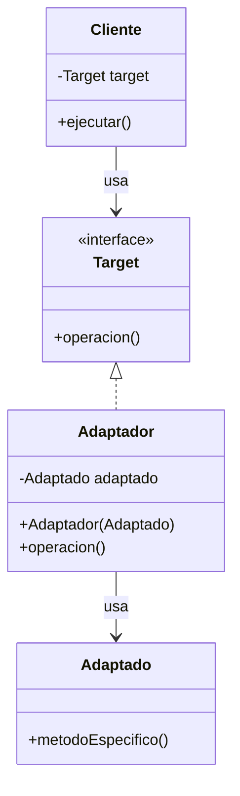
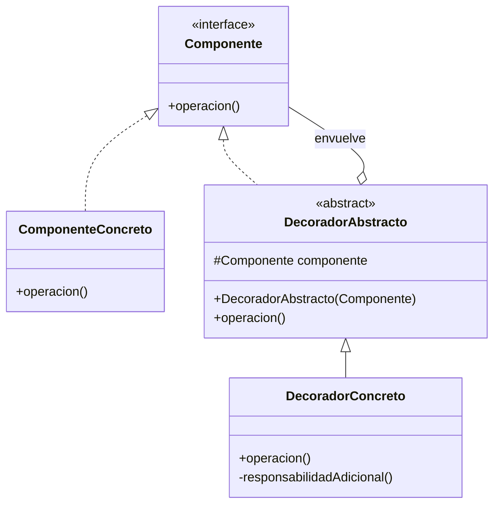
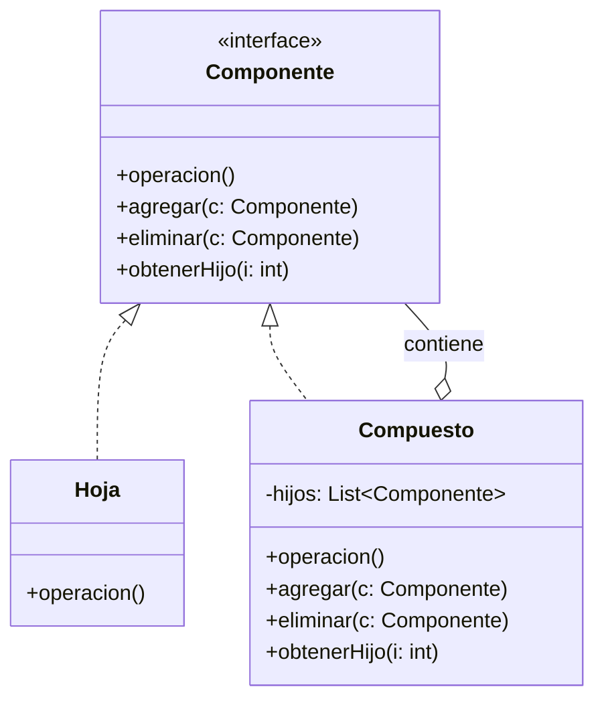

(patrones-estructurales-profundidad)=
# Patrones de Diseño Estructurales: Profundización

Los patrones estructurales se ocupan de cómo se componen las clases y objetos para formar estructuras más grandes, facilitando la comunicación entre entidades y proporcionando soluciones elegantes a problemas de composición.

## Clasificación de Patrones Estructurales

Existen seis patrones estructurales principales en el catálogo Gang of Four:

1. **Adapter** - Adapta interfaces incompatibles
2. **Bridge** - Desacopla abstracción de implementación
3. **Composite** - Compone objetos en árboles
4. **Decorator** - Agrega responsabilidades dinámicamente
5. **Facade** - Proporciona interfaz simplificada a subsistema
6. **Flyweight** - Comparte objetos para optimizar memoria
7. **Proxy** - Proporciona sustituto o placeholder

---

(patron-adapter-profundo)=
## Adapter (Adaptador)

### Definición Completa

Convierte la interfaz de una clase en otra que los clientes esperan. Adapter permite que clases con interfaces incompatibles trabajen juntas.

### Motivación y Contexto

El patrón Adapter resuelve un problema clásico en ingeniería de software: la integración de componentes con interfaces incompatibles. Esto es especialmente relevante cuando:

- Trabajas con librerías legacy que no puedes modificar
- Integras componentes de terceros con tu sistema
- Necesitas hacer compatible código viejo con código nuevo
- Tienes múltiples proveedores con interfaces diferentes

### Estructura Detallada



### Variantes

**Adaptador de Clases (Herencia)**
```java
// Adaptador que hereda de Adaptado
class AdaptadorClase extends Adaptado implements Target {
    @Override
    public void operacion() {
        this.metodoEspecifico();
    }
}
```

**Adaptador de Objetos (Composición)**
```java
// Adaptador que contiene una instancia de Adaptado
class AdaptadorObjetos implements Target {
    private Adaptado adaptado;
    
    public AdaptadorObjetos(Adaptado adaptado) {
        this.adaptado = adaptado;
    }
    
    @Override
    public void operacion() {
        adaptado.metodoEspecifico();
    }
}
```

### Casos de Uso Real

**Caso 1: Integración con Base de Datos Legacy**
```java
// Interfaz esperada por la aplicación
interface RepositorioModerno {
    List<Usuario> buscar(Criterios c);
    void guardar(Usuario u);
}

// Clase legacy que no puedes modificar
class ConexionVieja {
    public ResultSet ejecutarSQL(String sql) { /* ... */ }
}

// Adaptador que los une
class AdaptadorBD implements RepositorioModerno {
    private ConexionVieja conexion;
    
    @Override
    public List<Usuario> buscar(Criterios c) {
        String sql = "SELECT * FROM usuarios WHERE " + c.toSQL();
        ResultSet rs = conexion.ejecutarSQL(sql);
        return convertirAObjetos(rs);
    }
    
    @Override
    public void guardar(Usuario u) {
        String sql = "INSERT INTO usuarios VALUES (" + u.toSQL() + ")";
        conexion.ejecutarSQL(sql);
    }
}
```

**Caso 2: Unificación de Proveedores**
```java
interface PagosAPI {
    TransaccionID procesarPago(Dinero cantidad, Tarjeta tarjeta);
}

class MercadoPago { 
    public String pagar(double monto, String token) { /* ... */ }
}

class PayPal { 
    public Transaction pay(BigDecimal amount, String token) { /* ... */ }
}

class AdaptadorMercadoPago implements PagosAPI {
    private MercadoPago mp = new MercadoPago();
    
    public TransaccionID procesarPago(Dinero cantidad, Tarjeta tarjeta) {
        String resultado = mp.pagar(cantidad.valor(), tarjeta.token());
        return new TransaccionID(resultado);
    }
}

class AdaptadorPayPal implements PagosAPI {
    private PayPal paypal = new PayPal();
    
    public TransaccionID procesarPago(Dinero cantidad, Tarjeta tarjeta) {
        Transaction tx = paypal.pay(cantidad.asBigDecimal(), tarjeta.token());
        return new TransaccionID(tx.getId());
    }
}
```

### Ventajas y Desventajas

**Ventajas:**
- ✅ Responsabilidad Única: Convierte interfaces incompatibles
- ✅ Abierto/Cerrado: Puedes agregar adaptadores sin modificar código existente
- ✅ Reutilización: Permite usar clases incompatibles juntas

**Desventajas:**
- ❌ Puede ocultar problemas de diseño más profundos
- ❌ Agregacomplejidad innecesaria si solo necesitas un cambio simple
- ❌ El adaptador puede convertirse en "curita" masiva

### Cuándo No Usar

- Cuando la interfaz es solo ligeramente diferente (mejor refactorizar)
- Cuando tienes control sobre ambas interfaces (mejor rediseñar)
- Cuando la traducción es tan compleja que oscurece la intención

---

(patron-decorator-profundo)=
## Decorator (Decorador)

### Definición Completa

Adjunta responsabilidades adicionales a un objeto dinámicamente. Los decoradores proporcionan una alternativa flexible a la herencia para extender funcionalidad.

### Motivación y Contexto

La herencia es una forma de extender funcionalidad, pero tiene limitaciones:

- **Cambio estático**: Las subclases se definen en tiempo de compilación
- **Explosión de clases**: Con N responsabilidades opcionales, necesitas 2^N subclases
- **Violación de SRP**: Una clase termina con múltiples responsabilidades

Decorator resuelve esto envolviendo objetos.

### Estructura Detallada



### Ejemplo Completo: Sistema de Reportes

**Sin Decorator (explosión de clases):**
```java
// ❌ 8 combinaciones diferentes
class Reporte { }
class ReporteConTimestamp { }
class ReporteConEncriptacion { }
class ReporteConCompresion { }
class ReporteConTimestampYEncriptacion { }
class ReporteConTimestampYCompresion { }
class ReporteConEncriptacionYCompresion { }
class ReporteConTodo { }
```

**Con Decorator:**
```java
interface Reporte {
    String generar();
}

class ReporteBase implements Reporte {
    @Override
    public String generar() {
        return "CONTENIDO DEL REPORTE\n";
    }
}

abstract class DecoradorReporte implements Reporte {
    protected Reporte reporte;
    
    public DecoradorReporte(Reporte reporte) {
        this.reporte = reporte;
    }
    
    @Override
    public String generar() {
        return reporte.generar();
    }
}

class DecoradorTimestamp extends DecoradorReporte {
    public DecoradorTimestamp(Reporte reporte) {
        super(reporte);
    }
    
    @Override
    public String generar() {
        return super.generar() + 
               "Generado: " + LocalDateTime.now() + "\n";
    }
}

class DecoradorEncriptacion extends DecoradorReporte {
    public DecoradorEncriptacion(Reporte reporte) {
        super(reporte);
    }
    
    @Override
    public String generar() {
        String contenido = super.generar();
        return "ENCRIPTADO: " + encriptar(contenido);
    }
    
    private String encriptar(String contenido) {
        // Simulación de encriptación
        return Base64.getEncoder().encodeToString(
            contenido.getBytes()
        );
    }
}

class DecoradorCompresion extends DecoradorReporte {
    public DecoradorCompresion(Reporte reporte) {
        super(reporte);
    }
    
    @Override
    public String generar() {
        String contenido = super.generar();
        return "COMPRIMIDO (" + contenido.length() + " bytes)";
    }
}

// Uso flexible y composable
Reporte reporte = new ReporteBase();
reporte = new DecoradorTimestamp(reporte);
reporte = new DecoradorEncriptacion(reporte);
reporte = new DecoradorCompresion(reporte);

System.out.println(reporte.generar());
```

### Ejemplo del Mundo Real: Java I/O

El framework de I/O de Java es un ejemplo magistral de Decorator:

```java
// Objeto base
FileInputStream archivo = new FileInputStream("datos.txt");

// Agregar buffering
BufferedInputStream buffer = new BufferedInputStream(archivo);

// Agregar compresión
GZIPInputStream comprimido = new GZIPInputStream(buffer);

// Agregar lectura de datos tipificada
DataInputStream datos = new DataInputStream(comprimido);

// El cliente ve una sola interfaz
int numero = datos.readInt();
String texto = datos.readUTF();
```

### Ventajas y Desventajas

**Ventajas:**
- ✅ Más flexible que herencia
- ✅ Responsabilidad Única: Cada decorador tiene una única responsabilidad
- ✅ Composición en tiempo de ejecución
- ✅ Fácil de combinar responsabilidades

**Desventajas:**
- ❌ Aumenta el número de clases pequeñas
- ❌ El orden de decoradores puede importar
- ❌ Debugging más complejo (múltiples wrappers)
- ❌ Overhead de memoria (múltiples objetos anidados)

---

(patron-composite-profundo)=
## Composite (Compuesto)

### Definición Completa

Compone objetos en estructuras de árbol para representar jerarquías parte-todo. Composite permite que los clientes traten objetos individuales y composiciones de objetos de manera uniforme.

### Motivación y Contexto

Muchos problemas del mundo real tienen naturaleza jerárquica:

- Sistemas de archivos (carpetas contienen archivos y otras carpetas)
- Interfaces gráficas (paneles contienen botones, etiquetas, otros paneles)
- Organigramas (departamentos contienen personas y subdepartamentos)
- Menús (menús contienen ítems y submenús)

El patrón Composite permite tratar todos estos casos de manera uniforme.

### Estructura Detallada



### Casos de Uso Detallados

**Caso 1: Sistema de Archivos Jerarquizado**

```java
interface ElementoArchivo {
    String obtenerNombre();
    long obtenerTamaño();
    void mostrar(int indentacion);
}

class Archivo implements ElementoArchivo {
    private String nombre;
    private long tamaño;
    
    public Archivo(String nombre, long tamaño) {
        this.nombre = nombre;
        this.tamaño = tamaño;
    }
    
    @Override
    public String obtenerNombre() {
        return nombre;
    }
    
    @Override
    public long obtenerTamaño() {
        return tamaño;
    }
    
    @Override
    public void mostrar(int indentacion) {
        System.out.println(" ".repeat(indentacion) + 
            "📄 " + nombre + " (" + tamaño + " bytes)");
    }
}

class Carpeta implements ElementoArchivo {
    private String nombre;
    private List<ElementoArchivo> contenido = new ArrayList<>();
    
    public Carpeta(String nombre) {
        this.nombre = nombre;
    }
    
    public void agregar(ElementoArchivo elemento) {
        contenido.add(elemento);
    }
    
    public void eliminar(ElementoArchivo elemento) {
        contenido.remove(elemento);
    }
    
    @Override
    public String obtenerNombre() {
        return nombre;
    }
    
    @Override
    public long obtenerTamaño() {
        long total = 0;
        for (ElementoArchivo elemento : contenido) {
            total += elemento.obtenerTamaño();
        }
        return total;
    }
    
    @Override
    public void mostrar(int indentacion) {
        System.out.println(" ".repeat(indentacion) + 
            "📁 " + nombre + "/");
        for (ElementoArchivo elemento : contenido) {
            elemento.mostrar(indentacion + 2);
        }
    }
}

// Uso uniforme
ElementoArchivo raiz = new Carpeta("Documentos");

Carpeta trabajo = new Carpeta("Trabajo");
trabajo.agregar(new Archivo("proyecto.java", 4096));
trabajo.agregar(new Archivo("especificacion.pdf", 204800));

Carpeta personal = new Carpeta("Personal");
personal.agregar(new Archivo("cv.pdf", 51200));

raiz.agregar(trabajo);
raiz.agregar(personal);
raiz.agregar(new Archivo("readme.txt", 512));

// Mostrar toda la estructura
raiz.mostrar(0);

// Obtener tamaño recursivamente
System.out.println("Tamaño total: " + raiz.obtenerTamaño() + " bytes");
```

**Caso 2: Componentes UI Jerárquicos**

```java
abstract class ComponenteUI {
    protected String id;
    
    abstract void dibujar(Graphics g, int x, int y);
    abstract void procesarEvento(Evento e);
}

class Etiqueta extends ComponenteUI {
    private String texto;
    
    @Override
    void dibujar(Graphics g, int x, int y) {
        g.drawString(texto, x, y);
    }
    
    @Override
    void procesarEvento(Evento e) {
        // Las etiquetas no procesan eventos
    }
}

class Panel extends ComponenteUI {
    private List<ComponenteUI> hijos = new ArrayList<>();
    private int ancho, alto;
    
    public void agregar(ComponenteUI componente) {
        hijos.add(componente);
    }
    
    @Override
    void dibujar(Graphics g, int x, int y) {
        // Dibujar el fondo del panel
        g.drawRect(x, y, ancho, alto);
        
        // Dibujar todos los componentes hijo
        int posY = y;
        for (ComponenteUI hijo : hijos) {
            hijo.dibujar(g, x + 10, posY);
            posY += 20;
        }
    }
    
    @Override
    void procesarEvento(Evento e) {
        // Propagar evento a todos los hijos
        for (ComponenteUI hijo : hijos) {
            hijo.procesarEvento(e);
        }
    }
}

// Construcción de interfaz compleja
ComponenteUI aplicacion = new Panel();
Panel panelPrincipal = new Panel();

panelPrincipal.agregar(new Etiqueta("Nombre:"));
panelPrincipal.agregar(new CampoTexto("nombre"));

panelPrincipal.agregar(new Etiqueta("Email:"));
panelPrincipal.agregar(new CampoTexto("email"));

Panel botones = new Panel();
botones.agregar(new Boton("Guardar"));
botones.agregar(new Boton("Cancelar"));

panelPrincipal.agregar(botones);

// Operaciones uniformes
panelPrincipal.dibujar(g, 0, 0);
panelPrincipal.procesarEvento(nuevoEvento);
```

### Variaciones Comunes

**Safe Composite:**
Solo el compuesto puede contener hijos (hojas no tienen métodos agregar/eliminar)

```java
interface Componente {
    void operacion();
}

class Hoja implements Componente {
    public void operacion() { }
}

class Compuesto implements Componente {
    private List<Componente> hijos;
    
    public void agregar(Componente c) { }
    public void eliminar(Componente c) { }
    
    public void operacion() {
        for (Componente hijo : hijos) {
            hijo.operacion();
        }
    }
}
```

**Transparent Composite:**
Todos los componentes tienen los mismos métodos (más flexible, menos type-safe)

```java
interface Componente {
    void operacion();
    void agregar(Componente c);
    void eliminar(Componente c);
}
```

### Ventajas y Desventajas

**Ventajas:**
- ✅ Simplifica código cliente (trata todos uniformemente)
- ✅ Fácil agregar nuevos tipos de componentes
- ✅ Recursión natural para estructuras jerárquicas
- ✅ Composición sobre herencia

**Desventajas:**
- ❌ Puede hacer muy general el diseño
- ❌ Puede permitir operaciones inválidas (ej: agregar hijo a una hoja)
- ❌ Debugging recursivo es complejo
- ❌ Performance: operaciones recursivas pueden ser lentas

---

## Comparativa de Patrones Estructurales

| Patrón | Propósito | Mecanismo | Cuándo Usar |
|--------|-----------|-----------|------------|
| **Adapter** | Hacer compatible interfaces incompatibles | Traducción | Integración con legacy/terceros |
| **Bridge** | Desacoplar abstracción de implementación | Separación | Múltiples implementaciones |
| **Composite** | Estructura jerárquica uniforme | Árbol recursivo | Estructuras parte-todo |
| **Decorator** | Agregar responsabilidades dinámicamente | Wrapping | Extensión flexible |
| **Facade** | Simplificar interfaz de subsistema | Simplificación | Reducir complejidad |
| **Flyweight** | Compartir objetos para optimizar | Caché | Muchas instancias similares |
| **Proxy** | Control de acceso | Sustituto | Lazy loading, control, logging |

---

## Ejercicios Prácticos

```{exercise}
:label: ex-decorator-pizza
Implementa un patrón Decorator para un sistema de orden de pizzas donde:
- Clase base: `Pizza` con método `costo()` y `descripcion()`
- Decoradores: `ConQueso`, `ConPeperoni`, `ConCebolla`, `ConHambre`
- Permite combinar múltiples ingredientes dinámicamente
```

```{solution} ex-decorator-pizza
:class: dropdown

```java
interface Pizza {
    double costo();
    String descripcion();
}

class PizzaSimple implements Pizza {
    @Override
    public double costo() { return 8.0; }
    
    @Override
    public String descripcion() { return "Pizza Simple"; }
}

abstract class IngredienteDecorador implements Pizza {
    protected Pizza pizza;
    
    public IngredienteDecorador(Pizza pizza) {
        this.pizza = pizza;
    }
}

class ConQueso extends IngredienteDecorador {
    public ConQueso(Pizza pizza) { super(pizza); }
    
    @Override
    public double costo() { return pizza.costo() + 1.5; }
    
    @Override
    public String descripcion() { 
        return pizza.descripcion() + ", con queso"; 
    }
}

// Uso
Pizza miPizza = new PizzaSimple();
miPizza = new ConQueso(miPizza);
miPizza = new ConPeperoni(miPizza);

System.out.println(miPizza.descripcion());  // Pizza Simple, con queso, con peperoni
System.out.println(miPizza.costo());        // 8.0 + 1.5 + 2.0 = 11.5
```

```

---

## Resumen

Los patrones estructurales proporcionan soluciones probadas a problemas de composición y organización de objetos:

- **Adapter**: Soluciona incompatibilidad de interfaces
- **Decorator**: Ofrece alternativa flexible a la herencia
- **Composite**: Maneja estructuras jerárquicas uniformemente

Estos patrones, cuando se usan correctamente, hacen que el código sea más mantenible, flexible y fácil de entender.

---

## Referencias y Lecturas Recomendadas

- Gang of Four: "Design Patterns: Elements of Reusable Object-Oriented Software"
- Refactoring Guru: https://refactoring.guru/design-patterns/structural-patterns
- Oracle: Java I/O Streams (ejemplo vivo de Decorator)
