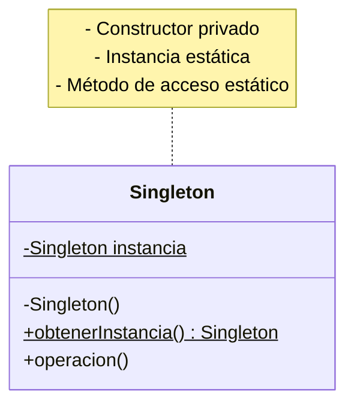
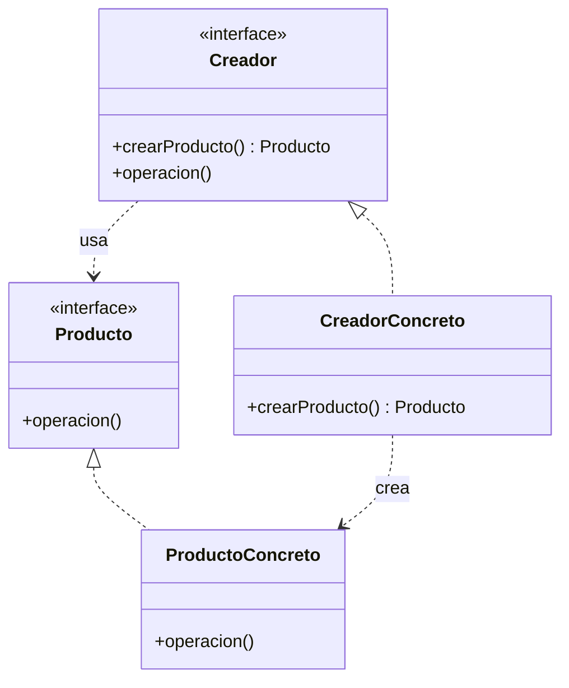
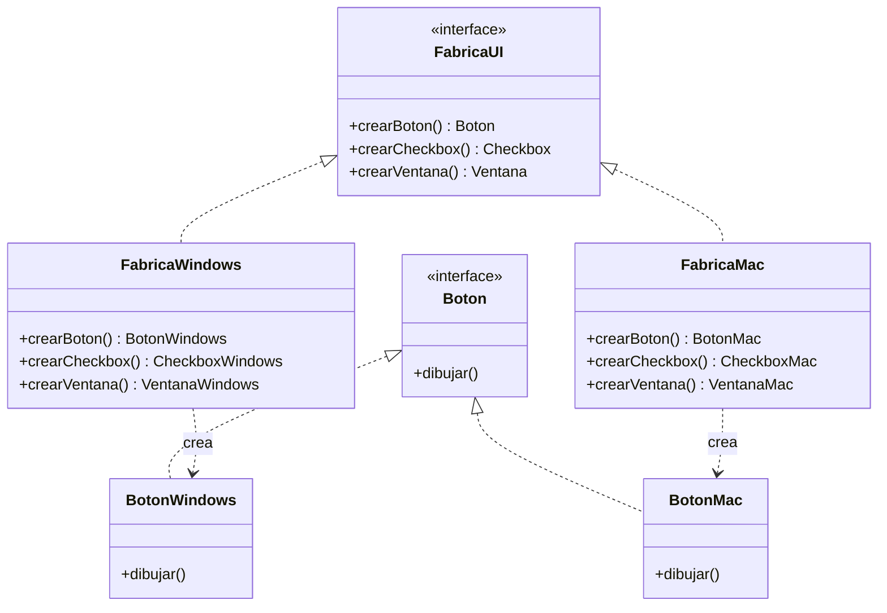
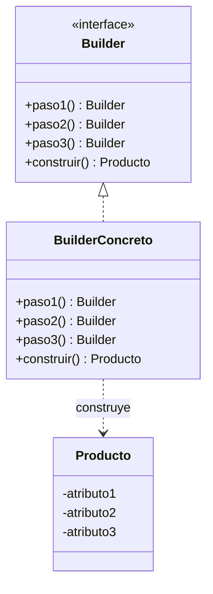

(patrones-creacionales-profundidad)=
# Patrones de Diseño Creacionales: Profundización

Los patrones creacionales abstraen el proceso de instanciación de objetos, haciendo el sistema independiente de cómo se crean, componen y representan los objetos. Resuelven problemas de creación de manera flexible y escalable.

## Clasificación de Patrones Creacionales

Existen cinco patrones creacionales principales en el catálogo Gang of Four:

1. **Singleton** - Garantiza una única instancia
2. **Factory Method** - Delega la creación a subclases
3. **Abstract Factory** - Crea familias de objetos relacionados
4. **Builder** - Construye objetos complejos paso a paso
5. **Prototype** - Crea objetos clonando un prototipo

---

(patron-singleton-profundo)=
## Singleton (Instancia Única)

### Definición Completa

Asegura que una clase tenga exactamente una instancia y proporciona un punto de acceso global a ella.

### Motivación y Contexto

En muchas aplicaciones necesitamos garantizar la existencia de una sola instancia de ciertas clases:

- **Configuración global**: Solo una configuración de la aplicación
- **Logger**: Un único punto de logging
- **Pool de conexiones**: Una sola colección de conexiones reutilizables
- **Caché**: Un único punto de almacenamiento en memoria
- **Thread pool**: Un único administrador de threads

### Estructura Detallada



### Variantes de Implementación

**1. Inicialización Eager (Instancia por defecto)**
```java
class Singleton {
    // Se crea al cargar la clase
    private static final Singleton INSTANCIA = new Singleton();
    
    private Singleton() { }
    
    public static Singleton obtenerInstancia() {
        return INSTANCIA;
    }
}
```
✅ Thread-safe por naturaleza
❌ Se crea incluso si nunca se usa

**2. Inicialización Lazy (Bajo demanda)**
```java
class Singleton {
    private static Singleton instancia;
    
    private Singleton() { }
    
    public static synchronized Singleton obtenerInstancia() {
        if (instancia == null) {
            instancia = new Singleton();
        }
        return instancia;
    }
}
```
✅ Solo se crea si se usa
❌ `synchronized` puede ser ineficiente

**3. Double-Checked Locking (Optimizado)**
```java
class Singleton {
    private static volatile Singleton instancia;
    
    private Singleton() { }
    
    public static Singleton obtenerInstancia() {
        if (instancia == null) {
            synchronized (Singleton.class) {
                if (instancia == null) {
                    instancia = new Singleton();
                }
            }
        }
        return instancia;
    }
}
```
✅ Lazy y eficiente
⚠️ Complejo, difícil de entender

**4. Inicialización por Class Loader (Recomendado)**
```java
class Singleton {
    private Singleton() { }
    
    private static class Holder {
        static final Singleton INSTANCIA = new Singleton();
    }
    
    public static Singleton obtenerInstancia() {
        return Holder.INSTANCIA;
    }
}
```
✅ Lazy, thread-safe, simple
✅ Patrón recomendado en Java

### Casos de Uso Real

**Caso 1: Configuración de la Aplicación**
```java
class Configuracion {
    private static Configuracion instancia;
    private Properties props;
    
    private Configuracion() {
        props = new Properties();
        cargarDesdeArchivo("config.properties");
    }
    
    public static Configuracion obtener() {
        if (instancia == null) {
            instancia = new Configuracion();
        }
        return instancia;
    }
    
    public String obtenerPropiedad(String clave) {
        return props.getProperty(clave);
    }
    
    public void establecerPropiedad(String clave, String valor) {
        props.setProperty(clave, valor);
    }
}

// Uso
String bd = Configuracion.obtener().obtenerPropiedad("database.url");
```

**Caso 2: Logger Centralizado**
```java
class Logger {
    private static Logger instancia;
    private PrintWriter escritor;
    
    private Logger() {
        try {
            escritor = new PrintWriter("app.log");
        } catch (IOException e) {
            e.printStackTrace();
        }
    }
    
    public static Logger obtener() {
        if (instancia == null) {
            instancia = new Logger();
        }
        return instancia;
    }
    
    public void info(String mensaje) {
        escribir("INFO: " + mensaje);
    }
    
    public void error(String mensaje) {
        escribir("ERROR: " + mensaje);
    }
    
    private void escribir(String mensaje) {
        escritor.println(LocalDateTime.now() + " " + mensaje);
        escritor.flush();
    }
}

// Uso desde cualquier lugar
Logger.obtener().info("Aplicación iniciada");
```

**Caso 3: Pool de Conexiones**
```java
class PoolConexiones {
    private List<Conexion> disponibles;
    private List<Conexion> enUso;
    private static PoolConexiones instancia;
    
    private PoolConexiones() {
        disponibles = new ArrayList<>();
        enUso = new ArrayList<>();
        inicializarConexiones(10);
    }
    
    public static PoolConexiones obtener() {
        if (instancia == null) {
            instancia = new PoolConexiones();
        }
        return instancia;
    }
    
    public Conexion obtenerConexion() {
        if (disponibles.isEmpty()) {
            crearConexion();
        }
        Conexion conn = disponibles.remove(0);
        enUso.add(conn);
        return conn;
    }
    
    public void devolverConexion(Conexion conn) {
        enUso.remove(conn);
        disponibles.add(conn);
    }
}
```

### Ventajas y Desventajas

**Ventajas:**
- ✅ Acceso global y controlado a la única instancia
- ✅ Inicialización lazy (si se implementa correctamente)
- ✅ Previene instanciación múltiple

**Desventajas:**
- ❌ Oculta estado global (dificulta testing)
- ❌ Viola Responsabilidad Única
- ❌ Dificulta la inyección de dependencias
- ❌ Puede crear un cuello de botella en concurrencia

### Alternativas Modernas

En lugar de Singleton, considera:

**1. Inyección de Dependencias**
```java
class Aplicacion {
    private Configuracion config;
    
    // La instancia se inyecta desde afuera
    public Aplicacion(Configuracion config) {
        this.config = config;
    }
}

// En la clase main
Configuracion config = new Configuracion();
Aplicacion app = new Aplicacion(config);
```

**2. Enum Singleton (Anti-patrón desaparecido)**
```java
enum ConfiguracionEnum {
    INSTANCIA;
    
    public String obtenerPropiedad(String clave) {
        // ...
    }
}

// Uso
String valor = ConfiguracionEnum.INSTANCIA.obtenerPropiedad("clave");
```

---

(patron-factory-method-profundo)=
## Factory Method (Método Factoría)

### Definición Completa

Define una interfaz para crear un objeto, pero deja que las subclases decidan qué clase instanciar.

### Motivación y Contexto

Factory Method resuelve el problema del acoplamiento a clases concretas:

- **Acoplamiento**: El código cliente conoce todas las subclases posibles
- **Rigidez**: Agregar un nuevo tipo requiere modificar código existente
- **Duplicación**: Lógica de creación repartida por el código

### Estructura Detallada



### Ejemplo Completo: Sistema de Transporte

```java
abstract class Logistica {
    // Método factoría - abstract
    protected abstract Transporte crearTransporte();
    
    public void planificarEntrega() {
        Transporte transporte = crearTransporte();
        transporte.entregar();
    }
}

// Subclases concretas
class LogisticaTerrestre extends Logistica {
    @Override
    protected Transporte crearTransporte() {
        return new Camion();
    }
}

class LogisticaAerea extends Logistica {
    @Override
    protected Transporte crearTransporte() {
        return new Avion();
    }
}

class LogisticaMaritima extends Logistica {
    @Override
    protected Transporte crearTransporte() {
        return new Barco();
    }
}

// Interfaz Transporte
interface Transporte {
    void entregar();
}

class Camion implements Transporte {
    public void entregar() {
        System.out.println("Entrega por carretera");
    }
}

class Avion implements Transporte {
    public void entregar() {
        System.out.println("Entrega aérea");
    }
}

class Barco implements Transporte {
    public void entregar() {
        System.out.println("Entrega marítima");
    }
}

// Uso
Logistica logistica = new LogisticaTerrestre();
logistica.planificarEntrega();  // Usa Camion

logistica = new LogisticaAerea();
logistica.planificarEntrega();  // Usa Avion
```

### Variación: Factory Estática (Simple Factory)

Cuando la lógica de creación es simple, no necesitas herencia:

```java
class VehiculoFactory {
    public static Vehiculo crear(String tipo) {
        switch (tipo) {
            case "auto":
                return new Auto();
            case "moto":
                return new Moto();
            case "camion":
                return new Camion();
            default:
                throw new IllegalArgumentException("Tipo desconocido: " + tipo);
        }
    }
}

// Uso
Vehiculo auto = VehiculoFactory.crear("auto");
```

### Ventajas y Desventajas

**Ventajas:**
- ✅ Desacopla código cliente de clases concretas
- ✅ Fácil agregar nuevos tipos (OCP)
- ✅ Centraliza lógica de creación
- ✅ Permite subclases controlar qué crear

**Desventajas:**
- ❌ Requiere jerarquía de clases
- ❌ Puede ser excesivo para casos simples
- ❌ Más clases en el código

---

(patron-abstract-factory-profundo)=
## Abstract Factory (Factoría Abstracta)

### Definición Completa

Proporciona una interfaz para crear familias de objetos relacionados o dependientes sin especificar sus clases concretas.

### Motivación y Contexto

Cuando tu sistema debe trabajar con múltiples familias de productos relacionados:

- **UIs multiplataforma**: Windows, Mac, Linux con componentes consistentes
- **Bases de datos**: Soportar múltiples providers (MySQL, PostgreSQL, Oracle)
- **Temas visuales**: Dark mode, Light mode, High contrast con componentes coordinados

### Estructura Detallada



### Ejemplo Completo: UI Multiplataforma

```java
interface FabricaUI {
    Boton crearBoton();
    Checkbox crearCheckbox();
    Ventana crearVentana();
}

class FabricaWindows implements FabricaUI {
    public Boton crearBoton() {
        return new BotonWindows();
    }
    
    public Checkbox crearCheckbox() {
        return new CheckboxWindows();
    }
    
    public Ventana crearVentana() {
        return new VentanaWindows();
    }
}

class FabricaMac implements FabricaUI {
    public Boton crearBoton() {
        return new BotonMac();
    }
    
    public Checkbox crearCheckbox() {
        return new CheckboxMac();
    }
    
    public Ventana crearVentana() {
        return new VentanaMac();
    }
}

// Componentes concretos
interface Boton {
    void dibujar();
}

class BotonWindows implements Boton {
    public void dibujar() {
        System.out.println("🪟 Botón Windows");
    }
}

class BotonMac implements Boton {
    public void dibujar() {
        System.out.println("🍎 Botón Mac");
    }
}

// Uso
FabricaUI fabrica = obtenerFabricaParaSO();
Boton boton = fabrica.crearBoton();
Checkbox check = fabrica.crearCheckbox();
Ventana ventana = fabrica.crearVentana();

boton.dibujar();        // Estilo adecuado al SO
check.dibujar();        // Estilo adecuado al SO
ventana.mostrar();      // Estilo adecuado al SO
```

### Ventajas y Desventajas

**Ventajas:**
- ✅ Garantiza consistencia entre productos relacionados
- ✅ Aislación entre familias de productos
- ✅ Fácil soportar nuevas familias

**Desventajas:**
- ❌ Muchas clases y interfaces
- ❌ Difícil agregar nuevos productos a todas las familias
- ❌ Puede ser excesivo para pocas familias

---

(patron-builder-profundo)=
## Builder (Constructor)

### Definición Completa

Separa la construcción de un objeto complejo de su representación, permitiendo crear diferentes representaciones con el mismo proceso de construcción.

### Motivación y Contexto

Algunos objetos son complejos y requieren múltiples pasos para su inicialización:

- **Muchos parámetros** (obligatorios y opcionales)
- **Pasos secuenciales** (orden específico de inicialización)
- **Validaciones** que deben ocurrir durante la construcción
- **Diferentes representaciones** del mismo objeto

### Estructura Detallada



### Ejemplo Completo: Constructor de Casas

```java
class Casa {
    private String cimientos;
    private String paredes;
    private String techo;
    private String puertas;
    private String ventanas;
    private String jardin;
    private String garage;
    
    // Constructor privado - solo el builder puede crear instancias
    private Casa(CasaBuilder builder) {
        this.cimientos = builder.cimientos;
        this.paredes = builder.paredes;
        this.techo = builder.techo;
        this.puertas = builder.puertas;
        this.ventanas = builder.ventanas;
        this.jardin = builder.jardin;
        this.garage = builder.garage;
    }
    
    @Override
    public String toString() {
        return "Casa: " + cimientos + " | " + paredes + " | " + 
               techo + " | " + puertas + " puertas | " + ventanas + " ventanas";
    }
    
    // Builder interno (patrón telescópico mejorado)
    public static class CasaBuilder {
        // Obligatorios
        private String cimientos;
        private String paredes;
        private String techo;
        
        // Opcionales
        private String puertas = "2";
        private String ventanas = "4";
        private String jardin = "No";
        private String garage = "No";
        
        public CasaBuilder(String cimientos, String paredes, String techo) {
            this.cimientos = cimientos;
            this.paredes = paredes;
            this.techo = techo;
        }
        
        // Métodos fluentes para opcionales
        public CasaBuilder conPuertas(String cantidad) {
            this.puertas = cantidad;
            return this;
        }
        
        public CasaBuilder conVentanas(String cantidad) {
            this.ventanas = cantidad;
            return this;
        }
        
        public CasaBuilder conJardin() {
            this.jardin = "Sí";
            return this;
        }
        
        public CasaBuilder conGarage() {
            this.garage = "Sí";
            return this;
        }
        
        public Casa construir() {
            return new Casa(this);
        }
    }
}

// Uso
Casa casaSimple = new Casa.CasaBuilder("hormigón", "ladrillo", "tejas")
    .conPuertas("3")
    .construir();

Casa casaLujo = new Casa.CasaBuilder("hormigón armado", "piedra", "tejas francesas")
    .conPuertas("4")
    .conVentanas("8")
    .conJardin()
    .conGarage()
    .construir();

System.out.println(casaSimple);  // Casa: hormigón | ladrillo | tejas | 3 puertas...
System.out.println(casaLujo);    // Casa: hormigón armado | piedra | tejas francesas...
```

### Ejemplo: SQL Query Builder

```java
class QueryBuilder {
    private String select = "";
    private String from = "";
    private List<String> wheres = new ArrayList<>();
    private List<String> joins = new ArrayList<>();
    private String orderBy = "";
    private int limit = -1;
    
    public QueryBuilder select(String... columnas) {
        select = "SELECT " + String.join(", ", columnas);
        return this;
    }
    
    public QueryBuilder from(String tabla) {
        from = "FROM " + tabla;
        return this;
    }
    
    public QueryBuilder join(String tabla, String condicion) {
        joins.add("JOIN " + tabla + " ON " + condicion);
        return this;
    }
    
    public QueryBuilder where(String condicion) {
        wheres.add(condicion);
        return this;
    }
    
    public QueryBuilder orderBy(String columna) {
        orderBy = "ORDER BY " + columna;
        return this;
    }
    
    public QueryBuilder limit(int cantidad) {
        limit = cantidad;
        return this;
    }
    
    public String construir() {
        StringBuilder sql = new StringBuilder();
        sql.append(select).append(" ");
        sql.append(from).append(" ");
        
        for (String join : joins) {
            sql.append(join).append(" ");
        }
        
        if (!wheres.isEmpty()) {
            sql.append("WHERE ").append(String.join(" AND ", wheres)).append(" ");
        }
        
        if (!orderBy.isEmpty()) {
            sql.append(orderBy).append(" ");
        }
        
        if (limit > 0) {
            sql.append("LIMIT ").append(limit);
        }
        
        return sql.toString();
    }
}

// Uso
String query = new QueryBuilder()
    .select("id", "nombre", "email")
    .from("usuarios")
    .join("roles", "usuarios.role_id = roles.id")
    .where("edad > 18")
    .where("activo = true")
    .orderBy("nombre")
    .limit(10)
    .construir();

System.out.println(query);
// SELECT id, nombre, email FROM usuarios JOIN roles ON ... WHERE edad > 18 AND activo = true ORDER BY nombre LIMIT 10
```

### Ventajas y Desventajas

**Ventajas:**
- ✅ Código cliente más legible y expresivo
- ✅ Separa construcción de representación
- ✅ Fácil manejar parámetros opcionales
- ✅ Valida estado del objeto durante construcción

**Desventajas:**
- ❌ Requiere más clases
- ❌ Overhead para objetos simples
- ❌ Más verboso que constructores directos

---

## Comparativa de Patrones Creacionales

| Patrón | Propósito | Cuándo Usar |
|--------|-----------|------------|
| **Singleton** | Una única instancia | Configuración, Logger, Pool de conexiones |
| **Factory Method** | Delega instanciación | Subclases controlan qué crear |
| **Abstract Factory** | Familias de productos | Múltiples implementaciones relacionadas |
| **Builder** | Construcción compleja | Muchos parámetros, pasos secuenciales |
| **Prototype** | Clona existentes | Crear variantes de objetos existentes |

---

## Ejercicios Prácticos

```{exercise}
:label: ex-factory-empleados
Implementa un Factory Method para crear diferentes tipos de empleados:
- Tipos: Desarrollador, Gerente, Diseñador, Tester
- Cada tipo tiene diferentes atributos (salario base, bonus, beneficios)
- Usa clases abstractas y métodos factory
- El cliente no debe conocer las clases concretas
```

```{solution} ex-factory-empleados
:class: dropdown

```java
abstract class Empresa {
    protected abstract Empleado crearEmpleado(String nombre, double salario);
    
    public void contratarEmpleado(String nombre, double salario) {
        Empleado emp = crearEmpleado(nombre, salario);
        emp.mostrarDetalles();
    }
}

class EmpresaTecnologia extends Empresa {
    protected Empleado crearEmpleado(String nombre, double salario) {
        return new Desarrollador(nombre, salario);
    }
}

class EmpresaCrativa extends Empresa {
    protected Empleado crearEmpleado(String nombre, double salario) {
        return new Diseñador(nombre, salario);
    }
}

abstract class Empleado {
    protected String nombre;
    protected double salario;
    
    public Empleado(String nombre, double salario) {
        this.nombre = nombre;
        this.salario = salario;
    }
    
    abstract void mostrarDetalles();
}

class Desarrollador extends Empleado {
    public Desarrollador(String nombre, double salario) {
        super(nombre, salario);
    }
    
    void mostrarDetalles() {
        System.out.println(nombre + " - Desarrollador: $" + salario);
    }
}

class Diseñador extends Empleado {
    public Diseñador(String nombre, double salario) {
        super(nombre, salario);
    }
    
    void mostrarDetalles() {
        System.out.println(nombre + " - Diseñador: $" + salario);
    }
}
```

```

---

## Resumen

Los patrones creacionales proporcionan soluciones probadas para abstraer la instanciación de objetos:

- **Singleton**: Controla creación de instancia única
- **Factory Method**: Delega creación a subclases
- **Abstract Factory**: Crea familias de objetos relacionados
- **Builder**: Construye objetos complejos paso a paso
- **Prototype**: Clona prototipos existentes

Elegir el patrón correcto hace el código más mantenible, flexible y fácil de extender.

---

## Referencias

- Gang of Four: "Design Patterns: Elements of Reusable Object-Oriented Software"
- Effective Java (Joshua Bloch) - Item 1-5 sobre instanciación
- Refactoring Guru: https://refactoring.guru/design-patterns/creational-patterns
