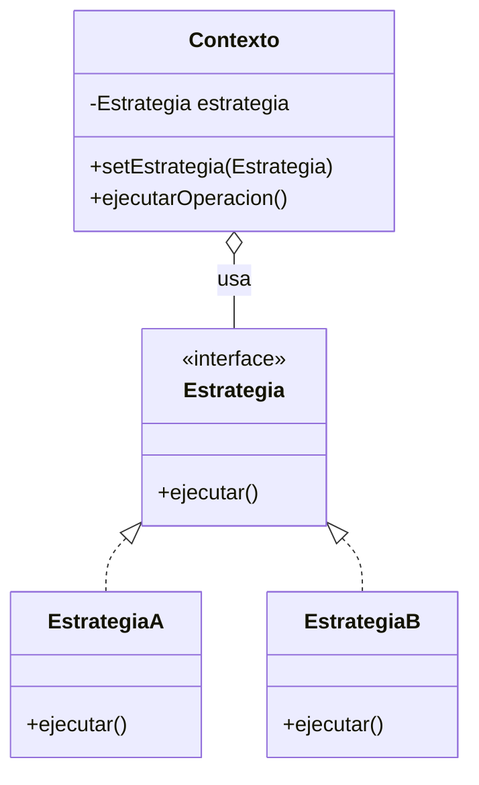
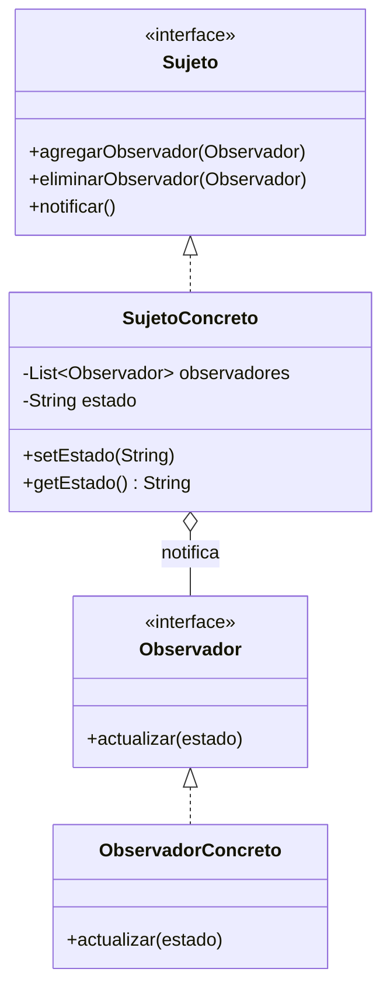
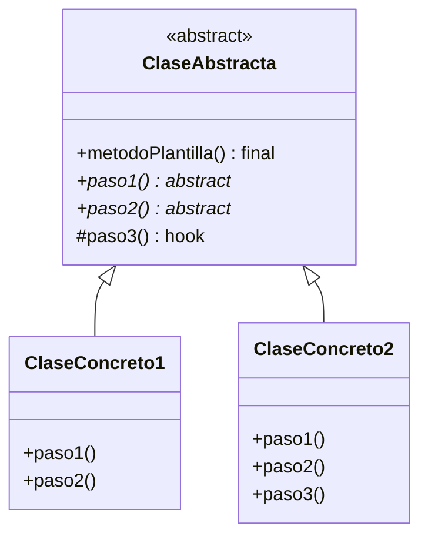

(patrones-comportamiento-profundidad)=
# Patrones de Diseño de Comportamiento: Profundización

Los patrones de comportamiento se ocupan de algoritmos y la asignación de responsabilidades entre objetos. Definen cómo los objetos interactúan y distribuyen responsabilidades.

## Clasificación de Patrones de Comportamiento

Los principales patrones de comportamiento son:

1. **Strategy** - Encapsula algoritmos intercambiables
2. **Observer** - Notifica cambios a múltiples objetos
3. **Template Method** - Define esqueleto de algoritmo
4. **State** - Cambia comportamiento según estado
5. **Command** - Encapsula solicitudes como objetos
6. **Iterator** - Accede elementos secuencialmente
7. **Mediator** - Centraliza comunicación entre objetos
8. **Chain of Responsibility** - Pasa solicitudes en cadena
9. **Visitor** - Realiza operaciones sobre estructura

---

(patron-strategy-profundo)=
## Strategy (Estrategia)

### Definición Completa

Define una familia de algoritmos, encapsula cada uno, y hacelos intercambiables. Strategy permite que el algoritmo varíe independientemente del cliente que lo usa.

### Motivación y Contexto

Strategy resuelve el problema de múltiples formas de hacer algo:

- **Muchos algoritmos**: Ordenamiento, búsqueda, compresión
- **Condicionales complejos**: Cambiar lógica según contexto
- **Variabilidad en tiempo de ejecución**: Elegir algoritmo dinámicamente
- **Mantener opciones abiertas**: Sin modificar código existente

### Estructura Detallada



### Ejemplo Completo: Sistema de Compresión

```java
interface EstrategiaCompresion {
    void comprimir(String archivo, String destino);
}

class CompresiónZIP implements EstrategiaCompresion {
    public void comprimir(String archivo, String destino) {
        System.out.println("Comprimiendo con ZIP: " + archivo);
        // Implementación específica de ZIP
    }
}

class CompresiónRAR implements EstrategiaCompresion {
    public void comprimir(String archivo, String destino) {
        System.out.println("Comprimiendo con RAR: " + archivo);
        // Implementación específica de RAR
    }
}

class CompresiónGZIP implements EstrategiaCompresion {
    public void comprimir(String archivo, String destino) {
        System.out.println("Comprimiendo con GZIP: " + archivo);
        // Implementación específica de GZIP
    }
}

class Compresor {
    private EstrategiaCompresion estrategia;
    
    public Compresor(EstrategiaCompresion estrategia) {
        this.estrategia = estrategia;
    }
    
    public void setEstrategia(EstrategiaCompresion estrategia) {
        this.estrategia = estrategia;
    }
    
    public void comprimir(String archivo, String destino) {
        estrategia.comprimir(archivo, destino);
    }
}

// Uso
Compresor compresor = new Compresor(new CompresiónZIP());
compresor.comprimir("datos.txt", "datos.zip");

compresor.setEstrategia(new CompresiónRAR());
compresor.comprimir("datos.txt", "datos.rar");
```

### Ejemplo: Estrategias de Pago

```java
interface EstrategiaPago {
    boolean validar();
    void procesar(double monto);
}

class PagoTarjetaCredito implements EstrategiaPago {
    private String numero;
    private String cvv;
    private String fechaVencimiento;
    
    public PagoTarjetaCredito(String numero, String cvv, String fecha) {
        this.numero = numero;
        this.cvv = cvv;
        this.fechaVencimiento = fecha;
    }
    
    public boolean validar() {
        return numero.length() == 16 && cvv.length() == 3;
    }
    
    public void procesar(double monto) {
        if (validar()) {
            System.out.println("Procesando $" + monto + " con tarjeta...");
        }
    }
}

class PagoPayPal implements EstrategiaPago {
    private String email;
    private String contrasena;
    
    public boolean validar() {
        return email.contains("@") && !contrasena.isEmpty();
    }
    
    public void procesar(double monto) {
        if (validar()) {
            System.out.println("Procesando $" + monto + " con PayPal...");
        }
    }
}

class CarritoCompras {
    private double total;
    private EstrategiaPago metodoPago;
    
    public CarritoCompras(double total) {
        this.total = total;
    }
    
    public void setMetodoPago(EstrategiaPago pago) {
        this.metodoPago = pago;
    }
    
    public void checkout() {
        metodoPago.procesar(total);
    }
}
```

### Ventajas y Desventajas

**Ventajas:**
- ✅ Fácil agregar nuevos algoritmos sin modificar código
- ✅ Elimina condicionales complejos
- ✅ Algoritmos pueden variar en tiempo de ejecución
- ✅ Cada algoritmo en su propia clase (SRP)

**Desventajas:**
- ❌ Muchas clases pequeñas
- ❌ Overhead si solo hay pocos algoritmos
- ❌ El cliente debe conocer todas las estrategias

---

(patron-observer-profundo)=
## Observer (Observador)

### Definición Completa

Define una dependencia uno-a-muchos entre objetos de modo que cuando un objeto cambia de estado, todos sus dependientes son notificados automáticamente.

### Motivación y Contexto

Observer es esencial en sistemas event-driven:

- **Desacoplamiento**: El sujeto no conoce detalles de observadores
- **Dinámico**: Los observadores se pueden agregar/quitar en tiempo de ejecución
- **Propagación de cambios**: Múltiples objetos reaccionan automáticamente
- **Patrón publish-subscribe**: Componentes se comunican sin acoplamiento

### Estructura Detallada



### Ejemplo Completo: Sistema de Notificaciones de Eventos

```java
interface Observador {
    void actualizar(String evento, String detalles);
}

interface Sujeto {
    void agregarObservador(Observador o);
    void eliminarObservador(Observador o);
    void notificar(String evento, String detalles);
}

class EventManager implements Sujeto {
    private List<Observador> observadores = new ArrayList<>();
    
    public void agregarObservador(Observador o) {
        observadores.add(o);
    }
    
    public void eliminarObservador(Observador o) {
        observadores.remove(o);
    }
    
    public void notificar(String evento, String detalles) {
        for (Observador o : observadores) {
            o.actualizar(evento, detalles);
        }
    }
}

// Observadores concretos
class LoggerObservador implements Observador {
    public void actualizar(String evento, String detalles) {
        System.out.println("[LOG] " + evento + ": " + detalles);
    }
}

class EmailObservador implements Observador {
    private String email;
    
    public EmailObservador(String email) {
        this.email = email;
    }
    
    public void actualizar(String evento, String detalles) {
        System.out.println("[EMAIL a " + email + "] " + evento + ": " + detalles);
    }
}

class SlackObservador implements Observador {
    private String canal;
    
    public SlackObservador(String canal) {
        this.canal = canal;
    }
    
    public void actualizar(String evento, String detalles) {
        System.out.println("[SLACK #" + canal + "] " + evento + ": " + detalles);
    }
}

class PanelUIObservador implements Observador {
    public void actualizar(String evento, String detalles) {
        System.out.println("[UI] Actualizar panel: " + evento);
    }
}

// Uso
EventManager eventManager = new EventManager();
eventManager.agregarObservador(new LoggerObservador());
eventManager.agregarObservador(new EmailObservador("admin@empresa.com"));
eventManager.agregarObservador(new SlackObservador("alertas"));
eventManager.agregarObservador(new PanelUIObservador());

// Cuando ocurre un evento
eventManager.notificar("USUARIO_NUEVO", "usuario123 se registró");
// [LOG] USUARIO_NUEVO: usuario123 se registró
// [EMAIL a admin@empresa.com] USUARIO_NUEVO: usuario123 se registró
// [SLACK #alertas] USUARIO_NUEVO: usuario123 se registró
// [UI] Actualizar panel: USUARIO_NUEVO
```

### Ejemplo: Suscripción a Cotizaciones

```java
class Accion {
    private String simbolo;
    private double precio;
    private List<Inversor> observadores = new ArrayList<>();
    
    public Accion(String simbolo, double precioinicial) {
        this.simbolo = simbolo;
        this.precio = precioinicial;
    }
    
    public void suscribir(Inversor inversor) {
        observadores.add(inversor);
    }
    
    public void desuscribir(Inversor inversor) {
        observadores.remove(inversor);
    }
    
    public void setPrecio(double nuevoPrecio) {
        double cambio = nuevoPrecio - this.precio;
        this.precio = nuevoPrecio;
        notificar(cambio);
    }
    
    private void notificar(double cambio) {
        for (Inversor inversor : observadores) {
            inversor.actualizar(simbolo, precio, cambio);
        }
    }
}

interface Inversor {
    void actualizar(String simbolo, double precio, double cambio);
}

class InversorConservador implements Inversor {
    public void actualizar(String simbolo, double precio, double cambio) {
        if (cambio > 5.0) {  // Solo reacciona a cambios grandes
            System.out.println("Inversor conservador alerta: " + simbolo + " cambió $" + cambio);
        }
    }
}

class InversorAgresivo implements Inversor {
    public void actualizar(String simbolo, double precio, double cambio) {
        System.out.println("Inversor agresivo: " + simbolo + " cambió a $" + precio);
    }
}
```

### Ventajas y Desventajas

**Ventajas:**
- ✅ Desacoplamiento entre sujeto y observadores
- ✅ Soporte para broadcast communication
- ✅ Dinámico: agregar/quitar en tiempo de ejecución
- ✅ Cumple con Open/Closed Principle

**Desventajas:**
- ❌ Los observadores se notifican en orden indeterminado
- ❌ Puede consumir mucha memoria si hay muchos observadores
- ❌ Debugging complejo con cadenas de notificaciones

---

(patron-template-method-profundo)=
## Template Method (Método Plantilla)

### Definición Completa

Define en una clase base el esqueleto de un algoritmo, dejando que las subclases redefinan ciertos pasos sin cambiar la estructura del algoritmo.

### Motivación y Contexto

Template Method es útil cuando:

- **Código duplicado**: Múltiples clases tienen algoritmos similares
- **Variabilidad selectiva**: Solo algunos pasos varían
- **Control de extensión**: Querés asegurar que subclases respeten la estructura

### Estructura Detallada



### Ejemplo Completo: Procesamiento de Documentos

```java
abstract class ProcesadorDocumento {
    
    // Método plantilla - final para que no se sobrescriba
    public final void procesar(String nombreArchivo) {
        abrirArchivo(nombreArchivo);
        String contenido = leerContenido();
        String procesado = procesarContenido(contenido);
        guardarResultado(procesado);
        cerrarArchivo();
    }
    
    protected void abrirArchivo(String nombre) {
        System.out.println("Abriendo archivo: " + nombre);
    }
    
    protected abstract String leerContenido();
    
    protected abstract String procesarContenido(String contenido);
    
    protected abstract void guardarResultado(String resultado);
    
    protected void cerrarArchivo() {
        System.out.println("Cerrando archivo");
    }
}

class ProcesadorHTML extends ProcesadorDocumento {
    private String contenido;
    
    protected String leerContenido() {
        contenido = "<html><body>Contenido</body></html>";
        System.out.println("Leyendo HTML");
        return contenido;
    }
    
    protected String procesarContenido(String cont) {
        System.out.println("Procesando HTML");
        return cont.toLowerCase();
    }
    
    protected void guardarResultado(String resultado) {
        System.out.println("Guardando como HTML: " + resultado);
    }
}

class ProcesadorJSON extends ProcesadorDocumento {
    private String contenido;
    
    protected String leerContenido() {
        contenido = "{\"key\": \"value\"}";
        System.out.println("Leyendo JSON");
        return contenido;
    }
    
    protected String procesarContenido(String cont) {
        System.out.println("Validando JSON");
        return cont;
    }
    
    protected void guardarResultado(String resultado) {
        System.out.println("Guardando como JSON: " + resultado);
    }
}

// Uso
ProcesadorDocumento proc1 = new ProcesadorHTML();
proc1.procesar("archivo.html");

ProcesadorDocumento proc2 = new ProcesadorJSON();
proc2.procesar("datos.json");
```

### Ejemplo: Algoritmo de Autenticación

```java
abstract class EstrategiaAutenticacion {
    
    public final boolean autenticar(String usuario, String contrasena) {
        // Esqueleto del algoritmo
        if (!validarEntrada(usuario, contrasena)) {
            return false;
        }
        
        if (!usuarioExiste(usuario)) {
            registrarIntento("usuario_no_existe", usuario);
            return false;
        }
        
        if (!verificarContrasena(usuario, contrasena)) {
            registrarIntento("contrasena_incorrecta", usuario);
            return false;
        }
        
        registrarIntento("autenticacion_exitosa", usuario);
        return true;
    }
    
    // Métodos abstract que subclases deben implementar
    protected abstract boolean usuarioExiste(String usuario);
    protected abstract boolean verificarContrasena(String usuario, String contrasena);
    
    // Métodos hook que subclases pueden override
    protected boolean validarEntrada(String usuario, String contrasena) {
        return usuario != null && !usuario.isEmpty() && 
               contrasena != null && !contrasena.isEmpty();
    }
    
    protected void registrarIntento(String tipo, String usuario) {
        // Implementación por defecto
    }
}

class AutenticacionBD extends EstrategiaAutenticacion {
    protected boolean usuarioExiste(String usuario) {
        // Buscar en base de datos
        return true;
    }
    
    protected boolean verificarContrasena(String usuario, String contrasena) {
        // Verificar contra hash en BD
        return true;
    }
    
    protected void registrarIntento(String tipo, String usuario) {
        System.out.println("[BD] Registrando intento: " + tipo + " - " + usuario);
    }
}

class AutenticacionLDAP extends EstrategiaAutenticacion {
    protected boolean usuarioExiste(String usuario) {
        // Consultar servidor LDAP
        return true;
    }
    
    protected boolean verificarContrasena(String usuario, String contrasena) {
        // Verificar contra servidor LDAP
        return true;
    }
}
```

### Ventajas y Desventajas

**Ventajas:**
- ✅ Reduce duplicación de código
- ✅ Invertir el control (Hollywood Principle)
- ✅ Garantiza que el algoritmo sea respetado
- ✅ Fácil extender sin modificar clase base

**Desventajas:**
- ❌ Requiere herencia
- ❌ Invierte el flujo de control (puede ser confuso)
- ❌ Violaciones de Liskov si las subclases cambian semántica

---

## Comparativa de Patrones de Comportamiento

| Patrón | Propósito | Cuándo Usar |
|--------|-----------|------------|
| **Strategy** | Algoritmos intercambiables | Múltiples formas de hacer algo |
| **Observer** | Notificar cambios | Desacoplamiento entre componentes |
| **Template Method** | Esqueleto de algoritmo | Código duplicado con variaciones |
| **State** | Cambiar comportamiento | Objeto con múltiples estados |
| **Command** | Encapsular solicitudes | Undo/Redo, colas, logging |

---

## Ejercicios Prácticos

```{exercise}
:label: ex-strategy-transporte
Implementa estrategias de transporte:
- Estrategias: Auto, Bicicleta, TransitePúblico, Caminando
- Cada estrategia calcula tiempo y costo
- El usuario puede cambiar estrategia dinámicamente
```

```{solution} ex-strategy-transporte
:class: dropdown

```java
interface EstrategiaTransporte {
    double calcularTiempo(double distancia);
    double calcularCosto(double distancia);
    String getDescripcion();
}

class Auto implements EstrategiaTransporte {
    public double calcularTiempo(double distancia) {
        return distancia / 80.0;  // 80 km/h
    }
    
    public double calcularCosto(double distancia) {
        return distancia * 15.0;  // $15 por km
    }
    
    public String getDescripcion() { return "Auto"; }
}

class Bicicleta implements EstrategiaTransporte {
    public double calcularTiempo(double distancia) {
        return distancia / 20.0;  // 20 km/h
    }
    
    public double calcularCosto(double distancia) {
        return 0.0;  // Gratis
    }
    
    public String getDescripcion() { return "Bicicleta"; }
}

class Viaje {
    private EstrategiaTransporte estrategia;
    
    public void setEstrategia(EstrategiaTransporte e) {
        this.estrategia = e;
    }
    
    public void calcular(double distancia) {
        System.out.println("Viaje en " + estrategia.getDescripcion());
        System.out.println("Tiempo: " + estrategia.calcularTiempo(distancia) + " horas");
        System.out.println("Costo: $" + estrategia.calcularCosto(distancia));
    }
}
```

```

---

## Resumen

Los patrones de comportamiento proporcionan soluciones para cómo los objetos interactúan:

- **Strategy**: Encapsula algoritmos intercambiables
- **Observer**: Notifica cambios a múltiples observadores
- **Template Method**: Define esqueleto reutilizable de algoritmo

Estos patrones mejoran la flexibilidad y el mantenimiento del código al separar responsabilidades.

---

## Referencias

- Gang of Four: "Design Patterns: Elements of Reusable Object-Oriented Software"
- Refactoring Guru: https://refactoring.guru/design-patterns/behavioral-patterns
- Head First Design Patterns
