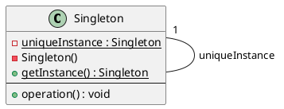
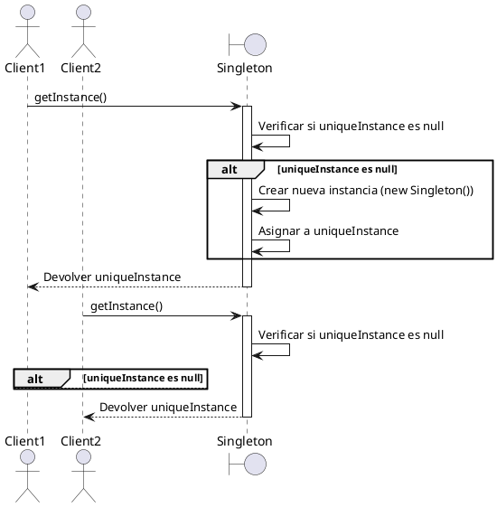

# Singleton

## Definición

En su forma más breve, el patrón Singleton **garantiza que una clase tenga una única instancia y proporciona un punto de acceso global a ella**.

De manera más detallada, el Singleton es un patrón creacional que restringe la creación de objetos de una clase a una única instancia. Esto es útil cuando exactamente un objeto es necesario para coordinar acciones en todo el sistema. Proporciona un método estático global que devuelve la única instancia de la clase, encapsulando así el proceso de creación y asegurando que no se puedan crear otras instancias directamente.

## Casos en los que se utiliza

El patrón Singleton es apropiado en situaciones donde:

1.  **Debe haber exactamente una instancia de una clase:** Por ejemplo, un gestor de configuración, un pool de conexiones a base de datos, un gestor de logs o un objeto que representa un único recurso de hardware (como una impresora). Si tener más de una instancia de esta clase llevaría a inconsistencias o un comportamiento incorrecto del sistema, Singleton es una opción a considerar.

2.  **La única instancia debe ser accesible desde un punto conocido globalmente:** En lugar de pasar la única instancia como parámetro a todos los objetos que la necesitan, el Singleton proporciona un método estático accesible desde cualquier parte del código.

3.  **Se necesita controlar estrictamente el acceso a una única instancia:** Permite controlar cómo y cuándo se accede a la instancia, a diferencia de una simple variable global que podría ser reemplazada accidentalmente.

## Casos en los que NO es correcto usarlo

:::{warning}
Aunque parece conveniente, el Singleton a menudo se considera un "anti-patrón" si se usa indiscriminadamente o por las razones equivocadas.
:::

Evitá usar Singleton cuando:

1.  **La unicidad de la instancia no es un requisito fundamental del dominio del problema:** No uses un Singleton solo para tener acceso global a algo. Esto esconde las dependencias y dificulta entender qué partes del sistema dependen de esa instancia.

2.  **Hace que tu código sea difícil de probar unitariamente:** Las clases que dependen de un Singleton son difíciles de probar de forma aislada, ya que el Singleton introduce un estado global que no podés reemplazar fácilmente por un *mock* o una versión de prueba.

3.  **Viola el Principio de Responsabilidad Única (SRP):** Una clase Singleton a menudo asume dos responsabilidades: gestionar su propia instancia única y contener la lógica de negocio. Esto puede hacer que la clase sea más difícil de mantener.

4.  **Introduce un estado global oculto:** El estado manejado por el Singleton puede ser modificado desde cualquier parte del sistema, lo que puede llevar a efectos secundarios inesperados y hacer que los errores sean difíciles de rastrear.

5.  **Existe la posibilidad de necesitar múltiples instancias en el futuro:** Si hay alguna duda de si en el futuro se podría requerir más de una instancia, es mejor optar por otro patrón (como Factory o inyección de dependencias) que permita esa flexibilidad.

## Consecuencias de su uso

### Positivas

- **Garantiza una única instancia:** Asegura que no haya múltiples objetos de la clase compitiendo o causando inconsistencias.
- **Punto de acceso global:** Facilita el acceso a la instancia desde cualquier parte del código.
- **Control sobre la instanciación:** Permite un control más fino sobre cuándo y cómo se crea la instancia (por ejemplo, inicialización perezosa).
- **Reduce el espacio de nombres:** Evita la necesidad de variables globales voluminosas para contener la instancia única.

### Negativas

- **Dificultad para probar:** La dependencia de Singletons puede acoplar fuertemente las clases y hacer que las pruebas unitarias sean complicadas, ya que es difícil sustituir o aislar el Singleton.
- **Oculta dependencias:** En lugar de que las dependencias sean explícitas (pasadas por constructores o métodos), una clase que usa un Singleton accede a él globalmente, haciendo que la dependencia sea implícita.
- **Potenciales problemas de concurrencia:** La implementación básica del Singleton no es segura para hilos en entornos multi-hilo, requiriendo sincronización que puede añadir complejidad o afectar el rendimiento.
- **Rompe el SRP:** A menudo combina la lógica de gestión de la instancia con la lógica de negocio.
- **Dificultad para extender:** Es difícil crear subclases de un Singleton, ya que el constructor es privado y el mecanismo de creación está internalizado.

## Otras Observaciones

### Seguridad de Hilos (Thread Safety)

Implementar un Singleton correctamente en un entorno multi-hilo es crucial para evitar que se creen múltiples instancias. Las técnicas comunes incluyen:

- **Inicialización Eager**: Crear la instancia en el momento de la carga de la clase. Es simple y seguro para hilos, pero no permite inicialización perezosa si la creación es costosa.
- **Método `getInstance()` Sincronizado**: Sincronizar el método que devuelve la instancia. Seguro, pero puede ser ineficiente en accesos concurrentes frecuentes debido al bloqueo.
- **"Double-Checked Locking"**: Una técnica más optimizada que reduce la sobrecarga de la sincronización, pero requiere una implementación cuidadosa y puede depender del modelo de memoria del lenguaje/plataforma (ej. uso de `volatile` en Java).
- **Uso de clases internas estáticas**: Una forma segura y perezosa de implementar el Singleton en Java.

### Inicialización Perezosa vs. Eager

El Singleton puede crear su instancia cuando la clase se carga por primera vez (eager) o la primera vez que se solicita (`getInstance()`, lazy). La inicialización perezosa ahorra recursos si la instancia nunca se usa, pero requiere manejo de concurrencia si la aplicación es multi-hilo.

### Alternativas

:::{tip}
A menudo, la inyección de dependencias (DI) a través de contenedores DI o el uso de fábricas (Factory Patterns) son alternativas más flexibles que permiten gestionar el ciclo de vida de objetos únicos (singletons gestionados por el contenedor) sin los inconvenientes del patrón Singleton manual.
:::

**Diagramas en PlantUML:**

**Estructura del Patrón Singleton:**

Este diagrama muestra la estructura básica de un Singleton con inicialización perezosa.

-   `uniqueInstance: Singleton`: Un atributo estático privado que mantiene la única instancia de la clase.

-   `Singleton()`: Un constructor privado que impide la creación directa de instancias desde fuera de la clase.

-   `getInstance(): Singleton`: Un método estático público que es el punto de acceso global. Contiene la lógica para crear la instancia si aún no existe y devolverla.

-   La relación `Singleton "1" -- Singleton : uniqueInstance` indica que la clase `Singleton` contiene una referencia estática a una instancia de sí misma.

**Comportamiento al obtener la instancia (Inicialización Perezosa):**

Este diagrama de secuencia muestra cómo múltiples clientes obtienen la misma instancia del Singleton.

-   `Client1` llama `getInstance()`. Como `uniqueInstance` es null, se crea la instancia.

-   `Client1` recibe la instancia.

-   `Client2` llama `getInstance()`. Como `uniqueInstance` ya no es null, se devuelve la instancia existente sin crear una nueva.

-   Ambos clientes interactúan con la *misma* instancia del Singleton.

En resumen, el Singleton es un patrón simple conceptualmente pero que requiere una implementación cuidadosa, especialmente en entornos multi-hilo. Debe usarse con discreción, reservándolo para casos donde la unicidad de la instancia es un requisito de diseño fuerte y justificado, y siendo consciente de las implicaciones que tiene en la testabilidad y el acoplamiento del código. A menudo, explorar alternativas como la inyección de dependencias puede llevar a diseños más flexibles y fáciles de mantener.

