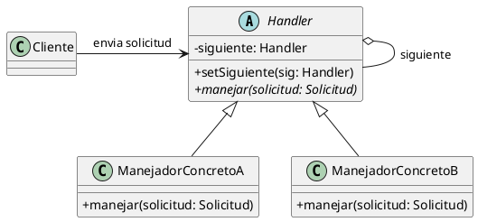

(patron-chain-of-responsibility)=
# Chain of Responsibility

## Definición

El patrón **Chain of Responsibility** (Cadena de Responsabilidad) es un patrón de diseño de comportamiento que evita acoplar al emisor de una solicitud con su receptor, permitiendo que múltiples objetos tengan la oportunidad de procesar la solicitud. 

El patrón encadena los objetos receptores y pasa la solicitud a lo largo de la cadena hasta que un objeto la maneja o se alcanza el final de la misma.

## Origen e Historia

Formalizado por el *Gang of Four* (GoF) en 1994, este patrón surgió de la necesidad de desacoplar los sistemas de manejo de eventos en interfaces gráficas. En estos sistemas, un evento (como un clic) puede ser manejado por el componente que lo recibe o pasar a su contenedor padre, y así sucesivamente, hasta que un elemento tome la responsabilidad de procesarlo.

## Motivación

La motivación principal es reducir el acoplamiento entre el objeto que emite una petición y el conjunto de objetos que pueden resolverla. Sin este patrón, el emisor debería conocer exactamente qué objeto puede procesar su pedido, lo que genera un código rígido y difícil de extender con nuevos manejadores.

:::{note} Propósito
Permitir que más de un objeto maneje una petición sin que el emisor necesite conocer al receptor específico.
:::

## Contexto

### Cuando aplica

- Cuando hay más de un objeto que puede manejar una petición y el manejador no se conoce a priori.
- Cuando se desea enviar una petición a uno de varios objetos sin especificar explícitamente el receptor.
- Cuando el conjunto de objetos que pueden manejar la petición debe ser definido dinámicamente o puede cambiar en tiempo de ejecución.
- En sistemas de procesamiento de mensajes, validación de formularios o sistemas de soporte técnico por niveles.

### Cuando no aplica

- Cuando la petición debe ser procesada por un receptor específico y único ya conocido.
- Cuando el costo de recorrer la cadena es prohibitivo y se requiere una respuesta inmediata.
- Cuando se necesita garantizar que la petición sea procesada (el patrón no asegura que algún eslabón tome la responsabilidad).

## Consecuencias de su uso

### Positivas

- **Reducción del acoplamiento:** El emisor y el receptor no tienen conocimiento mutuo explícito.
- **Flexibilidad en la asignación de responsabilidades:** Se pueden añadir o cambiar manejadores simplemente modificando la cadena.
- **Cumplimiento del SRP:** Cada manejador se encarga de una lógica específica y decide si delega o no.

### Negativas

- **No se garantiza la recepción:** Una petición puede caer al final de la cadena sin ser procesada si ningún manejador la toma.
- **Dificultad en el seguimiento (Debugging):** Puede ser complejo rastrear qué objeto procesó finalmente la petición en cadenas largas.
- **Impacto en el rendimiento:** Si la cadena es muy extensa, el tiempo de recorrido puede afectar la latencia del sistema.

## Alternativas

- **Command:** Puede usarse para encapsular la petición, pero no gestiona la propagación entre múltiples receptores.
- **Mediator:** Centraliza la comunicación, mientras que Chain of Responsibility la distribuye linealmente.
- **Decorator:** Aunque estructuralmente similar, el Decorator añade responsabilidades al objeto, mientras que Chain of Responsibility busca un único responsable entre varios.

## Estructura

### Diagrama de Clases



## Ejemplos

```java
/**
 * Solicitud a procesar.
 */
public class SolicitudAyuda {
    private String descripción;
    private int prioridad; // 1=baja, 2=media, 3=alta
    
    public SolicitudAyuda(String desc, int prior) {
        this.descripción = desc;
        this.prioridad = prior;
    }
    
    public int getPrioridad() { return prioridad; }
    public String getDescripción() { return descripción; }
}

/**
 * Manejador base.
 */
public abstract class Manejador {
    protected Manejador siguiente;
    
    public void setSiguiente(Manejador sig) { this.siguiente = sig; }
    
    public final void procesar(SolicitudAyuda solicitud) {
        if (puedeManejar(solicitud)) {
            ejecutar(solicitud);
        } else if (siguiente != null) {
            siguiente.procesar(solicitud);
        }
    }
    
    protected abstract boolean puedeManejar(SolicitudAyuda solicitud);
    protected abstract void ejecutar(SolicitudAyuda solicitud);
}

/**
 * Manejador concreto: Soporte Nivel 1.
 */
public class SoporteNivel1 extends Manejador {
    @Override
    protected boolean puedeManejar(SolicitudAyuda s) { return s.getPrioridad() == 1; }
    
    @Override
    protected void ejecutar(SolicitudAyuda s) {
        System.out.println("Nivel 1 resuelve: " + s.getDescripción());
    }
}
```

## Resumen

El Chain of Responsibility es el patrón de los "niveles de atención". Su mayor ventaja es el desacoplamiento dinámico que permite construir tuberías de procesamiento donde cada eslabón decide su participación. Es ideal para sistemas extensibles de reglas de negocio o validaciones en cascada.
