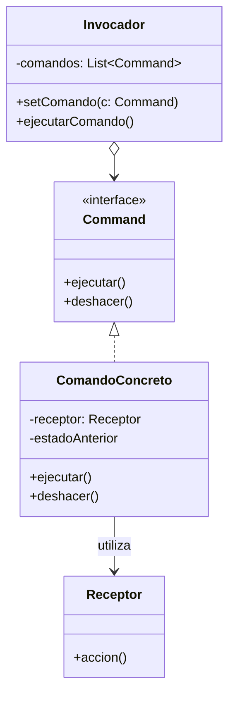
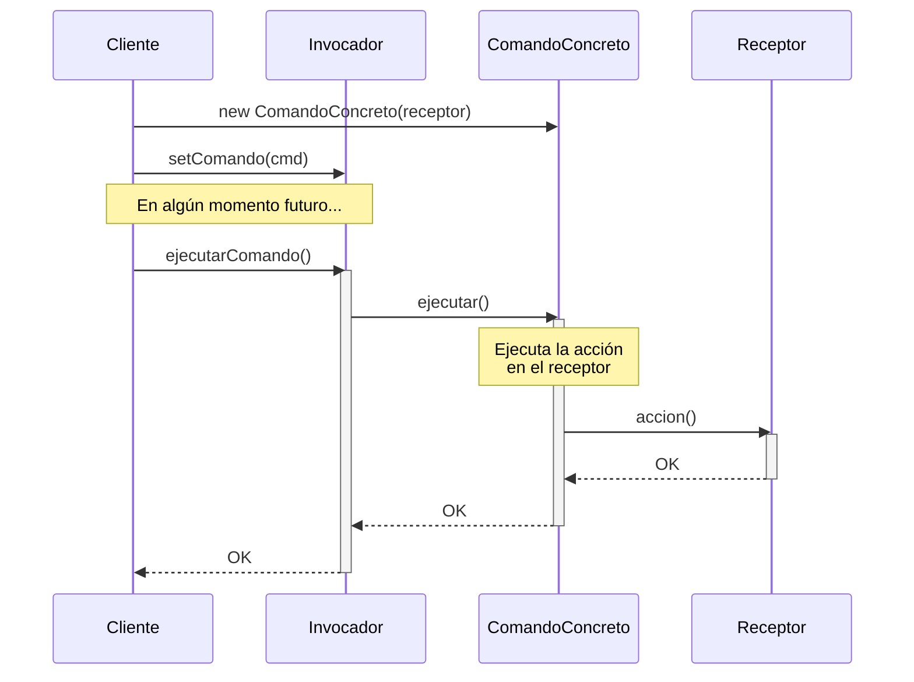

(patron-command)=
# Command

## Definición

El patrón **Command** (Orden) es un patrón de diseño de comportamiento que convierte una solicitud en un objeto independiente que contiene toda la información sobre la misma. 

Esta transformación permite parametrizar a los clientes con diferentes solicitudes, retrasar o poner en cola la ejecución de una solicitud y soportar operaciones que se pueden deshacer.

## Origen e Historia

Formalizado por el GoF en 1994, el patrón Command se inspiró en la necesidad de implementar "callbacks" en lenguajes que no soportaban funciones como ciudadanos de primer orden. Al encapsular una función dentro de un objeto, se lograba la misma flexibilidad que un puntero a función pero con los beneficios de la orientación a objetos (estado, herencia y polimorfismo).

## Motivación

La motivación principal es desacoplar al objeto que invoca una operación del objeto que sabe cómo realizarla. Esto permite que el invocador no necesite conocer los detalles internos del receptor ni la operación específica que se va a ejecutar.

:::{note} Propósito
Encapsular una petición como un objeto, permitiendo así parametrizar a los clientes con distintas peticiones, hacer cola o llevar un registro de las peticiones y poder deshacerlas.
:::

## Contexto

### Cuando aplica

- Cuando se necesita parametrizar objetos con una acción a realizar.
- Cuando se desea especificar, encolar y ejecutar solicitudes en diferentes momentos.
- Cuando se requiere soporte para operaciones reversibles (deshacer/rehacer).
- Cuando se quieren registrar los cambios para poder volver a aplicarlos en caso de una caída del sistema (logging).
- Para implementar macros o secuencias de comandos (Composite de Commands).

### Cuando no aplica

- Cuando las llamadas directas entre objetos son simples y no requieren ninguna de las capacidades adicionales del patrón (deshacer, encolar, etc.).
- Cuando el número de comandos es excesivo y las operaciones son extremadamente triviales, lo que llevaría a una explosión de clases pequeñas sin beneficio real.

## Consecuencias de su uso

### Positivas

- **Desacoplamiento:** El objeto que invoca la operación está totalmente separado del que la realiza.
- **Extensibilidad:** Es fácil añadir nuevos comandos sin cambiar el código existente (Principio Abierto/Cerrado).
- **Composición de comandos:** Se pueden agrupar comandos simples para formar comandos complejos (Macros).
- **Historial y Deshacer:** Facilita la implementación de mecanismos de reversión de estado.

### Negativas

- **Proliferación de clases:** Se crea una clase nueva por cada comando concreto, lo que puede aumentar la complejidad del proyecto.
- **Uso de memoria:** Mantener un historial de comandos para el "deshacer" puede consumir recursos significativos si los comandos almacenan mucho estado.

## Alternativas

- **Strategy:** Mientras que Command encapsula una *intención* o *acción*, Strategy encapsula un *algoritmo* intercambiable.
- **Memento:** A menudo se usa junto con Command para guardar el estado del receptor antes de ejecutar la acción, facilitando un "deshacer" más robusto.
- **Callbacks/Lambdas:** En lenguajes modernos (como Java 8+), muchas veces se pueden usar expresiones lambda para casos simples en lugar de clases Command formales.

## Estructura

### Diagramas

**Diagrama de Clases**



**Diagrama de Secuencia**



## Ejemplos

```java
/**
 * Interfaz Command.
 */
public interface Comando {
    void ejecutar();
    void deshacer();
}

/**
 * Receptor: El objeto que sabe cómo realizar la acción.
 */
public class Luz {
    public void encender() { System.out.println("Luz encendida"); }
    public void apagar() { System.out.println("Luz apagada"); }
}

/**
 * Comando Concreto.
 */
public class ComandoEncenderLuz implements Comando {
    private Luz luz;
    
    public ComandoEncenderLuz(Luz luz) { this.luz = luz; }
    
    @Override
    public void ejecutar() { luz.encender(); }
    
    @Override
    public void deshacer() { luz.apagar(); }
}

/**
 * Invocador.
 */
public class ControlRemoto {
    private Stack<Comando> historial = new Stack<>();
    
    public void presionarBoton(Comando cmd) {
        cmd.ejecutar();
        historial.push(cmd);
    }
    
    public void presionarDeshacer() {
        if (!historial.isEmpty()) {
            historial.pop().deshacer();
        }
    }
}
```

## Mini ejercicio

```{exercise}
:label: ex-parte4-command-mini

Un editor de diagramas necesita soportar **deshacer** y **rehacer** para acciones como agregar nodo, mover nodo y borrar nodo. Explicá cómo **Command** ayuda a encapsular esas operaciones.
```

## Resumen

El patrón Command es la base de las aplicaciones interactivas modernas. Al transformar una acción en un objeto, nos otorga control sobre el flujo temporal de las operaciones, permitiéndonos pausar, revertir o agrupar intenciones de usuario de manera elegante y desacoplada.
