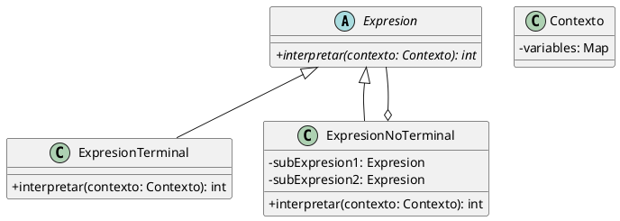

(patron-interpreter)=
# Interpreter

## Definición

El patrón **Interpreter** (Intérprete) es un patrón de diseño de comportamiento que define una representación de la gramática de un lenguaje junto con un intérprete que utiliza dicha representación para interpretar sentencias en el lenguaje.

Básicamente, este patrón propone modelar las reglas de una gramática simple como una jerarquía de clases, donde cada clase representa una regla o un símbolo del lenguaje.

## Origen e Historia

Formalizado por el GoF en 1994, este patrón tiene sus raíces en la teoría de lenguajes formales y la construcción de compiladores. Se diseñó para situaciones donde un problema ocurre con la suficiente frecuencia como para que valga la pena expresar sus instancias como sentencias de un lenguaje sencillo (lenguajes específicos del dominio o DSL).

## Motivación

La motivación surge cuando tenemos un problema que puede ser resuelto mediante la interpretación de una serie de símbolos o reglas. En lugar de escribir un algoritmo monolítico y rígido, definimos un lenguaje que describe las soluciones y un motor que lo ejecuta.

:::{note} Propósito
Dado un lenguaje, definir una representación para su gramática junto con un intérprete que use la representación para interpretar sentencias del lenguaje.
:::

## Contexto

### Cuando aplica

- Cuando la gramática del lenguaje es simple. Para gramáticas complejas, las jerarquías de clases se vuelven inmanejables (en esos casos es mejor usar generadores de parsers como ANTLR o Lex/Yacc).
- Cuando la eficiencia no es el factor crítico, ya que la interpretación suele ser más lenta que la ejecución de código compilado.
- En motores de búsqueda de expresiones regulares simples.
- En lenguajes de consulta de bases de datos personalizados o filtros de búsqueda avanzados.

### Cuando no aplica

- Cuando la gramática es compleja o cambia frecuentemente de forma estructural.
- En aplicaciones de alto rendimiento donde el costo de recorrer el árbol de sintaxis abstracta (AST) es inaceptable.

## Consecuencias de su uso

### Positivas

- **Fácil de cambiar y extender la gramática:** Al estar cada regla en una clase, se pueden añadir nuevas expresiones simplemente heredando de la clase base.
- **Implementación directa:** Las clases del patrón corresponden casi uno a uno con las reglas de la gramática (Notación BNF).

### Negativas

- **Gramáticas complejas son difíciles de mantener:** Una gramática con cientos de reglas requiere cientos de clases.
- **Eficiencia:** El proceso de interpretación implica muchas llamadas polimórficas y creación de objetos, lo que puede ser costoso en memoria y CPU.

## Alternativas

- **Visitor:** A menudo se usa junto con Interpreter para recorrer el árbol de expresiones y realizar diferentes operaciones (como chequeo de tipos o generación de código) sin cambiar las clases de las expresiones.
- **Parser Generators:** Herramientas externas que generan el código de interpretación a partir de una gramática formal.

## Estructura

### Diagrama de Clases



## Ejemplos

```java
/**
 * Interfaz para todas las expresiones.
 */
public interface Expresion {
    int interpretar(Map<String, Integer> contexto);
}

/**
 * Expresión Terminal: un número literal.
 */
public class Numero implements Expresion {
    private int valor;
    public Numero(int v) { this.valor = v; }
    
    @Override
    public int interpretar(Map<String, Integer> ctx) { return valor; }
}

/**
 * Expresión No Terminal: Suma.
 */
public class Suma implements Expresion {
    private Expresion izq, der;
    public Suma(Expresion i, Expresion d) { this.izq = i; this.der = d; }
    
    @Override
    public int interpretar(Map<String, Integer> ctx) {
        return izq.interpretar(ctx) + der.interpretar(ctx);
    }
}

// Uso: Evaluar (5 + 10)
Expresion expr = new Suma(new Numero(5), new Numero(10));
System.out.println("Resultado: " + expr.interpretar(null));
```

## Resumen

El patrón Interpreter es la forma más pura de transformar una gramática en código. Aunque su uso es limitado por cuestiones de rendimiento y escalabilidad, sigue siendo una herramienta fundamental para crear lenguajes de dominio específico (DSL) legibles y extensibles dentro de una aplicación.
