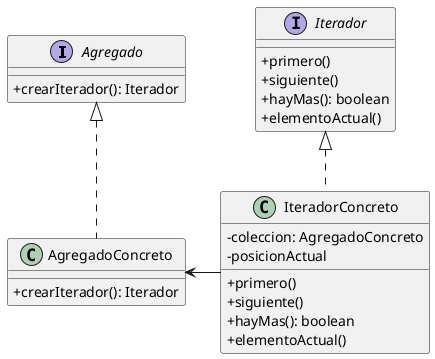

(patron-iterator)=
# Iterator

## Definición

El patrón **Iterator** (Iterador) es un patrón de diseño de comportamiento que permite recorrer los elementos de una colección sin exponer su representación subyacente (listas, pilas, árboles, etc.). 

El patrón extrae el comportamiento de recorrido de la colección y lo coloca en un objeto independiente llamado iterador.

## Origen e Historia

Formalizado por el GoF en 1994, el concepto de iteración es fundamental en la informática. Antes de su formalización, cada estructura de datos solía proveer sus propios métodos de acceso (índices para arreglos, punteros para listas enlazadas), lo que obligaba al cliente a conocer la estructura interna para poder recorrerla. El Iterator estandarizó este proceso.

## Motivación

La motivación principal es la **encapsulación**. Queremos que el cliente pueda procesar todos los elementos de una colección (por ejemplo, para imprimirlos o sumarlos) sin que le importe si están guardados en un arreglo dinámico, un árbol balanceado o una tabla hash.

:::{note} Propósito
Proporcionar un modo de acceder secuencialmente a los elementos de un objeto agregado sin exponer su representación interna.
:::

## Contexto

### Cuando aplica

- Cuando se quiere acceder a los contenidos de un objeto agregado sin exponer su representación interna.
- Cuando se desea soportar múltiples recorridos simultáneos de objetos agregados.
- Cuando se necesita proporcionar una interfaz uniforme para recorrer diferentes estructuras de agregados (iteración polimórfica).

### Cuando no aplica

- Cuando la colección es muy simple (un arreglo fijo) y el acceso por índice es la norma del sistema.
- En lenguajes que ya proveen mecanismos de iteración potentes y nativos (como los `Streams` de Java o los `Iterators` integrados), a menos que estemos implementando una estructura de datos personalizada.

## Consecuencias de su uso

### Positivas

- **Uniformidad:** El código del cliente es el mismo para cualquier tipo de colección.
- **Simplificación de la interfaz de la colección:** La colección no necesita métodos de recorrido propios; solo necesita un método para crear un iterador.
- **Múltiples recorridos:** Cada iterador mantiene su propio estado (posición actual), permitiendo varios recorridos al mismo tiempo sobre la misma colección.

### Negativas

- **Sobrecarga (Overhead):** Para colecciones pequeñas, usar un objeto iterador es menos eficiente que un simple bucle `for` con índices.
- **Complejidad:** Introduce interfaces y clases adicionales para cada tipo de colección.

## Alternativas

- **Clonación de la colección:** Si la colección es pequeña, se puede devolver una copia en forma de arreglo, aunque esto rompe la eficiencia.
- **Streams (Java 8+):** Proporcionan una abstracción de mayor nivel para el procesamiento de colecciones.

## Estructura

### Diagrama de Clases



## Ejemplos

```java
/**
 * Interfaz genérica para iteradores.
 */
public interface Iterador<T> {
    boolean tieneSiguiente();
    T siguiente();
}

/**
 * Colección concreta: Una lista simple.
 */
public class MiLista<T> {
    private List<T> items = new ArrayList<>();
    
    public void agregar(T item) { items.add(item); }
    
    public Iterador<T> obtenerIterador() {
        return new IteradorLista();
    }
    
    // Clase interna que conoce la estructura de MiLista
    private class IteradorLista implements Iterador<T> {
        private int indice = 0;
        
        @Override
        public boolean tieneSiguiente() {
            return indice < items.size();
        }
        
        @Override
        public T siguiente() {
            return items.get(indice++);
        }
    }
}
```

## Resumen

El Iterator es el "traductor de recorridos". Es un patrón esencial que habilita el polimorfismo sobre estructuras de datos, permitiendo que el software sea agnóstico a la forma en que se almacenan los datos y se concentre en cómo se procesan.
