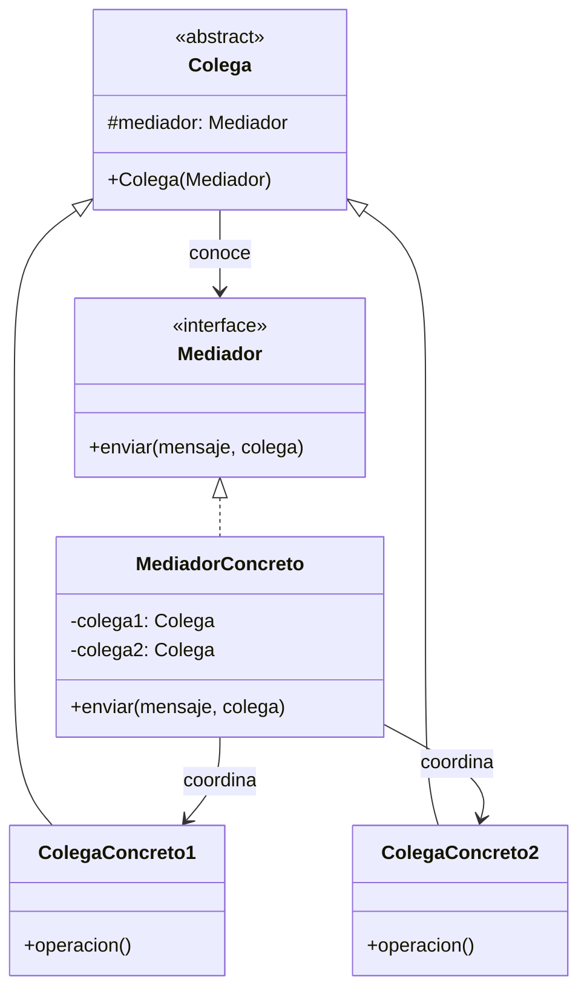
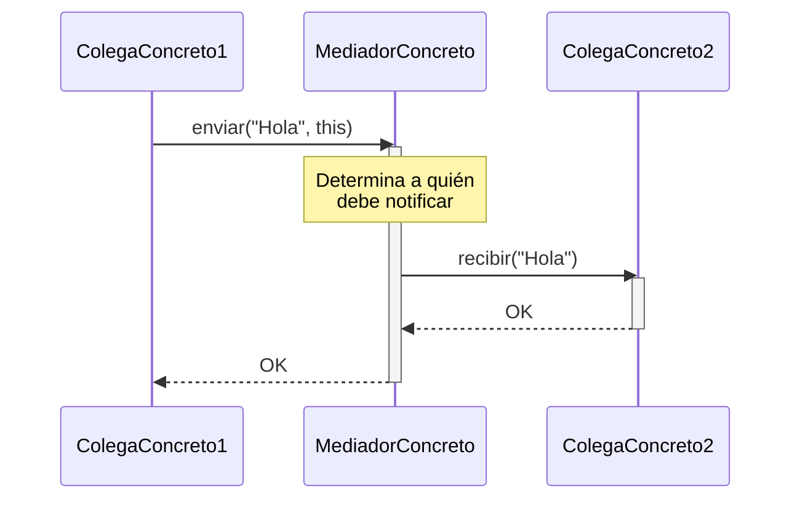

(patron-mediator)=
# Mediator

## Definición

El patrón **Mediator** (Mediador) es un patrón de diseño de comportamiento que define un objeto que encapsula cómo interactúan un conjunto de objetos. 

El patrón promueve el desacoplamiento al evitar que los objetos se refieran entre sí explícitamente y permitiendo variar su interacción de forma independiente.

## Origen e Historia

Formalizado por el GoF en 1994, el Mediator surgió de la observación de que, a medida que los sistemas crecen, las conexiones entre objetos tienden a volverse densas e inmanejables (el efecto "código espagueti"). El patrón se inspiró en los controladores de tráfico aéreo: los aviones no hablan entre sí para evitar colisiones, sino que todos se comunican con una torre central (el mediador).

## Motivación

La motivación principal es evitar un sistema donde cada objeto necesite conocer a todos los demás para funcionar. Este "acoplamiento de muchos a muchos" dificulta la reutilización de objetos individuales, ya que están fuertemente ligados a sus pares.

:::{note} Propósito
Definir un objeto que encapsule cómo interactúa un conjunto de objetos. El Mediador promueve el bajo acoplamiento al evitar que los objetos se refieran entre sí explícitamente.
:::

## Contexto

### Cuando aplica

- Cuando un conjunto de objetos se comunica de formas bien definidas pero complejas.
- Cuando la reutilización de un objeto es difícil porque se refiere y se comunica con muchos otros objetos.
- Cuando un comportamiento que está distribuido entre varias clases debería ser personalizable sin mucha subclasificación.
- Es muy común en el desarrollo de interfaces gráficas complejas (formularios donde el estado de un botón depende de varios campos de texto).

### Cuando no aplica

- Cuando la comunicación es simple o involucra solo a dos objetos.
- Si el mediador se convierte en un "Objeto Todopoderoso" (God Object) que contiene toda la lógica del sistema, volviéndose inmanejable.

## Consecuencias de su uso

### Positivas

- **Reduce el acoplamiento:** Sustituye muchas conexiones de "muchos a muchos" por conexiones de "uno a muchos" entre el mediador y sus colegas.
- **Simplifica el protocolo de los objetos:** Los objetos ya no necesitan saber quién más existe en el sistema.
- **Centraliza el control:** La lógica de interacción se encuentra en un solo lugar, facilitando su modificación.

### Negativas

- **Complejidad del Mediador:** El mediador puede volverse excesivamente complejo al tener que gestionar todas las interacciones de un subsistema.
- **Dificultad de mantenimiento:** Si no se diseña bien, el mediador puede ser un cuello de botella para la evolución del código.

## Alternativas

- **Observer:** Mientras que el Mediator centraliza la comunicación, el Observer la distribuye (el sujeto notifica y los observadores reaccionan). A menudo se usan juntos.
- **Facade:** El Facade abstrae un subsistema para facilitar su uso desde fuera, mientras que el Mediator abstrae la comunicación interna entre los componentes del subsistema.

## Estructura

### Diagramas

**Diagrama de Clases**



**Diagrama de Secuencia**



## Ejemplos

```java
/**
 * Interfaz Mediador.
 */
public interface TorreControl {
    void enviar(String mensaje, Avion avion);
}

/**
 * Clase base para los "Colegas".
 */
public abstract class Avion {
    protected TorreControl mediador;
    public Avion(TorreControl m) { this.mediador = m; }
    public abstract void recibir(String mensaje);
}

/**
 * Mediador Concreto.
 */
public class TorreControlConcreta implements TorreControl {
    private List<Avion> aviones = new ArrayList<>();
    
    public void registrar(Avion a) { aviones.add(a); }
    
    @Override
    public void enviar(String mensaje, Avion origen) {
        for (Avion a : aviones) {
            if (a != origen) a.recibir(mensaje);
        }
    }
}
```

## Mini ejercicio

```{exercise}
:label: ex-parte4-mediator-mini

En un formulario de inscripción, cambiar la carrera habilita materias, turno y sede, y cada campo afecta a varios otros. Explicá cómo **Mediator** reduce el acoplamiento entre widgets.
```

## Resumen

El Mediator es el "coordinador central". Su valor reside en transformar una red caótica de dependencias en una estructura en estrella, donde la lógica de negocio sobre cómo colaboran los objetos queda aislada y protegida, permitiendo que los componentes individuales sigan siendo simples y reutilizables.
