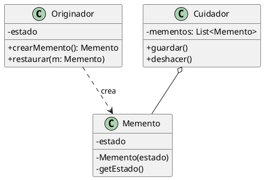

(patron-memento)=
# Memento

## Definición

El patrón **Memento** (Recuerdo) es un patrón de diseño de comportamiento que permite capturar y externalizar el estado interno de un objeto sin violar su encapsulación, de forma que el objeto pueda ser restaurado a dicho estado posteriormente.

El patrón separa la responsabilidad de guardar el estado (Memento) de la lógica del objeto original (Originador) y de quien gestiona el historial (Cuidador).

## Origen e Historia

Formalizado por el GoF en 1994, el Memento resolvió el dilema de cómo hacer copias de seguridad del estado de un objeto sin exponer sus atributos privados. Antes de este patrón, para guardar el estado de un objeto a menudo se necesitaba que este expusiera sus campos internos, lo que rompía los principios de la programación orientada a objetos.

## Motivación

La motivación principal es el soporte para operaciones de "deshacer" (undo) o "puntos de control" (checkpoints). Necesitamos una forma de volver atrás en el tiempo sin que el sistema que gestiona el historial sepa cómo está construido el objeto por dentro.

:::{note} Propósito
Sin violar la encapsulación, capturar y externalizar el estado interno de un objeto para que dicho objeto pueda ser restaurado a este estado más tarde.
:::

## Contexto

### Cuando aplica

- Cuando se necesita guardar una instantánea (snapshot) del estado de un objeto para poder restaurarlo después.
- Cuando obtener el estado directamente a través de una interfaz pública rompería la encapsulación del objeto (exponiendo detalles de implementación).
- En editores de texto, herramientas de diseño gráfico o videojuegos con sistemas de guardado.

### Cuando no aplica

- Cuando el estado del objeto es muy grande y guardarlo consume demasiada memoria RAM.
- Cuando el estado es público y no hay riesgo en que otros objetos lo conozcan y lo copien directamente.

## Consecuencias de su uso

### Positivas

- **Preserva la encapsulación:** El historial de estados no conoce los detalles internos del objeto original.
- **Simplifica al Originador:** El objeto original no necesita gestionar su propio historial de versiones; solo necesita saber crear y leer un memento.
- **Facilita el "Deshacer":** Proporciona un mecanismo natural para volver a estados anteriores.

### Negativas

- **Costo de memoria:** Si los estados son frecuentes o el objeto es grande, el consumo de memoria puede dispararse rápidamente.
- **Costo de procesamiento:** Crear una copia completa del estado interno cada vez puede penalizar el rendimiento.
- **Ciclo de vida de los mementos:** El Cuidador debe asegurarse de eliminar los mementos viejos para no agotar los recursos.

## Alternativas

- **Command:** El patrón Command puede implementar el deshacer guardando la *operación inversa* en lugar del *estado completo*. Esto ahorra memoria pero es más complejo de implementar.
- **Prototype:** Se puede clonar el objeto completo, pero esto consume más recursos que guardar solo una parte del estado y expone más la estructura.

## Estructura

### Diagrama de Clases



## Ejemplos

```java
/**
 * El Memento: Es inmutable y solo el Originador puede leerlo de verdad.
 */
public class Memento {
    private final String estado;
    public Memento(String e) { this.estado = e; }
    public String getEstado() { return estado; }
}

/**
 * El Originador: El objeto que cambia y queremos guardar.
 */
public class Editor {
    private String contenido;
    public void escribir(String texto) { this.contenido = texto; }
    
    public Memento guardar() { return new Memento(contenido); }
    public void restaurar(Memento m) { this.contenido = m.getEstado(); }
}

/**
 * El Cuidador: El que maneja la lista de mementos (el historial).
 */
public class Historial {
    private Stack<Memento> estados = new Stack<>();
    public void push(Memento m) { estados.push(m); }
    public Memento pop() { return estados.pop(); }
}
```

## Resumen

El Memento es la "máquina del tiempo" de los objetos. Su gran valor es permitir que un sistema tenga memoria de sus estados pasados sin comprometer la integridad ni la privacidad de sus datos internos, logrando un equilibrio entre funcionalidad y diseño limpio.
