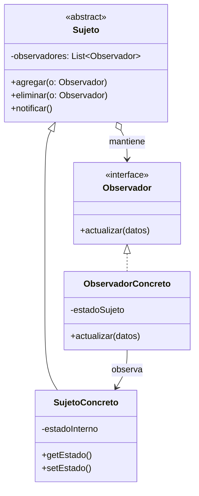
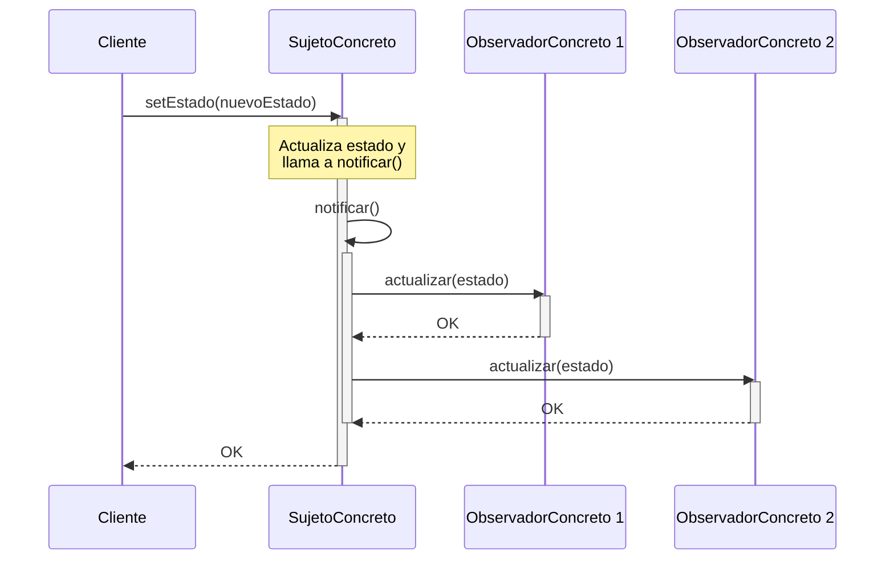

(patron-observer)=
# Observer

:::{note} Hoja de ruta del capítulo

**Objetivo.** Comprender las ideas centrales de **Observer** y usarlas como base para el resto del recorrido.

**Prerrequisitos.** Conviene haber leído [el material inmediatamente anterior](memento.md) para llegar con el hilo de la parte fresco.

**Desarrollo.** El desarrollo del capítulo aparece en las secciones que siguen. Conviene recorrerlas en orden y volver al resumen antes de pasar al siguiente tema.
:::

## Definición

El patrón **Observer** (Observador) es un patrón de diseño de comportamiento que define una dependencia de uno-a-muchos entre objetos, de forma que cuando un objeto cambia de estado, todos sus dependientes son notificados y actualizados automáticamente.

Se basa en el modelo de "Publicador-Suscriptor", donde el objeto observado (Sujeto) mantiene una lista de sus observadores y les comunica cualquier cambio relevante.

## Origen e Historia

Formalizado por el GoF en 1994, el Observer es la base del famoso patrón de arquitectura **MVC (Modelo-Vista-Controlador)**. Se inspiró en los sistemas de eventos de Smalltalk, donde las vistas necesitaban actualizarse automáticamente cuando los datos del modelo cambiaban, sin que el modelo tuviera que conocer los detalles de la interfaz gráfica.

## Motivación

La motivación principal es mantener la consistencia entre objetos relacionados sin que estos estén fuertemente acoplados. Queremos que un objeto pueda notificar a otros sin saber cuántos son o qué clases específicas tienen.

:::{note} Propósito
Definir una dependencia de uno-a-muchos entre objetos para que cuando un objeto cambie de estado, todos sus dependientes sean notificados y actualizados automáticamente.
:::

## Contexto

### Cuando aplica

- Cuando un cambio en un objeto requiere cambiar otros, y no sabemos cuántos objetos necesitan cambiar.
- Cuando un objeto debería ser capaz de notificar a otros sin hacer suposiciones sobre quiénes son esos objetos.
- En sistemas de interfaces gráficas, sistemas de noticias, monitoreo de sensores o aplicaciones de mensajería.

### Cuando no aplica

- Cuando el número de observadores es fijo y siempre el mismo (en ese caso, una llamada directa es más simple).
- Cuando las notificaciones pueden causar ciclos de actualización infinitos (A notifica a B, B cambia y notifica a A).

## Consecuencias de su uso

### Positivas

- **Acoplamiento abstracto:** El sujeto solo conoce una lista de objetos que implementan una interfaz `Observador`.
- **Soporte para comunicación por difusión (Broadcast):** La notificación se envía a todos los interesados automáticamente.
- **Registro dinámico:** Se pueden añadir o quitar observadores en tiempo de ejecución.

### Negativas

- **Actualizaciones inesperadas:** Como los observadores no se conocen entre sí, un cambio pequeño puede desencadenar una cascada de actualizaciones costosas en el sistema.
- **Fugas de memoria (Memory Leaks):** Si un observador no se desregistra correctamente, el sujeto mantendrá una referencia a él, impidiendo que el recolector de basura lo libere.

## Alternativas

- **Mediator:** Centraliza la comunicación en un solo objeto. Observer es más distribuido.
- **Pub-Sub (Publicador/Suscriptor):** Es una versión más evolucionada (a menudo asíncrona) que introduce un canal intermedio (event bus) para separar aún más a las partes.

## Estructura

### Diagramas

**Diagrama de Clases**



**Diagrama de Secuencia**



## Ejemplos

```java
/**
 * Interfaz para los interesados.
 */
public interface Observador {
    void actualizar(float precio);
}

/**
 * El Sujeto: Una acción de bolsa.
 */
public class Accion {
    private List<Observador> interesados = new ArrayList<>();
    private float precio;

    public void registrar(Observador o) { interesados.add(o); }
    
    public void setPrecio(float p) {
        this.precio = p;
        notificar();
    }
    
    private void notificar() {
        for (Observador o : interesados) o.actualizar(precio);
    }
}

/**
 * Observador concreto.
 */
public class Inversor implements Observador {
    @Override
    public void actualizar(float p) {
        System.out.println("El inversor ve el nuevo precio: " + p);
    }
}
```

## Ejercicios

```{exercise}
:label: ex-parte4-observer-mini

Cuando se publica una nota, hay que avisar a estudiantes, analítica académica y un servicio de notificaciones móviles. Diseñá un caso con **Observer** e indicá qué pasaría si el sujeto conociera en detalle a todos los receptores.
```

## Resumen

El Observer es el patrón de la "reactividad". Permite construir sistemas donde el flujo de información es automático y dinámico, asegurando que todos los componentes interesados estén siempre sincronizados con la fuente de la verdad (el sujeto) sin sacrificar la independencia de las clases.

## Próximo paso

Para seguir, conviene pasar a [el material siguiente](state.md), donde el recorrido continúa sobre esta base.
