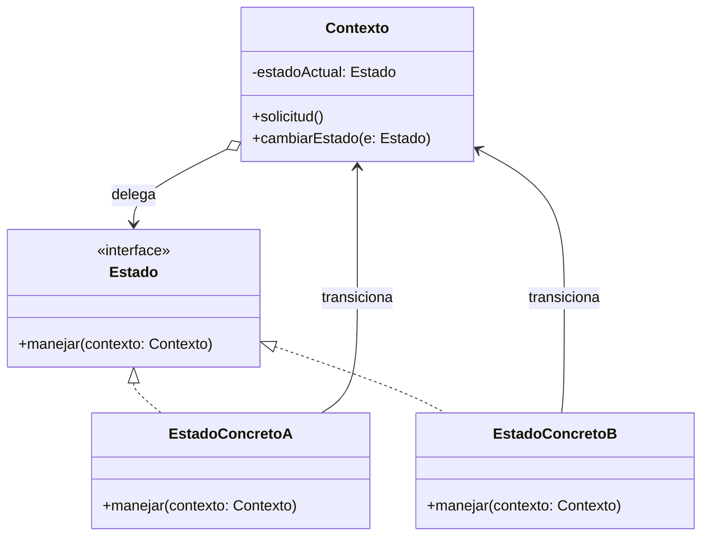
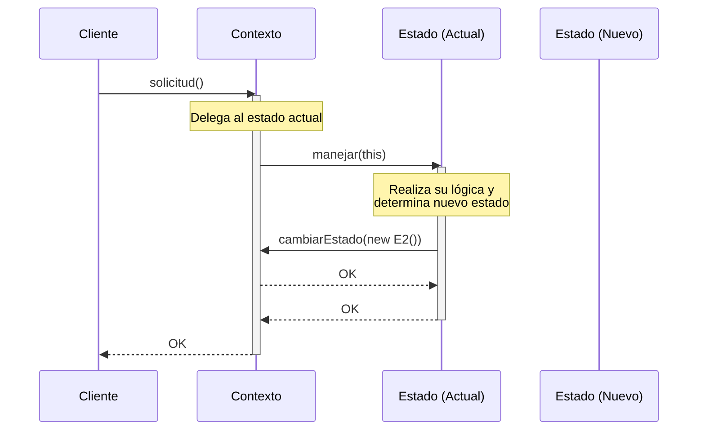

(patron-state)=
# State

## Definición

El patrón **State** (Estado) es un patrón de diseño de comportamiento que permite que un objeto altere su comportamiento cuando su estado interno cambia. El objeto parecerá haber cambiado su clase.

Este patrón propone crear nuevas clases para cada estado posible de un objeto y extraer todos los comportamientos específicos de esos estados a dichas clases.

## Origen e Historia

Formalizado por el GoF en 1994, el patrón State es una aplicación de la orientación a objetos para implementar Máquinas de Estados Finitos (FSM). Antes de su formalización, la lógica de estados solía gestionarse mediante gigantescas estructuras `switch` o `if-else` que se volvían imposibles de mantener a medida que se añadían nuevos estados o transiciones.

## Motivación

La motivación principal es la **cohesión**. Queremos evitar que una sola clase contenga la lógica de todos los estados posibles del sistema. Al separar cada estado en su propia clase, el código se vuelve más legible, fácil de testear y extensible.

:::{note} Propósito
Permitir que un objeto altere su comportamiento cuando cambia su estado interno. El objeto parecerá cambiar de clase.
:::

## Contexto

### Cuando aplica

- Cuando el comportamiento de un objeto depende de su estado y debe cambiar en tiempo de ejecución según ese estado.
- Cuando las operaciones tienen grandes estructuras condicionales (switch/if) que dependen del estado del objeto.
- En procesos con flujos definidos (ej. un pedido que pasa por: pendiente, pagado, enviado, entregado).
- En controladores de dispositivos, protocolos de red o personajes de videojuegos.

### Cuando no aplica

- Cuando el objeto tiene solo dos o tres estados y la lógica es muy simple. El patrón añade una complejidad innecesaria en esos casos.
- Cuando los estados casi nunca cambian o no afectan significativamente al comportamiento.

## Consecuencias de su uso

### Positivas

- **Localización de comportamientos específicos:** Cada estado está en una sola clase, facilitando su mantenimiento.
- **Transiciones explícitas:** El cambio de un objeto de estado a otro queda claramente definido mediante el cambio de la instancia de referencia.
- **Elimina condicionales masivos:** Limpia el código de lógicas de control repetitivas.

### Negativas

- **Explosión de clases:** Si hay muchos estados, el número de archivos y clases puede crecer significativamente.
- **Complejidad de las transiciones:** Si los estados necesitan conocerse entre sí para transicionar, se puede generar un acoplamiento entre las clases de estado.

## Alternativas

- **Strategy:** Tienen una estructura casi idéntica, pero la intención es diferente. Strategy es para algoritmos intercambiables (el cliente elige), mientras que State es para cambios automáticos basados en la lógica interna del objeto.
- **Tablas de transición:** En sistemas muy simples, una matriz de estados y eventos puede ser suficiente.

## Estructura

### Diagramas

**Diagrama de Clases**



**Diagrama de Secuencia**



## Ejemplos

```java
/**
 * Interfaz para los estados.
 */
public interface EstadoSemaforo {
    void mostrar(Semaforo s);
}

/**
 * Estado concreto: Rojo.
 */
public class EstadoRojo implements EstadoSemaforo {
    @Override
    public void mostrar(Semaforo s) {
        System.out.println("🔴 ROJO: Pare");
        // Lógica de transición
        s.setEstado(new EstadoVerde());
    }
}

/**
 * El Contexto.
 */
public class Semaforo {
    private EstadoSemaforo actual = new EstadoRojo();
    
    public void setEstado(EstadoSemaforo e) { this.actual = e; }
    
    public void cambiar() {
        actual.mostrar(this);
    }
}
```

## Resumen

El patrón State es la solución elegante a la complejidad de las máquinas de estado. Al transformar los estados en objetos, logramos un diseño donde el comportamiento es una propiedad dinámica y polimórfica, permitiendo que los objetos evolucionen de forma fluida y organizada a lo largo de su ciclo de vida.
