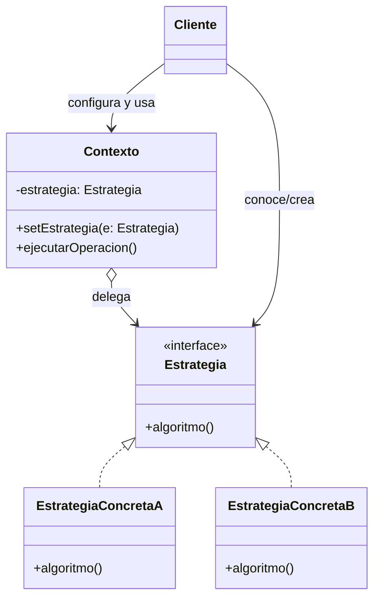
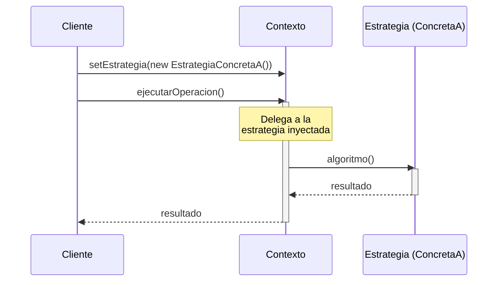

(patron-strategy)=
# Strategy

## Definición

El patrón **Strategy** (Estrategia) es un patrón de diseño de comportamiento que define una familia de algoritmos, encapsula cada uno de ellos y los hace intercambiables. 

Este patrón permite que el algoritmo varíe independientemente de los clientes que lo utilizan, delegando la ejecución del comportamiento a un objeto de estrategia específico.

## Origen e Historia

Formalizado por el GoF en 1994, el Strategy surgió como una respuesta a la rigidez de la herencia para variar comportamientos. Antes de este patrón, si queríamos que una clase tuviera diferentes comportamientos, solíamos crear subclases para cada variante. El Strategy propone usar **composición** en lugar de herencia, permitiendo cambiar el comportamiento incluso en tiempo de ejecución.

## Motivación

La motivación principal es el cumplimiento del **Principio de Abierto/Cerrado**. Queremos ser capaces de añadir nuevos algoritmos o formas de hacer algo sin tener que tocar las clases que usan esos algoritmos.

:::{note} Propósito
Definir una familia de algoritmos, encapsular cada uno de ellos y hacerlos intercambiables. Strategy permite que el algoritmo varíe independientemente de los clientes que lo utilizan.
:::

## Contexto

### Cuando aplica

- Cuando se necesitan diferentes variantes de un algoritmo (ej. diferentes métodos de ordenamiento o de compresión).
- Cuando una clase define muchos comportamientos y estos aparecen como múltiples sentencias condicionales (`if-else` o `switch`) en sus operaciones.
- Cuando se desea ocultar al cliente los detalles de implementación de algoritmos complejos o datos internos que el algoritmo utiliza.

### Cuando no aplica

- Cuando el comportamiento casi nunca cambia o solo existe una forma de realizar la tarea.
- Cuando el cliente no necesita conocer ni elegir entre diferentes estrategias (en ese caso, el patrón podría añadir una complejidad innecesaria).

## Consecuencias de su uso

### Positivas

- **Familias de algoritmos relacionados:** Define una jerarquía de clases de estrategia para que un contexto pueda reutilizarlos.
- **Eliminación de condicionales:** El polimorfismo sustituye a las estructuras de control para seleccionar el comportamiento.
- **Flexibilidad:** Permite cambiar la estrategia de un objeto dinámicamente durante la ejecución del programa.

### Negativas

- **Los clientes deben conocer las estrategias:** Para elegir la estrategia adecuada, el cliente debe entender cómo difieren entre sí.
- **Sobrecarga de comunicación:** El contexto y la estrategia deben compartir una interfaz común que a veces puede ser ineficiente si algunas estrategias no necesitan todos los datos que el contexto les pasa.
- **Aumento del número de objetos:** Cada estrategia es una clase y un objeto adicional en el sistema.

## Alternativas

- **Template Method:** Usa herencia para variar partes de un algoritmo. Strategy usa composición para variar el algoritmo completo.
- **State:** Tienen una estructura similar, pero State gestiona estados internos que cambian automáticamente, mientras que Strategy es una elección deliberada (usualmente del cliente) sobre qué algoritmo usar.

## Estructura

### Diagramas

**Diagrama de Clases**



**Diagrama de Secuencia**



## Ejemplos

```java
/**
 * Interfaz Strategy.
 */
public interface EstrategiaPago {
    void pagar(int monto);
}

/**
 * Estrategia Concreta A.
 */
public class PagoTarjeta implements EstrategiaPago {
    @Override
    public void pagar(int monto) {
        System.out.println("Pagando $" + monto + " con Tarjeta de Crédito.");
    }
}

/**
 * El Contexto: Un Carrito de Compras.
 */
public class Carrito {
    private EstrategiaPago metodo;
    
    public void setMetodoPago(EstrategiaPago m) { this.metodo = m; }
    
    public void realizarPago(int total) {
        metodo.pagar(total);
    }
}
```

## Resumen

El patrón Strategy es el patrón de la "intercambiabilidad". Al separar el *qué se hace* del *cómo se hace*, nos otorga una arquitectura limpia donde los algoritmos son piezas modulares que pueden evolucionar, testearse y reemplazarse sin afectar la estabilidad del resto del sistema.
