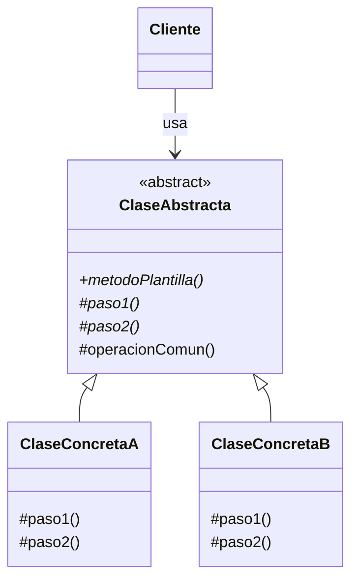
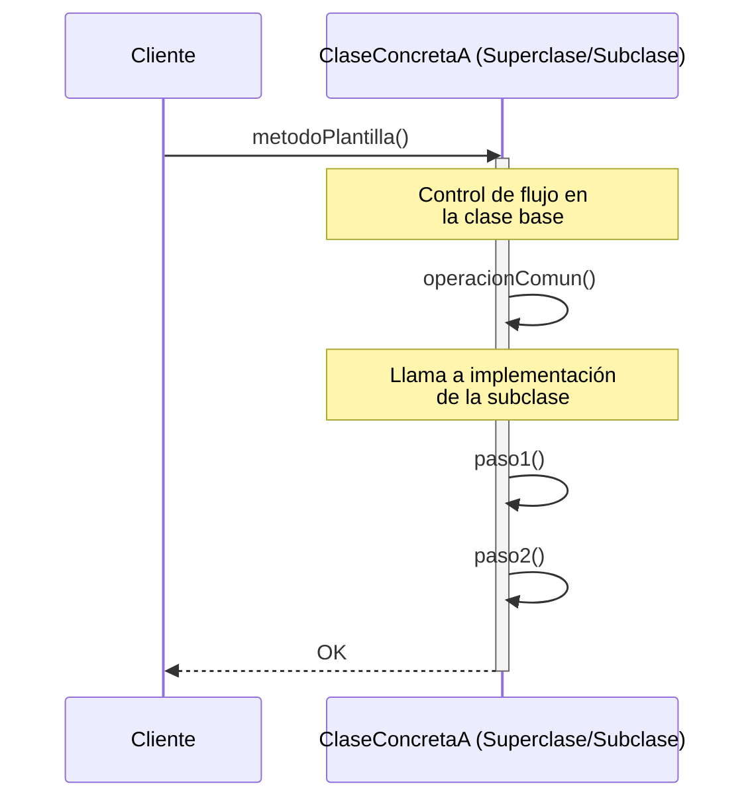

(patron-template-method)=
# Template Method

## Definición

El patrón **Template Method** (Método Plantilla) es un patrón de diseño de comportamiento que define el esqueleto de un algoritmo en una operación, delegando algunos pasos a las subclases. 

Este patrón permite que las subclases redefinan ciertos pasos de un algoritmo sin cambiar su estructura básica.

## Origen e Historia

Formalizado por el GoF en 1994, el Template Method es una técnica fundamental en el diseño de frameworks. Se basa en el **Principio de Hollywood**: "No nos llames, nosotros te llamaremos". En lugar de que la subclase controle el flujo, la superclase define el flujo y llama a los métodos de la subclase en los momentos adecuados.

## Motivación

La motivación principal es evitar la duplicación de código en algoritmos que son estructuralmente idénticos pero difieren en detalles específicos. Al centralizar la estructura en la clase base, nos aseguramos de que todos los descendientes sigan el mismo proceso.

:::{note} Propósito
Definir el esqueleto de un algoritmo en una operación, delegando algunos pasos a las subclases. Permite que las subclases redefinan ciertos pasos de un algoritmo sin cambiar su estructura.
:::

## Contexto

### Cuando aplica

- Cuando se tiene un algoritmo con pasos que no cambian y otros que sí deben ser personalizados por las subclases.
- Cuando varias clases tienen comportamientos casi idénticos y se desea evitar la duplicación de código moviendo la estructura común a una clase base.
- Para controlar las extensiones de las subclases (usando métodos "gancho" o hooks).

### Cuando no aplica

- Cuando el algoritmo es muy simple y no hay duplicación real.
- Cuando la estructura del algoritmo cambia radicalmente entre las subclases (en ese caso, el patrón Strategy sería más adecuado).
- En sistemas donde se prefiere evitar la herencia profunda a favor de la composición.

## Consecuencias de su uso

### Positivas

- **Reutilización de código:** La lógica común se escribe una sola vez en la superclase.
- **Consistencia:** Asegura que todas las subclases respeten el orden y la lógica global del algoritmo.
- **Inversión de control:** La clase base gestiona el ciclo de vida de la operación.

### Negativas

- **Rigidez:** La estructura del algoritmo es fija; si una subclase necesita saltarse un paso obligatorio o cambiar el orden, el patrón se rompe.
- **Violación potencial de Liskov:** Si se abusa del patrón, las subclases pueden terminar implementando métodos que no necesitan o que contradicen la lógica de la base.
- **Complejidad de depuración:** Seguir el flujo de ejecución entre la base y las subclases puede ser confuso.

## Alternativas

- **Strategy:** Provee una solución similar mediante composición. Es más flexible pero requiere más objetos.
- **Factory Method:** A menudo los Template Methods utilizan métodos de fábrica para crear los objetos que necesitan durante el algoritmo.

## Estructura

### Diagramas

**Diagrama de Clases**



**Diagrama de Secuencia**



## Ejemplos

```java
/**
 * Clase base con el método plantilla.
 */
public abstract class ProcesadorMensajes {
    // El método plantilla es final para evitar que se cambie la estructura
    public final void procesar(String msg) {
        String limpio = limpiar(msg);
        enviar(limpio);
        registrar();
    }
    
    private String limpiar(String s) { return s.trim(); }
    
    // Paso delegado a las subclases
    protected abstract void enviar(String s);
    
    private void registrar() { System.out.println("Mensaje procesado."); }
}

/**
 * Subclase Concreta.
 */
public class ProcesadorEmail extends ProcesadorMensajes {
    @Override
    protected void enviar(String s) {
        System.out.println("Enviando email: " + s);
    }
}
```

## Resumen

El Template Method es el patrón de la "estructura compartida". Es una herramienta poderosa para construir sistemas coherentes donde la lógica de alto nivel está protegida en la base, mientras que la flexibilidad de los detalles queda en manos de las especializaciones, logrando un balance ideal entre control y extensibilidad.
