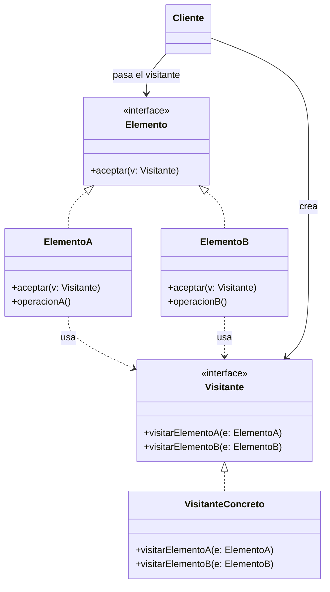
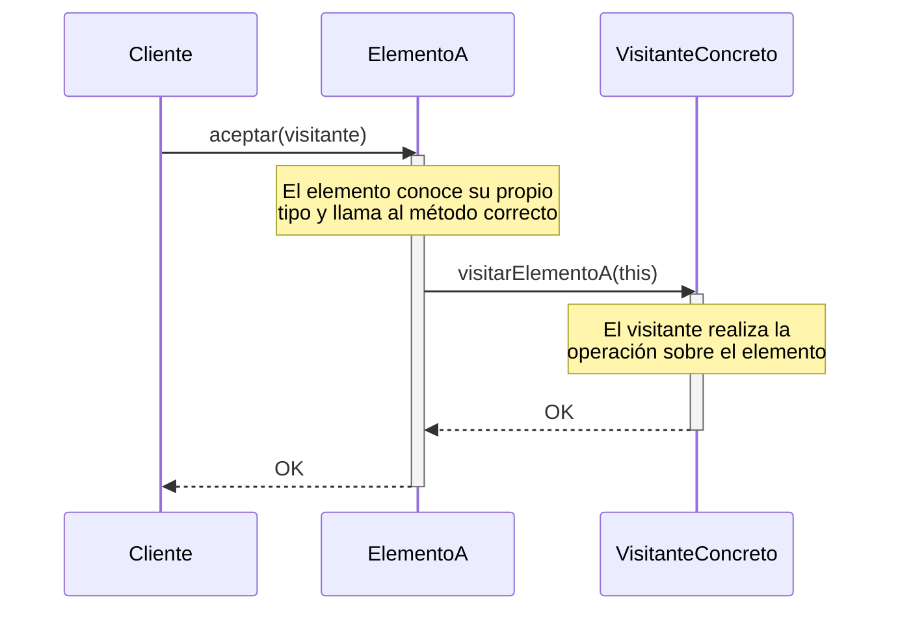

(patron-visitor)=
# Visitor

## Definición

El patrón **Visitor** (Visitante) es un patrón de diseño de comportamiento que permite definir una nueva operación sin cambiar las clases de los elementos sobre los que opera. 

Para lograrlo, el patrón separa el algoritmo de la estructura de objetos sobre la que opera, permitiendo añadir nuevas operaciones simplemente creando nuevas clases de visitantes.

## Origen e Historia

Formalizado por el GoF en 1994, el Visitor se diseñó principalmente para resolver problemas en la construcción de compiladores. Cuando se tiene un Árbol de Sintaxis Abstracta (AST), se necesitan realizar muchas operaciones diferentes sobre él (chequeo de tipos, optimización, generación de código). Añadir estos métodos a cada nodo del árbol haría que las clases de los nodos fueran gigantescas y difíciles de mantener. El Visitor permitió extraer esas lógicas a objetos externos.

## Motivación

La motivación principal es cumplir con el **Principio de Abierto/Cerrado**. Queremos que nuestra jerarquía de objetos (la estructura) esté cerrada a modificaciones, pero abierta a nuevas funcionalidades (las operaciones).

:::{note} Propósito
Representar una operación que se va a realizar sobre los elementos de una estructura de objetos. Permite definir una nueva operación sin cambiar las clases de los elementos sobre los que opera.
:::

## Contexto

### Cuando aplica

- Cuando una estructura de objetos contiene muchas clases de objetos con interfaces diferentes y se desea realizar operaciones que dependen de sus clases concretas.
- Cuando se necesitan realizar muchas operaciones distintas y no relacionadas sobre los objetos de una estructura, y se desea evitar "contaminar" las clases con estas operaciones.
- Cuando la estructura de clases de los objetos cambia rara vez, pero se añaden nuevas operaciones sobre la estructura frecuentemente.

### Cuando no aplica

- Cuando la jerarquía de elementos cambia a menudo. Cada vez que se añade un nuevo tipo de elemento, hay que actualizar la interfaz de todos los visitantes existentes.
- Cuando las operaciones no necesitan conocer el tipo concreto de los elementos (en ese caso, un simple bucle o un Iterator es suficiente).

## Consecuencias de su uso

### Positivas

- **Facilidad para añadir nuevas operaciones:** Solo hay que crear un nuevo visitante.
- **Agrupación de comportamientos relacionados:** Toda la lógica de una operación (ej. "Exportar a PDF") se encuentra en una sola clase, no dispersa por toda la jerarquía de elementos.
- **Acumulación de estado:** El visitante puede guardar información mientras recorre la estructura (ej. para contar elementos o sumar valores).

### Negativas

- **Dificultad para añadir nuevas clases de elementos:** Rompe la estructura de todos los visitantes.
- **Rotura de la encapsulación:** A menudo, el visitante necesita acceder a los atributos internos de los elementos para realizar su tarea, lo que obliga a los elementos a exponer sus datos mediante getters públicos.
- **Complejidad del "Double Dispatch":** El mecanismo de `aceptar(visitante)` y `visitar(elemento)` puede ser confuso de entender y depurar inicialmente.

## Alternativas

- **Iterator:** Útil para recorridos simples donde la operación no depende del tipo concreto del objeto.
- **Composition con Instanceof:** Una alternativa pobre y manual que suele degenerar en código difícil de mantener (grandes bloques `if-else` de tipos).

## Estructura

### Diagramas

**Diagrama de Clases**



**Diagrama de Secuencia (Doble Despacho)**



## Ejemplos

```java
/**
 * Interfaz Visitante.
 */
public interface Visitante {
    void visitar(Circulo c);
    void visitar(Rectangulo r);
}

/**
 * Interfaz Elemento.
 */
public interface Forma {
    void aceptar(Visitante v);
}

/**
 * Elementos Concretos.
 */
public class Circulo implements Forma {
    public float radio;
    @Override
    public void aceptar(Visitante v) { v.visitar(this); }
}

public class Rectangulo implements Forma {
    public float base, altura;
    @Override
    public void aceptar(Visitante v) { v.visitar(this); }
}

/**
 * Operación externa: Calcular Área.
 */
public class CalculadorArea implements Visitante {
    @Override
    public void visitar(Circulo c) {
        System.out.println("Área Círculo: " + (Math.PI * c.radio * c.radio));
    }
    
    @Override
    public void visitar(Rectangulo r) {
        System.out.println("Área Rectángulo: " + (r.base * r.altura));
    }
}
```

## Resumen

El Visitor es el patrón del "doble despacho". Su gran poder reside en la capacidad de extender la funcionalidad de una estructura compleja sin tocar una sola línea de código de las clases originales, permitiendo que el sistema crezca de forma modular y manteniendo las responsabilidades de procesamiento bien aisladas de las de representación.
