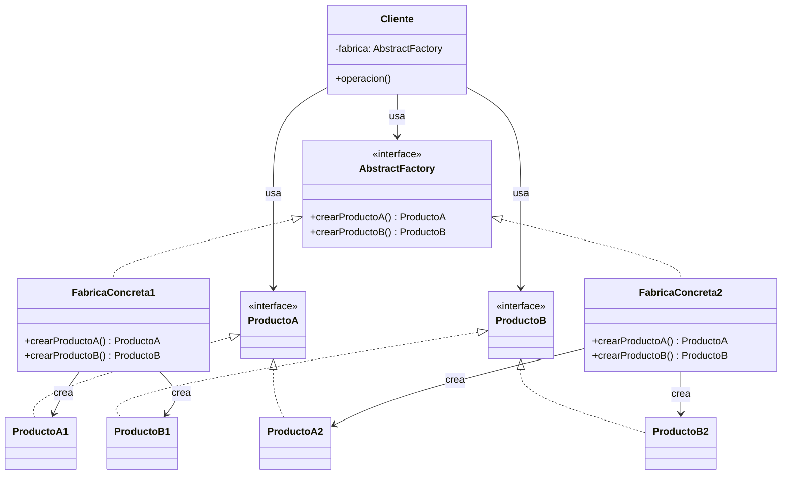
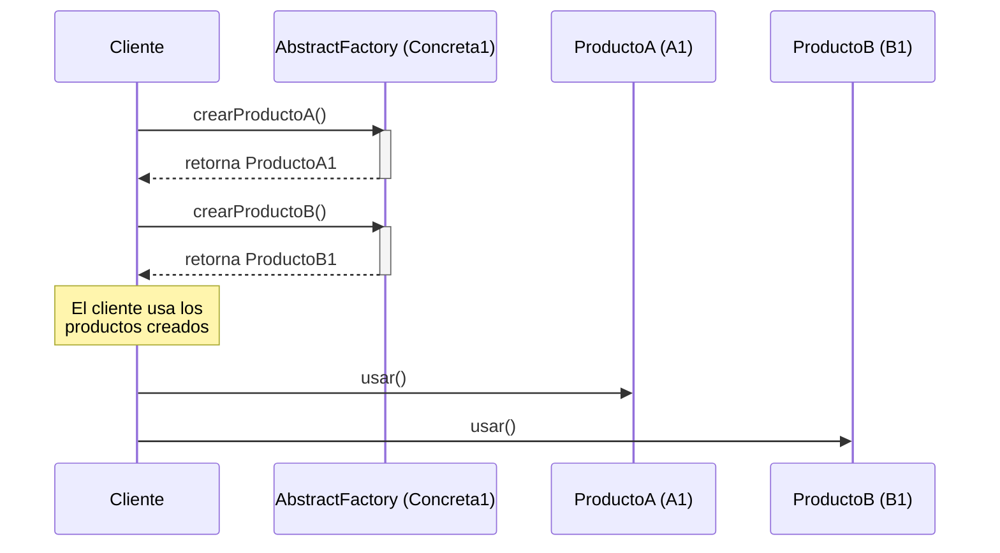

(patron-abstract-factory)=
# Abstract Factory

## Definición

El patrón **Abstract Factory** (Fábrica Abstracta) es un patrón de diseño creacional que proporciona una interfaz para crear familias de objetos relacionados o dependientes sin especificar sus clases concretas. 

En lugar de instanciar productos directamente, el cliente interactúa con una interfaz de fábrica que declara métodos para crear cada uno de los productos abstractos.

## Origen e Historia

Este patrón fue formalizado por Erich Gamma, Richard Helm, Ralph Johnson y John Vlissides (el *Gang of Four* o GoF) en su libro seminal de 1994. Surgió de la necesidad de independizar a un sistema de cómo se crean, componen y representan sus productos, especialmente cuando un sistema debe configurarse con una de entre varias familias de productos.

## Motivacion

La motivación principal surge cuando un sistema debe ser independiente de las plataformas o variantes de sus productos. Sin este patrón, el código cliente se llena de condicionales para instanciar clases específicas según el entorno (por ejemplo, diferentes sistemas operativos o temas visuales), lo que dificulta el mantenimiento y la extensión.

:::{note} El Problema de la Inconsistencia
Si creamos una ventana para Windows y un botón para Linux en la misma pantalla, la interfaz será visualmente incoherente. Abstract Factory previene esto forzando el uso de una misma "familia" de componentes.
:::

## Contexto

Se aplica en sistemas donde:
- El sistema debe ser independiente de cómo se crean sus productos.
- El sistema debe configurarse con una familia de productos entre varias disponibles.
- Una familia de objetos relacionados está diseñada para ser usada en conjunto y es necesario asegurar esta restricción.
- Querés proporcionar una biblioteca de clases de productos, pero solo revelar sus interfaces, no sus implementaciones.

### Cuando aplica

- **Interfaces Multiplataforma (GUI):** Cuando una aplicación debe funcionar en Windows, macOS y Linux, manteniendo el *look and feel* nativo de cada uno.
- **Sistemas de Temas/Skins:** Aplicaciones que permiten cambiar toda la estética (colores, fuentes, bordes) dinámicamente.
- **Persistencia de Datos:** Cuando se necesita soportar múltiples motores de bases de datos (MySQL, Oracle, PostgreSQL) y cada uno requiere un conjunto de conectores y traductores específicos.

### Cuando no aplica

- **Familias de un solo producto:** Si solo hay un tipo de objeto que crear, un *Factory Method* o incluso un constructor simple es preferible.
- **Sistemas con pocos cambios:** Si la familia de productos nunca va a cambiar o extenderse, la abstracción añade una complejidad innecesaria.
- **Cuando los productos no están relacionados:** Si los objetos no dependen entre sí ni deben ser coherentes como grupo, no hay beneficio en agruparlos en una fábrica.

## Consecuencias de su uso

### Positivas

- **Aislamiento de clases concretas:** El cliente solo manipula interfaces abstractas.
- **Facilidad de intercambio de familias:** Cambiar la fábrica concreta en tiempo de ejecución cambia toda la familia de productos instantáneamente.
- **Consistencia de productos:** Asegura que el cliente siempre obtenga objetos de la misma familia.

### Negativas

- **Dificultad para soportar nuevos tipos de productos:** Extender la fábrica para agregar un nuevo "producto abstracto" (ej. agregar `crearMenu()` a una fábrica que ya tiene `crearBoton()`) requiere modificar la interfaz `AbstractFactory` y todas sus subclases.
- **Complejidad:** Introduce muchas interfaces y clases nuevas, lo que puede sobrecargar el diseño si no es estrictamente necesario.

## Alternativas

- **Factory Method:** Si solo se necesita crear un tipo de objeto pero delegar la decisión a las subclases.
- **Prototype:** Si los productos de la familia pueden crearse clonando objetos preconfigurados en lugar de usar fábricas concretas.
- **Builder:** Si la creación de los objetos de la familia es muy compleja y requiere un proceso paso a paso.

## Estructura

### Diagramas

**Diagrama de Clases**



**Diagrama de Secuencia**



## Ejemplos

```java
/**
 * Interfaz Abstract Factory.
 */
public interface UIFactory {
    Ventana crearVentana();
    Boton crearBoton();
}

/**
 * Interfaces para productos.
 */
public interface Ventana {
    void renderizar();
}

public interface Boton {
    void presionar();
}

/**
 * Implementación para Linux.
 */
public class LinuxFactory implements UIFactory {
    @Override
    public Ventana crearVentana() {
        return new VentanaLinux();
    }
    
    @Override
    public Boton crearBoton() {
        return new BotonLinux();
    }
}

public class VentanaLinux implements Ventana {
    @Override
    public void renderizar() {
        System.out.println("Ventana con GTK...");
    }
}

public class BotonLinux implements Boton {
    @Override
    public void presionar() {
        System.out.println("Botón Linux presionado...");
    }
}

/**
 * Implementación para Windows.
 */
public class WindowsFactory implements UIFactory {
    @Override
    public Ventana crearVentana() {
        return new VentanaWindows();
    }
    
    @Override
    public Boton crearBoton() {
        return new BotonWindows();
    }
}

/**
 * Aplicación que usa la factory.
 */
public class Aplicacion {
    private UIFactory factory;
    private Ventana ventana;
    private Boton boton;
    
    public Aplicacion(UIFactory factory) {
        this.factory = factory;
    }
    
    public void inicializar() {
        ventana = factory.crearVentana();
        boton = factory.crearBoton();
    }
    
    public void mostrar() {
        ventana.renderizar();
        boton.presionar();
    }
}
```

## Resumen

El Abstract Factory es el "patrón de las familias". Su fuerza reside en garantizar la coherencia entre objetos relacionados y en desacoplar totalmente al cliente de las implementaciones concretas. Sin embargo, su rigidez ante la adición de nuevos tipos de productos requiere un diseño previo cuidadoso de las interfaces.
