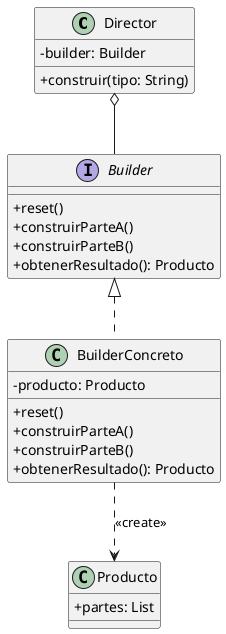

(patron-builder)=
# Builder

## definicion

El patrón **Builder** (Constructor) es un patrón de diseño creacional que permite construir objetos complejos paso a paso. El patrón permite producir distintos tipos y representaciones de un objeto utilizando el mismo código de construcción.

A diferencia de otros patrones creacionales, el Builder no requiere que los productos tengan una interfaz común, ya que los procesos de construcción pueden variar significativamente entre productos.

## origen e historia

Al igual que el resto de los patrones clásicos, fue documentado por el GoF en 1994. Se inspiró en los procesos de fabricación industriales donde un objeto se ensambla a partir de componentes menores siguiendo un orden específico, permitiendo que el mismo proceso de ensamblaje pueda producir diferentes resultados finales.

## motivacion

La motivación surge ante el problema del "constructor telescópico". Cuando una clase tiene muchos parámetros opcionales, el constructor se vuelve difícil de manejar y leer.

```java
// Ejemplo de constructor telescópico (Inconveniente)
public Casa(int h, int b, boolean p, boolean g, boolean s, boolean t) { ... }
```

El Builder resuelve esto permitiendo que el cliente llame solo a los métodos que necesita para configurar las partes que le interesan del objeto.

## contexto

Se utiliza cuando:
- El proceso de creación de un objeto complejo debe ser independiente de las partes que lo componen y de cómo se ensamblan.
- El proceso de construcción debe permitir diferentes representaciones del objeto que se construye.
- Se desea evitar constructores con demasiados parámetros (muchos de los cuales podrían ser `null` o valores por defecto).

## casos en los que aplica

- **Construcción de documentos:** Generar archivos PDF, HTML o RTF utilizando el mismo proceso de lectura de datos.
- **Configuración de objetos complejos:** Crear una conexión a base de datos o un cliente HTTP con múltiples opciones (timeout, autenticación, proxies, etc.).
- **Ensamblaje de productos:** Construir una "Computadora" configurando el CPU, RAM, Disco, etc., paso a paso.

## casos en los que no aplica

- **Objetos simples:** Si el objeto tiene solo dos o tres atributos obligatorios, el Builder añade una verbosidad innecesaria.
- **Objetos inmutables con pocos parámetros:** Un constructor simple es más directo.
- **Cuando no hay variabilidad en la construcción:** Si el objeto siempre se construye de la misma forma, no hay beneficio en usar un Builder.

## consecuencias de su uso

### positivas

- **Permite variar la representación interna de un producto:** El Director puede usar diferentes Builders para obtener resultados distintos.
- **Encapsula el código de construcción y representación:** Mejora la modularidad al separar la lógica de ensamblaje de la lógica del objeto final.
- **Control fino sobre el proceso de construcción:** El objeto se construye solo cuando se llama al método final (`build()`), lo que permite validar el estado antes de la instanciación.

### negativas

- **Requiere un Builder específico para cada producto:** Si los productos son muy diferentes, la jerarquía de Builders puede crecer mucho.
- **Complejidad adicional:** Introduce múltiples clases nuevas (Director, BuilderAbstracto, BuildersConcretos).
- **Mutabilidad temporal:** El objeto Builder es mutable mientras se configura, lo que requiere cuidado en entornos multi-hilo antes de llamar a `build()`.

## alternativas

- **Abstract Factory:** Se centra en familias de productos. El Builder se centra en la construcción paso a paso de un objeto complejo.
- **Factory Method:** Crea objetos en un solo paso, no permite una configuración gradual.

## estructura

### Diagrama de Clases



## ejemplos

```java
/**
 * Clase a construir.
 */
public class Casa {
    private int habitaciones;
    private int baños;
    private boolean piscina;
    private boolean garaje;
    
    private Casa(CasaBuilder builder) {
        this.habitaciones = builder.habitaciones;
        this.baños = builder.baños;
        this.piscina = builder.piscina;
        this.garaje = builder.garaje;
    }
    
    public static class CasaBuilder {
        private int habitaciones = 0;
        private int baños = 0;
        private boolean piscina = false;
        private boolean garaje = false;
        
        public CasaBuilder habitaciones(int cantidad) {
            this.habitaciones = cantidad;
            return this;
        }
        
        public CasaBuilder baños(int cantidad) {
            this.baños = cantidad;
            return this;
        }
        
        public CasaBuilder conPiscina() {
            this.piscina = true;
            return this;
        }
        
        public Casa construir() {
            return new Casa(this);
        }
    }
}

// Uso fluido:
Casa miCasa = new Casa.CasaBuilder()
    .habitaciones(3)
    .baños(2)
    .conPiscina()
    .construir();
```

## resumen

El Builder es el patrón ideal para "ensamblar" objetos. Su mayor virtud es la legibilidad y la flexibilidad que aporta al cliente, permitiéndole construir objetos complejos sin perderse en una maraña de parámetros de constructor. Es especialmente popular en Java moderno a través de bibliotecas como Lombok o en la construcción de APIs fluidas.
