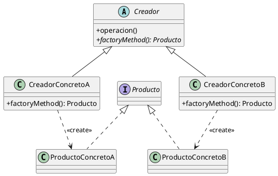

(patron-factory-method)=
# Factory Method

## Definición

El patrón **Factory Method** (Método de Fábrica) es un patrón de diseño creacional que define una interfaz para crear un objeto, pero deja que las subclases decidan qué clase instanciar. El Factory Method permite que una clase delegue la instanciación a sus subclases.

## Origen e Historia

Formalizado por el GoF en 1994, este patrón es una de las piedras angulares de la programación orientada a objetos moderna. Surgió como una solución para desacoplar el código que utiliza un objeto del código que lo crea, permitiendo que un sistema sea extensible sin necesidad de modificar el código existente.

## Motivacion

La motivación surge cuando una clase no puede anticipar la clase de objetos que debe crear. 

```java
// Sin Factory Method: Acoplamiento rígido
public class Aplicacion {
    public void abrir() {
        Documento doc = new DocumentoPDF(); // ❌ Acoplado a PDF
        doc.mostrar();
    }
}
```

Al usar un Factory Method, la clase `Aplicacion` solo sabe que necesita un `Documento`, pero deja que una subclase específica (como `AplicacionPDF`) decida qué tipo de documento crear.

## Contexto

Se aplica cuando:
- Una clase no sabe de antemano qué subclases de objetos debe crear.
- Una clase quiere que sus subclases especifiquen los objetos que crean.
- Se desea centralizar la lógica de creación de objetos para facilitar el mantenimiento.

### Cuando aplica

- **Frameworks de IU:** Un framework puede proporcionar una clase base para "Ventana", pero dejar que la aplicación concreta decida si la ventana es de tipo "Windows", "Material" o "GTK".
- **Gestión de conexiones:** Una aplicación puede necesitar diferentes tipos de conectores (SSH, FTP, HTTP) dependiendo de la configuración.
- **Procesamiento de archivos:** Crear diferentes lectores/escritores (JSON, XML, CSV) basados en la extensión del archivo.

### Cuando no aplica

- **Cuando el tipo de objeto es fijo:** Si siempre vas a crear la misma clase y no hay jerarquía de productos, usar una fábrica es sobreingeniería.
- **Creaciones simples:** Si un `new` directo es suficiente y no afecta la testabilidad ni la extensibilidad.
- **Cuando el rendimiento es crítico:** En bucles extremadamente densos donde la indirección del método de fábrica podría (teóricamente) causar un *overhead* despreciable pero medible.

## Consecuencias de su uso

### Positivas

- **Desacoplamiento:** El código cliente no está ligado a las clases concretas de los productos.
- **Soporta el Principio de Abierto/Cerrado:** Podés introducir nuevos tipos de productos sin romper el código cliente existente.
- **Responsabilidad Única:** La lógica de creación se mueve a un lugar específico (el método de fábrica).

### Negativas

- **Proliferación de subclases:** Podrías terminar con una jerarquía de creadores paralela a la jerarquía de productos (por cada `ProductoA` necesitás un `CreadorA`).
- **Complejidad innecesaria:** Si la jerarquía de productos es pequeña o estable, el patrón añade capas de abstracción que pueden dificultar la lectura inicial.

## Alternativas

- **Abstract Factory:** Si necesitás crear familias de productos relacionados.
- **Static Factory Method:** Una versión simplificada que usa un método estático en la clase base para devolver instancias, evitando la necesidad de subclases creadoras (aunque es menos flexible).

## Estructura

### Diagrama de Clases



## Ejemplos

```java
/**
 * Clase base que define el factory method.
 */
public abstract class Aplicacion {
    protected abstract Documento crearDocumento();
    
    public void abrirDocumento() {
        Documento doc = crearDocumento(); // Factory Method
        doc.abrir();
    }
}

/**
 * Interfaz para productos.
 */
public interface Documento {
    void abrir();
}

/**
 * Implementaciones concretas.
 */
public class DocumentoPDF implements Documento {
    @Override
    public void abrir() { System.out.println("Abriendo PDF..."); }
}

/**
 * Subclase que implementa el factory method.
 */
public class AplicacionPDF extends Aplicacion {
    @Override
    protected Documento crearDocumento() {
        return new DocumentoPDF();
    }
}
```

## Resumen

El Factory Method es la herramienta definitiva para el desacoplamiento creacional. Su principal valor radica en permitir que un sistema evolucione permitiendo que nuevas subclases decidan cómo instanciar objetos existentes, manteniendo el código base limpio y enfocado en la lógica de alto nivel.
