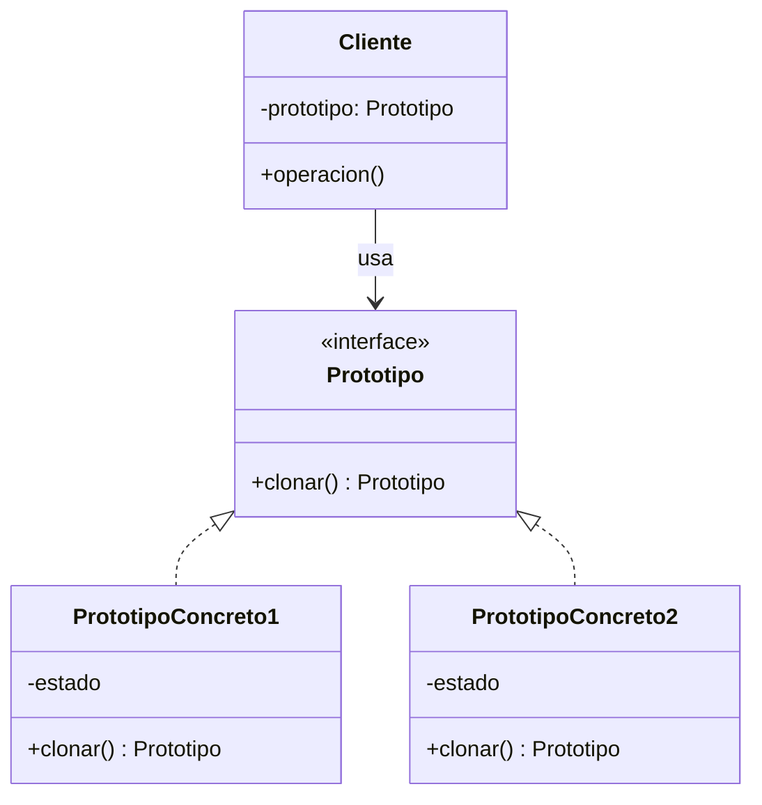
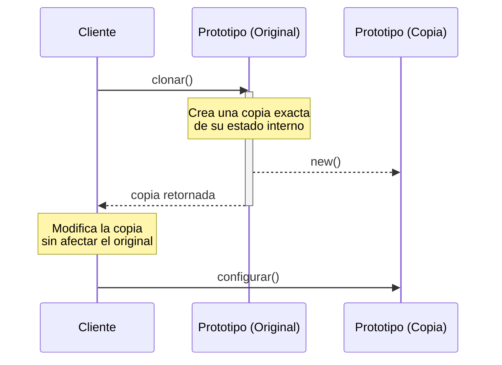

(patron-prototype)=
# Prototype

## Definición

El patrón **Prototype** (Prototipo) es un patrón de diseño creacional que permite la creación de nuevos objetos a partir de un objeto existente (el prototipo) mediante la clonación. En lugar de instanciar la clase desde cero, el cliente solicita al prototipo que cree una copia de sí mismo.

## Origen e Historia

Documentado por el GoF en 1994, el patrón Prototype tiene raíces en lenguajes como **Self**, donde la clonación de objetos es el mecanismo principal de herencia y creación (en lugar de clases). En Java, este patrón está integrado en el lenguaje a través de la interfaz `Cloneable` y el método `clone()`, aunque su implementación requiere cuidado con la clonación profunda.

## Motivacion

La motivación principal es evitar el costo de creación de objetos complejos cuando ya existe una instancia configurada. 

```java
// Sin Prototype: Re-configurar cada instancia es ineficiente
Configuracion c1 = new Configuracion();
c1.cargarDeBD(); // Proceso costoso
c1.setModulos(...);

Configuracion c2 = new Configuracion();
c2.cargarDeBD(); // ❌ Repetir proceso costoso
```

Con Prototype, `c2` simplemente se clonaría de `c1`, heredando todo su estado ya inicializado.

## Contexto

Se aplica cuando:
- Las clases a instanciar se especifican en tiempo de ejecución.
- Se desea evitar la creación de una jerarquía de fábricas paralela a la jerarquía de productos.
- Las instancias de una clase pueden tener solo unos pocos estados diferentes. Puede ser más conveniente instalar un número correspondiente de prototipos y clonarlos en lugar de instanciar la clase manualmente cada vez.
- La creación de un objeto es costosa en términos de tiempo o recursos (consultas a BD, carga de archivos grandes).

### Cuando aplica

- **Sistemas de Juegos:** Clonar enemigos o proyectiles que ya tienen propiedades físicas configuradas.
- **Editores Gráficos:** Copiar y pegar formas geométricas que tienen colores, posiciones y capas específicas.
- **Gestores de Configuración:** Mantener una configuración base y crear variantes para diferentes módulos mediante clonación.

### Cuando no aplica

- **Objetos simples:** Si crear un objeto con `new` es trivial y no requiere configuración previa.
- **Grafos de objetos complejos con referencias circulares:** La clonación profunda de estructuras complejas puede ser extremadamente difícil de implementar correctamente y propensa a errores.
- **Cuando el estado no es relevante:** Si cada nueva instancia debe empezar totalmente vacía o con datos únicos que no se pueden copiar.

## Consecuencias de su uso

### Positivas

- **Oculta la complejidad de la creación:** El cliente no necesita saber cómo se ensambla un objeto complejo, solo cómo clonarlo.
- **Permite añadir y eliminar productos en tiempo de ejecución:** Podés registrar nuevos prototipos dinámicamente en un "gestor de prototipos".
- **Reducción de la subclasificación:** A diferencia de Factory Method, no necesitás una jerarquía de creadores.

### Negativas

- **Dificultad en la clonación profunda:** Clonar objetos que contienen referencias a otros objetos requiere una implementación cuidadosa para asegurar que se copien los datos y no solo las direcciones de memoria (clonación superficial).
- **Costo de implementación:** Cada subclase debe implementar el método de clonación, lo que puede ser tedioso si la jerarquía es muy grande.

## Alternativas

- **Abstract Factory:** Se centra en crear familias desde cero. Prototype se centra en copiar lo que ya existe.
- **Memento:** Puede usarse para guardar el estado de un objeto, pero su propósito es la restauración, no la creación de nuevas instancias para uso concurrente.

## Estructura

### Diagramas

**Diagrama de Clases**



**Diagrama de Secuencia**



## Ejemplos

```java
/**
 * Interfaz Prototype.
 */
public interface Cloneable {
    Object clonar();
}

/**
 * Clase que implementa clonación.
 */
public class Documento implements Cloneable {
    private String titulo;
    private List<String> etiquetas;
    
    public Documento(String titulo) {
        this.titulo = titulo;
        this.etiquetas = new ArrayList<>();
    }
    
    // Constructor de copia (Recomendado sobre clone() de Java)
    private Documento(Documento original) {
        this.titulo = original.titulo;
        this.etiquetas = new ArrayList<>(original.etiquetas); // Clonación profunda de la lista
    }
    
    @Override
    public Documento clonar() {
        return new Documento(this);
    }
}
```

## Resumen

El patrón Prototype es el patrón del "copiar y pegar". Su valor reside en la eficiencia y en la capacidad de crear variantes de objetos complejos sin depender de sus clases concretas ni de pesados procesos de inicialización. Es la base de los sistemas de prototipado donde los objetos evolucionan por copia y modificación.
