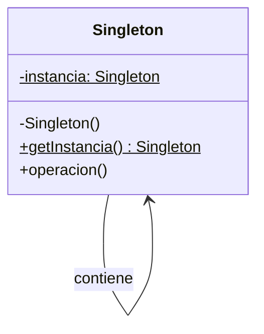
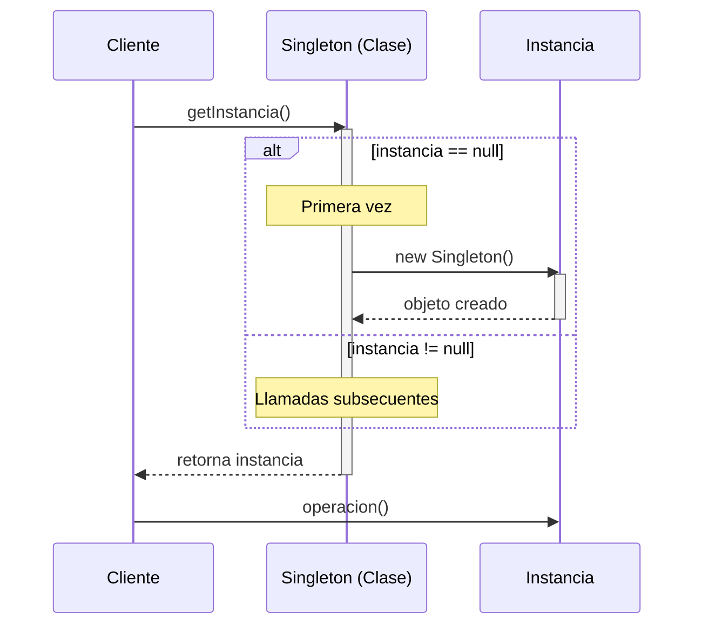

(patron-singleton)=
# Singleton

## Definición

El patrón **Singleton** (Instancia Única) es un patrón de diseño creacional que garantiza que una clase tenga una única instancia y proporciona un punto de acceso global a ella. 

Restringe la creación de objetos de una clase a una sola instancia, lo cual es útil cuando se necesita un objeto único para coordinar acciones en todo el sistema, como un gestor de configuración o un pool de conexiones.

## Origen e Historia

Formalizado por el GoF en 1994, el Singleton es quizás el patrón más conocido (y a veces el más abusado). Su origen se remonta a la necesidad de gestionar recursos compartidos de hardware o software que, por su naturaleza, no pueden o no deben tener múltiples controladores (como una cola de impresión o un sistema de logs).

## Motivacion

La necesidad del Singleton surge cuando:
- Se requiere exactamente una instancia de una clase para evitar inconsistencias.
- Esa instancia debe ser accesible de forma sencilla desde cualquier parte del código.
- Se desea evitar la creación costosa de múltiples objetos idénticos.

```java
// Motivación: Acceso centralizado y único
public class Logger {
    // Si cada clase crea su propio Logger, 
    // ¿quién coordina la escritura en el archivo único?
}
```

## Contexto

Se aplica en situaciones donde:
- El control de un recurso compartido debe ser centralizado.
- El acceso global es preferible a pasar la instancia por todos los constructores (aunque esto último suele ser mejor para la testabilidad).
- La inicialización perezosa (*lazy initialization*) es deseable para ahorrar recursos si la instancia nunca se solicita.

### Cuando aplica

- **Gestores de Configuración:** Un único objeto que carga y provee los parámetros de la aplicación.
- **Pools de Conexiones:** Para administrar un número limitado de conexiones a una base de datos.
- **Sistemas de Logs:** Para asegurar que todos los mensajes de error se escriban en el mismo destino de forma ordenada.
- **Cachés de Aplicación:** Un almacén de datos temporal compartido por todos los módulos.

### Cuando no aplica

- **Cuando el estado global es innecesario:** No uses Singleton solo para evitar pasar parámetros.
- **Cuando se requieren múltiples instancias en el futuro:** Si existe la mínima posibilidad de necesitar dos instancias (ej. dos bases de datos distintas), Singleton será un obstáculo.
- **En pruebas unitarias estrictas:** Los Singletons introducen un estado global que hace que las pruebas no sean aisladas ni deterministas.

## Consecuencias de su uso

### Positivas

- **Garantiza una única instancia:** Elimina el riesgo de duplicidad de recursos.
- **Acceso controlado:** El Singleton puede gestionar quién y cómo accede a sus métodos.
- **Inicialización perezosa:** El objeto solo se crea cuando realmente se necesita.

### Negativas

- **Dificultad para probar (Testability):** Al ser global, no se puede "resetear" fácilmente entre pruebas unitarias sin hacks.
- **Acoplamiento oculto:** Las clases que usan el Singleton dependen de él de forma implícita, lo que dificulta ver el grafo de dependencias.
- **Problemas de concurrencia:** Requiere una implementación cuidadosa en entornos multi-hilo para evitar que dos hilos creen la instancia simultáneamente.
- **Viola el SRP:** La clase se encarga de su lógica de negocio Y de gestionar su propio ciclo de vida.

## Alternativas

- **Inyección de Dependencias (DI):** Es la alternativa moderna más recomendada. Un contenedor gestiona el ciclo de vida del objeto y lo "inyecta" donde se necesita, permitiendo que sea único sin ser un Singleton global.
- **Clases Estáticas (Utility Classes):** Si no hay estado y solo son métodos de utilidad.

## Estructura

### Diagramas

**Diagrama de Clases**



**Diagrama de Secuencia**



## Ejemplos

```java
/**
 * Implementación segura para hilos (Thread-safe) en Java.
 */
public class DatabaseConnector {
    private static volatile DatabaseConnector instancia;
    
    private DatabaseConnector() {
        // Conexión costosa aquí
    }
    
    public static DatabaseConnector getInstancia() {
        if (instancia == null) {
            synchronized (DatabaseConnector.class) {
                if (instancia == null) {
                    instancia = new DatabaseConnector();
                }
            }
        }
        return instancia;
    }
}
```

## Resumen

El Singleton es una herramienta potente pero peligrosa. Su simplicidad lo hace atractivo, pero su naturaleza global puede corromper la arquitectura de un sistema si se usa para ocultar dependencias. Debe reservarse para recursos que son intrínsecamente únicos en el dominio del problema.
