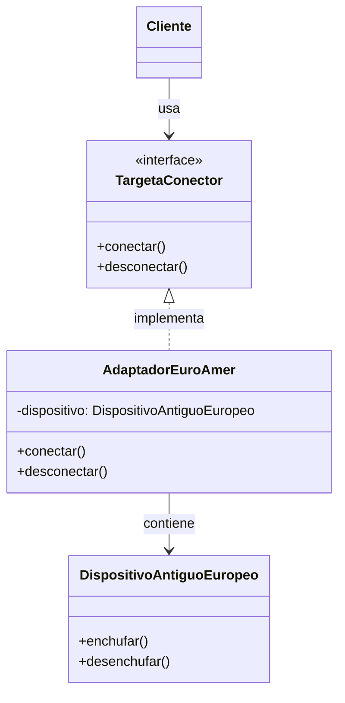
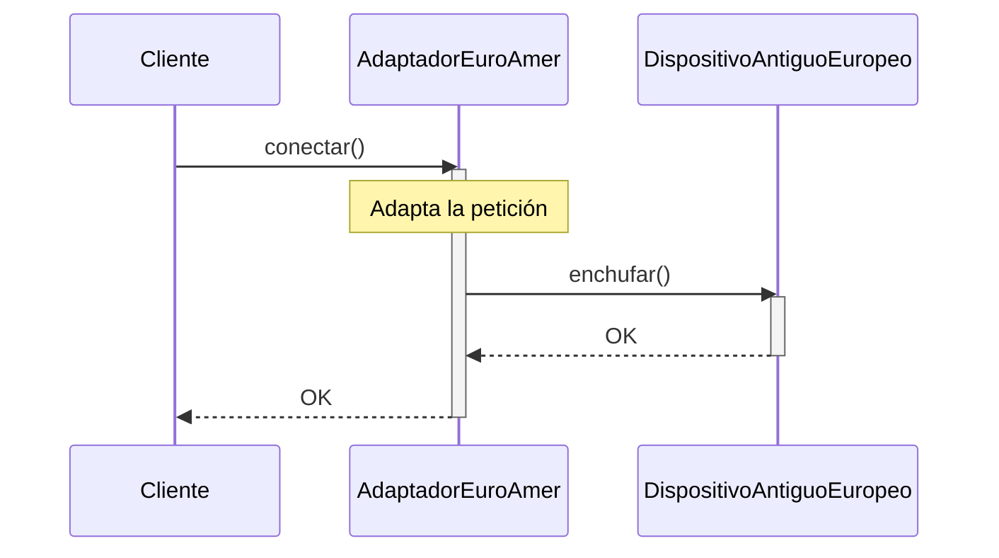

(patron-adapter)=
# Adapter

:::{note} Hoja de ruta del capítulo

**Objetivo.** Comprender las ideas centrales de **Adapter** y usarlas como base para el resto del recorrido.

**Prerrequisitos.** Conviene haber leído [el material inmediatamente anterior](indice.md) para llegar con el hilo de la parte fresco.

**Desarrollo.** El desarrollo del capítulo aparece en las secciones que siguen. Conviene recorrerlas en orden y volver al resumen antes de pasar al siguiente tema.
:::

## Definición

El patrón **Adapter** (también conocido como **Wrapper**) permite que clases con interfaces incompatibles trabajen juntas, convirtiendo la interfaz de una clase en otra que el cliente espera. Actúa como un "traductor" entre dos interfaces, permitiendo que objetos con interfaces incompatibles colaboren.

## Origen e Historia

El Adapter fue documentado por Gang of Four en 1994. Tiene raíces en el concepto de "adapters" físicos (como adaptadores de electricidad que permiten usar dispositivos en diferentes regiones). En software, se popularizó para resolver la integración de código heredado con código nuevo.

## Motivación

Surge cuando:
- Necesitas integrar código legado con interfaces antiguas
- Trabajas con librerías externas de terceros que no puedes modificar
- Quieres reutilizar clases existentes pero sus interfaces no coinciden
- Necesitas que objetos con interfaces diferentes colaboren

## Contexto

**Escenario típico:**
- Cliente espera interfaz `TargetaConector`
- Clase existente proporciona `DispositivoAntiguoEuropeo`
- Adapter actúa como "traductor" entre ambas

**Anatomía:**
- **Target**: Interfaz que espera el cliente
- **Adaptee**: Clase existente con interfaz diferente
- **Adapter**: Clase que implementa Target y encapsula Adaptee
- **Client**: Usa Target

### Cuando aplica

✅ **Usa Adapter cuando:**
- Tienes código legacy que no puedes modificar
- Necesitas integrar bibliotecas de terceros
- Dos interfaces incompatibles necesitan trabajar juntas
- Quieres mantener separación de concerns

### Cuando no aplica

❌ **Evita cuando:**
- Puedes refactorizar la interfaz original
- La adaptación es trivial
- Hay múltiples niveles de adaptación

## Consecuencias de su uso

### Positivas

- **Reutilización**: Usa código existente sin modificarlo
- **Separación**: Desvincula cliente del código adaptado
- **Flexibilidad**: Agregar nuevos adapters sin cambiar código existente
- **Single Responsibility**: Adapter solo hace traducción

### Negativas

- **Complejidad**: Introduce clases adicionales
- **Indirección**: Capa extra de llamadas
- **Performance**: Overhead de traducción
- **Confusión**: Muchos adapters pueden ser confusos

## Alternativas

| Patrón | Propósito | Cuando |
| :--- | :--- | :--- |
| **Bridge** | Desacoplar abstracción de implementación | Múltiples dimensiones |
| **Decorator** | Agregar responsabilidades dinámicamente | Extender comportamiento |
| **Facade** | Simplificar interfaz compleja | Sistemas complejos |

## Estructura

### Problema

```java
// Cliente espera esta interfaz
public interface TargetaConector {
    void conectar();
    void desconectar();
}

// Dispositivo antiguo con interfaz diferente
public class DispositivoAntiguoEuropeo {
    public void enchufar() {
        System.out.println("Enchufado con conector europeo (2 pines)");
    }
    
    public void desenchufar() {
        System.out.println("Desenchufado desde conector europeo");
    }
}

// ❌ Problema: No puedo usar directamente
TargetaConector conector = new DispositivoAntiguoEuropeo();  // Error de compilación!
```

### Solución

```java
/**
 * Adapter que convierte DispositivoAntiguoEuropeo 
 * a la interfaz TargetaConector.
 */
public class AdaptadorEuropaAmerica implements TargetaConector {
    private DispositivoAntiguoEuropeo dispositivo;
    
    public AdaptadorEuropaAmerica(DispositivoAntiguoEuropeo dispositivo) {
        this.dispositivo = dispositivo;
    }
    
    @Override
    public void conectar() {
        dispositivo.enchufar();
    }
    
    @Override
    public void desconectar() {
        dispositivo.desenchufar();
    }
}

// ✅ Ahora funciona
DispositivoAntiguoEuropeo tv = new DispositivoAntiguoEuropeo();
TargetaConector conector = new AdaptadorEuropaAmerica(tv);
conector.conectar();      // Funciona como se esperaba
conector.desconectar();
```

### Diagramas

**Diagrama de Clases**



**Diagrama de Secuencia**



## Ejemplos

### Ejemplo 1: Integración de Sistemas de Notificación

```java
// Interfaz que espera el cliente (nuevo sistema)
public interface SistemaNotificacionModerno {
    void enviarNotificacion(String mensaje);
}

// Sistema antiguo que no queremos modificar
public class SistemaNotificacionAntiguoFax {
    public void enviarFax(String numero, String contenido) {
        System.out.println("Fax enviado a " + numero + ": " + contenido);
    }
}

// Adapter que traduce notificación moderna a fax antiguo
public class AdaptadorNotificacionAFax implements SistemaNotificacionModerno {
    private SistemaNotificacionAntiguoFax sistemaFax;
    private String numeroFaxPorDefecto;
    
    public AdaptadorNotificacionAFax(SistemaNotificacionAntiguoFax sistemaFax, 
                                      String numeroFax) {
        this.sistemaFax = sistemaFax;
        this.numeroFaxPorDefecto = numeroFax;
    }
    
    @Override
    public void enviarNotificacion(String mensaje) {
        sistemaFax.enviarFax(numeroFaxPorDefecto, mensaje);
    }
}

// Cliente que usa la interfaz moderna
public class CentroNotificaciones {
    private SistemaNotificacionModerno sistema;
    
    public CentroNotificaciones(SistemaNotificacionModerno sistema) {
        this.sistema = sistema;
    }
    
    public void notificar(String mensaje) {
        sistema.enviarNotificacion(mensaje);
    }
}

// Uso
SistemaNotificacionAntiguoFax fax = new SistemaNotificacionAntiguoFax();
SistemaNotificacionModerno adaptado = new AdaptadorNotificacionAFax(fax, "+549111234567");
CentroNotificaciones centro = new CentroNotificaciones(adaptado);

centro.notificar("Alerta de seguridad");
// Salida: Fax enviado a +549111234567: Alerta de seguridad
```

### Variantes

**Adapter de Clase (Herencia):**
```java
public class AdaptadorPorHerencia extends DispositivoAntiguoEuropeo 
    implements TargetaConector {
    
    @Override
    public void conectar() {
        this.enchufar();
    }
    
    @Override
    public void desconectar() {
        this.desenchufar();
    }
}
```

## Ejercicios

```{exercise}
:label: ex-parte4-adapter-mini

Una aplicación nueva necesita usar un servicio legacy de fax cuya API no coincide con la interfaz de notificaciones actual. Diseñá un caso mínimo con **Adapter** e indicá qué clases querés mantener sin modificar.
```

## Resumen

El patrón **Adapter** resuelve problemas de incompatibilidad entre interfaces proporcionando una clase intermediaria que traduce llamadas. Es fundamental en integración de sistemas heterogéneos y reutilización de código existente sin modificación. Aunque introduce indirección, su beneficio en separación de concerns y flexibilidad lo hacen invaluable en arquitecturas empresariales.

## Próximo paso

Para seguir, conviene pasar a [el material siguiente](bridge.md), donde el recorrido continúa sobre esta base.
