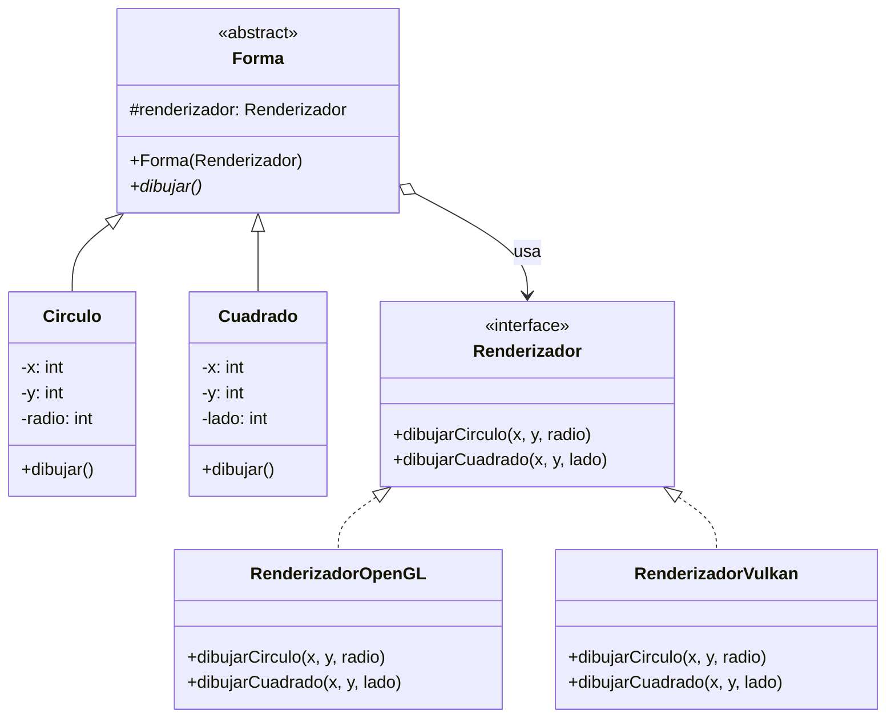
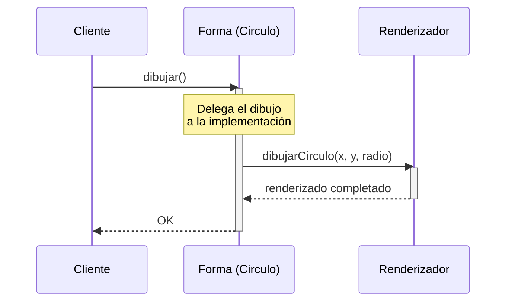

(patron-bridge)=
# Bridge

## Definición

El patrón **Bridge** desacopla una abstracción de su implementación para que puedan variar independientemente. Permite tener múltiples dimensiones de variación sin crear una explosión de subclases.

## Origen e Historia

Documentado por Gang of Four en 1994. Bridge surge del reconocimiento de que herencia múltiple (combinar múltiples dimensiones de variación) crea explosión de clases. Fue popularizado especialmente en frameworks de gráficos y sistemas de renderización.

## Motivación

Necesario cuando:
- Tienes múltiples dimensiones de variación independientes
- Quieres evitar jerarquías de herencia explosivas
- Abstracciones e implementaciones varían independientemente
- Necesitas compartir implementaciones entre abstracciones

## Contexto

**Estructura:**
- **Abstracción**: Define interfaz general (ej: Forma)
- **Implementador**: Define interfaz para implementaciones (ej: Renderizador)
- **La connexión**: Abstracción usa Implementador, ambos varían independientemente

**Anatomía:** N formas × M renderizadores sin N×M clases

### Cuando aplica

✅ **Usa Bridge cuando:**
- Tienes múltiples dimensiones de variación
- Quieres evitar combinaciones explosivas
- La abstracción e implementación deben cambiar independientemente

### Cuando no aplica

❌ **Evita cuando:**
- Solo una dimensión de variación
- La herencia simple es suficiente

## Consecuencias de su uso

### Positivas

- **Desacoplamiento**: Abstracción e implementación independientes
- **Escalabilidad**: Agregar formas o renderizadores sin afectar otros
- **Evita explosión de clases**: N*M en lugar de N+M clases
- **Delegación**: Usa composición sobre herencia

### Negativas

- **Complejidad**: Más difícil de entender que herencia simple
- **Indirección**: Extra de llamadas
- **Overhead**: Capas adicionales de abstracción

## Alternativas

| Patrón | Propósito | Diferencia |
| :--- | :--- | :--- |
| **Adapter** | Hacer compatibles interfaces | Integra código existente |
| **Decorator** | Agregar responsabilidades | Envuelve con comportamiento |
| **Composite** | Componer objetos en árbol | Estructura jerárquica |

## Estructura

### Problema

```
Sin Bridge: Explosión de clases
├─ Círculo
│  ├─ CirculoOpenGL
│  └─ CirculoVulkan
└─ Cuadrado
   ├─ CuadradoOpenGL
   └─ CuadradoVulkan
```

### Solución

```java
/**
 * Interfaz Implementación (Implementor).
 * Define operaciones primitivas en las que se basa la abstracción.
 */
public interface Renderizador {
    void dibujarCirculo(int x, int y, int radio);
    void dibujarCuadrado(int x, int y, int lado);
}

/**
 * Abstracción que usa Renderizador.
 */
public abstract class Forma {
    protected Renderizador renderizador;
    
    public Forma(Renderizador renderizador) {
        this.renderizador = renderizador;
    }
    
    abstract void dibujar();
}

/**
 * Abstracción Refinada.
 */
public class Circulo extends Forma {
    private int x, y, radio;
    
    public Circulo(Renderizador renderizador, int x, int y, int radio) {
        super(renderizador);
        this.x = x;
        this.y = y;
        this.radio = radio;
    }
    
    @Override
    public void dibujar() {
        renderizador.dibujarCirculo(x, y, radio);
    }
}

/**
 * Implementador concreto: OpenGL.
 */
public class RenderizadorOpenGL implements Renderizador {
    @Override
    public void dibujarCirculo(int x, int y, int radio) {
        System.out.println("OpenGL: Dibujando círculo en (" + x + "," + y + "), radio=" + radio);
    }
    
    @Override
    public void dibujarCuadrado(int x, int y, int lado) {
        System.out.println("OpenGL: Dibujando cuadrado en (" + x + "," + y + "), lado=" + lado);
    }
}

// ✅ Uso: Sin explosión de clases
Renderizador opengl = new RenderizadorOpenGL();
Forma circuloGL = new Circulo(opengl, 50, 50, 20);
circuloGL.dibujar();  // OpenGL: Dibujando círculo...
```

### Diagramas

**Diagrama de Clases**



**Diagrama de Secuencia**



## Ejemplos

### Ejemplo 1: Sistemas de Renderización

```java
// Interfaz implementación
public interface Renderizador {
    void renderizar(String contenido);
}

// Implementadores
public class RenderizadorHTML implements Renderizador {
    @Override
    public void renderizar(String contenido) {
        System.out.println("<html>" + contenido + "</html>");
    }
}

public class RenderizadorPDF implements Renderizador {
    @Override
    public void renderizar(String contenido) {
        System.out.println("[PDF] " + contenido);
    }
}

// Abstracción
public abstract class Documento {
    protected Renderizador renderizador;
    
    public Documento(Renderizador renderizador) {
        this.renderizador = renderizador;
    }
    
    abstract void mostrar();
}

// Refinadas
public class Informe extends Documento {
    private String contenido;
    
    public Informe(Renderizador renderizador, String contenido) {
        super(renderizador);
        this.contenido = contenido;
    }
    
    @Override
    public void mostrar() {
        renderizador.renderizar("INFORME: " + contenido);
    }
}

// Uso
Renderizador html = new RenderizadorHTML();
Documento doc = new Informe(html, "Datos de ventas");
doc.mostrar();  // <html>INFORME: Datos de ventas</html>
```

## Resumen

El patrón **Bridge** es esencial para manejar múltiples dimensiones de variación sin explosión de clases. Mediante la separación de abstracción e implementación, permite evolucionar ambas de forma independiente. Aunque introduce complejidad adicional, su beneficio en escalabilidad y mantenibilidad lo hace fundamental en sistemas grandes.
