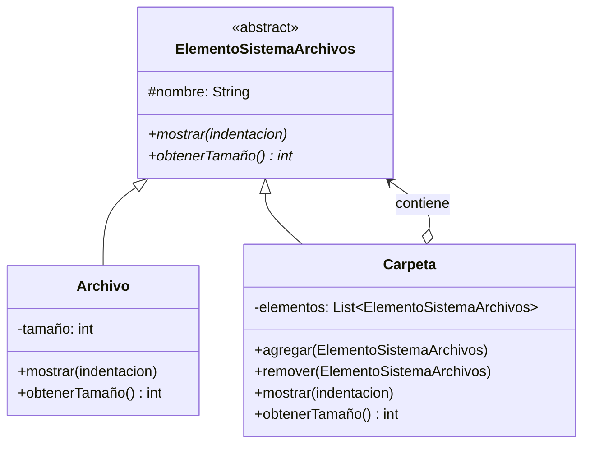
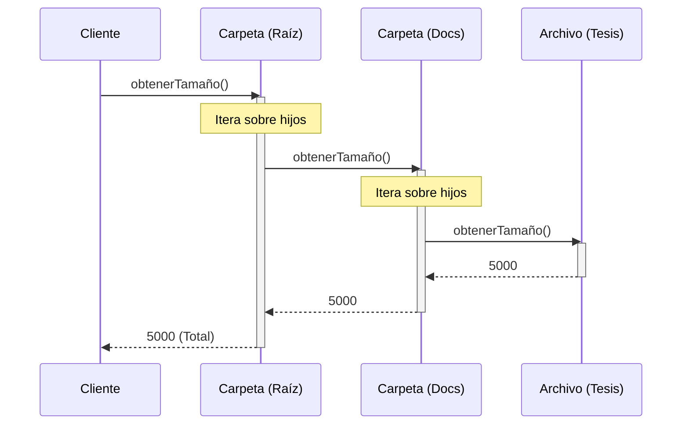

(patron-composite)=
# Composite

## Definición

El patrón **Composite** permite componer objetos en estructuras de árbol para representar jerarquías parte-todo, permitiendo que los clientes traten objetos individuales y composiciones de objetos de manera uniforme.

## Origen e Historia

Gang of Four 1994. Surge de la necesidad de tratar uniformemente estructuras jerárquicas (árboles) sin que el cliente conozca si está trabajando con una hoja o un compuesto. Se popularizó en sistemas de archivos, widgets de UI, y procesadores de documentos.

## Motivación

Necesario cuando:
- Tienes estructuras jerárquicas parte-todo
- Quieres que cliente trate uniformemente hojas y compuestos
- Necesitas recursión sobre estructuras arbitrariamente profundas
- Implementar sin Composite requiere condicionales constantes

## Contexto

**Escenario:** Archivos/carpetas, widgets UI, menús anidados

**Anatomía:**
- **Component**: Interfaz común
- **Leaf**: Sin hijos (archivo, MenuItem)
- **Composite**: Puede tener Component (carpeta, Menu)
- Ambos responden a mismas operaciones

### Cuando aplica

✅ **Usa Composite cuando:**
- Tienes estructuras jerárquicas parte-todo
- Quieres tratar uniformemente hojas y compuestos
- Ejemplos: Archivos/carpetas, widgets de UI, menús

### Cuando no aplica

❌ **Evita cuando:**
- La estructura es plana
- El costo de recursión es prohibitivo

## Consecuencias de su uso

### Positivas

- **Uniformidad**: Interfaz única para individuales y composiciones
- **Flexibilidad**: Agregar nuevos tipos sin cambiar código
- **Recursión**: Navegar estructuras complejas fácilmente
- **Simplicidad**: Cliente no necesita saber sobre estructura

### Negativas

- **Complejidad**: Más difícil de diseñar
- **Overhead**: Comparaciones de tipos
- **Confusión**: Diferencias semánticas entre hoja y compuesto
- **Performance**: Recalcular valores puede ser costoso

## Alternativas

| Patrón | Propósito | Diferencia |
| :--- | :--- | :--- |
| **Decorator** | Agregar responsabilidades | Envuelve individual |
| **Flyweight** | Compartir datos | Optimiza memoria |
| **Iterator** | Recorrer colecciones | Patrón de comportamiento |

## Estructura

### Problema

```java
// ❌ Sin Composite: Se debe diferenciar entre tipos
class Archivo {
    private String nombre;
    private int tamaño;
    
    public int obtenerTamaño() {
        return tamaño;
    }
}

class Carpeta {
    private String nombre;
    private List<Archivo> archivos;
    
    public int obtenerTamaño() {
        int total = 0;
        for (Archivo archivo : archivos) {
            total += archivo.obtenerTamaño();
        }
        return total;
    }
}

// ¿Y si quiero carpetas anidadas?
// ¿Y si quiero un método que funcione con ambos?
```

### Solución

```java
/**
 * Componente común: interfaz uniforme.
 */
public abstract class ElementoSistemaArchivos {
    protected String nombre;
    
    public ElementoSistemaArchivos(String nombre) {
        this.nombre = nombre;
    }
    
    abstract void mostrar(int indentacion);
    abstract int obtenerTamaño();
    
    public String getNombre() {
        return nombre;
    }
}

/**
 * Hoja: Archivo sin hijos.
 */
public class Archivo extends ElementoSistemaArchivos {
    private int tamaño;
    
    public Archivo(String nombre, int tamaño) {
        super(nombre);
        this.tamaño = tamaño;
    }
    
    @Override
    public void mostrar(int indentacion) {
        for (int i = 0; i < indentacion; i++) {
            System.out.print("  ");
        }
        System.out.println("📄 " + nombre + " (" + tamaño + " KB)");
    }
    
    @Override
    public int obtenerTamaño() {
        return tamaño;
    }
}

/**
 * Compuesto: Carpeta que puede contener archivos y carpetas.
 */
public class Carpeta extends ElementoSistemaArchivos {
    private List<ElementoSistemaArchivos> elementos;
    
    public Carpeta(String nombre) {
        super(nombre);
        this.elementos = new ArrayList<>();
    }
    
    public void agregar(ElementoSistemaArchivos elemento) {
        elementos.add(elemento);
    }
    
    public void remover(ElementoSistemaArchivos elemento) {
        elementos.remove(elemento);
    }
    
    @Override
    public void mostrar(int indentacion) {
        for (int i = 0; i < indentacion; i++) {
            System.out.print("  ");
        }
        System.out.println("📁 " + nombre);
        
        for (ElementoSistemaArchivos elemento : elementos) {
            elemento.mostrar(indentacion + 1);
        }
    }
    
    @Override
    public int obtenerTamaño() {
        int total = 0;
        for (ElementoSistemaArchivos elemento : elementos) {
            total += elemento.obtenerTamaño();
        }
        return total;
    }
}

// ✅ Uso uniforme
Carpeta raiz = new Carpeta("C:\\");

Carpeta documentos = new Carpeta("Documentos");
Archivo tesis = new Archivo("tesis.pdf", 5000);
Archivo carta = new Archivo("carta.doc", 100);

documentos.agregar(tesis);
documentos.agregar(carta);

raiz.agregar(documentos);
raiz.agregar(new Archivo("readme.txt", 10));

// Mismo método para todos
raiz.mostrar(0);
System.out.println("Tamaño total: " + raiz.obtenerTamaño() + " KB");
```

### Diagramas

**Diagrama de Clases**



**Diagrama de Secuencia**



## Ejemplos

### Ejemplo 1: Estructura de Menú

```java
public abstract class Elemento {
    protected String nombre;
    
    public Elemento(String nombre) {
        this.nombre = nombre;
    }
    
    abstract void mostrar();
}

public class OpcionMenu extends Elemento {
    @Override
    public void mostrar() {
        System.out.println("→ " + nombre);
    }
}

public class SubmenuMenu extends Elemento {
    private List<Elemento> items = new ArrayList<>();
    
    public SubmenuMenu(String nombre) {
        super(nombre);
    }
    
    public void agregar(Elemento item) {
        items.add(item);
    }
    
    @Override
    public void mostrar() {
        System.out.println("📋 " + nombre);
        for (Elemento item : items) {
            item.mostrar();
        }
    }
}

// Uso
SubmenuMenu menuPrincipal = new SubmenuMenu("Archivo");
menuPrincipal.agregar(new OpcionMenu("Abrir"));
menuPrincipal.agregar(new OpcionMenu("Guardar"));

SubmenuMenu menuRecientes = new SubmenuMenu("Abiertos Recientemente");
menuRecientes.agregar(new OpcionMenu("documento1.txt"));
menuRecientes.agregar(new OpcionMenu("documento2.txt"));

menuPrincipal.agregar(menuRecientes);
menuPrincipal.mostrar();
```

## Mini ejercicio

```{exercise}
:label: ex-parte4-composite-mini

Modelá un sistema de archivos con carpetas y documentos donde ambos deben soportar la operación `pesoTotal()`. Indicá por qué **Composite** simplifica el código cliente.
```

## Resumen

El patrón **Composite** es fundamental para trabajar con estructuras jerárquicas. Al permitir tratar uniformemente hojas y compuestos, simplifica enormemente el código cliente y facilita la adición de nuevos tipos. Es ampliamente usado en sistemas que requieren representar relaciones padre-hijo de forma flexible.
