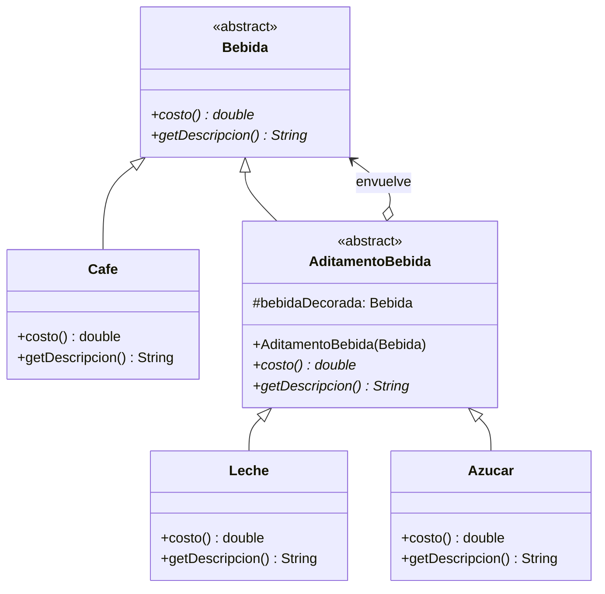
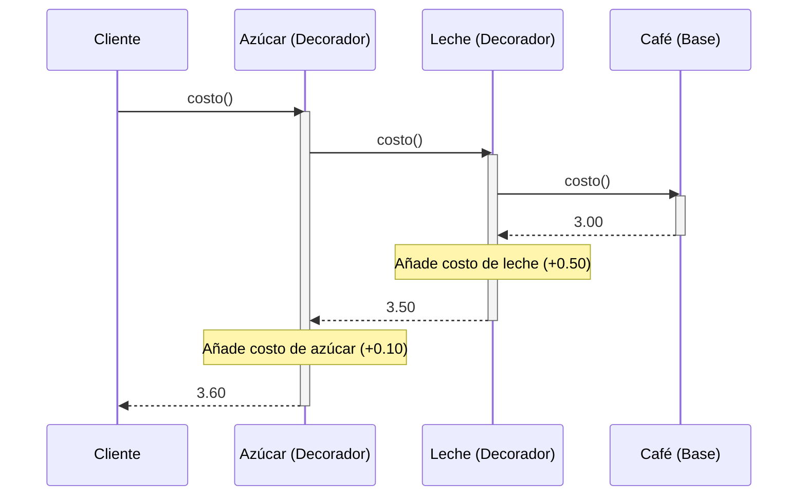

(patron-decorator)=
# Decorator

:::{note} Hoja de ruta del capítulo

**Objetivo.** Comprender las ideas centrales de **Decorator** y usarlas como base para el resto del recorrido.

**Prerrequisitos.** Conviene haber leído [el material inmediatamente anterior](composite.md) para llegar con el hilo de la parte fresco.

**Desarrollo.** El desarrollo del capítulo aparece en las secciones que siguen. Conviene recorrerlas en orden y volver al resumen antes de pasar al siguiente tema.
:::

## Definición

El patrón **Decorator** permite agregar responsabilidades a un objeto dinámicamente, proporcionando una alternativa flexible a la herencia para extender funcionalidad.

## Origen e Historia

Gang of Four 1994. Proviene de la necesidad de evitar "explosión de subclases" cuando se combinan múltiples características. Popularizado en frameworks de I/O (Java streams: BufferedInputStream, DataInputStream, etc).

## Motivación

Necesario cuando:
- Necesitas agregar responsabilidades dinámicamente
- Herencia sería explosiva (N características × M tipos = N×M clases)
- Combinar comportamientos en diferentes órdenes
- Cada decorador es responsabilidad única

## Contexto

**Patrón:** Componente base → Stack de decoradores

**Anatomía:**
- **Component**: Interfaz común
- **ConcreteComponent**: Objeto base
- **Decorator**: Encapsula Component, implementa interfaz igual
- Permite stacking: `new D1(new D2(new D3(component)))`

### Cuando aplica

✅ **Usa Decorator cuando:**
- Necesitas agregar funcionalidad dinámicamente
- Herencia sería explosiva
- Beneficio de responsabilidad única
- Ejemplos: I/O streams (BufferedInputStream), UI widgets

### Cuando no aplica

❌ **Evita cuando:**
- Solo una responsabilidad adicional (herencia es más simple)
- El orden no importa y es uno-a-uno (Proxy es mejor)

## Consecuencias de su uso

### Positivas

- **Flexibilidad**: Combinar comportamientos en runtime
- **Principio Open/Closed**: Abierto a extensión, cerrado a modificación
- **Alternativa a herencia**: Evita explosión de subclases
- **Responsabilidad única**: Cada decorador hace una cosa

### Negativas

- **Complejidad**: Stack de decoradores es difícil de entender
- **Debugging**: Difícil rastrear en debugger
- **Orden importa**: El orden de decoradores puede afectar resultado
- **Overhead**: Múltiples capas de indirección

## Alternativas

| Aspecto | Decorator | Proxy | Strategy |
|--------|-----------|-------|----------|
| **Intención** | Agregar responsabilidades | Controlar acceso | Encapsular algoritmo |
| **Composición** | Múltiple | Uno-a-uno | Intercambiable |
| **Timing** | Tiempo de objeto | Tiempo de objeto | Tiempo de uso |

## Estructura

### Problema

```java
// ❌ Explosión de subclases
abstract class Bebida {
    abstract double costo();
}

class Café extends Bebida {
    public double costo() { return 3.00; }
}

class CaféConLeche extends Café {
    public double costo() { return 3.00 + 0.50; }
}

class CaféConLecheYAzúcar extends CaféConLeche {
    public double costo() { return 3.00 + 0.50 + 0.10; }
}

// Cada combinación es una clase nueva!
```

### Solución

```java
/**
 * Componente base.
 */
public abstract class Bebida {
    protected String descripcion = "Bebida desconocida";
    
    public String getDescripcion() {
        return descripcion;
    }
    
    abstract double costo();
}

/**
 * Componente concreto: implementación simple.
 */
public class Café extends Bebida {
    public Café() {
        descripcion = "Café";
    }
    
    @Override
    public double costo() {
        return 3.00;
    }
}

/**
 * Clase Decorator base: también es Bebida.
 */
public abstract class AditamentoBebida extends Bebida {
    protected Bebida bebidaDecorada;
    
    public AditamentoBebida(Bebida bebida) {
        this.bebidaDecorada = bebida;
    }
    
    @Override
    public String getDescripcion() {
        return bebidaDecorada.getDescripcion();
    }
}

/**
 * Decorador concreto: Leche.
 */
public class Leche extends AditamentoBebida {
    public Leche(Bebida bebida) {
        super(bebida);
    }
    
    @Override
    public String getDescripcion() {
        return bebidaDecorada.getDescripcion() + ", leche";
    }
    
    @Override
    public double costo() {
        return bebidaDecorada.costo() + 0.50;
    }
}

/**
 * Decorador concreto: Azúcar.
 */
public class Azúcar extends AditamentoBebida {
    public Azúcar(Bebida bebida) {
        super(bebida);
    }
    
    @Override
    public String getDescripcion() {
        return bebidaDecorada.getDescripcion() + ", azúcar";
    }
    
    @Override
    public double costo() {
        return bebidaDecorada.costo() + 0.10;
    }
}

// ✅ Composición flexible
Bebida café = new Café();                              // 3.00
Bebida caféConLeche = new Leche(café);                 // 3.50
Bebida caféConLecheYAzúcar = new Azúcar(caféConLeche); // 3.60

System.out.println(caféConLecheYAzúcar.getDescripcion()); // Café, leche, azúcar
System.out.println("Costo: $" + caféConLecheYAzúcar.costo()); // 3.60
```

### Diagramas

**Diagrama de Clases**



**Diagrama de Secuencia**



## Ejemplos

### Ejemplo 1: Streams de Entrada

```java
public interface InputStream {
    int read();
    void close();
}

public class FileInputStream implements InputStream {
    @Override
    public int read() {
        System.out.println("Leyendo desde archivo");
        return 42;
    }
    
    @Override
    public void close() {
        System.out.println("Archivo cerrado");
    }
}

public abstract class StreamDecorator implements InputStream {
    protected InputStream stream;
    
    public StreamDecorator(InputStream stream) {
        this.stream = stream;
    }
}

public class BufferedStream extends StreamDecorator {
    private byte[] buffer = new byte[1024];
    
    public BufferedStream(InputStream stream) {
        super(stream);
    }
    
    @Override
    public int read() {
        System.out.println("[Buffered] Leyendo con buffer");
        return stream.read();
    }
    
    @Override
    public void close() {
        stream.close();
    }
}

public class CompressedStream extends StreamDecorator {
    public CompressedStream(InputStream stream) {
        super(stream);
    }
    
    @Override
    public int read() {
        System.out.println("[Comprimido] Descomprimiendo");
        return stream.read();
    }
    
    @Override
    public void close() {
        stream.close();
    }
}

// Uso
InputStream file = new FileInputStream();
InputStream buffered = new BufferedStream(file);
InputStream final_stream = new CompressedStream(buffered);

final_stream.read();  // Descomprimiendo -> Buffered -> archivo
```

## Ejercicios

```{exercise}
:label: ex-parte4-decorator-mini

Un servicio de envío de correos ya funciona, pero ahora hay que poder agregar validación, logging y reintentos de manera combinable. Proponé una solución con **Decorator** y explicá por qué herencia sola no escala bien.
```

## Resumen

El patrón **Decorator** es esencial para agregar comportamiento dinámicamente sin crear explosión de subclases. Su flexibilidad permite combinar múltiples características en tiempo de ejecución. Aunque introduce complejidad, su adherencia al principio Open/Closed y Single Responsibility lo hacen invaluable en arquitectura extensible.

## Próximo paso

Para seguir, conviene pasar a [el material siguiente](facade.md), donde el recorrido continúa sobre esta base.
