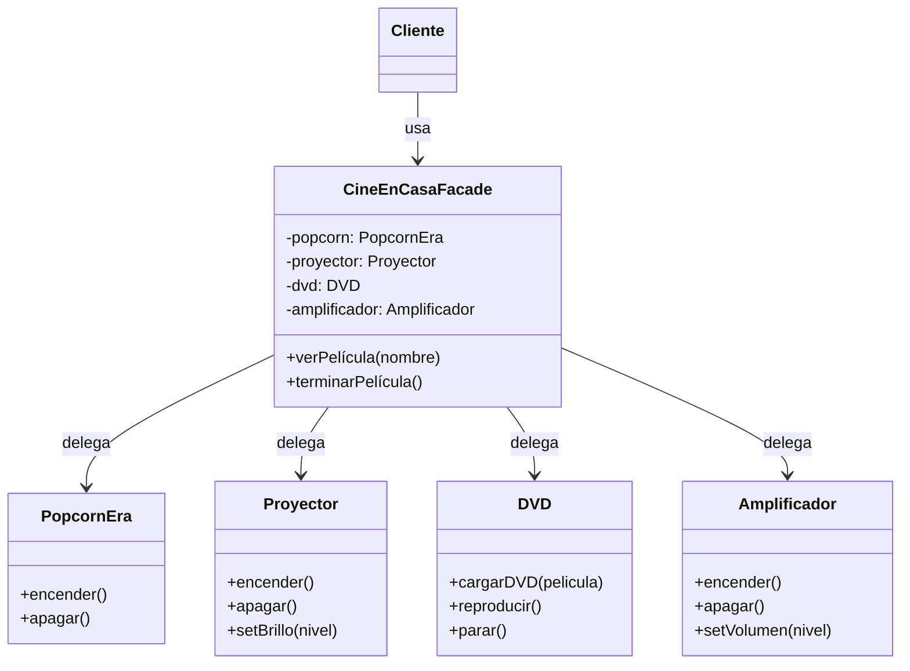
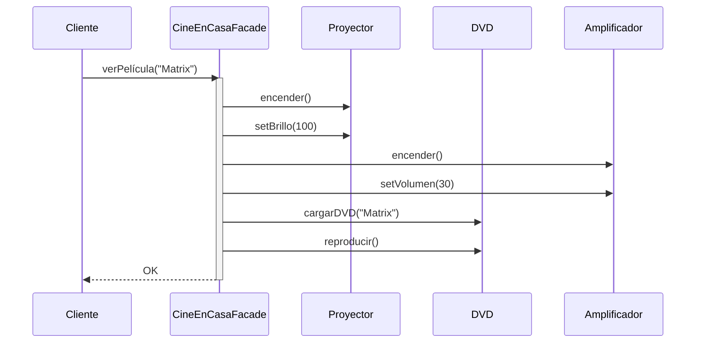

(patron-facade)=
# Facade

## Definición

El patrón **Facade** proporciona una interfaz unificada y simplificada a un conjunto de interfaces de un subsistema, facilitando su uso sin exponer complejidad interna.

## Origen e Historia

Gang of Four 1994. Surge de la necesidad de simplificar sistemas complejos. Popularizado en frameworks web (Rails, Spring): ActiveRecord, DataMapper, etc.

## Motivación

Necesario cuando:
- Subsistema es complejo con múltiples componentes
- Cliente solo quiere hacer operaciones simples
- Necesitas desacoplar cliente del subsistema
- Quieres punto de entrada único

## Contexto

**Patrón:** Cliente → Facade → [Subsistema interno]

**Anatomía:**
- **Facade**: Interfaz simplificada pública
- **Subsistema**: Clases complejas internas (generalmente private)
- Facade delega a componentes internos coordinadamente

### Cuando aplica

✅ **Usa Facade cuando:**
- Subsistema es complejo y difícil de usar
- Necesitas simplificar interfaz
- Quieres desacoplar cliente de subsistema
- Ejemplo: librerías complejas (Spring, Apache Commons)

### Cuando no aplica

❌ **Evita cuando:**
- Subsistema es simple
- Cliente necesita control detallado

## Consecuencias de su uso

### Positivas

- **Simplificación**: Cliente no ve complejidad interna
- **Desacoplamiento**: Cambios internos no afectan cliente
- **Punto de entrada único**: Fácil de mantener
- **Escalabilidad**: Agregar componentes sin afectar interfaz

### Negativas

- **Pérdida de control**: Cliente pierde flexibilidad
- **Dios Facade**: Facade puede crecer demasiado
- **Overhead**: Indirección adicional
- **Testing**: Más difícil testear componentes individuales

## Alternativas

| Patrón | Propósito | Diferencia |
| :--- | :--- | :--- |
| **Adapter** | Hacer compatibles interfaces | Integra existentes |
| **Decorator** | Agregar responsabilidades | Envuelve individual |
| **Proxy** | Controlar acceso | Uno-a-uno |

## Estructura

### Problema

```java
// ❌ Sin Facade: Cliente debe conocer muchas clases
class Cliente {
    void reproducirPelícula(String nombre) {
        PopcornEra era = new PopcornEra();
        era.encender();
        
        Proyector proyector = new Proyector();
        proyector.encender();
        proyector.setBrillo(100);
        
        DVD dvd = new DVD();
        dvd.cargarDVD(nombre);
        dvd.reproducir();
        
        // Demasiado acoplamiento!
    }
}
```

### Solución

```java
/**
 * Componentes del subsistema.
 */
public class PopcornEra {
    public void encender() { System.out.println("Máquina de palomitas encendida"); }
    public void apagar() { System.out.println("Máquina de palomitas apagada"); }
}

public class Proyector {
    public void encender() { System.out.println("Proyector encendido"); }
    public void apagar() { System.out.println("Proyector apagado"); }
    public void setBrillo(int nivel) { System.out.println("Brillo: " + nivel); }
}

public class DVD {
    public void cargarDVD(String película) { System.out.println("DVD cargado: " + película); }
    public void reproducir() { System.out.println("Reproduciendo..."); }
    public void parar() { System.out.println("DVD detenido"); }
}

public class Amplificador {
    public void encender() { System.out.println("Amplificador encendido"); }
    public void apagar() { System.out.println("Amplificador apagado"); }
    public void setVolumen(int nivel) { System.out.println("Volumen: " + nivel); }
}

/**
 * Facade: interfaz simplificada.
 */
public class CineEnCasaFacade {
    private PopcornEra popcorn;
    private Proyector proyector;
    private DVD dvd;
    private Amplificador amplificador;
    
    public CineEnCasaFacade() {
        this.popcorn = new PopcornEra();
        this.proyector = new Proyector();
        this.dvd = new DVD();
        this.amplificador = new Amplificador();
    }
    
    public void verPelícula(String nombre) {
        System.out.println("=== INICIANDO PELÍCULA ===");
        popcorn.encender();
        proyector.encender();
        proyector.setBrillo(100);
        amplificador.encender();
        amplificador.setVolumen(30);
        dvd.cargarDVD(nombre);
        dvd.reproducir();
        System.out.println("¡Que disfrutes!");
    }
    
    public void terminarPelícula() {
        System.out.println("=== FINALIZANDO ===");
        dvd.parar();
        proyector.apagar();
        amplificador.apagar();
        popcorn.apagar();
        System.out.println("Sistema de cine apagado");
    }
}

// ✅ Uso simplificado
CineEnCasaFacade cine = new CineEnCasaFacade();
cine.verPelícula("The Matrix");
// ... ver película ...
cine.terminarPelícula();
```

### Diagramas

**Diagrama de Clases**



**Diagrama de Secuencia**



## Ejemplos

### Ejemplo 1: Configuración de Base de Datos

```java
public class ConexionBD {
    public void conectar(String url) {
        System.out.println("Conectado a " + url);
    }
}

public class PoolConexiones {
    public void inicializar() {
        System.out.println("Pool inicializado");
    }
}

public class LoggerBD {
    public void registrar(String evento) {
        System.out.println("[LOG] " + evento);
    }
}

public class BaseDatosConfigFacade {
    private ConexionBD conexion = new ConexionBD();
    private PoolConexiones pool = new PoolConexiones();
    private LoggerBD logger = new LoggerBD();
    
    public void inicializar(String url) {
        logger.registrar("Iniciando configuración");
        pool.inicializar();
        conexion.conectar(url);
        logger.registrar("Configuración completada");
    }
}

// Uso
BaseDatosConfigFacade bdConfig = new BaseDatosConfigFacade();
bdConfig.inicializar("jdbc:mysql://localhost/midb");
```

## Mini ejercicio

```{exercise}
:label: ex-parte4-facade-mini

La inscripción a una materia requiere consultar correlativas, cupos, estado administrativo y generación de comprobante. Diseñá una **Facade** para ese subsistema e indicá qué complejidad le ocultás al cliente.
```

## Resumen

El patrón **Facade** es esencial para manejar subsistemas complejos. Al proporcionar una interfaz simplificada, reduce acoplamiento y mejora usabilidad. Aunque puede crecer excesivamente si no se controla, su beneficio en desacoplamiento y simplicidad lo hace fundamental en aplicaciones empresariales.
