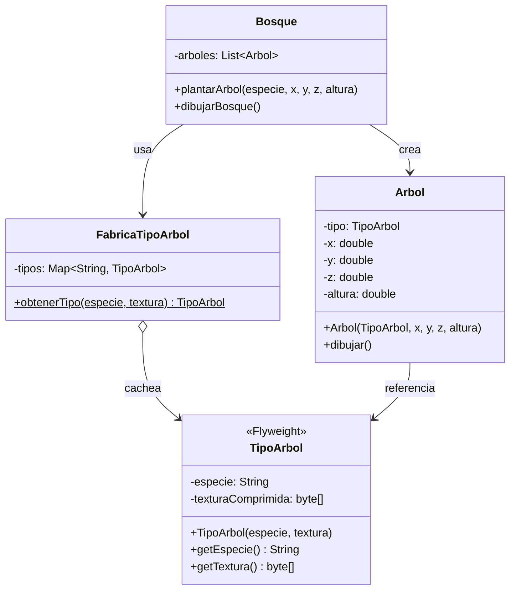
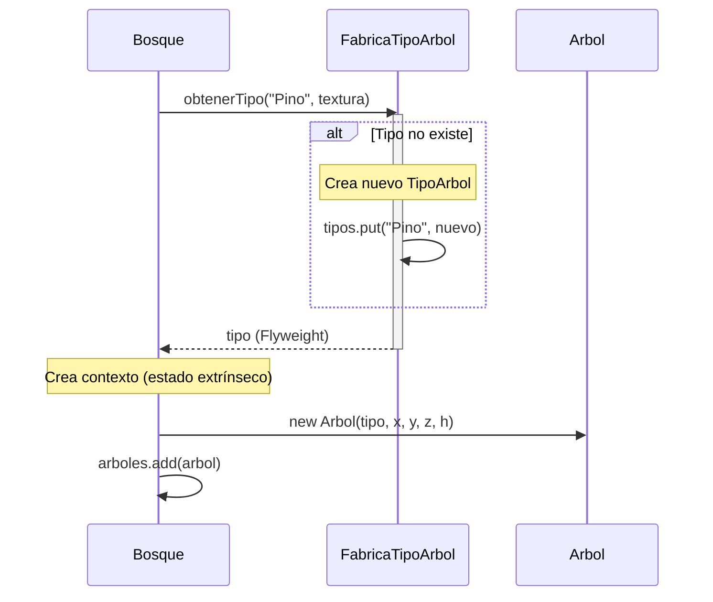

(patron-flyweight)=
# Flyweight

## Definición

El patrón **Flyweight** usa compartición para soportar grandes cantidades de objetos granulares eficientemente, separando estado intrínseco (compartido) del extrínseco (particular).

## Origen e Historia

Gang of Four 1994. Surge de optimización de memoria en juegos/gráficos. Inspirado en el concepto de "compartir" datos comunes. Popularizado en motores de videojuegos y editores de texto donde miles/millones de objetos similares requieren memoria mínima.

## Motivación

Necesario cuando:
- Millones de objetos similares consumirían demasiada memoria
- Muchos objetos tienen estado común reutilizable
- Crear nuevas instancias es costoso
- Trade-off: CPU + acceso extra por memoria

## Contexto

**Patrón:** Estado intrínseco (compartido) vs. extrínseco (particular)

**Anatomía:**
- **Flyweight**: Objeto inmutable compartible
- **Factory**: Crea/cachea flyweights
- **Cliente**: Referencia a flyweight + estado extrínseco
- Millones de referencias vs. una copia de flyweight

**Ejemplo:** 1M árboles = 1 flyweight de "Pino" + 1M referencias

### Cuando aplica

✅ **Ideal para:**
- Juegos (partículas, sprites)
- Editores de texto (caracteres)
- Navegadores web (bloques de caché)
- Sistemas de bases de datos (conexiones compartidas)

### Cuando no aplica

❌ **Evita cuando:**
- Pocos objetos (overhead no compensa)
- Estado muta frecuentemente
- Sincronización es prohibitiva

## Consecuencias de su uso

### Positivas

- **Economía de memoria**: Reducción dramática de memoria
- **Performance**: Menos asignaciones y garbage collection
- **Escalabilidad**: Soporta millones de objetos
- **Simplicidad**: Cliente no ve complejidad

### Negativas

- **Complejidad**: Separar estado es difícil
- **CPU vs. Memoria**: CPU extra en lookup de factory
- **Thread safety**: Necesita sincronización en factory
- **Debugging**: Difícil rastrear estado compartido

## Alternativas

| Patrón | Propósito | Diferencia |
| :--- | :--- | :--- |
| **Composite** | Componer en árbol | Estructura jerárquica |
| **Proxy** | Controlar acceso | Uno-a-uno |
| **Object Pool** | Reutilizar objetos | Patrón concurrencia |

## Estructura

### Problema

```java
// ❌ Millones de árboles: cada uno copia su forma y textura
class Árbol {
    private String especie;        // "Pino", "Roble" - repetido!
    private String textura;        // Datos de imagen - repetido!
    private double x, y, z;        // Posición única
    private double altura;         // Altura única
}

// 1 millón de árboles × 2MB cada uno = 2GB de memoria!
List<Árbol> bosque = new ArrayList<>();
for (int i = 0; i < 1_000_000; i++) {
    bosque.add(new Árbol("Pino", "textura.png", x, y, z, altura));
}
```

### Solución

```java
/**
 * Datos compartidos (Flyweight): estado intrínseco.
 */
public class TipoÁrbol {
    private final String especie;
    private final byte[] texturaComprimida;
    
    public TipoÁrbol(String especie, byte[] textura) {
        this.especie = especie;
        this.texturaComprimida = textura;
    }
    
    public String getEspecie() { return especie; }
    public byte[] getTextura() { return texturaComprimida; }
}

/**
 * Factory para compartir Flyweights.
 */
public class FábricaTipoÁrbol {
    private static final Map<String, TipoÁrbol> tipos = new HashMap<>();
    
    public static TipoÁrbol obtenerTipo(String especie, byte[] textura) {
        if (!tipos.containsKey(especie)) {
            tipos.put(especie, new TipoÁrbol(especie, textura));
        }
        return tipos.get(especie);
    }
}

/**
 * Árbol con estado extrínseco (posición, altura).
 */
public class Árbol {
    private TipoÁrbol tipo;     // Compartido (Flyweight)
    private double x, y, z;     // Extrínseco
    private double altura;      // Extrínseco
    
    public Árbol(TipoÁrbol tipo, double x, double y, double z, double altura) {
        this.tipo = tipo;
        this.x = x;
        this.y = y;
        this.z = z;
        this.altura = altura;
    }
    
    public void dibujar() {
        System.out.println("Dibujando " + tipo.getEspecie() + 
                         " en (" + x + "," + y + "," + z + "), altura: " + altura);
    }
}

/**
 * Bosque que reutiliza Flyweights.
 */
public class Bosque {
    private List<Árbol> árboles = new ArrayList<>();
    
    public void plantarÁrbol(String especie, double x, double y, double z, double altura) {
        TipoÁrbol tipo = FábricaTipoÁrbol.obtenerTipo(especie, obtenerTextura(especie));
        Árbol árbol = new Árbol(tipo, x, y, z, altura);
        árboles.add(árbol);
    }
    
    public void dibujarBosque() {
        for (Árbol árbol : árboles) {
            árbol.dibujar();
        }
    }
    
    private byte[] obtenerTextura(String especie) {
        return new byte[1024 * 10]; // 10 KB por tipo (compartido)
    }
}

// ✅ Uso eficiente
Bosque bosque = new Bosque();
for (int i = 0; i < 1_000_000; i++) {
    bosque.plantarÁrbol("Pino", Math.random() * 1000, Math.random() * 1000, 0, 20);
}
bosque.dibujarBosque();
```

### Diagramas

**Diagrama de Clases**



**Diagrama de Secuencia**



## Ejemplos

### Ejemplo 1: Editor de Texto (Caracteres)

```java
public class Carácter {
    private final char valor;
    private final String fuente;
    private final int tamaño;
    
    public Carácter(char valor, String fuente, int tamaño) {
        this.valor = valor;
        this.fuente = fuente;
        this.tamaño = tamaño;
    }
    
    public void renderizar(int x, int y) {
        System.out.println("Renderizando '" + valor + "' en (" + x + "," + y + 
                         ") con " + fuente);
    }
}

public class FábricaCarácter {
    private static final Map<Character, Carácter> caracteres = new HashMap<>();
    
    public static Carácter obtener(char valor) {
        if (!caracteres.containsKey(valor)) {
            caracteres.put(valor, new Carácter(valor, "Arial", 12));
        }
        return caracteres.get(valor);
    }
}

public class Documento {
    private List<Carácter> contenido = new ArrayList<>();
    
    public void agregarCarácter(char c) {
        contenido.add(FábricaCarácter.obtener(c));
    }
    
    public void mostrar() {
        int x = 0;
        for (Carácter c : contenido) {
            c.renderizar(x++, 0);
        }
    }
}

// Uso: 1M caracteres pero solo 256 Flyweights máximo
Documento doc = new Documento();
doc.agregarCarácter('H');
doc.agregarCarácter('o');
doc.agregarCarácter('l');
doc.agregarCarácter('a');
doc.mostrar();
```

## Mini ejercicio

```{exercise}
:label: ex-parte4-flyweight-mini

Un editor de mapas representa miles de árboles iguales que solo cambian de posición y tamaño. Explicá qué estado harías compartido y cuál extrínseco si aplicás **Flyweight**.
```

## Resumen

El patrón **Flyweight** es crítico para aplicaciones que manejan cantidades masivas de objetos similares. Al separar estado compartible del estado particular, logra reducir dramáticamente el consumo de memoria. Su uso requiere cuidadosa identificación de estado intrínseco vs. extrínseco, pero el ahorro resultante es significativo en sistemas a gran escala.
