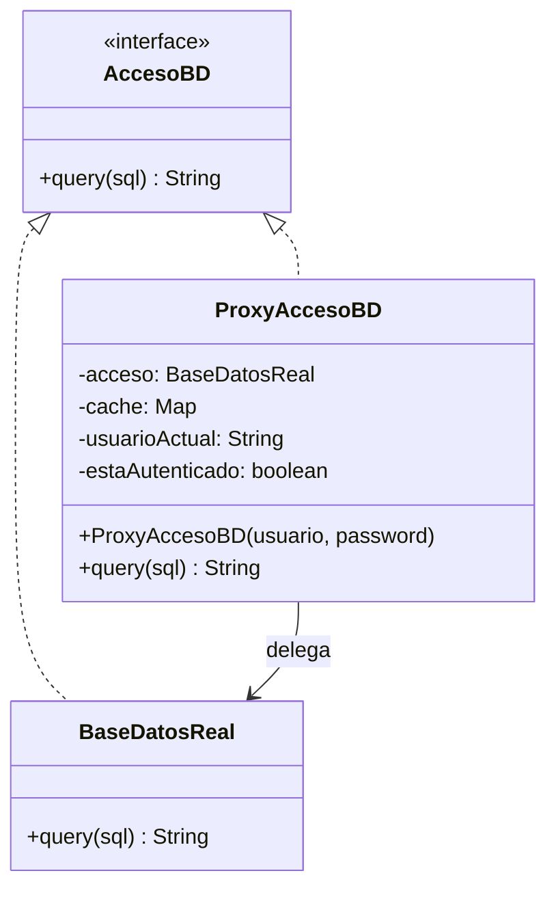
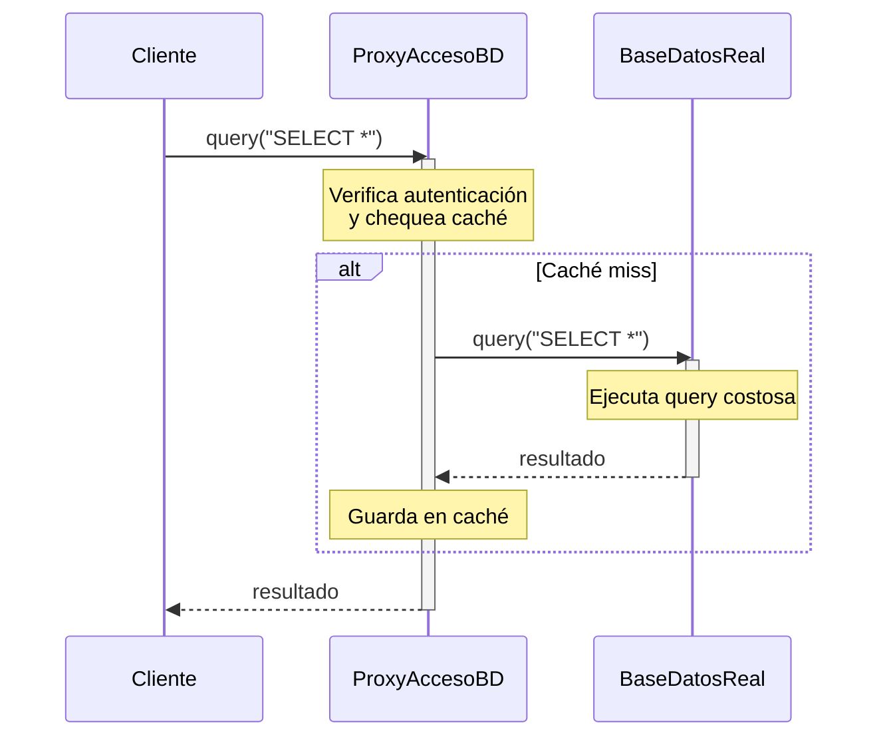

(patron-proxy)=
# Proxy

## Definición

El patrón **Proxy** proporciona un sustituto (proxy) para otro objeto para controlar su acceso, permitiendo operaciones adicionales antes/después de acceder al objeto real.

## Origen e Historia

Gang of Four 1994. Surge de sistemas distribuidos: necesidad de interceder antes de acceder a objetos remotos. Popularizado en RPC, ORM (Hibernate), y frameworks web.

## Motivación

Necesario cuando:
- Necesitas control sobre acceso a objeto (autorización)
- Objeto es costoso (remoto, BD, archivo grande)
- Necesitas ejecutar lógica pre/post-acceso
- Lazy loading: crear cuando se necesita
- Ejemplo: proxy remoto = RPC, proxy de caché = BD

## Contexto

**Patrón:** Cliente → Proxy → RealSubject

**Anatomía:**
- **Subject**: Interfaz común
- **RealSubject**: Objeto real (costoso/protegido)
- **Proxy**: Intercede, mantiene referencia a RealSubject
- Proxy y Real tienen misma interfaz

**Tipos:**
- Proxy virtual: lazy loading
- Proxy remoto: llamada a servicio remoto
- Proxy protector: autorización

### Cuando aplica

✅ **Usa Proxy cuando:**
- Necesitas controlar acceso al objeto real
- Lazy loading es importante
- Auditoria o logging es necesario
- Ejemplos: Conexiones BD, APIs remotas, imágenes grandes

### Cuando no aplica

❌ **Evita cuando:**
- El objeto es simple y rápido
- El control de acceso es innecesario

## Consecuencias de su uso

### Positivas

- **Control**: Autorización, autenticación
- **Performance**: Caché, lazy loading
- **Auditoría**: Registrar accesos
- **Protección**: El cliente no accede directo

### Negativas

- **Complejidad**: Indirección adicional
- **Performance**: Overhead del proxy
- **Confusión**: Similar a Decorator
- **Sincronización**: Thread safety en caché

## Alternativas

| Aspecto | Proxy | Decorator | Facade |
|--------|-------|-----------|--------|
| **Intención** | Controlar acceso | Agregar responsabilidades | Simplificar |
| **Creación** | Proxy crea real | Cliente inyecta | Internos |
| **Relación** | Uno-a-uno | Múltiple | Coordinación |

## Estructura

### Problema

```java
// ❌ Sin Proxy: cliente directo a recurso costoso
class BaseDatos {
    public String query(String sql) {
        System.out.println("Ejecutando: " + sql);
        return "Resultado";
    }
}

// Cada cliente puede ejecutar cualquier query
// Sin control, caché, o auditoría
BaseDatos db = new BaseDatos();
db.query("DELETE FROM usuarios"); // ¡Peligroso!
```

### Solución

```java
/**
 * Sujeto: interfaz común.
 */
public interface AccesoBD {
    String query(String sql);
}

/**
 * Sujeto real: operación costosa.
 */
public class BaseDatosReal implements AccesoBD {
    @Override
    public String query(String sql) {
        System.out.println("[BD] Ejecutando: " + sql);
        try { Thread.sleep(1000); } catch (InterruptedException e) {}
        return "Resultado de: " + sql;
    }
}

/**
 * Proxy: añade autenticación, caché y logging.
 */
public class ProxyAccesoBD implements AccesoBD {
    private AccesoBDReal acceso;
    private Map<String, String> caché = new HashMap<>();
    private String usuarioActual;
    private boolean estaAutenticado = false;
    
    public ProxyAccesoBD(String usuario, String contraseña) {
        if ("admin".equals(usuario) && "123".equals(contraseña)) {
            this.usuarioActual = usuario;
            this.estaAutenticado = true;
            this.acceso = new BaseDatosReal();
            System.out.println("[PROXY] Usuario " + usuario + " autenticado");
        } else {
            System.out.println("[PROXY] ¡Acceso denegado!");
        }
    }
    
    @Override
    public String query(String sql) {
        if (!estaAutenticado) {
            throw new SecurityException("No autenticado");
        }
        
        // Verificar si es operación permitida
        if (sql.toUpperCase().contains("DELETE") || sql.toUpperCase().contains("DROP")) {
            throw new SecurityException("Operación no permitida: " + sql);
        }
        
        // Verificar caché
        if (caché.containsKey(sql)) {
            System.out.println("[PROXY] Retornando resultado en caché");
            return caché.get(sql);
        }
        
        // Registrar acceso
        System.out.println("[PROXY] Usuario " + usuarioActual + " ejecutando query");
        
        // Delegar al objeto real
        String resultado = acceso.query(sql);
        
        // Almacenar en caché
        caché.put(sql, resultado);
        
        return resultado;
    }
}

// ✅ Uso controlado
ProxyAccesoBD proxy = new ProxyAccesoBD("admin", "123");

// Exitoso
System.out.println(proxy.query("SELECT * FROM usuarios"));
System.out.println(proxy.query("SELECT * FROM usuarios")); // Del caché

// Rechazado
try {
    proxy.query("DELETE FROM usuarios");
} catch (SecurityException e) {
    System.out.println("[ERROR] " + e.getMessage());
}
```

### Diagramas

**Diagrama de Clases**



**Diagrama de Secuencia**



## Ejemplos

### Ejemplo 1: Lazy Loading de Imagen

```java
public interface Imagen {
    void mostrar();
}

public class ImagenReal implements Imagen {
    private String archivo;
    
    public ImagenReal(String archivo) {
        cargarImagen(archivo);
        this.archivo = archivo;
    }
    
    private void cargarImagen(String archivo) {
        System.out.println("[BD] Cargando imagen " + archivo);
        try { Thread.sleep(2000); } catch (InterruptedException e) {}
    }
    
    @Override
    public void mostrar() {
        System.out.println("Mostrando: " + archivo);
    }
}

public class ProxyImagen implements Imagen {
    private String archivo;
    private ImagenReal imagenReal;
    
    public ProxyImagen(String archivo) {
        this.archivo = archivo;
    }
    
    @Override
    public void mostrar() {
        if (imagenReal == null) {
            System.out.println("[PROXY] Cargando imagen por primera vez...");
            imagenReal = new ImagenReal(archivo);
        }
        imagenReal.mostrar();
    }
}

// Uso: Imagen no se carga hasta que se llama mostrar()
Imagen img = new ProxyImagen("grande.jpg");
System.out.println("Imagen creada");  // Sin cargar
img.mostrar();  // Aquí se carga
img.mostrar();  // Ya está en caché
```

### Variantes

**Proxy Remoto (RPC):**
```java
public class ProxyServidor implements ServicioRemoto {
    private String url;
    
    @Override
    public String llamada(String param) {
        System.out.println("[PROXY] Conectando a " + url);
        // ... ejecutar RPC ...
        return "Respuesta del servidor";
    }
}
```

## Resumen

El patrón **Proxy** es fundamental para controlar acceso a objetos costosos o protegidos. Su versatilidad permite múltiples variantes (virtual, remoto, protector) adaptándose a diferentes necesidades. Aunque introduce indirección, sus beneficios en seguridad, performance y auditoría lo hacen indispensable en arquitecturas empresariales.
