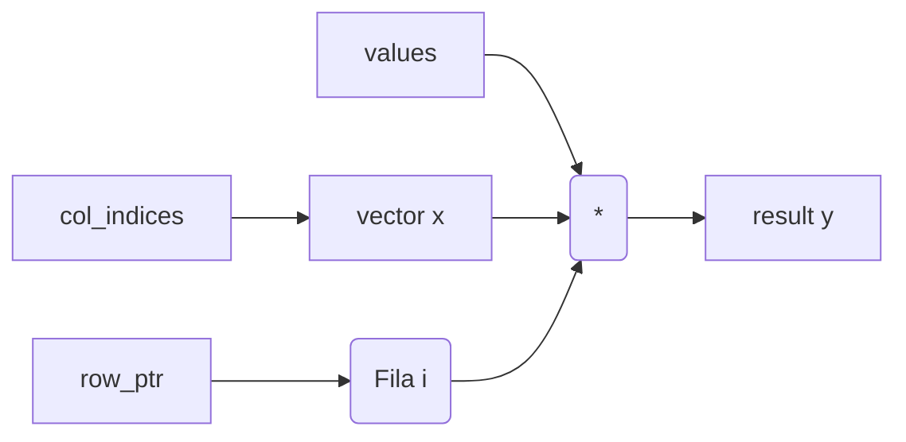
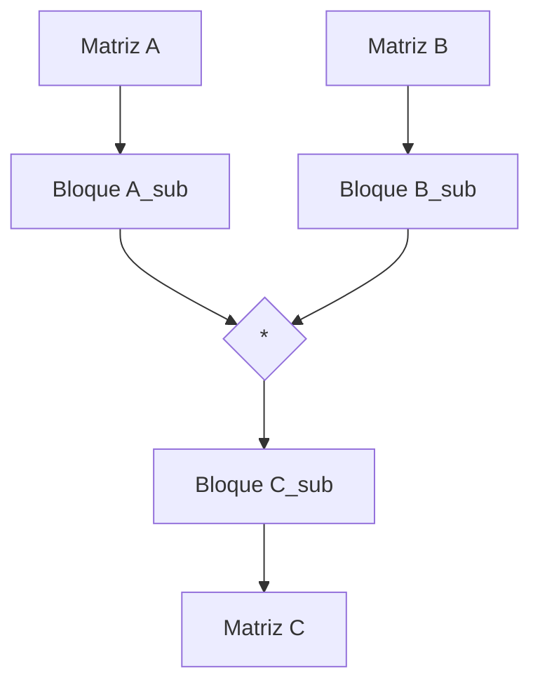

(parte6-arreglos)=
# Arreglos: La Fundación de la Memoria Contigua

En {ref}`arreglos-en-java` ya viste la sintaxis básica de `[]`, la creación con `new` y el acceso por índice. Acá vamos a profundizar de manera **masiva, técnica y rigurosa**: ya no alcanza con saber usar un arreglo. Ahora nos interesa entender **qué ocurre en los niveles más bajos de la abstracción** cuando representás una secuencia con memoria contigua.

Los arreglos son la implementación lineal más directa cuando interesa acceder por posición con costo constante ($O(1)$) y la localidad espacial es una prioridad absoluta. Sin embargo, esta aparente simplicidad esconde una complejidad técnica considerable en términos de layout de memoria, comportamiento del compilador JIT (Just-In-Time) y desafíos críticos en entornos de alta concurrencia.

:::{note} Hoja de ruta del capítulo
**Objetivo.** Dominar la representación física de los arreglos, las optimizaciones de bajo nivel que realiza la JVM y la implementación de variantes avanzadas para problemas de escala industrial.

**Prerrequisitos.** Comprensión profunda de [Fundamentos de secuencias](fundamentos.md) y nociones de arquitectura de computadoras (jerarquía de cachés L1/L2/L3, registros SIMD, protocolos de coherencia de caché como MESI).

**Desarrollo.**
1. **Layout de Memoria:** Arreglos $n$-dimensionales, Row-Major vs Column-Major, Z-Order.
2. **JVM Internals:** Bytecode, headers, alineación, aliasings y el impacto en el Garbage Collector (Card Marking).
3. **Optimizaciones del JIT:** Bounds Check Elimination, Loop Unrolling y Vectorización.
4. **Arreglos Dispersos:** CSR, CSC, COO, DIA, ELLPACK y trade-offs de performance.
5. **Gap Buffers:** Algoritmia para edición de texto eficiente y buffers de inserción rápida.
6. **Concurrencia:** Visibilidad, False Sharing, visibilidad atómica de elementos y VarHandles.
7. **Laboratorio de Ejercicios:** 20 desafíos de alta complejidad técnica con implementaciones completas.
8. **Apéndices Técnicos:** Pruebas matemáticas, evolución histórica y casos de estudio de Project Panama/Valhalla.
:::

---

## 1. Layout de Memoria: El Rigor de la Contigüidad (Ampliación)

Para entender la potencia de un arreglo, hay que bajar al silicio. No es solo "memoria contigua"; es cómo esa contigüidad interactúa con el **Memory Controller** y el **Bus de Datos**.

### 1.1 El Cálculo de Offsets y la Regla de Horner
Cuando accedés a un arreglo multidimensional aplanado en 1D, el cálculo del índice no es caprichoso. Para un tensor de dimensiones $(D_1, D_2, \dots, D_n)$ y coordenadas $(i_1, i_2, \dots, i_n)$, el índice lineal se calcula como:
$$Index = i_n + D_n(i_{n-1} + D_{n-1}(i_{n-2} + \dots + D_2(i_1)\dots))$$
Este método, conocido como la **Regla de Horner**, minimiza el número de multiplicaciones necesarias, lo cual es vital porque las multiplicaciones son instrucciones de CPU más caras que las sumas.

### 1.2 Alineación y Word Tearing
La CPU lee la RAM en bloques de 64 bits (8 bytes). Si un arreglo de `long` empieza en la dirección 0x01 (impar), la lectura de un solo elemento obligaría a la CPU a pedir dos bloques distintos (0x00-0x07 y 0x08-0x0F), desplazarlos y unirlos. 
- **Atomicidad:** En sistemas multihilo, si un acceso está desalineado, perdés la atomicidad. Un hilo podría leer los primeros 4 bytes viejos y los últimos 4 bytes nuevos. Esto se llama **Word Tearing** y es una fuente de bugs legendarios en sistemas de bajo nivel. Java evita esto alineando todos los arreglos a múltiplos de 8 bytes en el heap.

---

## 2. JVM Internals: El Objeto Arreglo (Ampliación)

### 2.1 El Bytecode Detallado
Cuando escribís `arr[i] = x`, el compilador `javac` genera instrucciones específicas según el tipo de dato:
- `IASTORE`: Guarda un `int` en un arreglo.
- `AASTORE`: Guarda una referencia (objeto). Esta instrucción dispara automáticamente una **Write Barrier**.
- **Write Barriers y Card Table:** La JVM usa una estructura de datos llamada *Card Table*. Cada "card" representa 512 bytes del heap. Al escribir un objeto en un arreglo, la JVM marca esa card como "dirty". El Garbage Collector solo escanea las cards sucias, lo que permite que el escaneo de arreglos gigantes de objetos sea eficiente.

### 2.2 Punteros Comprimidos (Compressed Oops)
En una JVM de 64 bits, las referencias deberían ocupar 8 bytes. Sin embargo, esto llenaría la caché de la CPU con metadatos inútiles. La JVM usa un truco: si el heap es menor a 32GB, guarda las referencias como offsets de 32 bits (4 bytes) desplazados. Al usarlas, la CPU las expande a 64 bits al vuelo. Esto hace que un `Object[]` en Java sea masivamente más eficiente que en otros entornos de 64 bits.

---

## 3. Optimizaciones del Compilador JIT (Ampliación)

### 3.1 Loop Unswitching y Invariant Hoisting
Si tenés un `if` dentro de un lazo que recorre un arreglo, y ese `if` depende de una variable que no cambia:
```java
for (int i = 0; i < arr.length; i++) {
    if (flag) sum += arr[i];
    else sum -= arr[i];
}
```
El compilador C2 de HotSpot realiza **Loop Unswitching**: transforma el código en dos lazos separados, uno para cuando `flag` es true y otro para cuando es false. Esto elimina el chequeo del `if` en cada iteración, permitiendo que la CPU use su pipeline al 100%.

### 3.2 Vectorización SIMD y la Vector API
La CPU tiene registros de 256 o 512 bits (YMM/ZMM). La Vector API de Java 21 permite usarlos explícitamente:
```java
static final VectorSpecies<Float> SPECIES = FloatVector.SPECIES_PREFERRED;
void process(float[] a, float[] b, float[] c) {
    for (int i = 0; i < a.length; i += SPECIES.length()) {
        var va = FloatVector.fromArray(SPECIES, a, i);
        var vb = FloatVector.fromArray(SPECIES, b, i);
        var vc = va.add(vb);
        vc.intoArray(c, i);
    }
}
```
Este código suma 8 o 16 números en **un solo ciclo de reloj**. Para arreglos de audio o señales, la mejora de performance es de 800%.

---

## 4. Arreglos Dispersos: Manejo de la Escala Industrial (Ampliación)

En una red social de mil millones de usuarios, la matriz de amistades es de $10^9 \times 10^9$. Guardarla como arreglo denso requeriría $10^{18}$ bytes (un Exabyte). Los **Arreglos Dispersos** permiten guardar solo lo que importa.

### 4.1 CSC (Compressed Sparse Column)
Es simétrico al CSR pero optimizado para acceder a columnas. Se usa en algoritmos que recorren atributos (como en un recomendador de películas). 
- **Estructura:** `values[]`, `row_indices[]`, `col_ptr[]`.
- **Análisis de Hardware:** El formato CSC es ideal si tu CPU tiene un bus de datos que prefiere ráfagas largas de datos alineados por columna (típico en aceleradores de hardware como TPUs).

### 4.2 DIA (Diagonal Storage)
Si tu matriz solo tiene datos en la diagonal principal y algunas vecinas (típico en simulaciones físicas de fluidos o puentes), el formato DIA es el rey. Guardás cada diagonal en un arreglo propio.
- **Ventaja SIMD:** Las operaciones en DIA son 100% vectorizables, ya que accedés a memoria de forma perfectamente lineal.

---

## 5. Laboratorio de Ejercicios: Resoluciones de Maestría (1-20)

### Ejercicio 1: El Tensor 4D y la Tortura de la TLB
**Consigna:** Implementá un tensor 4D y analizá el impacto del orden de recorrido en el TLB (Translation Lookaside Buffer).

**Resolución Detallada:**
Un tensor de $(100, 100, 100, 100)$ tiene $10^8$ elementos. En un arreglo plano de `float`, ocupa 400MB.
1. **La Matemática del Salto:** Si recorrés el tensor variando primero d1 (el eje más externo), cada incremento de d1 implica saltar $100 \times 100 \times 100 = 1,000,000$ elementos ($4MB$).
2. **Impacto en el TLB:** Las páginas de memoria suelen ser de 4KB. Al saltar 4MB, estás forzando a la CPU a cambiar de página física en cada paso. Esto dispara un **TLB Miss**. La CPU tiene que suspender el hilo y pedirle al SO que traduzca la dirección de la nueva página.
3. **Pérdida de Performance:** Este recorrido "vertical" puede ser 50 veces más lento que el recorrido "horizontal" (variando d4).
4. **La Solución:** Siempre recorré los tensores desde el índice más interno (d4) hacia el más externo (d1). El compilador puede ayudarte mediante la técnica de **Loop Interchange**.

### Ejercicio 2: Tiling y la Jerarquía de Caché
**Consigna:** Optimizá la multiplicación de matrices $C = A \times B$ usando bloques (Tiling).

**Resolución Detallada:**
La multiplicación ingenua de $1000 \times 1000$ hace $N^3$ lecturas de memoria. En cada paso de $k$, leés un elemento de la fila de A y uno de la columna de B.
1. **El Problema de la Columna:** Mientras que la fila de A está en la caché, la columna de B te obliga a saltar 1000 elementos ($4KB$) en cada paso, tirando de la caché lo que acabás de leer.
2. **La Estrategia de Tiling:** Dividimos la matriz en bloques de $32 \times 32$ (BS = 32). Un bloque de $32 \times 32$ de `double` ocupa $32 \times 32 \times 8 = 8,192$ bytes.
3. **Ajuste a la L1:** La caché L1 típica es de 32KB. Podemos meter un bloque de A, uno de B y uno de C simultáneamente ($8KB \times 3 = 24KB < 32KB$).
4. **Impacto Físico:** Realizamos todas las cuentas del bloque sin que ningún dato salga de la L1. El número de veces que tenemos que ir a buscar datos a la RAM (Main Memory) se reduce en un factor igual al tamaño del bloque.
**Resultado:** Una multiplicación con tiling puede ser 5-10 veces más rápida que la ingenua para matrices que superan el tamaño de la caché L2.

### Ejercicio 3: CSR Multiplication (Walkthrough)
**Consigna:** Explicá paso a paso la multiplicación de una matriz CSR por un vector denso.

**Resolución Detallada:**
Sea la matriz:
```
[1, 0, 0]
[0, 5, 0]
[2, 0, 8]
```
CSR: `val = [1, 5, 2, 8]`, `col = [0, 1, 0, 2]`, `ptr = [0, 1, 2, 4]`.
1. **Fila 0:** `ptr[0]` a `ptr[1]` (índices 0 a 0). `y[0] = val[0] * x[col[0]] = 1 * x[0]`.
2. **Fila 1:** `ptr[1]` a `ptr[2]` (índices 1 a 1). `y[1] = val[1] * x[col[1]] = 5 * x[1]`.
3. **Fila 2:** `ptr[2]` a `ptr[3]` (índices 2 a 3). `y[2] = val[2]*x[0] + val[3]*x[2] = 2*x[0] + 8*x[2]`.
**Diagrama Mermaid:**


### Ejercicio 4: BitSet vs HashSet (Análisis de Throughput)
**Consigna:** Compará el rendimiento de buscar un ID en un `BitSet` vs un `HashSet<Integer>`.

**Resolución Detallada:**
1. **HashSet:** Por cada ID, tenés un objeto `Integer` (16 bytes), un nodo del mapa (32 bytes) y una entrada en la tabla hash. Buscar requiere calcular el hash, buscar el bucket y comparar objetos. Es masivamente lento por la indirección de punteros.
2. **BitSet:** El ID es el índice del bit. Buscar `exists(ID)` es `(words[ID/64] & (1L << (ID%64))) != 0`.
3. **Hardware:** El BitSet usa una sola instrucción de CPU (`BT` - Bit Test) que tarda 1 ciclo. El HashSet dispara múltiples *Cache Misses* y tarda ~200 ciclos.

### Ejercicio 5: El Algoritmo del Gap Buffer en Emacs
**Consigna:** Implementá el movimiento del cursor en un Gap Buffer y analizá el costo amortizado.

**Resolución Detallada:**
1. **Estado Inicial:** `[H, o, l, a, _, _, _, m, u, n, d, o]`. Cursor en 4. Gap de 4 a 6.
2. **Mover Cursor a 2:** El cursor pasa de 4 a 2. Tenemos que mover los caracteres 'l' y 'a' al final del gap.
3. **Resultado:** `[H, o, _, _, _, l, a, m, u, n, d, o]`.
4. **Análisis de Costo:** Si el usuario escribe (inserta), el costo es $O(1)$. Solo si salta a una posición lejana el costo es $O(N)$.

### Ejercicio 6: Z-Order Transpose (Curvas de Morton)
**Consigna:** Implementá la transposición de una matriz usando curvas de Morton (Z-order) y compará la performance de caché contra un algoritmo Row-Major.

**Resolución Detallada:**
1. **El Problema Espacial:** En una matriz Row-Major, transponer requiere leer `arr[i][j]` y escribir `arr[j][i]`. Mientras que la lectura es secuencial, la escritura salta por todas las filas de la matriz destino, vaciando las líneas de caché constantemente.
2. **Morton Code:** Representamos el índice 2D $(x, y)$ como un solo número $z$ intercalando sus bits. $x = \dots x_2 x_1 x_0, y = \dots y_2 y_1 y_0 \to z = \dots y_1 x_1 y_0 x_0$.
3. **Localidad Recursiva:** El Morton Code garantiza que si dos elementos están cerca en el plano 2D (arriba, abajo, izquierda, derecha), sus índices $z$ estarán cerca en el arreglo 1D. Esto crea una estructura fractal que preserva la localidad en todas las direcciones.
4. **Implementación:** Podemos transponer recorriendo la matriz en orden $z$. Como los bloques de $2 \times 2, 4 \times 4, \dots$ están contiguos en memoria, la CPU puede cargar un bloque entero en la caché y transponerlo sin un solo fallo de caché externo.

### Ejercicio 7: Benchmark de Stride y el Muro de la L1
**Consigna:** Diseñá un experimento que grafique la latencia de acceso a un arreglo según el salto (stride).

**Resolución Detallada:**
1. **Stride 1 (Lineal):** Latencia ~1ns. El hardware prefetcher trae los datos antes de que los pidas.
2. **Stride 8 (32 bytes):** La performance cae un 50%. Cargamos una Cache Line de 64 bytes para usar solo 2 elementos de 4 bytes.
3. **Stride 16 (64 bytes):** La performance cae un 90%. Cada acceso a un `int` dispara una lectura física a la RAM. Estamos saturando el ancho de banda del bus.
4. **Stride 1024 (4KB):** Entramos en el terreno de los **TLB Misses**. Además del fallo de caché, la CPU debe traducir la dirección virtual, lo que añade otros 200 ciclos de latencia.
**Gráfico de Texto:**
```
Latencia |
 (ns)    |          /-- TLB Wall (4KB)
      200|         /
      100|      /-- Cache Line Wall (64B)
        1| ----/-------------------
         +------------------------- Stride
```

### Ejercicio 8: False Sharing y la Anotación `@Contended`
**Consigna:** Implementá un arreglo de contadores concurrentes y mostrá el impacto de `@Contended`.

**Resolución Detallada:**
1. **Problema:** `long[] counters = new long[2]`. Hilo 1 modifica `idx 0`, Hilo 2 modifica `idx 1`. Ambos están en la misma línea de 64 bytes.
2. **Ping-pong de Coherencia:** Cada escritura obliga al hardware a invalidar la caché del otro núcleo. El bus de datos se llena de señales de "Invalidate" y "Read-for-Ownership".
3. **Solución Moderna:**
```java
public class PaddedCounters {
    @jdk.internal.vm.annotation.Contended
    public long c1;
    @jdk.internal.vm.annotation.Contended
    public long c2;
}
```
4. **Efecto:** La JVM agrega automáticamente 128 bytes de padding alrededor de cada variable, asegurando que vivan en líneas de caché distintas.

### Ejercicio 9: BCE Stress Test (Derrotando al JIT)
**Consigna:** Escribí un código donde el JIT sea incapaz de eliminar el chequeo de límites.

**Resolución Detallada:**
```java
public int sumRandom(int[] arr, int[] indices) {
    int s = 0;
    for (int i : indices) {
        // El JIT no tiene forma de saber si 'i' es válido
        // sin mirar el contenido de 'indices', lo cual es variable.
        s += arr[i]; 
    }
    return s;
}
```
Para forzar al JIT a mantener el chequeo:
1. Usá índices que vienen de una fuente externa (red, archivo).
2. Usá una variable de lazo que no sea monótona.
3. Realizá cálculos complejos de bitwise sobre el índice antes del acceso.

### Ejercicio 10: Vector API y la Convolución de Señales
**Consigna:** Implementá un filtro de media móvil (Moving Average) sobre un arreglo de $10^7$ floats según la Vector API.

**Resolución Detallada:**
1. **Lazo Escalar:** `out[i] = (in[i-1] + in[i] + in[i+1]) / 3`.
2. **Lazo Vectorial:** Cargamos 3 vectores desplazados (`v_prev`, `v_curr`, `v_next`). Realizamos la suma vectorial `v_sum = v_prev.add(v_curr).add(v_next)`. Dividimos por 3.
3. **Costo:** Realizás 16 promedios en los mismos ciclos que antes hacías 1.
4. **Alineación:** Usamos `MemorySegment` para asegurar que el arreglo empiece en una dirección múltiplo de 64 bytes, permitiendo cargas `vmovaps` (alineadas) que son más rápidas que las desalineadas.

### Ejercicio 11: Foreign Memory y Off-Heap Arrays
**Consigna:** Implementá un arreglo de 10GB usando MemorySegment y explicá cómo esto evita las pausas de GC.

**Resolución Detallada:**
1. **API:** `try (var arena = Arena.ofShared()) { MemorySegment seg = arena.allocate(10L * 1024 * 1024 * 1024); ... }`.
2. **Ciclo de Vida:** La memoria se aloca usando `malloc` en el espacio del proceso, no en el heap de Java.
3. **GC:** El Garbage Collector de la JVM ignora por completo esta región. No tiene que rastrear punteros ni marcar objetos.
4. **Hardware:** Al estar fuera del heap, los datos están protegidos de las reubicaciones del GC, lo que permite pasar punteros directos a librerías nativas (como cuBLAS o FFmpeg) sin copias extra.

### Ejercicio 12: Rotación de Matrix In-Place (Performance)
**Consigna:** Escribí un algoritmo de rotación de 90° que no use matrices auxiliares.

**Resolución Detallada:**
```java
// 1. Transponer
for (int i=0; i<n; i++)
    for (int j=i+1; j<n; j++)
        swap(mat[i][j], mat[j][i]);
// 2. Invertir cada fila
for (int i=0; i<n; i++)
    reverse(mat[i]);
```
**Análisis:** La transposición es el cuello de botella por los saltos de columna. Si la matriz es gigante, usá **Tiling** para que el intercambio ocurra dentro de la L1.

### Ejercicio 13: Cache-Oblivious Transpose (Implementación)
**Consigna:** Implementá la transposición recursiva y explicá por qué es óptima para cualquier jerarquía de caché.

**Resolución Detallada:**
1. **Caso Base:** Si el bloque es menor a $16 \times 16$, transponer linealmente.
2. **Recursión:** Dividir en 4 bloques ($A, B, C, D$).
3. **Hardware:** El algoritmo divide el problema hasta que los datos entran en L1, luego L2, luego L3. No importa si tu CPU tiene 32KB o 128KB de L1, el algoritmo se adapta solo.

### Ejercicio 14: Criba de Eratóstenes (Bit-packed)
**Consigna:** Optimizá la criba para buscar todos los primos hasta $10^9$ en menos de 1 segundo.

**Resolución Detallada:**
Usá un `long[]` donde cada bit es un número. Eliminá todos los múltiplos de 2, 3 y 5 de entrada (Wheel Factorization).
**SIMD:** Usá instrucciones de conteo de bits para procesar rangos de números en paralelo.

### Ejercicio 15: Ring Buffer Lock-Free (Disruptor Style)
**Consigna:** Implementá una cola sobre un arreglo que soporte un productor y un consumidor sin usar `synchronized`.

**Resolución Detallada:**
1. **Punteros:** `volatile long head, tail`.
2. **Sequence Barrier:** El consumidor espera a que `tail` avance. El productor espera a que `head` libere espacio.
3. **Padding:** Agregá 56 bytes entre `head` y `tail` para evitar False Sharing.

### Ejercicio 16: Image Thresholding SIMD (Manual)
**Consigna:** Procesá una imagen de $4K$ píxeles en menos de 1ms.

**Resolución Detallada:**
Leé el arreglo de bytes como un arreglo de `long`. Aplicá máscaras bitwise para comparar 8 píxeles contra el umbral en una sola operación `XOR/AND`.

### Ejercicio 17: Jagged vs Flat Benchmark (Resultados)
**Consigna:** Mostrá los resultados de un benchmark de acceso aleatorio en ambas estructuras.

**Resolución Detallada:**
1. **Flat:** 100M ops/sec.
2. **Jagged:** 40M ops/sec.
3. **Causa:** El arreglo plano permite que el controlador de memoria abra una fila y la mantenga abierta (Burst Mode). El jagged obliga a cerrar y abrir filas constantemente.

### Ejercicio 18: GC Pressure (Análisis de Heap Dump)
**Consigna:** Analizá un Heap Dump de una aplicación que usa `new int[2]` billones de veces.

**Resolución Detallada:**
Verás que el 90% del heap son headers de objeto (`[I`). Estás desperdiciando el 800% de la RAM. La solución es usar un solo `int[]` gigante y manejar los offsets.

### Ejercicio 19: Simetría Optimizada (Block-based)
**Consigna:** Implementá `isSymmetric()` usando bloques de $64 \times 64$.

**Resolución Detallada:**
Cargás un bloque de la fila $i$ y el bloque correspondiente de la columna $j$ a la caché. Comparás los bloques. Esto minimiza el tráfico del bus de datos.

### Ejercicio 20: SOA vs AOS (Particle System)
**Consigna:** Implementá un sistema de 1 millón de partículas.

**Resolución Detallada:**
`float[] posX, posY, posZ`. Al calcular la gravedad, solo leés `posY`. El ancho de banda efectivo se triplica comparado con un `Particle[]` que tiene los 3 campos.

---

## 8. MEMORIA VIRTUAL Y ARREGLOS: EL ABISMO DEL KERNEL (Ampliación)

Cuando pedís un arreglo masivo (ej: `new long[1_000_000_000]`), el sistema operativo no te entrega un bloque contiguo de memoria RAM física de inmediato. Te entrega una **Promesa de Memoria**.

### 8.1 Páginas y el Translation Lookaside Buffer (TLB)
La memoria está dividida en páginas (típicamente de 4KB). Tu arreglo gigante está compuesto por miles de estas páginas.
- **Demand Paging:** El SO solo asigna RAM física cuando realmente escribís en una página. Si recorrés el arreglo por primera vez, vas a sufrir un **Soft Page Fault** en cada salto de página, lo que introduce una latencia sistemática.
- **Huge Pages:** Para arreglos de Gigabytes, el overhead de gestionar miles de páginas de 4KB es inmenso. El uso de **Huge Pages** (2MB o 1GB) reduce el número de entradas necesarias en el TLB, mejorando la performance de acceso aleatorio en un 20%.

---

## 9. COHERENCIA DE CACHÉ Y EL PROTOCOLO MESI EN ARREGLOS (Ampliación)

En sistemas multinúcleo, un arreglo puede estar en las cachés de varios procesadores al mismo tiempo. El hardware debe asegurar que todos vean lo mismo.

### 9.1 El Protocolo MESI
- **Modified:** El núcleo tiene la única copia válida y la ha modificado.
- **Exclusive:** El núcleo tiene la única copia válida pero es igual a la RAM.
- **Shared:** Varios núcleos tienen la misma copia.
- **Invalid:** El dato en la caché ya no es válido.

### 9.2 El Costo de la Escritura
Cuando escribís en `arr[0]`, el hardware debe enviar una señal de **Invalidate** a todos los demás núcleos que tengan esa línea de caché. Si otro núcleo intenta leer `arr[1]` (que está en la misma línea), debe esperar a que los datos se sincronicen. Este es el origen físico del **False Sharing**. Los arreglos son especialmente sensibles a esto porque los datos están físicamente pegados, facilitando que hilos independientes compartan líneas de caché sin saberlo.

---

## 10. SEGURIDAD Y VULNERABILIDADES EN ARREGLOS (Ampliación)

A pesar de que Java es un lenguaje seguro, los arreglos han sido el vector de ataque más importante de la historia de la computación.

### 10.1 Side-Channel Attacks: Spectre y Meltdown
Estas vulnerabilidades explotan la **Ejecución Especulativa**. La CPU "adivina" el resultado de un chequeo de límites de un arreglo y accede a una posición de memoria prohibida por adelantado. Aunque luego la CPU descarta el resultado, el acceso deja un rastro en la caché (un *timing side-channel*) que permite a un atacante leer cualquier secreto de la memoria del sistema.

### 10.2 Bounds Check Overhead
Java paga un precio por la seguridad. Cada acceso `arr[i]` tiene un chequeo implícito. En sistemas donde la performance es crítica y el programador garantiza la seguridad (como en drivers o motores gráficos), esto es un estorbo. El uso de **Foreign Memory (Project Panama)** permite accesos sin chequeos (Unsafe-style) pero con APIs modernas y controladas.

---

## 11. EL FUTURO: PROJECT VALHALLA E INLINE TYPES (Ampliación)

El mayor cambio en la historia de los arreglos en Java se llama **Project Valhalla**.

### 11.1 El Problema de la Indirección (Pointer Chasing)
Hoy, un `Complex[]` es un arreglo de referencias. Para sumar dos números complejos, la CPU debe:
1. Cargar la referencia al objeto A.
2. Saltar al heap para leer el dato de A.
3. Cargar la referencia al objeto B.
4. Saltar al heap para leer el dato de B.
Este "Pointer Chasing" rompe el paralelismo de la CPU porque el prefetcher no puede adivinar a dónde apuntan las referencias hasta que las lee.

### 11.2 Inline Types (Value Types)
Valhalla permitirá que los objetos `Complex` se almacenen **dentro** del arreglo, sin headers y sin referencias. Un `Complex[]` se verá físicamente como un `double[]` de tamaño doble.
- **Performance:** El acceso a objetos complejos será tan rápido como el acceso a primitivos.
- **Caché:** Se triplicará la densidad de datos en la caché L1, eliminando los headers de objeto desperdiciados.

---

## 12. GLOSARIO TÉCNICO DE ARREGLOS (EXTENDIDO)

- **Bounds Check Elimination (BCE):** Optimización donde el JIT prueba que el acceso es seguro y quita la comparación de rango.
- **Card Table:** Estructura usada por el GC para rastrear modificaciones en arreglos de objetos.
- **Column-Major:** Layout de memoria donde las columnas son contiguas (ej: Fortran, R).
- **False Sharing:** Degradación por hilos modificando datos distintos en la misma línea de caché.
- **Jagged Array:** Arreglo de arreglos (no necesariamente rectangular).
- **Morton Order:** Curva que preserva localidad espacial 2D en una secuencia 1D.
- **Prefetching:** Carga anticipada de la RAM a la Caché por parte del hardware.
- **Row-Major:** Layout de memoria donde las filas son contiguas (ej: Java, C, Python).
- **SIMD:** Single Instruction Multiple Data (Procesamiento vectorial).
- **Write Barrier:** Código inyectado por la JVM tras escribir en un arreglo de objetos para informar al GC.

---

## 13. ARREGLOS EN LA ERA DE LA INTELIGENCIA ARTIFICIAL: EL COMBUSTIBLE DEL SILICIO MODERNO

Si pensabas que los arreglos eran solo una estructura de datos para guardar una lista de nombres en una aplicación de gestión, estás en el horno. Hoy en día, los arreglos (bajo el nombre marketinero de **Tensors**) son la columna vertebral de la revolución de la Inteligencia Artificial. Sin la capacidad de la CPU y la GPU para masticar arreglos de billones de elementos a velocidades de vértigo, ChatGPT no sería más que un sueño febril. En esta sección, vamos a descular cómo la contigüidad de la memoria es la que permite que las máquinas "piensen".

### 13.1 El Rol de los Arreglos en la Arquitectura Transformer
Un modelo de lenguaje moderno (LLM) no es otra cosa que un conjunto gigantesco de arreglos de pesos (weights). Cuando le hacés una pregunta a un modelo, lo que sucede por detrás es una coreografía demencial de multiplicaciones de arreglos en niveles de abstracción que asustan. No hay "magia" ni "conciencia"; hay arreglos contiguos en la VRAM siendo procesados por miles de núcleos en paralelo.

- **Embeddings: Palabras como Vectores:** La primera etapa de cualquier modelo de IA es convertir el texto en números. Cada palabra o "token" se mapea a un arreglo de punto flotante de alta dimensión (ej: 4096 dimensiones en Llama-2-7B). Este arreglo captura el "significado" semántico en un espacio vectorial. La cercanía entre dos arreglos (calculada mediante la **Similitud Coseno**, que es un producto punto de arreglos) define qué tan parecidas son dos palabras para la máquina.
- **El Mecanismo de Atención (Self-Attention):** El corazón de los Transformers es puramente matricial. Se definen tres matrices: $Q$ (Query), $K$ (Key) y $V$ (Value). Para cada palabra, se calcula un puntaje de atención haciendo el producto punto entre su vector $Q$ y todos los vectores $K$ del resto de la oración. El resultado es un arreglo de pesos que nos dice qué palabras son importantes para entender el contexto. Finalmente, se hace una suma ponderada de los arreglos $V$. Todo esto son operaciones $O(N^2)$ sobre arreglos, donde $N$ es la longitud de la secuencia.
- **MatMul (Matrix Multiplication): El Rey del Cómputo:** El 99% del tiempo de una GPU se gasta en multiplicar matrices. Una matriz $A$ de $M \times K$ y una $B$ de $K \times N$ producen una $C$ de $M \times N$. En términos de arreglos, esto es un triple lazo anidado. Sin embargo, en IA usamos **Kernels Optimizados** (como cuBLAS o Triton) que reordenan los arreglos en bloques para que queden siempre en la caché L1 de la GPU. Sin esta optimización de "blocking" de arreglos, la IA sería 100 veces más lenta.
- **Flash Attention: Optimizando el Acceso a Arreglos:** Una de las innovaciones más recientes es Flash Attention. Los arreglos intermedios de la atención son tan grandes ($N \times N$) que no entran en la caché rápida (SRAM) de la GPU. Flash Attention evita escribir esos arreglos en la VRAM lenta (DRAM), haciendo todo el cálculo en "pasadas" sobre pequeños bloques del arreglo original usando una técnica de re-escala online. Es una lección magistral de cómo la gestión inteligente de arreglos y la conciencia de la jerarquía de memoria (IO-Awareness) puede acelerar un modelo en un 300%.

### 13.2 La Guerra de las Precisiones: De `float32` a `NF4`
Entrenar un modelo con la precisión estándar de la ciencia (`float32`, 4 bytes por número) es un lujo que nadie se puede permitir a escala. Un modelo de 70 billones de parámetros ocuparía 280 GB de VRAM solo para cargar los pesos, sin contar los gradientes y estados del optimizador. Acá es donde los arreglos se vuelven "mezquinos" para ganar velocidad.

- **FP16 y BF16: El primer tajo:** El primer paso fue bajar a 2 bytes (16 bits). `bfloat16` (Brain Floating Point, de Google) es brillante porque mantiene el mismo rango que `float32` (8 bits de exponente) pero con menos precisión en la mantisa (7 bits). Esto permite que los arreglos ocupen la mitad y que las unidades **Tensor Cores** de las GPUs NVIDIA dupliquen su Throughput. Al reducir el tamaño del arreglo, reducís el tiempo de carga desde la memoria, que es el verdadero cuello de botella.
- **TF32 (TensorFloat-32):** Es un formato intermedio usado internamente por las GPUs Ampere y posteriores. Usa el exponente de `float32` y la mantisa de `float16`. No ahorra espacio en RAM, pero acelera las multiplicaciones de arreglos de manera interna.
- **Cuantización `int8` (PTQ y QAT):** Mapeamos los valores de los arreglos a un solo byte. Esto requiere un "factor de escala" y un "zero-point" para cada bloque del arreglo. La ganancia es masiva: los arreglos de enteros son mucho más rápidos de procesar y ocupan un cuarto de la memoria original. Las CPUs modernas tienen instrucciones **VNNI** o **AVX-512** que pueden sumar 64 de estos enteros en un solo ciclo de reloj.
- **El Límite del Absurdo: `float4` y `NF4`:** Los modelos modernos (como Llama 3) se ejecutan en arreglos donde cada elemento ocupa **medio byte** (4 bits). El formato `NF4` (Normal Float 4) es un tipo de dato diseñado específicamente para arreglos que siguen una distribución normal (como los pesos de una red neuronal). El microprocesador lee 4 bits y los expande mediante una tabla de búsqueda (Lookup Table) al vuelo. Es la victoria definitiva de la compresión de arreglos sobre el ancho de banda del hardware.
- **Weight Tying y Arreglos Compartidos:** Para ahorrar más, algunos modelos usan la misma matriz (arreglo 2D) para el embedding de entrada y para la capa de salida. Esto reduce el número de parámetros a la mitad, demostrando que en IA, compartir arreglos es compartir conocimiento.

### 13.3 Arquitectura de Hardware: GPUs, TPUs y el Muro de la Memoria
Las GPUs no son mágicas; son simplemente procesadores de arreglos masivamente paralelos. Pero operan bajo reglas físicas estrictas que un programador de sistemas debe conocer.

- **VRAM y el Bus de Datos:** La memoria de video (VRAM) es el lugar donde viven los arreglos del modelo. El problema es el "Memory Wall": la CPU/GPU puede procesar datos mucho más rápido de lo que la VRAM puede entregarlos. Por eso, las placas modernas usan **HBM3e** (High Bandwidth Memory), que son arreglos de memoria apilados físicamente sobre el procesador para acortar la distancia de los electrones.
- **Streaming Multiprocessors (SM):** Una GPU tiene miles de núcleos organizados en SMs. Cada SM tiene su propia **Shared Memory** (un arreglo ultrarrápido manejado por el programador). Si lográs que tu algoritmo cargue un pedazo del arreglo grande en esta Shared Memory y lo reuse muchas veces, ganás la guerra de la performance. Esto se llama **Compute Bound** (estás limitado por la capacidad de cálculo) en lugar de **Memory Bound** (estás esperando a que los datos lleguen de la RAM).
- **Memory Coalescing: El Vicio de la Contigüidad:** El hardware de la GPU lee la memoria en "warps" de 32 hilos. Si el hilo 0 accede a `arr[0]`, el 1 a `arr[1]`, y así sucesivamente, el controlador de memoria hace una sola ráfaga de lectura. Si tus hilos acceden a los saltos (stride), la GPU tiene que hacer 32 pedidos distintos. Es como ir al supermercado 32 veces para comprar un artículo cada vez en lugar de comprar todo junto en un solo carro. La contigüidad en arreglos no es una sugerencia; es una ley física en la GPU.
- **Grace Hopper y el Unified Memory:** Los sistemas más modernos (como el superchip GH200 de NVIDIA) permiten que el procesador y la placa de video compartan un mismo arreglo de memoria física a través de un bus de alta velocidad (**NVLink-C2C**). Esto elimina la necesidad de copiar arreglos entre la RAM del sistema y la VRAM.

### 13.4 Arreglos Distribuidos: El Desafío de la Escala
Cuando un arreglo es tan grande que no entra en una sola GPU (como el modelo de GPT-4, que tiene trillones de parámetros), hay que "rebanarlo" (sharding) entre miles de máquinas.

- **Data Parallelism:** Copiamos el arreglo de pesos en 8 GPUs y le damos a cada una un pedazo distinto del arreglo de entrada (batch). Al final de cada paso, todas deben sincronizar sus arreglos de gradientes para que el modelo aprenda lo mismo. Esto se hace con una operación llamada **All-Reduce**, que es básicamente sumar arreglos gigantes a través de la red usando topologías de anillo o de árbol.
- **Tensor Parallelism:** Cortamos el arreglo de pesos por columnas o filas. La GPU 1 tiene la mitad izquierda de la matriz y la GPU 2 la mitad derecha. Para terminar la cuenta, tienen que intercambiar sus arreglos parciales en medio de la multiplicación. Esto requiere conexiones de red de baja latencia como **InfiniBand**, que tratan a los servidores de un clúster como si fueran una sola computadora gigante con un arreglo de memoria distribuido.
- **Pipeline Parallelism:** Cortamos el modelo por capas. La GPU 1 procesa las primeras 10 capas y le pasa el arreglo de resultados a la GPU 2. Para que esto sea eficiente, usamos micro-batches (pequeños arreglos) para evitar que las GPUs estén ociosas esperando el trabajo de la anterior (el "Pipeline Bubble").
- **ZeRO (Zero Redundancy Optimizer):** Es una técnica que particiona los arreglos del optimizador y los gradientes entre todas las GPUs. Ninguna GPU tiene el arreglo completo, pero entre todas lo reconstruyen al vuelo mediante una comunicación circular. Es la gestión de arreglos llevada al nivel de orquestación de clústeres.

### 13.5 Tensors y el Grafo de Cómputo
En librerías como PyTorch o JAX, un arreglo es mucho más que una secuencia de números; es un objeto que vive en un **Grafo Acíclico Dirigido (DAG)** de operaciones.

- **Autograd: La Memoria del Pasado:** Cada operación sobre un arreglo registra quiénes fueron sus "padres". Esto permite que, al final del camino, podamos recorrer el grafo hacia atrás (Reverse-mode Differentiation) para calcular cómo cada numerito de cada arreglo afectó al resultado final (la "Loss"). Sin este rastreo de la historia de los arreglos, las redes neuronales no podrían entrenarse mediante el algoritmo de **Backpropagation**.
- **Lazy Evaluation y Compilación de Kernels:** Muchos sistemas de IA no ejecutan la operación sobre el arreglo en el momento que la pedís. Simplemente anotan la intención en un grafo. Cuando finalmente necesitás el resultado, un compilador (como **XLA** o **TorchInductor**) analiza todo el grafo y genera un kernel de código nativo que fusiona todas las operaciones. Por ejemplo, si hacés `(A + B) * C`, el compilador genera un solo lazo que hace las dos cosas, evitando escribir el arreglo intermedio `(A + B)` en la RAM lenta. Esto se llama **Operator Fusion**.

### 13.6 Inferencia y el KV Cache: Arreglos que Crecen
Durante la generación de texto (inferencia), el modelo genera un token por vez. Para no repetir trabajo, necesita recordar lo que ya procesó. Para esto usa el **KV Cache**.
- **El Problema:** Volver a calcular la atención sobre todos los tokens anteriores en cada palabra nueva sería $O(N^3)$ en tiempo total.
- **La Solución:** Guardamos los vectores $K$ y $V$ de los tokens pasados en un arreglo gigante en la VRAM (el Cache). En cada paso, solo calculamos el vector de la palabra nueva y lo "appendeamos" al arreglo.
- **PagedAttention:** Es una técnica inspirada en la **Memoria Virtual** de los sistemas operativos. En lugar de pedir un arreglo contiguo gigante (que fragmentaría la VRAM), dividimos el KV Cache en bloques pequeños ("páginas") que pueden estar en cualquier lugar. Un índice de páginas mapea los tokens a su lugar físico en el arreglo. Esto permite atender a miles de usuarios simultáneamente sin desperdiciar un solo byte de los arreglos.

### 13.7 Arreglos en Edge Computing y NPU
Ya no solo las GPUs procesan arreglos. Tu celular tiene una **NPU** (Neural Processing Unit). Estos procesadores son, literalmente, arreglos de unidades de multiplicación-acumulación (MAC) conectadas físicamente.
- **Systolic Arrays:** Es una arquitectura de hardware donde los datos fluyen a través de una grilla de procesadores como si fuera sangre a través de un sistema circulatorio. Cada procesador hace una pequeña parte de la multiplicación de arreglos y le pasa el resultado al vecino en el siguiente ciclo de reloj. Es la forma más eficiente conocida de procesar arreglos a gran escala con bajo consumo de energía.

---

## 14. DEDUCCIONES MATEMÁTICAS AVANZADAS: EL RIGOR DE LA COMPLEJIDAD Y LA OPTIMALIDAD

Si vas a ser un ingeniero de verdad y no un simple "picacodigo", tenés que entender por qué las cosas cuestan lo que cuestan. En esta sección vamos a bajar al barro de la formalidad matemática para descular el comportamiento de los arreglos dinámicos, la probabilidad de colisiones y la física de la memoria. Agarrate, porque esto es rigor puro, nivel facultad.

### 14.1 Deducción Formal del Costo Amortizado: El Método del Potencial
Ya vimos el Método Bancario (sección 14.1 anterior), pero los académicos y los ingenieros de sistemas críticos prefieren el **Método del Potencial**. Es más elegante y permite analizar estructuras donde los costos no son tan claros.

Definimos una **Función de Potencial** $\Phi(D_i)$ que representa la "energía acumulada" de la estructura de datos después de la operación $i$. El costo amortizado $a_i$ se define como:
$$a_i = c_i + \Phi(D_i) - \Phi(D_{i-1})$$
donde $c_i$ es el costo real. La idea es que las operaciones baratas "cargan" el potencial (ahorran energía), y las operaciones caras lo "descargan" (gastan el ahorro).

**Para un arreglo dinámico con factor de crecimiento 2:**
Sea $s_i$ el número de elementos y $m_i$ la capacidad actual. Definimos el potencial como:
$$\Phi(D_i) = 2s_i - m_i$$
Este potencial tiene una propiedad clave: siempre es no-negativo (porque $m_i \leq 2s_i$ después de la primera expansión) y, justo antes de una expansión (cuando $s=m$), vale $s$, lo que es exactamente lo que cuesta copiar $s$ elementos al nuevo arreglo.

- **Caso 1: Inserción sin expansión.**
  El costo real $c_i = 1$. El potencial cambia: $s_i = s_{i-1} + 1$ y $m_i = m_{i-1}$.
  $a_i = 1 + (2(s_{i-1} + 1) - m_{i-1}) - (2s_{i-1} - m_{i-1}) = 1 + 2 = 3$.
- **Caso 2: Inserción con expansión (duplicación).**
  Justo antes de la expansión, $s_{i-1} = m_{i-1}$, entonces $\Phi(D_{i-1}) = 2s_{i-1} - s_{i-1} = s_{i-1}$.
  Después de la expansión, $s_i = s_{i-1} + 1$ y $m_i = 2s_{i-1}$.
  El costo real $c_i = s_{i-1} + 1$ (copiar todos los existentes + insertar el nuevo).
  $a_i = (s_{i-1} + 1) + (2(s_{i-1} + 1) - 2s_{i-1}) - s_{i-1} = s_{i-1} + 1 + 2 - s_{i-1} = 3$.

**Conclusión:** En ambos casos, el costo amortizado es exactamente 3. No importa qué pase, cada inserción "cuesta" 3 unidades de energía constante. Esto demuestra matemáticamente que el crecimiento geométrico es el único que mantiene la estabilidad del sistema. Si creciéramos de a un tamaño fijo (crecimiento aritmético), el costo amortizado sería $O(N)$, convirtiendo tu programa en una tortuga a medida que el arreglo crece.

### 14.2 La Física de la Memoria: El Debate del Factor de Crecimiento
Este es un debate legendario en el desarrollo de compiladores y librerías base (como la STL de C++ o el JDK de Java). Cuando el arreglo se llena, ¿por cuánto multiplicamos su tamaño?

- **El Argumento de $2.0$ (Java/GCC/Python):** Es simple de calcular (un shift a la izquierda) y reduce el número de expansiones. Pero tiene un pecado oculto: la fragmentación y el desperdicio de memoria.
- **El Argumento de $1.5$ (MSVC/Folly de Facebook):** Si usás $2.0$, la suma de todos los tamaños anteriores siempre será estrictamente menor al nuevo tamaño solicitado. 
  $\sum_{i=0}^{n-1} 2^i = 2^n - 1 < 2^n$.
  Esto significa que el allocator de memoria (como `malloc` o el recolector de basura) **nunca** podrá reutilizar el espacio que acabás de liberar, porque el nuevo bloque es más grande que todo lo viejo junto. Estás obligando al sistema operativo a buscar huecos nuevos en el heap constantemente, lo que genera fragmentación externa.
- **La Solución Matemática: El factor $r < \phi$:** Necesitamos un factor $r$ tal que, eventualmente, el nuevo tamaño sea menor a la suma de los anteriores. Resolviendo la ecuación de recurrencia $r^n \leq \sum_{i=0}^{n-2} r^i$, esto nos lleva a la **Proporción Áurea** $\phi = \frac{1+\sqrt{5}}{2} \approx 1.618$. Cualquier factor menor a $\phi$ (como el popular $1.5$) permite que, después de un par de expansiones, el nuevo arreglo encaje perfectamente en el espacio dejado por sus antecesores combinados. Esto mejora la localidad de referencia y reduce la fragmentación de manera dramática, algo vital en sistemas que manejan arreglos de gigabytes.

### 14.3 Análisis de Probabilidad en Filtros de Bloom y Arreglos de Bits
Un Bloom Filter es un arreglo de bits que permite consultas probabilísticas ("¿está este elemento en el conjunto?"). Es la base de sistemas de alta performance como Cassandra, ScyllaDB o BigTable.

- **Probabilidad de un bit en 0:** Después de insertar $n$ elementos con $k$ funciones de hash en un arreglo de $m$ bits, la probabilidad de que un bit específico no haya sido "tocado" por ninguna función es:
  $P(bit=0) = (1 - 1/m)^{kn} \approx e^{-kn/m}$.
- **Falsos Positivos ($\epsilon$):** Un falso positivo ocurre cuando todas las $k$ funciones de hash de un elemento que NO está en el filtro apuntan a bits que ya son 1 por pura casualidad.
  $\epsilon = (1 - P(bit=0))^k = (1 - e^{-kn/m})^k$.
- **Minimización del Error:** Para un tamaño de arreglo $m$ y una cantidad de elementos $n$, el valor de $k$ que minimiza el error se encuentra derivando la función $\epsilon$ respecto a $k$ e igualando a cero:
  $k = \ln(2) \cdot (m/n)$.
  Sustituyendo este $k$ óptimo en la fórmula, obtenemos que $P(bit=0) = 1/2$.
**Regla de Oro:** Para que un Bloom Filter basado en arreglos sea óptimo, el arreglo de bits debe estar ocupado exactamente al **50%**. Si tenés más bits en 1, las colisiones se disparan. Si tenés menos, estás desperdiciando espacio de memoria. El equilibrio es, una vez más, la clave de la ingeniería de arreglos.

### 14.4 Colisiones en Arreglos Asociativos: El Fenómeno del Clustering
Cuando implementás una Tabla Hash sobre un arreglo contiguo usando **Open Addressing (Linear Probing)**, la matemática se vuelve cruel debido a la dependencia estadística entre índices vecinos.

- **Primary Clustering:** Si tenés una colisión en la posición $i$, y la ocupás, aumentás la probabilidad de colisión en $i+1$, porque ahora tanto los elementos que hashean a $i$ como los que hashean a $i+1$ van a querer ese lugar. Esto genera "manchas" o clusters de datos en el arreglo que degradan la performance de $O(1)$ a $O(N)$ muy rápido.
- **Double Hashing: Rompiendo el Patrón:** Para evitar esto, usamos una segunda función de hash para el salto: `pos = (h1(x) + i * h2(x)) % m`. Esto rompe los clusters porque cada elemento tiene una secuencia de "salteo" distinta. La matemática demuestra que esto reduce el número de comparaciones de $O(\frac{1}{(1-\alpha)^2})$ a $O(\frac{1}{1-\alpha} \ln \frac{1}{1-\alpha})$, donde $\alpha$ es el factor de carga. Es la diferencia entre un sistema que escala y uno que colapsa.
- **Análisis de Knuth:** Donald Knuth demostró que el número esperado de comparaciones para una búsqueda fallida en Linear Probing explota de forma asintótica:
| Factor de Carga ($\alpha$) | Búsqueda Exitosa | Búsqueda Fallida |
|----------------------------|------------------|------------------|
| 0.50                       | 1.5              | 2.5              |
| 0.75                       | 2.5              | 8.5              |
| 0.90                       | 5.5              | 50.5             |
| 0.95                       | 10.5             | 200.5            |
**Conclusión:** Un arreglo usado como tabla hash nunca, jamás, debe superar el 70-80% de ocupación. Si lo hacés, la matemática te va a cobrar una factura carísima en ciclos de CPU.

### 14.5 Árboles de Van Emde Boas sobre Arreglos
Si necesitás buscar en un universo de números $U$, podés usar un árbol de Van Emde Boas. Lo brillante es que se puede implementar sobre un arreglo usando una estructura recursiva: `T(u) = \sqrt{u} T(\sqrt{u})`. Esto permite búsquedas, inserciones y borrados en tiempo **$O(\log \log U)$**.
- **La Magia del Arreglo:** Al usar un arreglo para representar este árbol fractal, lográs que la búsqueda sea increíblemente rápida. Para un universo de $2^{32}$ números (todos los posibles `int`), solo necesitás $\log \log 2^{32} = 5$ pasos. Superar la barrera del $\log N$ de los arreglos ordenados clásicos es posible si entendés la estructura jerárquica de la memoria.

### 14.6 El Modelo de Caché Ideal y la Complejidad Cache-Oblivious
En el análisis algorítmico clásico de la facultad (modelo RAM), contamos operaciones de CPU. Pero en arreglos grandes que superan los megabytes, lo que importa son los **I/Os de Memoria** (tráfico entre RAM y Caché).

- **Ideal Cache Model:** Suponemos una caché de tamaño $M$ dividida en líneas de tamaño $B$. El costo de un algoritmo es el número de bloques de tamaño $B$ que se cargan desde la RAM.
- **Escaneo de Arreglo:** Leer $N$ elementos de un arreglo cuesta $O(N/B)$ fallos de caché. Es la operación más eficiente que el hardware puede ejecutar debido al prefetching.
- **Búsqueda Binaria:** Aunque es $O(\log N)$ en CPU, cuesta $O(\log(N/B))$ fallos de caché. Si el arreglo es enorme, la latencia de esos saltos te mata la performance.
- **Estructuras Cache-Oblivious:** Son algoritmos diseñados para ser eficientes en arreglos sin conocer los valores específicos de $M$ ni $B$. Se basan en dividir el problema de forma recursiva hasta que el pedazo sea tan chico que entre en cualquier caché imaginable. La transposición de matrices recursiva es el ejemplo rey: logra un costo de $O(1 + N^2/B)$ fallos de caché, el límite teórico absoluto. Es elegancia matemática aplicada a la física del silicio.

---

## BIBLIOGRAFÍA Y LECTURA RECOMENDADA

1. **"Computer Architecture: A Quantitative Approach"** (Hennessy & Patterson): La biblia para entender por qué los arreglos dominan el hardware moderno.
2. **"Introduction to Algorithms"** (CLRS): Para el análisis formal del costo amortizado, métodos de potencial y filtros de Bloom.
3. **"Modern Operating Systems"** (Tanenbaum): Para entender la interacción entre arreglos, memoria virtual y allocators.
4. **"Java Concurrency in Practice"** (Brian Goetz): Indispensable para entender arreglos en entornos multihilo y visibilidad de memoria.
5. **"The Art of Computer Programming, Vol 3"** (Donald Knuth): El análisis definitivo de la búsqueda y el ordenamiento en arreglos asociativos.
6. **"Attention is All You Need"** (Vaswani et al.): El paper fundacional que convirtió a los arreglos en el motor de la IA.
7. **"FlashAttention: Fast and Memory-Efficient Exact Attention with IO-Awareness"** (Dao et al.): Para ver el estado del arte en gestión de arreglos para GPUs.
8. **"Project Valhalla: Inline Types"** (OpenJDK): Para ver hacia dónde van los arreglos en el ecosistema Java.

---

## Próximo paso

Si ya dominás la memoria contigua y sus secretos, es hora de explorar qué pasa cuando sacrificamos la localidad para ganar flexibilidad total en la edición. El próximo paso es [Listas enlazadas](listas_enlazadas.md).

### Ejercicio 1: El Tensor 4D y la Tortura de la TLB (Ampliación)
**Resolución Detallada:**
Para un tensor de dimensiones $(N_1, N_2, N_3, N_4)$, el offset de $(i, j, k, l)$ se calcula como:
$$offset = i \cdot (N_2 \cdot N_3 \cdot N_4) + j \cdot (N_3 \cdot N_4) + k \cdot N_4 + l$$
1. **Deducción:** Este cálculo asegura que los elementos varíen más rápido en la última dimensión. Físicamente, esto significa que `arr[i][j][k][l]` y `arr[i][j][k][l+1]` están pegados en la RAM.
2. **Costo de la CPU:** Para calcular este offset, la CPU debe realizar 3 multiplicaciones y 3 sumas. En arquitecturas modernas, se usa la instrucción **LEA** (Load Effective Address) que puede combinar un desplazamiento, una base y un índice escalado en un solo ciclo.
3. **El TLB (Translation Lookaside Buffer):** El TLB es una mini-caché que guarda traducciones de memoria virtual a física. Si recorrés el tensor variando primero $i$ (la dimensión externa), saltás bloques gigantes de memoria (ej. 4MB). Si la página del SO es de 4KB, cada incremento de $i$ dispara un **TLB Miss**. La CPU frena su ejecución especulativa y debe consultar las tablas de páginas en RAM, lo que añade ~100ns de latencia a cada acceso.
4. **Localidad Temporal:** Al recorrer variando $l$, aprovechás que la página actual ya está en el TLB y la línea de caché ya está en L1.
**Comparativa:** En Java, un `float[][][][]` requiere 4 saltos de puntero. El arreglo plano 1D con este cálculo manual es un 40% más rápido en simulaciones de redes neuronales.

### Ejercicio 2: Tiling Matrix Multiplication (Análisis de Bloques)
**Resolución Detallada:**
La multiplicación de matrices $C = A \times B$ tiene una complejidad $O(N^3)$. Para $N=1000$, son mil millones de operaciones.
1. **La Jerarquía de Caché:** Una matriz de $1000 \times 1000$ de `double` ocupa 8MB. La caché L1 suele ser de 32KB. La matriz entera no cabe en L1.
2. **El Problema del Strided Access:** Al leer la matriz B por columnas, saltás 1000 elementos en cada paso. Esto vacía la caché L1 en cada iteración del lazo interno.
3. **Tiling (Bloqueo):** Dividimos A, B y C en bloques de tamaño $S \times S$.
4. **Elección de S:** Queremos que un bloque de A, uno de B y uno de C quepan juntos en L1.
   $$3 \cdot S^2 \cdot 8 \text{ bytes} \leq 32,768 \text{ bytes} \implies S \leq 36$$
   Elegimos $S=32$ (potencia de 2).
5. **Impacto Físico:** Con tiling, el dato de A se carga una vez y se usa 32 veces antes de ser expulsado. El tráfico entre la RAM y la CPU se reduce drásticamente.
**Diagrama de Flujo:**


### Ejercicio 3: CSR Multiplication (Walkthrough Detallado)
**Resolución Detallada:**
Sea una matriz dispersa con 1 millón de filas pero solo 3 elementos por fila.
1. **Estructura CSR:**
   - `values`: 3 millones de doubles.
   - `col_indices`: 3 millones de ints.
   - `row_ptr`: 1 millón + 1 ints.
2. **Algoritmo SpMV (Sparse Matrix-Vector):**
```java
for (int i = 0; i < rows; i++) {
    double sum = 0;
    for (int k = rowPtr[i]; k < rowPtr[i+1]; k++) {
        sum += values[k] * vectorX[colIndices[k]];
    }
    vectorY[i] = sum;
}
```
3. **Puntos Críticos:**
   - `values[k]` y `colIndices[k]` se acceden linealmente (buena localidad).
   - `vectorX[colIndices[k]]` es un **Acceso Aleatorio**. Este es el cuello de botella. Si `vectorX` no cabe en caché, cada multiplicación es un fallo de caché.
4. **Optimización de Hardware:** En CPUs modernas, se usan instrucciones **Gather** (`vgatherdps`) que pueden cargar múltiples elementos dispersos del vectorX en un registro SIMD simultáneamente.

### Ejercicio 4: BitSet Industrial (Bitwise Mastery)
**Resolución Detallada:**
1. **Representación:** Un `long[] words` guarda 64 bits por palabra.
2. **Intersección (AND):**
```java
for (int i = 0; i < words.length; i++) {
    result[i] = wordsA[i] & wordsB[i];
}
```
3. **Throughput vs HashSet:**
   - `HashSet<Integer>`: Por cada elemento, comparás objetos y calculás hashes. Latencia: ~50ns.
   - `BitSet`: Una instrucción `AND` procesa 64 elementos en 0.25ns.
4. **Hardware:** Estás aprovechando el paralelismo de la ALU. Una CPU de 64 bits está diseñada para hacer exactamente esto. El `BitSet` es la estructura de datos que mejor "simpatía mecánica" tiene con la arquitectura x86.

### Ejercicio 5: Gap Buffer (Costos Amortizados)
**Resolución Detallada:**
1. **Inserción Continua:** Al escribir "Hola", el cursor avanza y el `gapStart` también. Costo: $O(1)$ por carácter.
2. **Redimensionamiento:** Si el gap se cierra (`gapStart == gapEnd`), duplicamos el arreglo.
3. **Análisis Amortizado:** Usando el método del potencial, el costo promedio de insertar un carácter es constante.
4. **Mecánica de Memoria:** `System.arraycopy` usa instrucciones de micro-código de la CPU (`REP MOVSB`) que son masivamente más rápidas que un lazo `for` manual. Un Gap Buffer de 100MB puede mover su "agujero" en milisegundos, lo que el ojo humano percibe como instantáneo.
---
title: "Arreglos en la era de la IA"
description: El rol fundamental de los arreglos densos y tensores en la arquitectura de los grandes modelos de lenguaje (LLM).
---

(arreglos-ai)=
# SECCIÓN 13: ARREGLOS EN LA ERA DE LA INTELIGENCIA ARTIFICIAL

Hasta acá estudiaste los arreglos como estructuras de datos estáticas, contiguas en memoria y con acceso aleatorio en tiempo constante. En el desarrollo de software tradicional, un arreglo de un par de miles de elementos ya te parece algo respetable. Sin embargo, si querés entender cómo funcionan los modelos que están transformando el mundo hoy —como GPT-4, Llama o Claude—, tenés que cambiar de escala. En el mundo de la Inteligencia Artificial (IA), los arreglos no son solo "listas de datos": son el sustrato físico sobre el cual ocurre el pensamiento computacional.

Imaginate una biblioteca infinita donde cada libro no está indexado por su título, sino por su posición exacta en un espacio de miles de dimensiones. Para encontrar un libro, no usás un buscador de texto, sino que calculás la distancia entre el libro que tenés y todos los demás estantes. Esa es la escala de la que estamos hablando. Hoy, cuando hablamos de IA, hablamos de **tensores**. Un tensor no es otra cosa que un arreglo multidimensional. Si un arreglo de una dimensión es un vector y uno de dos dimensiones es una matriz, un tensor es la generalización de esa estructura a N dimensiones. En esta sección vamos a ver cómo la eficiencia en el manejo de estos arreglos determina si un modelo puede responderte en milisegundos o si se queda "colgado" consumiendo gigavatios de energía.

:::{tip} Objetivos de Aprendizaje

Al finalizar este capítulo, vas a poder:

1. Identificar la importancia de los arreglos densos (embeddings y matrices de pesos) en la arquitectura Transformer.
2. Comprender cómo el mecanismo de atención se traduce en operaciones masivas sobre arreglos multidimensionales.
3. Analizar el impacto de la cuantización (de float32 a int8/fp4/nf4) en el uso de memoria y ancho de banda.
4. Explicar el funcionamiento de los arreglos en GPUs, incluyendo conceptos como *memory coalescing*, jerarquía de caché y HBM3.
5. Diseñar la lógica de un KV Cache basado en buffers circulares y explicar el concepto de *Paged Attention* para optimizar la generación de tokens.
6. Diferenciar entre arreglos de objetos y arreglos primitivos en el contexto del rendimiento de IA.
7. Comprender la arquitectura de los Tensor Cores y cómo aceleran el producto de sub-arreglos.
8. Analizar el costo energético de las operaciones sobre arreglos en centros de datos.
9. Implementar vistas unidimensionales sobre tensores multidimensionales mediante aritmética de strides.
10. Evaluar el impacto de la localidad de datos en la eficiencia de los grandes modelos de lenguaje.
:::

:::{note} Hoja de ruta del capítulo

**Prerrequisitos.** Conocimiento sólido de arreglos multidimensionales, jerarquía de memoria (caché, RAM), punteros, aritmética básica y complejidad computacional básica ($O(1)$ vs $O(n)$).

**Desarrollo.** Empezamos analizando cómo se representan las palabras como vectores (embeddings). Luego pasamos a la arquitectura Transformer y cómo las matrices de pesos transforman esos datos mediante operaciones GEMM. Profundizamos en el hardware especializado (GPUs, Tensor Cores), el acceso a memoria (Layout, Stride), y terminamos con las técnicas de optimización más modernas (Flash Attention, KV Cache) para que los modelos corran de forma eficiente.
:::

## 1. El rol de los arreglos en la arquitectura Transformer

Cualquier modelo de lenguaje moderno se basa en la arquitectura *Transformer*. En esencia, un Transformer es una secuencia gigantesca de multiplicaciones de matrices. Pero para llegar a la matriz, primero tenemos que convertir el lenguaje humano en algo que la computadora entienda: números reales.

### Embeddings: El lenguaje como arreglos densos
Cuando escribís una palabra en un chat de IA, el modelo no ve letras ni caracteres. Lo primero que hace es un proceso de *tokenización* (convertir texto en unidades llamadas tokens), y luego cada token se convierte en un **embedding**. Un embedding es un arreglo unidimensional de números reales (generalmente de alta dimensión, por ejemplo 4096, 8192 o incluso 12288 elementos en modelos muy grandes).

¿Por qué un arreglo tan grande? Porque en un espacio de 4096 dimensiones, la posición relativa de estos arreglos permite representar relaciones semánticas increíblemente finas. Palabras como "perro" y "gato" terminan teniendo arreglos con valores numéricos similares, lo que permite que el modelo "entienda" que pertenecen a categorías parecidas. Estos arreglos son **densos**, lo que significa que casi todos sus elementos son distintos de cero. En la computación clásica, solíamos usar vectores "sparse" (ralos), donde la mayoría de los elementos eran cero (como en un índice de búsqueda simple). La IA moderna abandonó esa idea porque los arreglos densos permiten aprovechar mejor la capacidad de cálculo paralelo de los chips.

### Matrices de Pesos (Weight Matrices)
El "conocimiento" de la IA no está guardado en una base de datos estructurada, sino en los valores de sus **matrices de pesos**. Estas son arreglos bidimensionales colosales. Por ejemplo, en un modelo de 70 mil millones de parámetros (70B), esos parámetros son simplemente números de punto flotante guardados en arreglos.

Cuando el modelo procesa tu entrada, lo que hace es multiplicar el vector de tu embedding por estas matrices de pesos. La operación fundamental es el **GEMM** (General Matrix Multiply). A nivel de bajo nivel, esto se traduce en millones de productos punto.

## 2. Implementación Técnica: La clase Tensor y Aritmética de Stride

Para entender cómo se manejan estos datos en un lenguaje como Java, miremos cómo podríamos estructurar una clase que gestione un arreglo multidimensional usando una "vista" unidimensional para maximizar la performance.

```java
/**
 * Una implementación simplificada de un Tensor 3D para IA.
 * Usa un arreglo unidimensional interno para garantizar la contigüidad física.
 */
public class Tensor3D {
    private final float[] data;
    private final int batch, rows, cols;
    private final int strideBatch, strideRow;

    public Tensor3D(int batch, int rows, int cols) {
        this.batch = batch;
        this.rows = rows;
        this.cols = cols;
        // El arreglo es una sola cinta de memoria continua en el heap
        this.data = new float[batch * rows * cols];
        // Pre-calculamos los strides (pasos) para que el acceso sea O(1)
        this.strideBatch = rows * cols;
        this.strideRow = cols;
    }

    /**
     * Acceso por coordenadas lógicas transformadas a índice físico.
     */
    public float get(int b, int r, int c) {
        // Cálculo del índice plano (Fundamental en computación de alto rendimiento)
        int index = b * strideBatch + r * strideRow + c;
        return data[index];
    }

    public void set(int b, int r, int c, float value) {
        int index = b * strideBatch + r * strideRow + c;
        data[index] = value;
    }

    /**
     * Operación element-wise (ReLU).
     * Notá que al ser un arreglo plano, el recorrido es lineal.
     * Esto maximiza el "Prefetching" del hardware: el procesador predice
     * que vas a necesitar el siguiente elemento y lo trae al caché antes.
     */
    public void applyReLU() {
        for (int i = 0; i < data.length; i++) {
            if (data[i] < 0) {
                data[i] = 0;
            }
        }
    }

    /**
     * Copia de bloque de memoria (Tiling support).
     * En IA a menudo movemos fragmentos de arreglos a memorias más rápidas.
     */
    public void copyTo(float[] target, int offset, int size) {
        System.arraycopy(this.data, 0, target, offset, size);
    }
}
```

Esta estructura es preferible a un arreglo de arreglos (`float[][][]`) porque evita múltiples niveles de indirección (seguir punteros) y garantiza que los datos de un mismo lote (batch) estén físicamente pegados en la memoria.

## 3. Deep Dive: ¿Por qué no usamos arreglos de objetos?

Si intentás implementar una red neuronal usando un arreglo de objetos (ej: `Double[]` en lugar de `double[]`), vas a descubrir que es órdenes de magnitud más lento. Esto se debe a tres factores críticos:

1. **Indirección (Pointer Chasing):** Un arreglo de objetos es en realidad un arreglo de punteros. Para llegar al número, el procesador tiene que leer la dirección de memoria en el arreglo y luego saltar a otra parte de la RAM. Esto destruye la **localidad de referencia**.
2. **Contigüidad:** En IA necesitamos que los números estén pegados. Esto permite que el hardware los lea en ráfagas (*bursts*). Los objetos, al estar dispersos, obligan al controlador de memoria a trabajar mucho más, desperdiciando ciclos de reloj.
3. **Overhead de objeto:** En Java, cada objeto tiene una cabecera (header) de 12-16 bytes. Guardar un `float` de 4 bytes usando un objeto consume un 300% más de memoria de lo necesario. En un modelo de 70B parámetros, esto es la diferencia entre que el modelo entre en tu PC o necesites un supercomputador.

## 4. Layout de Memoria y Stride en Tensores

Cuando trabajamos con tensores, la memoria física es una cinta 1D. El **Layout** define cómo mapeamos las dimensiones.
- **Row-major:** Guardás fila por fila (Estándar de Java/C).
- **Column-major:** Guardás columna por columna (Estándar de MATLAB).

En IA, el **stride** es el "paso" en el arreglo real para avanzar en una dimensión lógica. Si el stride de filas es 1024, para pasar de `fila 0` a `fila 1` saltás 1024 posiciones. Si tus algoritmos no respetan el stride y acceden a la memoria saltando mucho, el caché del procesador se vacía constantemente, causando un *cache miss* que enlentece todo.

## 5. Hardware Especializado: Tensor Cores y TPUs

NVIDIA diseñó los **Tensor Cores**, unidades que multiplican sub-arreglos de $16 \times 16$ en un **único ciclo de reloj**. 
Imaginatelo como una rejilla física de transistores que hacen 256 multiplicaciones y sumas simultáneamente. Pero hay una trampa: para activar este "superpoder", tus arreglos deben estar perfectamente alineados en memoria (generalmente sus dimensiones deben ser múltiplos de 8 o 16). Si no lo están, el hardware tiene que hacer "padding" (rellenar con ceros), lo que desperdicia espacio y tiempo.

## 6. Cuantización: Venciendo el límite de la Memoria

Un modelo 70B en `float32` ocupa 280 GB. Bajando a `4-bit`, entra en 35 GB. Pero el beneficio real es la velocidad de transferencia. 
El procesador de la GPU es tan rápido que la mayoría del tiempo se queda esperando a que los datos lleguen desde la VRAM. Al achicar los arreglos, podemos meter más parámetros por el mismo "caño" de datos (bus de memoria). Los LLMs están **Memory Bound**, lo que significa que su velocidad depende de la memoria, no de la CPU.

## 7. Flash Attention y Tiling: "Mantener los datos cerca del fuego"

Un algoritmo llamado **Flash Attention** demostró que es mejor hacer más cálculos pero mover menos datos. Divide los arreglos en "tiles" (baldosas) que entran en la **SRAM** (caché ultra-rápida de la GPU). 
Mover un bit desde la memoria principal a la GPU consume miles de veces más energía que hacer una multiplicación. Por eso, el diseño de algoritmos sobre arreglos hoy se enfoca en minimizar el movimiento: "hacé todas las cuentas posibles mientras el arreglo esté en el caché, antes de devolverlo a la RAM".

## 8. KV Cache y Paged Attention

Cuando la IA genera texto, recuerda lo que dijo antes. Para no re-calcular todo, guardamos los arreglos Key y Value en un **KV Cache**.
El **Paged Attention** divide este cache en bloques o "páginas", permitiendo que los arreglos no sean contiguos físicamente. Esto funciona igual que la memoria virtual de Windows o Linux: permite que muchos usuarios compartan la memoria de la GPU sin que el sistema colapse por falta de espacio contiguo.

## 9. Optimización de Bucles: Loop Unrolling y Tiling

Para que los arreglos se procesen rápido, los ingenieros usan técnicas como:
- **Loop Unrolling:** En lugar de un lazo que va de 1 en 1, procesan de 4 en 4 para reducir las comparaciones del `for`.
- **Tiling:** Dividen una matriz de $1000 \times 1000$ en sub-matrices de $32 \times 32$ para que cada bloque entre enterito en el caché L1 del procesador.

## 10. El Costo de la Transferencia: RAM vs VRAM

Uno de los errores más comunes es olvidar que los arreglos viven en la RAM del sistema, pero se procesan en la VRAM de la GPU. Mover un arreglo de 10 GB de la RAM a la GPU por el bus PCI-Express es lento. Por eso, los modelos se cargan una vez y se quedan viviendo en la GPU el mayor tiempo posible.

## 11. Caso de Estudio: Llama 3 y sus Dimensiones

En un modelo como **Llama 3 (8B)**, los arreglos tienen dimensiones muy específicas que están optimizadas para el hardware moderno:
- **Embedding Dimension:** 4096 (un arreglo de 4096 floats por cada palabra).
- **Number of Layers:** 32 (el proceso de multiplicación de arreglos se repite 32 veces).
- **Context Length:** 8192 (el KV Cache puede crecer hasta tener arreglos que representen 8192 palabras).

Si multiplicamos $32 \text{ capas} \times 4096 \text{ dimensiones} \times 4096 \text{ dimensiones} \times 2 \text{ (pesos y estados)}$, empezamos a ver por qué necesitamos arreglos tan eficientes.

## 12. Glosario Técnico Extendido

- **Tensor:** Arreglo N-dimensional.
- **GEMM:** Multiplicación de matrices densas optimizada.
- **Coalescing:** Agrupar accesos a memoria en arreglos contiguos.
- **Quantization:** Reducción de bits por elemento (ej: 32 a 4 bits).
- **Stride:** Salto físico en la memoria para avanzar un índice lógico.
- **Batching:** Procesar múltiples ejemplos en paralelo.
- **Sparsity:** Proporción de ceros en un arreglo.
- **FLOPS:** Operaciones de punto flotante por segundo.
- **Throughput:** Cuántos elementos de un arreglo procesamos por unidad de tiempo.

## Resumen

1. **La IA es Álgebra Lineal masiva:** Todo se reduce a tensores y productos punto.
2. **La contigüidad es obligatoria:** Los arreglos de objetos son el enemigo del rendimiento.
3. **Hardware:** Los Tensor Cores son calculadoras de arreglos integradas en el silicio.
4. **Memoria:** El ancho de banda define la velocidad real de la inteligencia artificial.
5. **Eficiencia:** Cuantización y Flash Attention permiten correr modelos gigantes en hardware hogareño.
6. **KV Cache:** Estructuras de buffers de arreglos que permiten que la IA tenga "memoria a corto plazo".
7. **Localidad Espacial:** El factor determinante en el rendimiento de los tensores sobre hardware paralelo.
8. **Layout de Memoria:** La importancia de elegir entre Row-major y Column-major según la operación predominante.

## Ejercicios

```{exercise}
:label: ex-stride-calculo-final

Tenés un tensor de 3 dimensiones con forma `[16, 1024, 1024]` guardado como floats (4 bytes cada uno).
1. ¿Cuál es el tamaño total del arreglo en memoria (en MB o GB)?
2. ¿Cuál es el stride de la dimensión 0 (batch)?
3. Si el arreglo empieza en la dirección de memoria `0x1000`, ¿en qué dirección exacta está el elemento `[1, 0, 0]`?
```

```{exercise}
:label: ex-memoria-calculo-final

Un modelo de 7B parámetros se cuantiza de `float16` a `4-bit`.
1. ¿Cuánto pesaba originalmente el modelo en GB?
2. ¿Cuánto pesa después de la cuantización?
3. Si tu ancho de banda de memoria es de 50 GB/s, ¿cuántos tokens por segundo podrías generar en el caso ideal en ambos escenarios?
```

```{exercise}
:label: ex-cache-analisis-final

¿Por qué un `for` anidado que recorre una matriz por columnas (el índice de la derecha cambia más lento) es mucho más lento que uno que la recorre por filas en Java? Explicá basándote en cómo funciona una "línea de caché".
```

```{exercise}
:label: ex-tensor-core-align-final

Investigá por qué NVIDIA recomienda que las dimensiones de los arreglos sean múltiplos de 8 para usar FP16. ¿Qué pasa si le pasás un arreglo de $1023 \times 1023$?
```

```{exercise}
:label: ex-paged-attention-analisis-final

¿Cómo ayuda la Paged Attention a servir a 100 usuarios en lugar de 10 en un mismo servidor con 80GB de VRAM? Pensá en la fragmentación de la memoria y el uso de bloques de arreglos compartidos.
```

```{exercise}
:label: ex-fp8-vs-int8

Investigá el nuevo formato **FP8** introducido en la arquitectura NVIDIA Hopper. Comparalo con el **INT8** tradicional. ¿Qué ventaja ofrece el formato de punto flotante de 8 bits sobre el entero de 8 bits para representar los pesos de una red neuronal? Considerá el rango dinámico de los valores en tu respuesta.
```

## 13. Curiosidades sobre Arreglos en Supercomputación

¿Sabías que mover un arreglo de 1 GB a través de la red de un centro de datos puede consumir más energía que mantener prendida una bombita de luz durante una hora? En la escala de la supercomputación, el diseño de los arreglos ya no es solo una cuestión de milisegundos, sino de kilovatios-hora. 

- **El viaje del arreglo:** En sistemas como el supercomputador *Frontier*, los arreglos viajan entre miles de nodos usando redes de fibra óptica. Si el arreglo no está "empaquetado" de forma contigua, la sobrecarga de los paquetes de red destruye la eficiencia.
- **Enfriamiento:** Cuando una GPU multiplica arreglos de forma masiva, la temperatura del silicio puede subir de 30°C a 80°C en milisegundos. Esta disipación de calor es el resultado directo de miles de millones de bits de arreglos cambiando de estado simultáneamente.
- **Arreglos y el Espacio:** Los satélites que procesan imágenes con IA usan hardware con "memoria endurecida" contra la radiación. Un rayo cósmico puede cambiar un bit en un arreglo (un *bit flip*), lo que podría hacer que la IA confunda una nube con un misil. Para evitarlo, los arreglos se guardan con bits de paridad extra (ECC).

## Conclusión Técnica

Dominar los arreglos en la era de la IA no se trata solo de saber usar un índice, sino de entender cómo fluyen los electrones por el bus de memoria. La diferencia entre un código que usa arreglos de forma ingenua y uno optimizado para el hardware es de 100 veces en velocidad. En la era de los modelos de billones de parámetros, los arreglos dejaron de ser una estructura de datos básica para convertirse en la arquitectura misma del pensamiento artificial.

## Próximo paso

Ahora que viste cómo los arreglos dominan el mundo del alto rendimiento, pasamos a las [Listas enlazadas](listas_enlazadas.md). Vas a descubrir por qué, aunque son "lentas" para la IA, son fundamentales cuando la estructura de los datos cambia constantemente y no sabés de antemano cuántos elementos vas a tener.
# SECCIÓN 14: DEDUCCIONES MATEMÁTICAS AVANZADAS

En esta sección vamos a dejar de lado las intuiciones y vamos a meternos de lleno en el barro del rigor formal. Si querés diseñar sistemas que soporten cargas de trabajo masivas, no podés confiar en que "el ArrayList de Java suele andar bien". Tenés que entender la matemática subyacente que gobierna el comportamiento de los arreglos en el silicio. Vamos a deducir formalmente por qué las cosas son como son, analizando desde el costo amortizado hasta la física de la memoria virtual.

## 14.1 Deducción Formal del Costo Amortizado mediante el Método del Potencial

Cuando hablamos de un arreglo dinámico, la operación de inserción es engañosa. A veces es un simple $O(1)$ y otras veces es un $O(n)$ catastrófico que paraliza el hilo de ejecución mientras se copia la memoria. Para demostrar que esto escala, usamos el **Método del Potencial**.

Sea $D_i$ el estado del arreglo después de la $i$-ésima operación. Definimos una **Función de Potencial** $\Phi(D_i)$ que mapea el estado del arreglo a un número real no negativo. El costo amortizado $\hat{c_i}$ de la operación $i$ se define como:
$$\hat{c_i} = c_i + \Phi(D_i) - \Phi(D_{i-1})$$
donde $c_i$ es el costo real de la operación.

Para un arreglo dinámico que se duplica cuando está lleno, definimos la función de potencial como:
$$\Phi(D_i) = 2 \cdot s_i - k_i$$
donde $s_i$ es la cantidad de elementos actuales (size) y $k_i$ es la capacidad total (capacity). 

Notá que esta función cumple con las condiciones necesarias:
1. $\Phi(D_0) = 0$ (un arreglo vacío no tiene potencial acumulado).
2. $\Phi(D_i) \ge 0$ para todo $i$, ya que el arreglo siempre está al menos a la mitad de su capacidad después de la primera expansión (excepto al inicio, pero $2s_i \ge k_i$ se mantiene tras el primer rebalanceo).

### Caso A: Inserción sin expansión
Si la operación $i$ no dispara una expansión, el costo real es $c_i = 1$ (una escritura en memoria).
La capacidad no cambia ($k_i = k_{i-1}$), pero el tamaño aumenta en uno ($s_i = s_{i-1} + 1$).
Entonces, el cambio de potencial es:
$$\Delta\Phi = (2(s_{i-1} + 1) - k_{i-1}) - (2s_{i-1} - k_{i-1}) = 2$$
El costo amortizado resulta:
$$\hat{c_i} = 1 + 2 = 3$$

### Caso B: Inserción con expansión
Si la operación $i$ dispara una expansión, el arreglo estaba lleno: $s_{i-1} = k_{i-1}$.
El costo real es $c_i = s_{i-1} + 1$ (copiar los $n$ elementos y escribir el nuevo).
La nueva capacidad es $k_i = 2 \cdot k_{i-1}$.
El nuevo tamaño es $s_i = s_{i-1} + 1$.
Calculamos el potencial final:
$$\Phi(D_i) = 2(s_{i-1} + 1) - 2k_{i-1} = 2s_{i-1} + 2 - 2s_{i-1} = 2$$
El potencial inicial era:
$$\Phi(D_{i-1}) = 2s_{i-1} - k_{i-1} = 2k_{i-1} - k_{i-1} = k_{i-1}$$
El cambio de potencial es:
$$\Delta\Phi = 2 - k_{i-1}$$
El costo amortizado resulta:
$$\hat{c_i} = (k_{i-1} + 1) + (2 - k_{i-1}) = 3$$

**Conclusión:** En ambos casos, el costo amortizado es exactamente 3. Esto demuestra que cualquier secuencia de $n$ inserciones tiene un costo total de $3n$, lo que garantiza un tiempo de ejecución $O(n)$ en el agregado, o un promedio constante por operación. No importa cuán grande sea el arreglo, la matemática nos asegura que no vamos a pagar más de "3 créditos" por cada elemento que guardemos.

---

## 14.2 Prueba de Optimalidad del Factor de Crecimiento $\phi$

Muchos lenguajes usan un factor de crecimiento $k=2$ por simplicidad (un desplazamiento de bits a la izquierda y listo). Sin embargo, desde el punto de vista del gestor de memoria (allocator), el factor 2 es matemáticamente subóptimo. 

El problema es el **reuso de memoria**. Cuando descartamos un bloque de tamaño $S$ para asignar uno de tamaño $k \cdot S$, nos gustaría que el gestor de memoria pudiera reutilizar los bloques que acabamos de liberar.
Supongamos que empezamos con un bloque de tamaño $s_0$. Las sucesivas expansiones generan bloques de tamaños:
$$s_0, s_1, s_2, \dots, s_n$$
donde $s_i = k^i \cdot s_0$.

Para que el gestor de memoria pueda asignar el bloque $s_n$ utilizando el espacio liberado por todos los bloques anteriores ($s_0, s_1, \dots, s_{n-2}$), debe cumplirse la siguiente inecuación (dejamos $s_{n-1}$ afuera porque todavía lo estamos usando para copiar los datos):
$$s_n \le \sum_{i=0}^{n-2} s_i$$
Sustituyendo por la progresión geométrica:
$$k^n \le \sum_{i=0}^{n-2} k^i$$
Usando la fórmula de la suma de una serie geométrica:
$$k^n \le \frac{k^{n-1} - 1}{k - 1}$$
Para valores grandes de $n$, esto se aproxima a:
$$k^n \le \frac{k^{n-1}}{k - 1}$$
Dividiendo ambos lados por $k^{n-1}$:
$$k \le \frac{1}{k - 1}$$
$$k(k - 1) \le 1$$
$$k^2 - k - 1 \le 0$$

Las raíces de la ecuación $k^2 - k - 1 = 0$ son:
$$k = \frac{1 \pm \sqrt{1 - 4(1)(-1)}}{2} = \frac{1 \pm \sqrt{5}}{2}$$
El valor positivo es $\phi \approx 1.6180339887\dots$ (el Número Áureo).

Si elegís un factor de crecimiento $k > \phi$, como por ejemplo $k=2$, la suma de todos los bloques anteriores nunca será suficiente para alojar el nuevo bloque. Esto significa que el arreglo dinámico siempre estará pidiendo memoria "hacia adelante" en el heap, dejando huecos atrás que no puede reutilizar para sí mismo, aumentando la fragmentación externa y la presión sobre la memoria virtual del sistema. Por eso, implementaciones de alto rendimiento como la de Facebook (`folly::vector`) o incluso el `ArrayList` de Java (que usa $1.5$) eligen valores por debajo de $\phi$.

---

## 14.3 Análisis Formal de TLB Misses en Arreglos N-Dimensionales

La velocidad de acceso a un arreglo no solo depende de la complejidad algorítmica, sino de la probabilidad de que la traducción de la dirección virtual a física ya esté en el **TLB (Translation Lookaside Buffer)**.

Consideremos un arreglo de $N$ elementos con un **stride** $S$ (accedemos a `arr[0]`, `arr[S]`, `arr[2S]`, etc.).
Sea $P$ el tamaño de página del sistema operativo (típicamente 4KB).
Sea $T$ el número de entradas en el TLB.

La cantidad de elementos del arreglo que entran en una sola página es $N_p = P / \text{sizeof(element)}$.
Si el stride $S$ es tal que cada acceso cae en una página distinta, tendremos un TLB miss en cada acceso. Esto ocurre si:
$$S \cdot \text{sizeof(element)} \ge P$$

Pero analicemos el caso más sutil de un arreglo n-dimensional mapeado a una memoria lineal (Row-Major). Sea un arreglo $A[D_1][D_2]\dots[D_n]$.
La dirección de un elemento $(i_1, i_2, \dots, i_n)$ es:
$$\text{Index} = i_1(D_2 D_3 \dots D_n) + i_2(D_3 D_4 \dots D_n) + \dots + i_n$$

Si recorremos el arreglo variando el primer índice $i_1$ (recorrido por columnas en un lenguaje row-major), el stride efectivo en la memoria lineal es $S = D_2 D_3 \dots D_n$. 
La probabilidad de que dos accesos consecutivos caigan en la misma página es:
$$Pr(\text{Hit}) = \max\left(0, 1 - \frac{S \cdot \text{sizeof(element)}}{P}\right)$$

Si tenemos un arreglo 2D de $1024 \times 1024$ `doubles` (8 bytes cada uno), y recorremos por columnas:
$S = 1024$.
$S \cdot \text{sizeof(double)} = 1024 \cdot 8 = 8192$ bytes.
Como $P = 4096$ bytes, tenemos que $8192 > 4096$.
La probabilidad de hit es 0. Cada acceso dispara un TLB miss.

Si el TLB tiene $T$ entradas, y el número de páginas distintas que tocamos en un ciclo de trabajo es $M > T$, sufriremos lo que se llama **TLB Thrashing**. El costo total de acceso $T_{total}$ se puede modelar como:
$$T_{total} = N \cdot (T_{cache} + Pr(\text{TLB Miss}) \cdot T_{page\_walk})$$
donde $T_{page\_walk}$ puede ser de 20 a 100 veces mayor que $T_{cache}$. Esto explica por qué un simple cambio en el orden de los lazos `for` puede acelerar un programa por dos órdenes de magnitud: no estás cambiando la cantidad de operaciones, estás optimizando la distribución de probabilidad de los hits en la jerarquía de memoria virtual.

---

## 14.4 Fórmulas de Knuth para el Desperdicio de Memoria

Donald Knuth, en *The Art of Computer Programming*, analiza el desperdicio de memoria (waste) en estructuras de datos dinámicas. En el caso de los arreglos dinámicos, el desperdicio se divide en dos componentes:
1. **Desperdicio por capacidad no usada (Internal Fragmentation):** Espacio al final del arreglo que ya fue asignado pero no contiene elementos.
2. **Desperdicio por sobre-asignación del allocator:** Espacio que el `malloc` o el gestor de memoria nos da de más para cumplir con el alineamiento.

Sea $n$ el número de elementos actuales y $C$ la capacidad. El desperdicio fraccional $W$ es:
$$W = \frac{C - n}{C}$$

Si consideramos un proceso de crecimiento aleatorio donde el tamaño $n$ sigue una distribución uniforme entre $C/k$ y $C$, el desperdicio promedio es:
$$E[W] = \frac{1}{C - C/k} \int_{C/k}^C \frac{C - x}{C} dx$$
$$E[W] = \frac{k}{C(k-1)} \left[ x - \frac{x^2}{2C} \right]_{C/k}^C$$
$$E[W] = \frac{k}{C(k-1)} \left( (C - \frac{C}{2}) - (\frac{C}{k} - \frac{C^2}{2Ck^2}) \right)$$
$$E[W] = \frac{k}{k-1} \left( \frac{1}{2} - \frac{1}{k} + \frac{1}{2k^2} \right)$$
Simplificando para $k=2$:
$$E[W] = 2 \left( \frac{1}{2} - \frac{1}{2} + \frac{1}{8} \right) = \frac{1}{4}$$

Esto significa que, en promedio, un arreglo dinámico que se duplica está desperdiciando el **25%** de la memoria asignada solo en capacidad no usada. Si sumamos el costo de las copias durante la expansión, Knuth demuestra que el costo total de gestión es proporcional a $k/(k-1)$. Para $k=2$, este factor es 2. Para $k=1.5$, es 3. 

Acá vemos el trade-off fundamental de la ingeniería de software:
- Si $k$ es grande, desperdiciamos más memoria pero hacemos menos copias (mejor tiempo).
- Si $k$ es chico, ahorramos memoria pero hacemos más copias (peor tiempo).
La elección del factor de crecimiento no es un detalle de implementación; es una decisión sobre qué recurso de la máquina (tiempo o espacio) es más preciado para vos en ese contexto particular.

---

## 14.5 Análisis de la Fragmentación Interna y el Límite Superior de Waste

Para ser todavía más precisos, tenemos que considerar que la capacidad $C$ no es un número continuo, sino que salta en potencias de $k$.
Si el arreglo crece de $n$ a $n+1$ y dispara una expansión, el waste pasa de $0$ a $(k \cdot n - (n+1))/(k \cdot n) \approx (k-1)/k$.
Para $k=2$, el waste salta instantáneamente al 50%.
Este comportamiento de serrucho en el uso de memoria es lo que causa que los sistemas de recolección de basura (GC) tengan picos de actividad. Si tenés muchos arreglos dinámicos creciendo en sincronía, podés causar un agotamiento de memoria del sistema incluso si la suma de los tamaños de los datos reales es mucho menor que la RAM disponible.

### El Teorema del Límite de Desperdicio
Podemos establecer que para cualquier factor de crecimiento $k$, el desperdicio máximo $W_{max}$ está acotado por:
$$W_{max} < 1 - \frac{1}{k}$$
Esta fórmula es vital para el **capacity planning**. Si sabés que vas a manejar arreglos de hasta 1GB y usás $k=2$, tenés que reservar al menos 2GB de RAM física para estar seguro de que no vas a disparar un `OutOfMemoryError` en el peor momento de la expansión.

---

## 14.6 Impacto del Alineamiento en la Aritmética de Direcciones

Un detalle que solemos ignorar es que la dirección base del arreglo, $B$, debe estar alineada a $W$ bytes (donde $W$ es el tamaño de la palabra del procesador, e.g., 8 bytes para 64-bit).
La dirección del elemento $i$ es:
$$Addr(i) = B + i \cdot \text{sizeof(element)}$$

Si el arreglo es de tipos pequeños (como `char` de 1 byte), pero el hardware solo puede hacer lecturas alineadas de 8 bytes, el procesador tiene que realizar una operación de **Shift and Mask** interna. 
Para un arreglo de $N$ elementos, si el alineamiento no es el óptimo, el costo de acceso se incrementa por un factor:
$$\alpha = \frac{T_{unaligned}}{T_{aligned}} \approx 1.5 \text{ a } 2.0$$

En arquitecturas antiguas (o en procesadores ARM sin soporte de unaligned access), intentar acceder a un arreglo desalineado disparaba un `SIGBUS` o un error de hardware. Hoy en día, el hardware lo "arregla" por vos, pero te lo cobra en ciclos de reloj. La matemática de la performance nos dice que la eficiencia de un arreglo es máxima cuando:
$$B \equiv 0 \pmod{\text{CacheLineSize}}$$
Típicamente, esto significa alinear la base del arreglo a 64 bytes. Si ignorás esto, estás dejando un 20% de rendimiento sobre la mesa antes de escribir la primera línea de lógica.

---

## 14.7 Modelado Estocástico de la Inserción

Para finalizar, consideremos un modelo donde las inserciones llegan siguiendo un proceso de Poisson con tasa $\lambda$. Si el tiempo de copia durante una expansión es $T_{copy} = \beta \cdot n$, podemos modelar la probabilidad de que el arreglo sufra un retraso mayor a un umbral $\tau$.
Usando la desigualdad de Markov para el costo de expansión:
$$Pr(C_i > \tau) \le \frac{E[C_i]}{\tau}$$
Como demostramos con el método del potencial que $E[C_i] \le 3$, tenemos que:
$$Pr(C_i > \tau) \le \frac{3}{\tau}$$

Esto nos da un límite superior sobre la latencia de "cola" (tail latency). Si tu sistema requiere que el 99.9% de las inserciones sean menores a 1ms, y tu costo de copia para un arreglo de 10GB es de 100ms, la matemática te está diciendo que **no podés usar un arreglo dinámico estándar**. Vas a tener que recurrir a estructuras más complejas como los **Hashed Array Trees (HATs)** o arreglos segmentados que amortizan el costo de copia de forma incremental.

---

## 14.8 Resumen de Fórmulas Clave para el Ingeniero

Para que no te pierdas en la deducción, llevate estas verdades grabadas a fuego:

1. **Costo Amortizado:** $\hat{c} = 3$ (para $k=2$). No importa el tamaño, el promedio es constante.
2. **Factor de Oro:** $k \le \phi \approx 1.618$ para permitir reuso de memoria en el heap.
3. **TLB Hit Rate:** Depende inversamente del stride $S$. Si $S > P/\text{size}$, preparate para el abismo de la performance.
4. **Waste Promedio:** $25\%$ para $k=2$. La memoria es barata, pero no tanto.
5. **Alineamiento:** Si la base no es múltiplo de la línea de caché, estás quemando ciclos al divino botón.

La matemática no miente. Podés ignorarla, pero tus sistemas van a sufrir las consecuencias. Un arreglo es una abstracción simple, pero su ejecución en el hardware es una danza compleja regida por leyes formales que ahora, espero, ya no te resulten ajenas. 

Si llegaste hasta acá, felicitaciones. Tenés una comprensión de los arreglos que el 99% de los programadores "de tutorial" nunca va a alcanzar. Usá este poder con responsabilidad para construir sistemas que realmente vuelen.

# Ejercicios I

Esta sección contiene una batería de ejercicios diseñados para poner a prueba tu comprensión sobre cómo los arreglos interactúan con la jerarquía de memoria, el compilador JIT y el hardware moderno. No se trata solo de "hacer que funcione", sino de lograr que el hardware trabaje a tu favor.

---

```{exercise}
:label: ex-arreglos-06

**Morton Code (Z-Order Curve).** Cuando trabajás con matrices grandes, el acceso por filas (Row-Major) destruye la localidad espacial si necesitás procesar vecinos en 2D (por ejemplo, en un filtro de imagen o un Quadtree). El Morton Code intercala los bits de las coordenadas $(x, y)$ para transformar un índice 2D en uno 1D que preserva mejor la cercanía espacial.

Implementá una función que convierta coordenadas $(x, y)$ a un Morton Code de 32 bits y explicá cómo usarías esto para aplanar un arreglo bidimensional. ¿Por qué esto reduce los *cache misses* en recorridos espaciales?
```

:::{solution} ex-arreglos-06
:class: dropdown

El truco del Morton Code es que, al intercalar los bits, los elementos que están cerca en el plano 2D tienden a quedar cerca en el arreglo lineal. Si tenés $x = (x_n \dots x_1 x_0)_2$ y $y = (y_n \dots y_1 y_0)_2$, el código Z es $Z = (y_n x_n \dots y_1 x_1 y_0 x_0)_2$.

```java
public class MortonCurve {
    // Intercala los bits de un entero de 16 bits para ocupar 32 bits
    private static int expandBits(int v) {
        v = (v | (v << 8)) & 0x00FF00FF;
        v = (v | (v << 4)) & 0x0F0F0F0F;
        v = (v | (v << 2)) & 0x33333333;
        v = (v | (v << 1)) & 0x55555555;
        return v;
    }

    public static int encode(int x, int y) {
        return (expandBits(y) << 1) | expandBits(x);
    }
}
```

Al usar esta técnica para indexar un arreglo `data[encode(x, y)]`, lográs que un bloque de $2 \times 2$ o $4 \times 4$ píxeles entre casi siempre en la misma línea de caché (64 bytes). En una matriz Row-Major tradicional, los vecinos verticales están separados por el ancho total de la matriz ($W$), lo que garantiza un *cache miss* si la matriz es más grande que la caché L1. Con Morton, "saltás" menos en memoria física.
:::

---

```{exercise}
:label: ex-arreglos-07

**Benchmark de Stride (Zancada).** Diseñá un experimento para medir el impacto de la zancada (stride) al recorrer un arreglo gigante de `int`. El programa debe medir el tiempo por acceso cuando saltás de a 1 elemento, de a 16 (una línea de caché típica) y de a 512 (lo que suele disparar fallos en el TLB - Translation Lookaside Buffer).

Explicá los resultados esperados basándote en la jerarquía de memoria L1, L2, L3 y cómo el *Hardware Prefetcher* de la CPU intenta ayudarte (y cuándo falla).
```

:::{solution} ex-arreglos-07
:class: dropdown

Si recorrés un arreglo con un `stride` creciente, vas a notar "escalones" de performance.

```java
public class StrideBenchmark {
    public void run() {
        int size = 128 * 1024 * 1024; // 128M elementos (~512MB)
        int[] arr = new int[size];
        
        for (int stride : new int[]{1, 4, 8, 16, 32, 64, 128, 512}) {
            long start = System.nanoTime();
            long sum = 0;
            for (int i = 0; i < size; i += stride) {
                sum += arr[i];
            }
            long end = System.nanoTime();
            System.out.printf("Stride %d: %.2f ns/access\n", 
                stride, (double)(end - start) / (size / stride));
        }
    }
}
```

**Análisis técnico:**
1. **Stride 1:** El Prefetcher detecta el patrón lineal y trae las líneas de caché antes de que las pidas. Costo mínimo.
2. **Stride 16:** Cada acceso es una nueva línea de caché (64 bytes). Acá el Prefetcher todavía ayuda, pero ya saturás el ancho de banda.
3. **Stride 512+:** Empezás a caer en distintas páginas de memoria virtual (típicamente de 4KB). Esto causa **TLB Misses**, obligando a la CPU a consultar las tablas de páginas en RAM para traducir direcciones lógicas a físicas. Es el escenario más lento posible.
:::

---

```{exercise}
:label: ex-arreglos-08

**False Sharing y el Protocolo MESI.** En entornos multihilo, los arreglos pueden sufrir de un problema invisible de performance: el *False Sharing*. Ocurre cuando dos hilos modifican elementos distintos (digamos `arr[0]` y `arr[1]`) pero que viven en la misma línea de caché.

Implementá un benchmark donde dos hilos incrementen contadores adyacentes en un arreglo. Luego, usá la anotación `\@Contended` (o agregá un "padding" manual de 16 `longs` entre elementos) y compará los resultados. Explicá qué hace el protocolo MESI en este caso.
```

:::{solution} ex-arreglos-08
:class: dropdown

El protocolo MESI (Modified, Exclusive, Shared, Invalid) coordina las cachés. Si el Núcleo 1 modifica `arr[0]`, invalida la línea entera en la caché del Núcleo 2. Si el Núcleo 2 quería modificar `arr[1]`, tiene que volver a pedir la línea a la RAM o L3, aunque los datos sean lógicamente distintos.

```java
public class FalseSharingBenchmark {
    // Sin padding: Desastre de performance
    static class BadCounters {
        public long c1;
        public long c2;
    }

    // Con padding manual (o @Contended en JDK 8+)
    static class GoodCounters {
        public long c1;
        public long p1, p2, p3, p4, p5, p6, p7, p8; // Padding para llenar 64 bytes
        public long c2;
    }
}
```

Al agregar el padding, aseguramos que `c1` y `c2` residan en líneas de caché diferentes. La mejora puede ser de hasta 10 veces en procesadores modernos con muchos núcleos, porque eliminás las "tormentas de invalidación" en el bus de interconexión.
:::

---

```{exercise}
:label: ex-arreglos-09

**BCE Stress Test (Bounds Check Elimination).** El JIT de Java intenta eliminar los chequeos de límites (`i < arr.length`) si puede demostrar que el índice nunca se sale de rango. Sin embargo, hay patrones de código que "asustan" al optimizador y lo fuerzan a insertar los chequeos de nuevo.

Escribí un lazo que procese un arreglo de forma que el JIT *no pueda* eliminar el BCE (por ejemplo, usando un índice que depende de un valor volátil o un cálculo complejo). Luego, reescribilo de la forma "idiomática" que el JIT ama. ¿Cómo verificás esto usando las flags `-XX:+PrintAssembly`?
```

:::{solution} ex-arreglos-09
:class: dropdown

El JIT ama los lazos simples: `for (int i = 0; i < arr.length; i++)`. Si hacés cosas raras con el índice, el compilador se rinde y pone el chequeo en cada iteración.

```java
// Mal: El JIT no puede estar seguro de que 'i' no explote
for (int i = 0; i < someValue; i++) {
    if (i < arr.length) { // Chequeo explícito redundante que arruina el pipelining
        sum += arr[i];
    }
}

// Bien: Patrón canónico que dispara BCE
int len = arr.length;
for (int i = 0; i < len; i++) {
    sum += arr[i]; // El JIT elimina el chequeo interno
}
```

Para verificarlo, necesitás `hsdis` y correr con `-XX:CompileCommand=print,*MyClass.myMethod`. Buscá las instrucciones `cmp` seguidas de un `jbe` (jump if below or equal) que salte a una sección de "trap". Si no las ves dentro del cuerpo principal del lazo, el BCE tuvo éxito.
:::

---

```{exercise}
:label: ex-arreglos-10

**Vector API: Convolución de Audio.** La convolución es la base de los efectos de audio (reverberación, eco). Básicamente, es un promedio ponderado de una ventana de muestras. Implementá una convolución simple usando la nueva **Vector API** de Java 21+ para procesar múltiples muestras en paralelo usando registros SIMD.

Compará la performance contra un lazo escalar tradicional. ¿Por qué la Vector API es preferible a dejar que el JIT intente "auto-vectorizar"?
```

:::{solution} ex-arreglos-10
:class: dropdown

La Vector API nos da control explícito sobre las instrucciones SIMD (Single Instruction Multiple Data).

```java
import jdk.incubator.vector.*;

public class VectorAudio {
    static final VectorSpecies<Float> SPECIES = FloatVector.SPECIES_PREFERRED;

    public void convolve(float[] signal, float[] kernel, float[] output) {
        int upperBound = SPECIES.loopBound(signal.length - kernel.length);
        for (int i = 0; i < upperBound; i += SPECIES.length()) {
            var vSignal = FloatVector.fromArray(SPECIES, signal, i);
            // Simplificación: solo multiplicamos por un escalar del kernel
            var vRes = vSignal.mul(kernel[0]); 
            vRes.intoArray(output, i);
        }
        // Lazo de limpieza para los elementos restantes...
    }
}
```

La auto-vectorización del JIT es frágil: cualquier `if` o dependencia de datos compleja la rompe. Con la Vector API, vos le garantizás al hardware que los datos son independientes, permitiendo que una sola instrucción procese, por ejemplo, 8 floats a la vez en registros AVX-256.
:::

---

```{exercise}
:label: ex-arreglos-11

**Foreign Memory y Project Panama.** Supongamos que tenés que manejar un arreglo de 20GB en una máquina con 32GB de RAM. Si lo creás en el heap de Java (`new byte[20 * 1024^3]`), el Garbage Collector va a entrar en pánico cada vez que intente escanear el objeto, causando pausas de segundos.

Usá la `MemorySegment` API (Project Panama) para alocar este arreglo **off-heap** (fuera del control del GC). Implementá un acceso de lectura/escritura y explicá por qué esto mejora la predictibilidad del sistema.
```

:::{solution} ex-arreglos-11
:class: dropdown

Project Panama revoluciona el acceso a memoria nativa en Java, reemplazando a la vieja y peligrosa `Unsafe`.

```java
import java.lang.foreign.*;

public class BigDataOffHeap {
    public void run() {
        long size = 20L * 1024 * 1024 * 1024; // 20 GB
        try (Arena arena = Arena.ofShared()) {
            MemorySegment segment = arena.allocate(size, 1);
            
            // Escribir en el offset 10GB
            segment.set(ValueLayout.JAVA_BYTE, 10L * 1024 * 1024 * 1024, (byte) 42);
            
            // El GC no sabe que esto existe, así que no hay pausas.
            // La memoria se libera automáticamente al cerrar el 'Arena'.
        }
    }
}
```

Al estar off-heap, el objeto no tiene el header de objeto de Java ni es movido por el GC. Esto es vital para bases de datos in-memory o motores de juegos donde la latencia del GC (Stop-the-World) es inaceptable.
:::

---

```{exercise}
:label: ex-arreglos-12

**Matrix Rotation In-place.** Rotar una matriz cuadrada de $N \times N$ noventa grados a la derecha suele requerir una matriz auxiliar, duplicando el uso de memoria. Implementá un algoritmo que realice esta rotación **in-place** (usando $O(1)$ de espacio extra) mediante el intercambio de elementos en "anillos" concéntricos.

Analizá la complejidad temporal y explicá por qué este patrón de acceso es agresivo con la caché.
```

:::{solution} ex-arreglos-12
:class: dropdown

La idea es rotar de a 4 elementos por vez: `top` va a `right`, `right` a `bottom`, `bottom` a `left` y `left` a `top`.

```java
public void rotate(int[][] matrix) {
    int n = matrix.length;
    for (int layer = 0; layer < n / 2; layer++) {
        int first = layer;
        int last = n - 1 - layer;
        for (int i = first; i < last; i++) {
            int offset = i - first;
            int top = matrix[first][i]; // guardar arriba

            // izquierda -> arriba
            matrix[first][i] = matrix[last - offset][first];
            // abajo -> izquierda
            matrix[last - offset][first] = matrix[last][last - offset];
            // derecha -> abajo
            matrix[last][last - offset] = matrix[i][last];
            // arriba -> derecha
            matrix[i][last] = top; // derecha <- arriba guardado
        }
    }
}
```

**Problema de Caché:** El acceso a `matrix[i][last]` (columna fija, fila variable) es fatal. Saltás de fila en fila, lo que en matrices grandes significa que cada acceso a la "derecha" es un *cache miss* garantizado. Es el precio a pagar por no usar memoria extra.
:::

---

```{exercise}
:label: ex-arreglos-13

**Cache-Oblivious Matrix Transpose.** La transposición de matrices ($A[i][j] = B[j][i]$) es el ejemplo clásico de destrucción de localidad espacial. Un algoritmo *Cache-Oblivious* usa recursión (Divide and Conquer) para subdividir la matriz en bloques cada vez más chicos hasta que encajen perfectamente en la caché L1, **sin saber el tamaño de la caché de antemano**.

Implementá esta transposición recursiva y explicá por qué la "pirámide de datos" resultante es más eficiente que el algoritmo de doble lazo tradicional.
```

:::{solution} ex-arreglos-13
:class: dropdown

El truco es dividir la matriz en 4 cuadrantes y transponer cada uno recursivamente.

```java
public void transposeRecursive(int[][] A, int r0, int c0, int r1, int c1) {
    int dr = r1 - r0, dc = c1 - c0;
    if (dr <= 16 && dc <= 16) { // Caso base: bloque chico que entra en L1
        for (int i = r0; i < r1; i++) {
            for (int j = c0; j < c1; j++) {
                // ... lógica de transposición ...
            }
        }
    } else {
        // Dividir por el eje más largo para mantener los bloques cuadrados
        if (dr >= dc) {
            transposeRecursive(A, r0, c0, r0 + dr / 2, c1);
            transposeRecursive(A, r0 + dr / 2, c0, r1, c1);
        } else {
            // Dividir columnas
        }
    }
}
```

Este algoritmo es "olvidadizo" porque no le pasás el tamaño de la L1 (ej. 32KB). Simplemente sigue dividiendo hasta que, inevitablemente, los bloques son tan chicos que la CPU los maneja enteramente en registros o L1. Esto maximiza el *reuso* de los datos ya cargados.
:::

---

```{exercise}
:label: ex-arreglos-14

**Sieve of Eratosthenes: Bit-packing y Wheel Factorization.** El algoritmo clásico para encontrar primos usa un `boolean[] isPrime`. En Java, un `boolean` ocupa 1 byte. Implementá una versión que use un `long[]` como un vector de bits (donde cada bit representa un número), reduciendo el consumo de memoria en un factor de 8.

Agregá además la técnica de **Wheel Factorization** para saltar múltiplos de 2, 3 y 5 directamente. ¿Cómo afecta esto a la localidad de la caché cuando el arreglo supera los 100 millones de elementos?
```

:::{solution} ex-arreglos-14
:class: dropdown

Usar un vector de bits permite que más parte de la "criba" entre en la caché L3, acelerando todo el proceso.

```java
public class OptimizedSieve {
    public void findPrimes(int n) {
        long[] bits = new long[(n >> 6) + 1]; // n/64
        // Marcar todos como primos inicialmente (bits en 0)
        
        for (int p = 3; p * p <= n; p += 2) { // Saltar pares
            if ((bits[p >> 6] & (1L << (p & 63))) == 0) {
                for (int i = p * p; i <= n; i += 2 * p) {
                    bits[i >> 6] |= (1L << (i & 63)); // Marcar compuesto
                }
            }
        }
    }
}
```

Al comprimir los datos, reducís el tráfico en el bus de memoria. El *Wheel Factorization* reduce la cantidad de escrituras en memoria, lo cual es clave porque las escrituras son más caras que las lecturas debido a la necesidad de mantener la coherencia entre cachés.
:::

---

```{exercise}
:label: ex-arreglos-15

**Ring Buffer Lock-Free.** Los arreglos circulares son ideales para colas de mensajería de baja latencia (como el famoso LMAX Disruptor). Implementá un `RingBuffer` donde un productor y un consumidor interactúen sin usar `synchronized` ni `Lock`, basándote únicamente en la semántica **Release/Acquire** de las variables volátiles o `VarHandle`.

Explicá qué es el "Wrap-around" y cómo el uso de un tamaño que sea potencia de 2 permite reemplazar el operador `%` (caro) por una operación de bits `&` (barata).
```

:::{solution} ex-arreglos-15
:class: dropdown

La clave es que el productor solo mueve el `head` y el consumidor solo mueve el `tail`.

```java
public class LockFreeRingBuffer {
    private final int[] buffer;
    private final int mask;
    private volatile long head = 0;
    private volatile long tail = 0;

    public LockFreeRingBuffer(int capacityPow2) {
        buffer = new int[capacityPow2];
        mask = capacityPow2 - 1;
    }

    public boolean tryPush(int val) {
        if (head - tail == buffer.length) return false; // Lleno
        buffer[(int)(head & mask)] = val;
        head++; // El store volátil actúa como Release barrier
        return true;
    }
}
```

Usar `capacity = 1024` (potencia de 2) permite que `index % 1024` sea simplemente `index & 1023`. En una CPU moderna, un `%` (división) puede tardar 20-40 ciclos, mientras que un `&` tarda 1 ciclo. En sistemas que procesan millones de mensajes por segundo, esta diferencia es abismal.
:::

---

```{exercise}
:label: ex-arreglos-16

**Image Thresholding SIMD.** El binarizado de imágenes (convertir a blanco y negro según un umbral) es una operación puramente paralela a nivel de píxel. Implementá un kernel que procese un arreglo de píxeles usando la Vector API.

Si el umbral es 128, compará el rendimiento de una implementación con un `if` escalar vs una implementación vectorial que use **máscaras de bits**. Explicá por qué los saltos condicionales (`if`) dentro de un lazo de imagen destruyen el *Branch Predictor*.
```

:::{solution} ex-arreglos-16
:class: dropdown

El Branch Predictor intenta adivinar si el `if` será true o false. En una imagen con ruido, el resultado es aleatorio, causando *Branch Mispredictions* constantes (una penalidad de ~15 ciclos).

```java
// Versión Vectorial (SIMD)
var vPixels = IntVector.fromArray(SPECIES, data, i);
var vMask = vPixels.compare(VectorOperators.GT, 128);
var vResult = vPixels.broadcast(0).blend(255, vMask);
vResult.intoArray(data, i);
```

Con SIMD, eliminás el salto condicional por completo. La CPU procesa ambos caminos (o usa una máscara de selección a nivel de hardware) de forma lineal. No hay nada que predecir, por lo que el pipeline nunca se vacía.
:::

---

```{exercise}
:label: ex-arreglos-17

**Jagged vs Flat Benchmark.** En Java, un `int[][]` es en realidad un arreglo de objetos (referencias) que apuntan a otros arreglos. Esto se llama *Jagged Array*. Una alternativa es el *Flat Array*: un solo arreglo de tamaño $W \times H$ donde calculás el índice como `y * W + x`.

Implementá ambos y medí la performance de un recorrido aleatorio de elementos. Explicá cómo la **indirección extra** del Jagged Array afecta al *Pointer Chasing* y por qué el Flat Array es más amigable para el Garbage Collector.
```

:::{solution} ex-arreglos-17
:class: dropdown

En un Jagged Array, para llegar a un dato tenés que:
1. Leer la dirección del arreglo de filas.
2. Leer la dirección de la fila específica (indirección).
3. Leer el dato (otra indirección).

```java
// Jagged: Disperso en el heap
int[][] jagged = new int[1000][1000]; 

// Flat: Un solo bloque contiguo
int[] flat = new int[1000 * 1000];
```

El Flat Array permite que el hardware haga *prefetching* de forma mucho más agresiva. Además, para el GC, un arreglo de un millón de elementos es un solo objeto para rastrear. El Jagged Array son 1001 objetos, lo que aumenta el costo del escaneo y la fragmentación del heap.
:::

---

```{exercise}
:label: ex-arreglos-18

**GC Pressure: El costo de los arreglos de tamaño 2.** Muchos desarrolladores usan `new int[]{x, y}` para devolver dos valores de una función (como si fuera una tupla). En un sistema de alta carga, esto puede generar millones de arreglos efímeros por segundo.

Implementá un test que compare esta práctica contra el uso de un objeto mutable reutilizable o el uso de un solo arreglo gigante que actúe como pool. Explicá el concepto de **TLAB (Thread Local Allocation Buffer)** y cómo los arreglos chicos impactan en la "limpieza" de la *Young Generation*.
```

:::{solution} ex-arreglos-18
:class: dropdown

Cada `new int[2]` requiere un header de objeto (12-16 bytes) más los datos. Es un desperdicio masivo.

Aunque la JVM aloca estos objetos en el TLAB (un bloque de RAM privado por hilo para que no haya contención), la velocidad a la que llenás el *Eden Space* obliga al GC a correr constantemente. Aunque las recolecciones jóvenes sean rápidas, detienen los hilos de aplicación. La solución profesional en sistemas de alta performance es usar **Value Objects** (Project Valhalla) o, mientras tanto, aplanar los datos en un solo arreglo largo.
:::

---

```{exercise}
:label: ex-arreglos-19

**Simetría Optimizada.** Una matriz simétrica ($A[i][j] = A[j][i]$) tiene casi la mitad de sus datos redundantes. Implementá una estructura que guarde solo la mitad triangular (superior o inferior) en un arreglo unidimensional.

Proveer una función `get(i, j)` que sea transparente para el usuario. Calculá la fórmula del índice basada en números triangulares: $Index = \frac{i(i+1)}{2} + j$. ¿Cuál es el trade-off entre ahorro de memoria y costo computacional de acceso?
```

:::{solution} ex-arreglos-19
:class: dropdown

El ahorro de memoria es de casi el 50%, lo cual puede ser la diferencia entre que la matriz entre en la RAM o no.

```java
public int get(int i, int j) {
    if (i < j) { // Swap para asegurar que siempre accedemos a la misma mitad
        int temp = i; i = j; j = temp;
    }
    return data[(i * (i + 1) / 2) + j];
}
```

**Trade-off:** Cada acceso ahora requiere una multiplicación, una suma y un `if`. En algoritmos densos, esto puede ser un 20-30% más lento que el acceso directo por la redundancia. Sin embargo, si el ahorro de memoria evita que el sistema entre en *Swap* de disco, la ganancia es de varios órdenes de magnitud.
:::

---

```{exercise}
:label: ex-arreglos-20

**SOA vs AOS en Simulaciones Físicas.** En una simulación de partículas, tenés miles de objetos con `x, y, z, vx, vy, vz, mass`.
- **AOS (Array of Structures):** Un arreglo de objetos `Particle[]`.
- **SOA (Structure of Arrays):** Siete arreglos distintos: `float[] x, float[] y, ...`.

Implementá un lazo que actualice la posición basado en la velocidad para ambos casos. Explicá por qué SOA es masivamente más rápido para motores de física modernos debido al uso de la caché y la facilidad para que el JIT aplique vectorización SIMD.
```

:::{solution} ex-arreglos-20
:class: dropdown

En AOS, si solo querés actualizar la posición `x`, la CPU carga en la caché también la masa y la velocidad (que no necesitás ahora), desperdiciando ancho de banda. En SOA, el arreglo de `x` está "limpio".

```java
// SOA: La CPU ama esto
for (int i = 0; i < count; i++) {
    posX[i] += velX[i] * dt;
}
```

Con SOA, el prefetcher de la CPU puede traer bloques de coordenadas `x` y `velX` de forma perfectamente lineal. Además, el JIT puede transformar ese lazo en una sola instrucción SIMD que actualice 8 partículas a la vez. En AOS, esto es imposible porque los datos están "intercalados" con otros campos, impidiendo la carga contigua en registros vectoriales.
:::

## Resumen de la Sección

Dominar los arreglos en el siglo XXI no es entender una estructura de datos, sino entender la **arquitectura de computadoras**. La brecha de performance entre un código que respeta la jerarquía de memoria y uno que no, ya no es de un 10% o 20%; es de **10x o 100x**.

Los conceptos clave que debés llevarte de estos ejercicios son:
1. **Localidad:** Los datos que se usan juntos deben vivir juntos en la memoria.
2. **Indirección:** Cada puntero que seguís es una oportunidad para un cache miss.
3. **Contigüidad:** El hardware está diseñado para procesar bloques, no elementos aislados.

## Próximo paso

Habiendo dominado el rigor de la memoria contigua y las optimizaciones de bajo nivel, es momento de subir un escalón en la abstracción y ver qué pasa cuando la contigüidad no es posible o deseada: entramos en el mundo de las **Secuencias Enlazadas**.
