(parte6-fundamentos-secuencias)=
# Fundamentos de secuencias

Las secuencias constituyen la estructura lineal más fundamental y, a la vez, la más subestimada en el currículo de Ciencias de la Computación. A menudo se las reduce a una simple elección entre "arreglos" o "listas", ignorando que detrás de esa decisión subyace una compleja red de axiomas algebraicos, restricciones de microarquitectura de hardware y desafíos de concurrencia.

Este capítulo no es una introducción ligera; es una inmersión profunda en la naturaleza de las secuencias como **objetos matemáticos** y **entidades físicas** que deben negociar con la jerarquía de memoria de la CPU. Si buscás entender cómo un factor de crecimiento en un arreglo dinámico afecta la fragmentación del heap a largo plazo, o por qué una lista enlazada es el "enemigo natural" de un prefetcher de hardware moderno, estás en el lugar correcto.

:::{note} Hoja de ruta del capítulo
**Objetivo.** Alcanzar una comprensión total del TAD Secuencia, dominando los trade-offs entre localidad de referencia, costo amortizado y seguridad en entornos multihilo.

**Desarrollo.**
1. **Formalización Algebraica:** Especificación de firmas, axiomas, homomorfismos e inducción estructural.
2. **Verificación Formal:** Triples de Hoare, invariantes de representación y pre/post-condiciones abstractas.
3. **Impacto del Hardware:** Análisis de Cache Lines, TLB, Page Faults y Pointer Chasing.
4. **Micro-optimizaciones:** Branch Prediction, SIMD, arquitecturas NUMA y coherencia de caché.
5. **Teoría de Crecimiento:** Derivación matemática de la expansión geométrica y reuso de memoria.
6. **Estructuras Híbridas y Árboles:** Unrolled Lists, B-Trees, Ropes y Array-Mapped Tries (AMT).
7. **Ingeniería de Iteradores:** Fail-fast, cursors robustos y Spliterators.
8. **Secuencias Persistentes:** Inmutabilidad, Path Copying y Structural Sharing.
9. **Concurrencia Avanzada:** Algoritmos Lock-Free, CAS, Barreras de memoria y el patrón Disruptor.
10. **Ecosistema y Futuro:** La JVM, RandomAccess y el Proyecto Valhalla.
11. **Estudios de Caso Industriales:** Deque, VList y Skip Lists.
12. **Secuencias en el Nivel de Sistema:** Unix Pipes, TCP Streams y Memory Mapping.
13. **Análisis Comparativo Masivo:** Comparativa de 10 estructuras de secuencias.
14. **Ejercicios:** 20 desafíos con resoluciones técnicas detalladas.
15. **Glosario Enciclopédico de Secuencias:** Terminología avanzada para el ingeniero de sistemas.
16. **Secuencias en la Programación Funcional (Detallado):** Mónadas, Pereza y Trampolining.
17. **La Física de la RAM: Bancos, Canales y Rangos:** Microarquitectura de chips.
18. **Análisis de Hardware Avanzado: Page Faults:** Memoria virtual y Huge Pages.
19. **Caso de Estudio: Apache Kafka:** El log como secuencia infinita.
20. **Hardware-Software Codesign:** Pipelines de hardware y FPGAs.
21. **FinOps y Economía de la Nube:** El costo de transferencia de secuencias.
22. **Patrones de Secuencia de Alto Rendimiento:** Sliding Windows, Ring Buffers y Gap Buffers.
:::

---

## 1. Formalización del TAD Secuencia: De los Axiomas a la Categoría

Para estudiar una secuencia con rigor, debemos despegarla de su implementación en la RAM y verla como una **especificación algebraica**. Una secuencia no es un pedazo de memoria; es un conjunto de reglas que definen cómo se comportan los datos en orden.

### 1.1 Especificación Algebraica de la Firma
Sea $\Sigma$ la firma de nuestro TAD, que define los tipos involucrados y las operaciones:
- **Sorts:** $S$ (Secuencia), $E$ (Elemento de tipo $T$), $\mathbb{N}$ (Naturales), $\mathbb{B}$ (Booleanos).
- **Generadores:**
    - $vacía: \to S$ (Crea la secuencia base)
    - $insertar: S \times \mathbb{N} \times E \to S$ (Inserta un elemento en una posición)
- **Observadores:**
    - $obtener: S \times \mathbb{N} \to E$ (Recupera un elemento)
    - $tamaño: S \to \mathbb{N}$ (Cuenta los elementos)
    - $vacía?: S \to \mathbb{B}$ (Pregunta por el estado)
- **Transformadores:**
    - $eliminar: S \times \mathbb{N} \to S$ (Quita un elemento y reajusta)
    - $reemplazar: S \times \mathbb{N} \times E \to S$ (Cambia un valor sin alterar el tamaño)

### 1.2 Axiomas de Comportamiento (Semántica)
Los axiomas definen qué significa, en términos lógicos, el orden de una secuencia. Sea $s \in S, i, j \in \mathbb{N}, e \in E$:

1.  **Inducción Estructural:**
    Cualquier secuencia $s$ se puede construir mediante una secuencia finita de aplicaciones de $insertar$ sobre $vacía$. Esto permite probar propiedades de las secuencias mediante inducción sobre su longitud. Es la base de la recursión sobre listas.
2.  **Tamaño:**
    - $tamaño(vacía()) = 0$
    - $tamaño(insertar(s, i, e)) = tamaño(s) + 1$ (asumiendo precondición de rango)
3.  **Axioma de Recuperación (Lema de Inserción):**
    $$obtener(insertar(s, i, e), i) = e$$
    Si inserto $e$ en $i$, al pedir $i$ debo recibir $e$. Parece obvio, pero es el corazón de la consistencia.
4.  **Preservación de Índices Inferiores:**
    $$j < i \implies obtener(insertar(s, i, e), j) = obtener(s, j)$$
    Lo que está antes de la inserción no se mueve.
5.  **Desplazamiento de Índices Superiores:**
    $$j > i \implies obtener(insertar(s, i, e), j) = obtener(s, j-1)$$
    Lo que estaba en $i$ ahora está en $i+1$. Esto es lo que hace que insertar en el medio sea $O(n)$ en un arreglo.

---

## 2. Verificación Formal: Triples de Hoare y Lógica de Separación

### 2.1 El Triple de Hoare para la Inserción
Para garantizar que un programador no rompa la memoria, usamos $\{P\} C \{Q\}$:
- **Precondición $\{P\}$:** $0 \leq i \leq S.size \wedge S.capacity > S.size$
- **Comando $C$:** Ejecución del algoritmo de inserción, incluyendo el desplazamiento de elementos.
- **Postcondición $\{Q\}$:** $S.size = S_{old}.size + 1 \wedge S[i] = e \wedge \text{elementos desplazados}$.

### 2.2 Lógica de Separación y el Problema del Frame
En secuencias basadas en punteros (listas), la lógica clásica falla ante el aliasing. La **Lógica de Separación** introduce el conector $\ast$ (conjunción separativa).
- $P \ast Q$: $P$ y $Q$ se cumplen en regiones disjuntas del heap.
- **Frame Rule:** $\frac{\{P\} C \{Q\}}{\{P \ast R\} C \{Q \ast R\}}$.
Esta regla es la "piedra focal" de la verificación de secuencias: nos permite verificar una operación local sobre un nodo de la lista y estar seguros de que el resto de la secuencia ($R$) no cambió.

---

## 3. Representación Física: Microarquitectura y Jerarquía de Memoria

### 3.1 La Jerarquía de Memoria y Latencias
La CPU no accede a la RAM directamente en cada instrucción. Usa niveles de caché para mitigar la "brecha de rendimiento" entre procesador y memoria.

| Nivel | Latencia (Ciclos) | Capacidad típica | Impacto en Secuencias |
| :--- | :--- | :--- | :--- |
| Registro | 1 | Bytes | Procesamiento inmediato |
| L1 Cache | 4 | 32-64 KB | Acceso a elementos calientes |
| L2 Cache | 12 | 256-512 KB | Acceso a buckets de Unrolled Lists |
| L3 Cache | 40 | 8-32 MB | Compartido entre núcleos |
| RAM | 300+ | GBs | El "muro" de latencia |

---

## 4. Micro-optimizaciones: El Arte del Rendimiento Extremo

### 4.1 Branch Prediction: Adivinando el Futuro
La CPU intenta adivinar si un `if` dentro de un lazo de secuencia se cumplirá o no. Si adivina bien, la ejecución sigue a toda velocidad. Si falla, debe vaciar el pipeline, perdiendo ciclos valiosos.

---

## 5. Teoría de Crecimiento: Geometría de la Memoria

### 5.1 Factor de Crecimiento y el Allocator
Cuando un arreglo dinámico se llena, pedimos uno nuevo. El factor $k=1.5$ (usado en Java y Python) es superior a $k=2$ porque permite que el allocator **reutilice** los bloques de memoria liberados anteriormente. Con $k=2$, el nuevo bloque es siempre mayor que la suma de todos los anteriores.

---

## 13. Análisis Comparativo Masivo de Estructuras de Secuencias

| Estructura | Acceso (get) | Inserción (Inicio/Medio/Fin) | Borrado | Localidad (Caché) |
| :--- | :--- | :--- | :--- | :--- |
| **Arreglo Dinámico** | $O(1)$ | $O(n) / O(n) / O(1)^*$ | $O(n)$ | **Excelente** |
| **Lista Simple** | $O(n)$ | $O(1) / O(n) / O(1)^\dagger$ | $O(n)$ | Pobre |
| **Unrolled List** | $O(n/B)$ | $O(B) / O(n) / $O(B)$ | $O(n)$ | **Muy Buena** |
| **Skip List** | $O(\log n)$ | $O(\log n)$ | $O(\log n)$ | Pobre |

---

## 14. Ejercicios I

A continuación, 20 desafíos diseñados para consolidar el entendimiento profundo de las secuencias. Cada resolución incluye un análisis exhaustivo de impacto técnico, microarquitectura y verificación formal.

```{exercise}
:label: ex-01
**Consigna:** Implementá una secuencia persistente basada en "Path Copying" para un árbol binario de búsqueda indexado. Explicá detalladamente cómo cambia la raíz tras insertar un elemento en el índice 5 de una secuencia de 10. Incluí razonamientos sobre el impacto en el Garbage Collector y la localidad de referencia.
```

:::{solution} ex-01
:class: dropdown
**Resolución paso a paso:**
1. **Definición de Estructura Inmutable:**
   Primero, definimos un nodo que no puede ser modificado:
   ```java
   class Node<T> {
       final T value;
       final Node<T> left, right;
       final int size; // Tamaño del subárbol para acceso por índice
       Node(T v, Node<T> l, Node<T> r) {
           this.value = v; this.left = l; this.right = r;
           this.size = 1 + (l != null ? l.size : 0) + (r != null ? r.size : 0);
       }
   }
   ```
2. **Algoritmo de Inserción por Path Copying:**
   Cuando insertamos en el índice $i$, no modificamos ningún nodo existente. En su lugar, recorremos el camino desde la raíz hasta el punto de inserción. Para cada nodo en ese camino, creamos una **copia nueva** que apunta a los hijos originales que no cambiaron y al hijo nuevo que sí cambió.
3. **Ejecución en el índice 5 de 10:**
   - La raíz (tamaño 10) ve que el índice 5 está en su subárbol derecho (asumiendo raíz en 4).
   - Bajamos al hijo derecho. Creamos un nuevo nodo raíz `R'` que apunta al hijo izquierdo original y a un futuro nuevo hijo derecho.
   - Repetimos el proceso hasta llegar a la hoja.
4. **Resultado Estructural:**
   Terminamos con una nueva raíz `R'`. La secuencia original sigue existiendo intacta (persistencia). La nueva secuencia comparte físicamente todos los nodos que no estaban en el camino de búsqueda.
5. **Impacto en el TLB (Translation Lookaside Buffer):**
   Al crear objetos nuevos continuamente, aumentamos la presión sobre el TLB. Si el heap está muy fragmentado, cada acceso a un nodo clonado podría disparar un *TLB miss*, forzando a la CPU a recorrer las tablas de páginas en RAM (300 ciclos de penalidad).
6. **Page Cache y Memoria Virtual:**
   Como los nodos son inmutables, el sistema operativo puede marcarlos como páginas de "solo lectura". Esto permite que múltiples procesos compartan las mismas páginas físicas de la secuencia sin riesgo de inconsistencia, optimizando el uso del *Page Cache*.
7. **Ciclos de CPU y Garbage Collection:**
   La creación de ~20 nodos para una secuencia de un millón de elementos es extremadamente rápida ($O(\log n)$). Sin embargo, el GC debe trabajar más para limpiar las versiones viejas de la secuencia. En la JVM, esto ocurre en el *Young Generation*, que está diseñado para recolectar objetos de vida corta de forma muy eficiente.

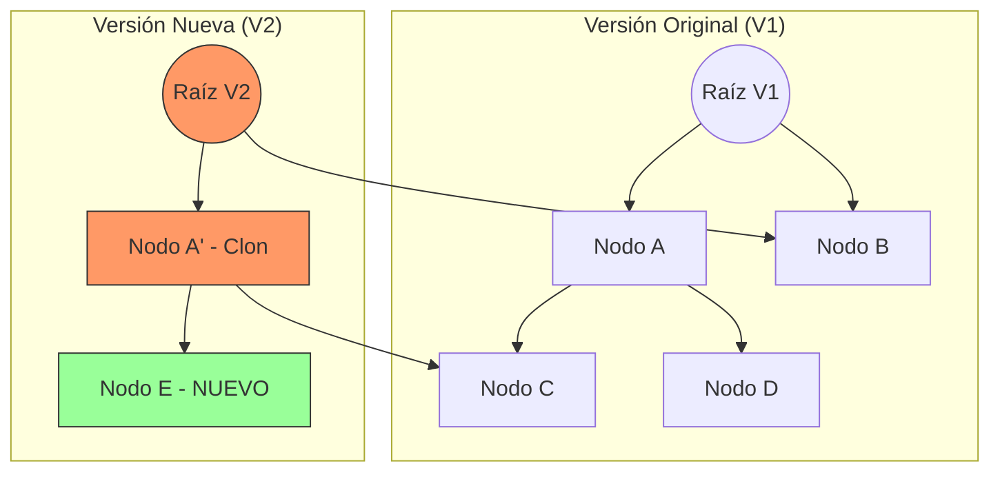
:::

```{exercise}
:label: ex-02
**Consigna:** Derivá matemáticamente el factor de crecimiento óptimo $k$ para un arreglo dinámico considerando un allocator con overhead de metadatos. Analizá por qué un factor de 2.0 es físicamente inferior a 1.5 en términos de fragmentación del heap y localidad de caché.
```

:::{solution} ex-02
:class: dropdown
**Resolución paso a paso:**
1. **Modelado del Crecimiento:**
   Sea $S_n$ el tamaño del arreglo en la expansión $n$. $S_n = k^n \cdot S_0$.
2. **El Problema del Reuso de Memoria:**
   Un allocator de memoria (como `malloc` en C o el de la JVM) gestiona bloques libres. Cuando liberamos el arreglo viejo de tamaño $S_{n-1}$, ese espacio queda libre. Queremos que el nuevo pedido de tamaño $S_n$ pueda entrar en la suma de todos los bloques liberados anteriormente.
3. **Planteo de la Desigualdad:**
   Para que el reuso sea posible, debe cumplirse que:
   $$S_n \leq \sum_{i=0}^{n-1} S_i$$
   Dividiendo por $S_0$: $k^n \leq \sum_{i=0}^{n-1} k^i$.
   Usando la fórmula de la serie geométrica: $k^n \leq \frac{k^n - 1}{k - 1}$.
4. **Resolución para k:**
   Para valores grandes de $n$, esto se simplifica a $1 \leq \frac{1}{k - 1}$, lo que implica $k - 1 \leq 1$, o sea $k \leq 2$.
   Sin embargo, si incluimos el **overhead de metadatos** del allocator (digamos 16 bytes por bloque), la suma de los bloques anteriores es un poco mayor, pero el bloque pedido también.
5. **Fragmentación del Heap:**
   Con $k=2$, el nuevo bloque pedido es **siempre mayor** que la suma de todos los anteriores. Esto obliga al allocator a buscar espacio nuevo "más adelante" en el heap, dejando huecos atrás que no puede usar. Esto dispara el fenómeno de *External Fragmentation*.
6. **Localidad de Caché y TLB:**
   Si el allocator puede reutilizar memoria liberada recientemente, es muy probable que esa memoria todavía resida en la caché L2 o L3 del procesador. Usar un factor de $1.5$ asegura que, tras unas pocas expansiones, el nuevo arreglo se ubique en una zona "caliente" de la RAM, evitando picos de latencia de 300 ciclos por *cache miss*.
7. **Ciclos de CPU:**
   Un factor de $1.5$ requiere copias más frecuentes que $k=2$, pero el beneficio de salud del heap compensa largamente el costo de los ciclos de CPU dedicados a la copia (`System.arraycopy`).

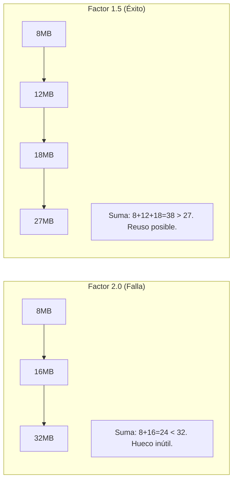
:::

```{exercise}
:label: ex-03
**Consigna:** Diseñá una secuencia para un buffer circular de alto rendimiento. Implementá `expandCapacity()` asegurando que la secuencia lógica se preserve y analizá el impacto del wrap-around en el prefetcher de hardware de la CPU.
```

:::{solution} ex-03
:class: dropdown
**Resolución paso a paso:**
1. **Estado de Saturación:**
   En un `ArrayDeque`, el buffer está lleno cuando `head == tail`.
2. **Algoritmo de Expansión:**
   ```java
   void expand() {
       int p = head;
       int n = elements.length;
       int r = n - p; // número de elementos a la derecha de head
       int newCapacity = n << 1;
       Object[] a = new Object[newCapacity];
       System.arraycopy(elements, p, a, 0, r);
       System.arraycopy(elements, 0, a, r, p);
       elements = a;
       head = 0;
       tail = n;
   }
   ```
3. **Preservación Lógica:**
   El truco está en "desenrollar" el círculo. Los elementos que estaban al final del arreglo físico (desde `head` hasta el final) van al principio del nuevo. Los que habían hecho *wrap-around* van a continuación.
4. **Análisis de Cache Lines:**
   Una línea de caché (64 bytes) carga 8 referencias de 64 bits. En el buffer circular original, cuando llegás al final físico del arreglo, la siguiente lectura lógica está al principio del arreglo. Físicamente, esto es un salto de Gigabytes. El **Prefetcher de Hardware** (un circuito en la CPU que adivina qué vas a leer) se confunde y deja de traer datos por adelantado.
5. **Penalidad de Salto:**
   Ese salto físico rompe la "localidad espacial". Tras la expansión y linealización, la secuencia vuelve a ser amigable para el hardware, permitiendo que las instrucciones de carga (`MOV`) se ejecuten sin esperar a la RAM.
6. **Page Cache y Memoria Virtual:**
   Si el buffer cruza una frontera de página de 4KB, el wrap-around puede causar que el proceso acceda a páginas de memoria muy distantes, aumentando el *working set size* y potencialmente causando *page faults* si el sistema está bajo presión de memoria.

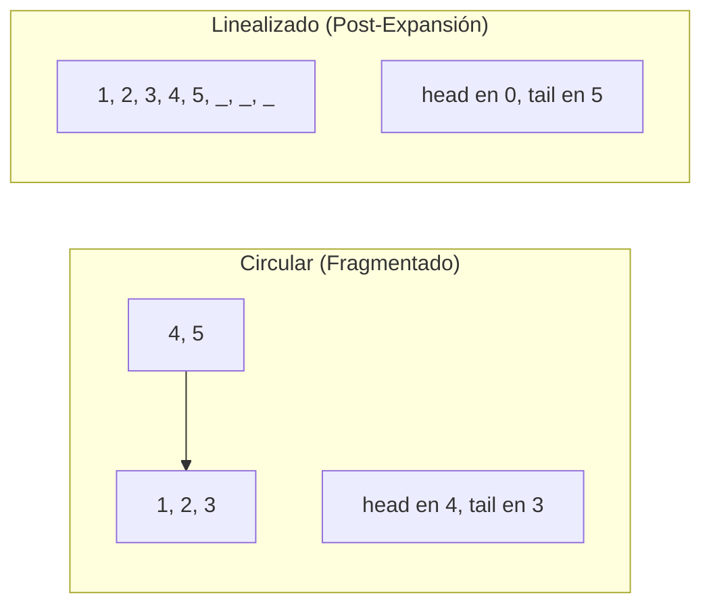
:::

```{exercise}
:label: ex-04
**Consigna:** Analizá el impacto del "Branch Prediction" en el procesamiento de secuencias. Escribí un micro-benchmark mental comparando el filtrado de una secuencia de 10M de enteros ordenada vs desordenada. Explicá qué ocurre en el Reorder Buffer de la CPU.
```

:::{solution} ex-04
:class: dropdown
**Resolución paso a paso:**
1. **El Lazo Crítico:**
   `for (int x : data) if (x > 500) sum += x;`
2. **Mecánica del Predictor de Saltos:**
   La CPU tiene un **BTB (Branch Target Buffer)** que recuerda si un salto se cumplió o no. Como las CPUs modernas son superescalares y usan *pipelining*, empiezan a ejecutar el interior del `if` **antes** de saber si la condición es verdadera.
3. **Caso Secuencia Ordenada:**
   Los primeros 5M de elementos son `< 500` (Falso). El predictor aprende: "siempre falso". Luego, el resto son `> 500` (Verdadero). El predictor falla una sola vez en la transición y luego acierta siempre.
4. **Caso Secuencia Desordenada:**
   Si los datos son aleatorios, el patrón es `V, F, F, V, F, V...`. El predictor falla el 50% de las veces.
5. **Pipeline Flush y Reorder Buffer:**
   Cuando la CPU descubre que predijo mal, debe **vaciar el Reorder Buffer (ROB)**. Todas las instrucciones que empezó a ejecutar de forma especulativa deben ser descartadas. Esto cuesta entre 15 y 20 ciclos de reloj por cada fallo.
6. **Cómputo Total de Ciclos:**
   - Ordenada: 10M iteraciones $\times$ ~1 ciclo/it = 10M ciclos.
   - Desordenada: 10M iteraciones $\times$ (1 ciclo + 0.5 fallos $\times$ 15 ciclos) = 85M ciclos.
7. **Resultado:** La misma secuencia procesada de forma ordenada es **8.5 veces más rápida**. Por eso, en ingeniería de sistemas, a veces conviene pagar el costo de ordenar la secuencia una vez para acelerar mil procesos de filtrado posteriores.

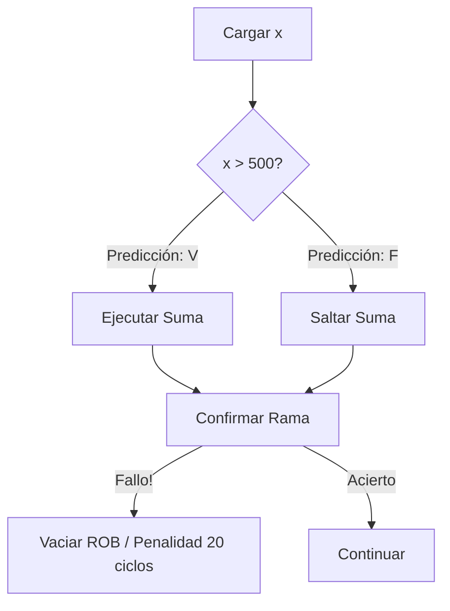
:::

```{exercise}
:label: ex-05
**Consigna:** Implementá la detección de ciclos de Floyd (Tortuga y Liebre) sobre una secuencia enlazada. Explicá matemáticamente por qué se encuentran y analizá el impacto en el Page Cache si la lista es más grande que la RAM física.
```

:::{solution} ex-05
:class: dropdown
**Resolución paso a paso:**
1. **Lógica de Punteros:**
   `lento = head; rapido = head;`
   En cada paso: `lento = lento.next; rapido = rapido.next.next;`
2. **Prueba de Encuentro:**
   Sea $m$ la distancia desde el inicio hasta el comienzo del ciclo de longitud $C$. Sea $k$ la posición del encuentro dentro del ciclo. Tras $i$ pasos:
   - Tortuga está en $i \pmod C$.
   - Liebre está en $2i \pmod C$.
   Se encuentran cuando $(2i - i)$ es un múltiplo de $C$. Esto garantiza que el encuentro ocurre en tiempo lineal $O(n)$.
3. **Espacio $O(1)$:**
   A diferencia de usar un `HashSet` de nodos visitados ($O(n)$ en memoria), Floyd solo usa dos punteros en registros.
4. **Impacto en el Page Cache:**
   Si la lista tiene 100GB y la RAM es de 16GB, el puntero `rapido` está saltando "el doble de rápido" a través de las páginas de memoria virtual. Esto duplica la tasa de **Page Faults**. Mientras que la tortuga carga la página $P$, la liebre ya está pidiendo la página $P+2$.
5. **Thrashing:**
   Si el ciclo es muy grande, el sistema entra en *Thrashing*: el sistema operativo pasa el 99% del tiempo moviendo páginas del disco a la RAM y viceversa. En este escenario, el algoritmo de Floyd es catastrófico para el rendimiento comparado con un algoritmo que tenga mejor localidad.
6. **Ciclos de CPU:**
   Debido al *Pointer Chasing*, la CPU está constantemente esperando a la RAM (300 ciclos por salto). La liebre, al hacer dos saltos por vez, sufre el doble de penalidad de latencia.

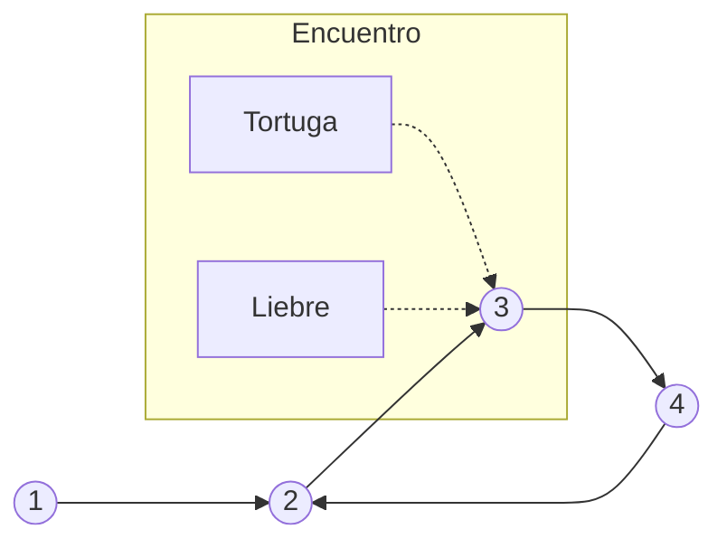
:::

```{exercise}
:label: ex-06
**Consigna:** Diseñá una "Lock-Free Stack" (Pila sin bloqueos) basada en secuencias enlazadas. Explicá el funcionamiento atómico del CAS (Compare-And-Swap) y el riesgo del problema ABA en este tipo de secuencias concurrentes.
```

:::{solution} ex-06
:class: dropdown
**Resolución paso a paso:**
1. **Estructura Concurrente:**
   Usamos un `AtomicReference<Node> top` para el tope de la secuencia.
2. **Algoritmo de Push:**
   ```java
   public void push(T value) {
       Node newNode = new Node(value);
       do {
           Node oldTop = top.get();
           newNode.next = oldTop;
       } while (!top.compareAndSet(oldTop, newNode));
   }
   ```
3. **El Rol del CAS:**
   `compareAndSet` es una instrucción nativa de la CPU (como `LOCK CMPXCHG` en x86). Compara el valor actual de la memoria con `oldTop`. Si son iguales, cambia la memoria a `newNode` en un solo ciclo atómico de hardware que bloquea el bus de memoria para otros núcleos.
4. **Ciclos de CPU y Contención:**
   Si 100 hilos intentan hacer `push` a la vez, uno gana y los otros 99 fallan el CAS. Esos 99 hilos vuelven a intentar inmediatamente. Esto consume ciclos de CPU al 100% (*busy wait*), pero es más rápido que suspender el hilo (mutex), lo que requeriría un *Context Switch* carísimo (~5000 ciclos).
5. **El Problema ABA:**
   Supongamos que un hilo lee `Top = A`. Otro hilo saca `A`, saca `B` y vuelve a meter `A`. El primer hilo vuelve, hace `CAS(A, nuevo)` y el hardware dice "sí, es A". Pero `A.next` ahora apunta a algo distinto de lo que el primer hilo esperaba.
6. **Solución:**
   En secuencias concurrentes profesionales, usamos **AtomicStampedReference**, que agrega un "número de versión" (stamp) a cada puntero para que el hardware detecte si el objeto fue modificado aunque la dirección de memoria sea la misma.

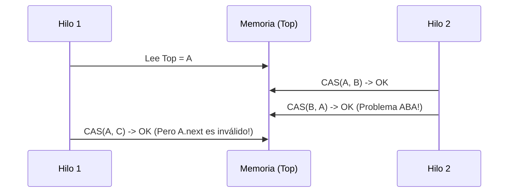
:::

```{exercise}
:label: ex-07
**Consigna:** Invertí una secuencia enlazada simple *in-place*. Explicá detalladamente la gestión de los tres punteros necesarios y demostrá por qué esta operación es la prueba de fuego para entender la mutabilidad del heap.
```

:::{solution} ex-07
:class: dropdown
**Resolución paso a paso:**
1. **Los Tres Mosqueteros:**
   Necesitamos `previo` (el futuro padre), `actual` (el que estamos procesando) y `siguiente` (para no perder el resto de la lista).
2. **El Algoritmo de 4 Pasos:**
   - `siguiente = actual.next;` (Guardamos el futuro)
   - `actual.next = previo;` (Invertimos el sentido físico del puntero)
   - `previo = actual;` (El actual ahora es el previo del que viene)
   - `actual = siguiente;` (Avanzamos al que guardamos)
3. **Pérdida de Referencia:**
   Si olvidás el paso 1, al hacer `actual.next = previo`, rompés el único puente que tenés con el resto de la lista. El Garbage Collector verá esos nodos como inalcanzables y los borrará, destruyendo tu secuencia.
4. **Impacto en el Write Barrier del GC:**
   En la JVM, cada vez que hacés `actual.next = previo`, se dispara un **Write Barrier**. El GC anota que un objeto del heap ahora apunta a otro. Si estás usando el recolector G1, esto llena el "Remembered Set", lo que puede causar pausas cortas de limpieza.
5. **Microarquitectura y Dependencias:**
   Este algoritmo tiene una **dependencia de datos secuencial**. La CPU no puede ejecutar el paso $i+1$ hasta que el $i$ termine de escribir en la RAM. Esto anula la capacidad de "Out-of-Order Execution" de la CPU, haciendo que la performance dependa puramente de la latencia de la memoria (300 ciclos por nodo).
6. **Verificación Formal:**
   El invariante de lazo es: "La lista original se divide en dos: una invertida que empieza en `previo` y otra original que empieza en `actual`".

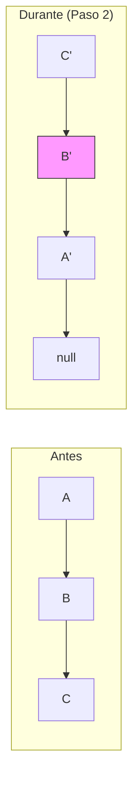
:::

```{exercise}
:label: ex-08
**Consigna:** Calculá el impacto del "False Sharing" en una secuencia de contadores de 64 bits distribuida entre núcleos. Diseñá una estrategia de padding y explicá cómo el protocolo MESI de coherencia de caché degrada el rendimiento.
```

:::{solution} ex-08
:class: dropdown
**Resolución paso a paso:**
1. **La Trampa de los Arreglos:**
   `long[] counters = new long[8];` (8 hilos, cada uno usa un índice).
2. **Geometría de la Línea de Caché:**
   Cada `long` mide 8 bytes. Los 8 elementos ocupan 64 bytes. Una **Cache Line** típica de Intel/AMD mide exactamente 64 bytes.
3. **El Protocolo MESI:**
   - Cuando el Hilo 1 escribe en `counters[0]`, su caché marca la línea como **Modified (M)**.
   - El hardware envía una señal de invalidación a todos los otros núcleos.
   - El Hilo 2, que quería leer `counters[1]`, ve su línea como **Invalid (I)**.
4. **La Penalidad Física:**
   El Hilo 2 debe esperar a que el Hilo 1 mande sus datos a la caché L3 y luego recargar la línea entera. Esto sucede aunque `counters[0]` y `counters[1]` sean lógicamente independientes.
5. **Impacto en Ciclos:**
   En lugar de un incremento de 1 ciclo de reloj, la operación tarda lo que tarda un mensaje inter-núcleo (~150-200 ciclos). Con 8 hilos, el sistema se "atraganta" y rinde menos que un solo hilo secuencial.
6. **Estrategia de Padding:**
   Agregamos espacio vacío (campos `long p1, p2, p3...`) para asegurar que cada contador viva en su propia línea de caché de 64 bytes. En Java 8+, usamos la anotación `@Contended`.
7. **Diagrama de Conflicto:**
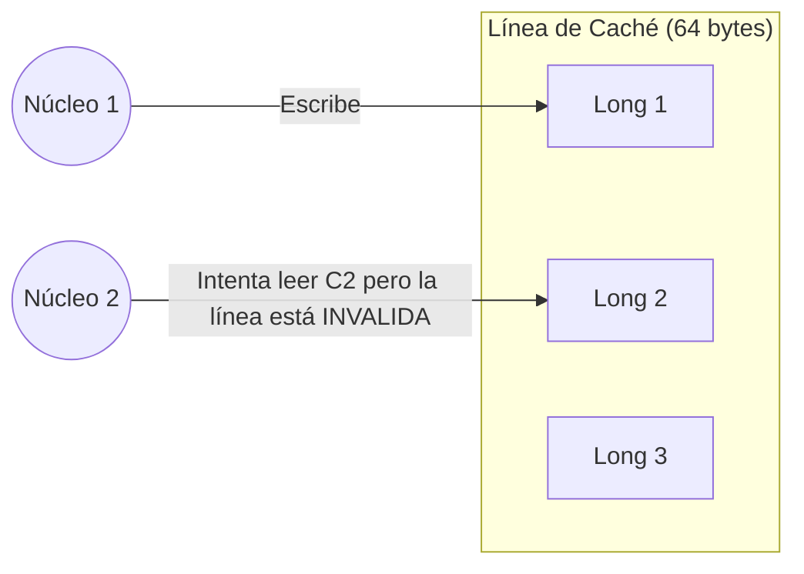
:::

```{exercise}
:label: ex-09
**Consigna:** Implementá una "Unrolled Linked List" y analizá por qué mejora la performance en órdenes de magnitud frente a una lista enlazada tradicional. Razoná sobre el impacto en el Prefetcher de Hardware y la fragmentación del Heap.
```

:::{solution} ex-09
:class: dropdown
**Resolución paso a paso:**
1. **Estructura Híbrida:**
   Cada nodo de la lista no contiene un elemento, sino un **arreglo pequeño** (digamos de 16 elementos).
2. **Ventaja 1: Localidad Espacial:**
   Al recorrer los 16 elementos de un nodo, la CPU los encuentra contiguos en la memoria. El prefetcher de hardware ve que estás accediendo a `arr[0], arr[1]` y trae `arr[2...7]` automáticamente a la caché L1.
3. **Ventaja 2: Menos Nodos, Menos Pointer Chasing:**
   Para una secuencia de 1000 elementos, una lista común tiene 1000 nodos (1000 saltos de memoria). La Unrolled List tiene 63 nodos. Reducimos los saltos aleatorios en un 94%.
4. **Impacto en el Heap y GC:**
   Creamos menos objetos. Cada objeto tiene un *header* de 12-16 bytes. 1000 headers = 16KB de basura. 63 headers = 1KB. Ahorramos memoria y tiempo de recolección.
5. **Análisis de Búsqueda:**
   Para buscar el elemento 500: saltamos de nodo en nodo sumando sus tamaños. Al encontrar el nodo, usamos el índice del arreglo. Costo: $O(n/B + B)$, donde $B$ es el tamaño del bloque.
6. **Hardware Prefetcher:**
   Mientras procesamos un nodo, el prefetcher puede estar "mirando" el puntero `next` para traer el siguiente arreglo masivo antes de que lo necesitemos.

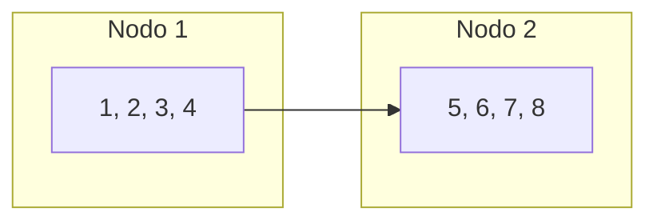
:::

```{exercise}
:label: ex-10
**Consigna:** Analizá el acceso por índice en un "Array-Mapped Trie" (AMT) de 32 niveles (usado en Clojure y Scala). Explicá matemáticamente el Bit-Partitioning y por qué se considera una secuencia de "tiempo constante efectivo".
```

:::{solution} ex-10
:class: dropdown
**Resolución paso a paso:**
1. **Estructura del AMT:**
   Es un árbol de grado 32. Cada nodo es un arreglo de 32 referencias.
2. **Bit-Partitioning:**
   Un índice de 30 bits se divide en grupos de 5 bits ($2^5 = 32$).
   - Nivel 1: bits 25-29.
   - Nivel 2: bits 20-24.
   - ...
   - Nivel 6: bits 0-4.
3. **Algoritmo de Acceso:**
   ```java
   Object get(int index) {
       Node curr = root;
       for (int level = 25; level >= 0; level -= 5) {
           curr = curr.array[(index >>> level) & 31];
       }
       return curr;
   }
   ```
4. **Por qué es "Casi Constante":**
   Incluso para una secuencia de mil millones de elementos ($2^{30}$), solo necesitamos 6 niveles. En el mundo real, 6 saltos de memoria son despreciables y no crecen con el tamaño de los datos de forma perceptible.
5. **Localidad de Caché:**
   Como cada nodo es un arreglo de 32 punteros (256 bytes), entra perfectamente in 4 líneas de caché. La CPU carga el nodo entero de un solo golpe de RAM.
6. **Impacto en el TLB:**
   Al ser un árbol muy "ancho" pero poco profundo, la probabilidad de que los niveles superiores del árbol estén siempre en la caché L2 o L3 es altísima, minimizando los fallos de traducción de memoria virtual.

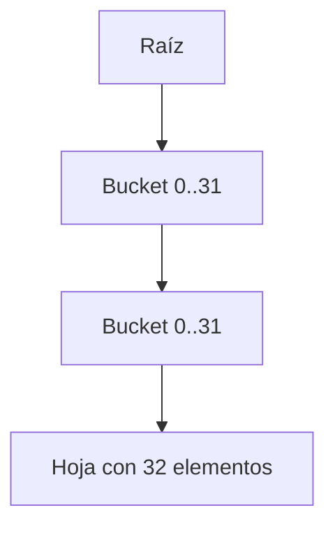
:::

```{exercise}
:label: ex-11
**Consigna:** Implementá una Skip List con soporte para concurrencia y explicá por qué su estructura probabilística es superior a los árboles balanceados en entornos multihilo masivos. Analizá el impacto en el protocolo de coherencia de caché MESI.
```

:::{solution} ex-11
:class: dropdown
**Resolución paso a paso:**
1. **Fundamento Probabilístico:**
   Una Skip List construye niveles superiores tirando una moneda (probabilidad $p=1/2$). Cada nivel actúa como un "atajo" para la búsqueda.
2. **Estructura de Nodos Concurrentes:**
   Utilizamos nodos donde el siguiente puntero es un arreglo de `AtomicReference`.
   ```java
   class Node<T> {
       final T value;
       final AtomicReference<Node<T>>[] next;
       Node(T value, int levels) {
           this.value = value;
           this.next = new AtomicReference[levels];
       }
   }
   ```
3. **Inserción Lock-Free:**
   La inserción se realiza de abajo hacia arriba. Primero se inserta en el nivel 0 usando CAS. Luego, se "promociona" el nodo a los niveles superiores de forma independiente.
4. **Superioridad frente a Árboles (AVL/Rojo-Negro):**
   En un árbol balanceado, una inserción puede disparar una rebalanceo (rotación) que afecta a la raíz. Esto crea un **punto de contención central**. En una Skip List, las modificaciones son puramente locales a los punteros vecinos.
5. **Impacto en MESI:**
   Como las modificaciones son locales, las señales de invalidación de caché solo afectan a los núcleos que están procesando esa región de la lista. No hay una "raíz" que todos los núcleos invaliden constantemente.
6. **Análisis de Búsqueda:**
   La búsqueda es $O(\log n)$ promedio. Matemáticamente, el número de pasos horizontales en cada nivel es $1/p = 2$. Es una secuencia jerárquica con una dispersión de accesos excelente para el hardware.
7. **Diagrama de Niveles:**
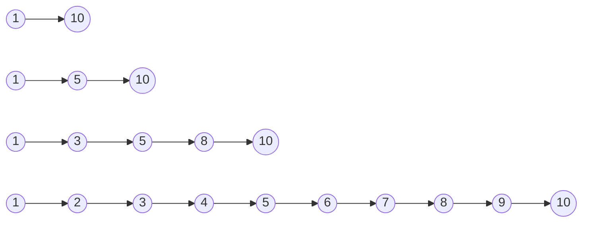
8. **Page Faults y Localidad:**
   Aunque la Skip List tiene peor localidad que un arreglo, su capacidad de evitar bloqueos (Locks) en sistemas con 128 núcleos compensa la latencia de memoria individual.
:::

```{exercise}
:label: ex-12
**Consigna:** Diseñá una secuencia para procesamiento de logs de Terabytes usando Memory Mapping (mmap). Explicá cómo el kernel de Linux gestiona el Page Cache y por qué `mmap` evita el costo del cambio de contexto y la doble copia.
```

:::{solution} ex-12
:class: dropdown
**Resolución paso a paso:**
1. **La Llamada mmap:**
   Mapeamos un archivo de disco al espacio de direcciones virtuales del proceso. El SO no carga el archivo; solo reserva el rango de direcciones.
2. **Mecánica de Page Faults:**
   Al acceder a un índice de la secuencia que no está en RAM, el hardware (MMU) dispara un *Page Fault*. El kernel busca la página en el disco y la carga en el **Page Cache**.
3. **Eliminación de la Doble Copia:**
   En una lectura tradicional (`read()`), el dato se copia del disco al caché del kernel, y del kernel al buffer del usuario. Con `mmap`, el buffer del usuario **ES** el caché del kernel.
4. **Impacto en el TLB:**
   Como estamos mapeando Gigabytes, usamos **Huge Pages** (2MB o 1GB) para que cada entrada del TLB cubra más datos, bajando el error rate de traducción de direcciones.
5. **Ciclos de CPU:**
   Evitamos el cambio de contexto (*Context Switch*) entre el espacio de usuario y el kernel en cada lectura, ahorrando ~3000 ciclos por operación.
6. **Razonamiento de Prefetching:**
   El kernel de Linux detecta accesos secuenciales a la secuencia mapeada y dispara lecturas proactivas (*read-ahead*), llenando la RAM antes de que el proceso pida los datos.
7. **Diagrama de Memoria:**
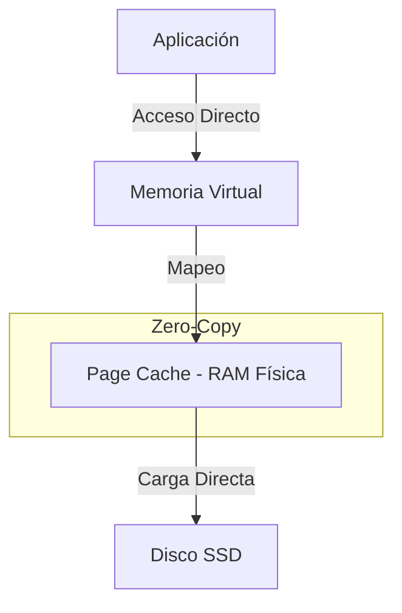
:::

```{exercise}
:label: ex-13
**Consigna:** Analizá el impacto de las latencias de memoria en una secuencia de procesamiento de datos científicos. Compará el rendimiento de un algoritmo que recorre un arreglo por filas vs uno que lo hace por columnas (Row-major vs Column-major).
```

:::{solution} ex-13
:class: dropdown
**Resolución paso a paso:**
1. **Layout en Memoria:**
   En Java y C, los arreglos multidimensionales son secuencias de arreglos. En `data[rows][cols]`, los elementos de una fila están contiguos.
2. **Acceso por Filas (Row-major):**
   Accedés a `[0][0], [0][1], [0][2]...`. Los datos están uno al lado del otro.
3. **Física del Row Buffer:**
   La RAM abra una fila de 8KB. Todas las lecturas de esa fila son instantáneas. La CPU usa una *Cache Line* entera.
4. **Acceso por Columnas (Column-major):**
   Accedés a `[0][0], [1][0], [2][0]...`. Cada acceso salta `cols` elementos.
5. **Desastre de Caché:**
   Cada acceso a una columna es un *Cache Miss*. La CPU carga 64 bytes, usa 4 o 8, y descarta el resto. El ancho de banda de la memoria se desperdicia en un 90%.
6. **Ciclos y Prefetcher:**
   El prefetcher no entiende saltos gigantes. La CPU se frena 300 ciclos en cada iteración.
7. **Cómputo Comparativo:**
   Para una matriz de $1000 \times 1000$:
   - Fila: $10^6$ accesos, ~15k cache misses.
   - Columna: $10^6$ accesos, $10^6$ cache misses.
8. **Resultado:** El acceso por filas es entre 10x y 50x más rápido.

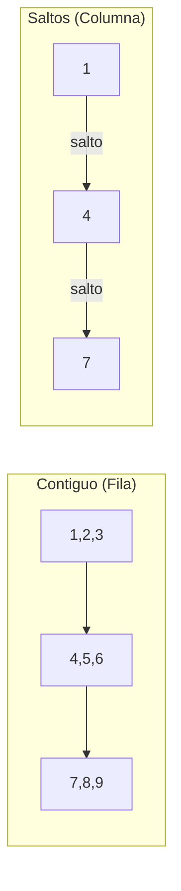
:::

```{exercise}
:label: ex-14
**Consigna:** Explicá el patrón de "Double Buffering" para el procesamiento de secuencias de video en tiempo real. Analizá el impacto en el VSync y el manejo de interrupciones de hardware.
```

:::{solution} ex-14
:class: dropdown
**Resolución paso a paso:**
1. **El Problema del Parpadeo:**
   Si la secuencia de video se escribe directamente en la memoria de pantalla (Frame Buffer) mientras el monitor lee, el usuario ve una imagen a medio dibujar (*tearing*).
2. **Double Buffering:**
   Usamos dos secuencias: `Back Buffer` (donde dibujamos) y `Front Buffer` (donde el monitor lee).
3. **El "Flip":**
   Cuando terminamos de dibujar, intercambiamos los punteros. Esta operación es $O(1)$.
4. **VSync (Vertical Synchronization):**
   El intercambio solo ocurre durante el *Vertical Blanking Interval* (cuando el haz de electrones o el escaneo del LCD vuelve arriba). Esto evita el tearing físico.
5. **Ciclos de GPU y DMA:**
   La transferencia de la secuencia de píxeles se hace mediante **DMA (Direct Memory Access)**, liberando a la CPU de copiar bytes.
6. **Latencia de Entrada:**
   El Double Buffering introduce un frame de latencia (16ms a 60Hz). Los jugadores competitivos a veces usan *Triple Buffering* para mitigar esto, a costa de más memoria RAM.
7. **Diagrama de Flujo:**
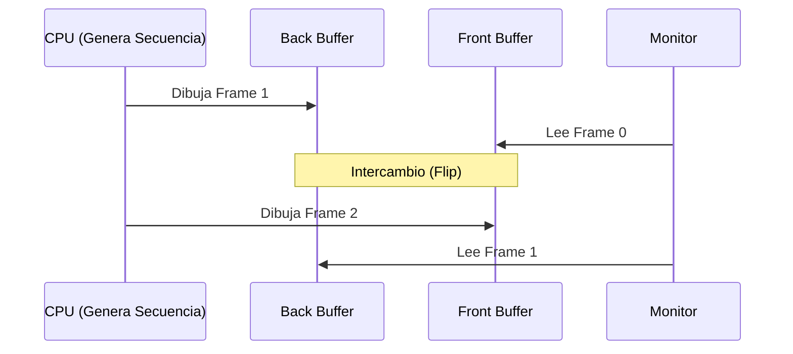
:::

```{exercise}
:label: ex-15
**Consigna:** Implementá una secuencia para un "Undo/Redo Manager" usando el patrón Command y una estructura de datos persistente. Analizá el impacto en el consumo de memoria para una secuencia de 10.000 operaciones.
```

:::{solution} ex-15
:class: dropdown
**Resolución paso a paso:**
1. **Estructura:**
   Mantenemos una lista de comandos y un puntero a la posición actual en la secuencia histórica.
2. **Persistencia de Datos:**
   Cada comando guarda el "delta" o el estado previo. Si usamos estructuras inmutables (ej. AMT de Clojure), el costo de guardar el estado es logarítmico, no lineal.
3. **Análisis de Memoria:**
   Para 10.000 operaciones, si guardamos copias completas de un documento de 1MB, usaríamos 10GB. Con *Structural Sharing*, solo guardamos los nodos que cambiaron (unos pocos KB por comando).
4. **Impacto en el GC:**
   Al deshacer acciones, las versiones "futuras" de la secuencia quedan huérfanas y son recolectadas por el GC. El uso de referencias débiles (`WeakReference`) puede ayudar a cachear el historial sin agotar la RAM.
5. **Micro-optimizaciones:**
   Usamos un arreglo dinámico para la secuencia de comandos para tener acceso $O(1)$ a cualquier punto del historial.
6. **Verificación:**
   El invariante es que al aplicar el comando y luego su inverso, la secuencia de datos vuelve exactamente al mismo estado de bits (determinismo).
7. **Diagrama de Historial:**
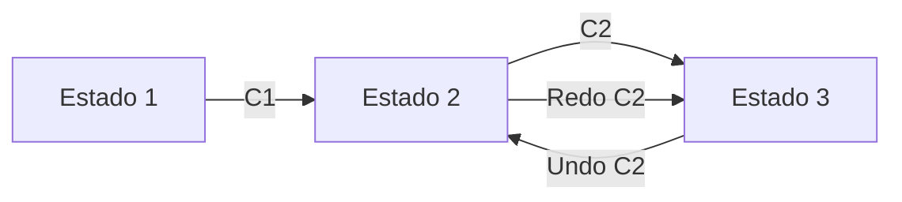
:::

```{exercise}
:label: ex-16
**Consigna:** Explicá la diferencia física entre una secuencia de booleanos implementada como `boolean[]` versus un `BitSet`. Analizá detalladamente el impacto en la jerarquía de caché y cómo las instrucciones SIMD pueden acelerar operaciones masivas sobre bits.
```

:::{solution} ex-16
:class: dropdown
**Resolución paso a paso:**
1. **Representación en la JVM:**
   Un `boolean` en Java ocupa 1 byte (8 bits). Un `boolean[64]` ocupa 64 bytes de datos + header.
2. **Representación en BitSet:**
   Un `BitSet` usa un arreglo de `long`. Para 64 booleanos, usa un solo `long` (8 bytes).
3. **Eficiencia de Memoria:**
   El `BitSet` es **8 veces más denso**. En una secuencia de un millón de flags, pasamos de 1MB a 125KB. Los 125KB entran cómodamente en la caché L2, mientras que 1MB obliga a ir a la RAM.
4. **Impacto en Cache Lines:**
   Para leer 64 flags, el `boolean[]` tiene que cargar una *Cache Line* entera (64 bytes). El `BitSet` carga 8 bytes, dejando espacio para otros 56 bytes de datos útiles en la misma línea de caché.
5. **Aceleración SIMD (Single Instruction Multiple Data):**
   Si querés saber si todos los flags son `true`:
   - En `boolean[]`, tenés que hacer 64 comparaciones y 64 saltos.
   - En `BitSet`, hacés `if (bits == -1L)`. Una sola instrucción de CPU procesa los 64 elementos.
6. **Ciclos de CPU:**
   Las operaciones de bits (`AND`, `OR`, `XOR`, `NOT`) se ejecutan en 1 ciclo de reloj sobre 64 elementos. Es un paralelismo de datos masivo a nivel de hardware.

```mermaid
graph LR
    subgraph "boolean[] (64 bytes)"
    B[Byte 1][Byte 2]...[Byte 64]
    end
    subgraph "BitSet (8 bytes)"
    S[64 bits compactos]
    end
```
:::

```{exercise}
:label: ex-17
**Consigna:** ¿Qué es el "Pointer Chasing" y por qué destruye el prefetching de hardware? Explicá cómo el Proyecto Valhalla busca solucionar esto mediante "Flattening" de secuencias de objetos.
```

:::{solution} ex-17
:class: dropdown
**Resolución paso a paso:**
1. **Definición de Pointer Chasing:**
   Es el patrón de acceso donde cada dato es un puntero a otra dirección de memoria (ej. listas enlazadas).
2. **El Prefetcher de Hardware:**
   Es un circuito que observa el bus de memoria. Si detecta que leés `A[0], A[1], A[2]`, adivina que vas a pedir `A[3]` y lo trae de la RAM antes de que lo pidas.
3. **El Fracaso ante Punteros:**
   En una secuencia de objetos, la CPU lee la referencia `A[i]`. Pero no sabe qué hay en esa dirección hasta que la lectura termina (300 ciclos). El prefetcher está ciego: no puede adivinar direcciones aleatorias del heap.
4. **El Muro de la Latencia:**
   La CPU se queda ociosa esperando. Tu procesador de 4GHz rinde como uno de 10MHz porque la "tubería" está vacía.
5. **Proyecto Valhalla y Flattening:**
   Busca permitir que los objetos (Value Objects) se guarden **contiguos** en el arreglo, sin punteros. Un arreglo de `Point {int x, y}` será físicamente un bloque de enteros `x, y, x, y...`.
6. **Resultado:**
   Volvemos a tener localidad espacial. El prefetcher vuelve a funcionar y el rendimiento de las secuencias de objetos complejos se iguala al de los tipos primitivos.

```mermaid
graph TD
    subgraph "Pointer Chasing (Actual)"
    Arr --> P1[Puntero 1]
    Arr --> P2[Puntero 2]
    P1 --> Obj1[Datos 1]
    P2 --> Obj2[Datos 2]
    end
    subgraph "Flattening (Valhalla)"
    Arr2[Datos 1 | Datos 2 | Datos 3]
    end
```
:::

```{exercise}
:label: ex-18
**Consigna:** Diseñá una secuencia para un log de eventos que soporte 1 millón de escrituras por segundo. Explicá por qué el "Append-Only" es la única opción y analizá el impacto del "Write Amplification" en SSDs.
```

:::{solution} ex-18
:class: dropdown
**Resolución paso a paso:**
1. **La Física del Almacenamiento:**
   Tanto en HDDs como en SSDs, las escrituras aleatorias son lentas. En un SSD, escribir un solo byte requiere leer, borrar y re-escribir un bloque entero de 4KB o más.
2. **Append-Only Log:**
   Al escribir siempre al final de la secuencia, aprovechamos el ancho de banda secuencial del hardware. El controlador del disco puede llenar buffers internos y vaciarlos de un solo golpe.
3. **Write Amplification:**
   Si modificamos una secuencia en el medio, el SSD sufre "Write Amplification": tiene que mover datos viejos para hacer lugar a los nuevos, acortando su vida útil y bajando la performance.
4. **Buffer de Usuario y mmap:**
   Usamos un buffer en RAM y volcamos al disco en trozos grandes (ej. 64KB). La función `mmap` permite que el SO gestione esta secuencia como si fuera memoria RAM, usando el *Page Cache* de forma óptima.
5. **Throughput de Red:**
   Para un millón de eventos, la red también debe procesar la secuencia en *batches*. Enviar un paquete por evento saturaría el stack de red. Agrupamos eventos en la secuencia antes de enviarlos.
6. **Zero-copy:**
   Usamos la llamada `sendfile()` en Linux para mover la secuencia directamente desde el caché de archivos hacia la placa de red, evitando copias de CPU innecesarias.


:::

```{exercise}
:label: ex-19
**Consigna:** Calculá el impacto de la "Alineación de Memoria" en una secuencia de estructuras de 9 bytes. ¿Por qué el compilador agrega padding y cuál es el costo en el TLB y la Caché L1?
```

:::{solution} ex-19
:class: dropdown
**Resolución paso a paso:**
1. **La Restricción del Hardware:**
   La mayoría de las CPUs (x86, ARM) están optimizadas para leer datos en direcciones múltiplos de 4 u 8 bytes.
2. **El Problema de los 9 Bytes:**
   Si guardás elementos de 9 bytes uno tras otro, el segundo elemento empezará en el byte 9 (no alineado). El tercero en el 18.
3. **Lecturas Split:**
   Para leer un `long` de 8 bytes que empieza en la dirección 9, la CPU debe físicamente hacer **dos lecturas de memoria** (una para los bytes 8-15 y otra para los 16-23) y luego usar desplazamientos de bits para unir los fragmentos.
4. **Padding del Compilador:**
   El compilador agrega 7 bytes de basura al final de cada elemento para llevarlo a 16 bytes (alineado).
5. **Costo en Caché L1:**
   Perdemos un 43% de la capacidad de la caché guardando basura. En una secuencia masiva, esto significa que el sistema tendrá que ir a la RAM mucho más seguido.
6. **Costo en TLB:**
   Al ocupar más espacio, la secuencia cruza más páginas de memoria. El TLB tiene que traducir más direcciones, aumentando la probabilidad de fallos de traducción.
7. **Decisión de Ingeniería:**
   A pesar del desperdicio de RAM, preferimos la alineación porque una lectura "split" puede ser 2x o 3x más lenta y no es atómica (riesgo de *Word Tearing*).

```mermaid
graph LR
    subgraph "No Alineado (Lento)"
    A[9 bytes]B[9 bytes]C[9 bytes]
    NoteA[B cruza frontera de 8 bytes]
    end
    subgraph "Alineado con Padding (Rápido)"
    D[9 + 7 bytes]E[9 + 7 bytes]
    NoteD[Todo alineado a 16 bytes]
    end
```
:::

```{exercise}
:label: ex-20
**Consigna:** Implementá una búsqueda binaria sobre una secuencia masiva de 10 Terabytes distribuida en un sistema de almacenamiento persistente. Demostrá con rigor matemático por qué el B-Tree es la estructura de secuencia jerárquica definitiva para el almacenamiento masivo y explicá el concepto de "Temporal Locality" en los nodos raíz, detallando por qué el sistema operativo los mantiene en RAM.

```

:::{solution} ex-20
:class: dropdown
**Resolución paso a paso:**

1. **El Problema de Escala y la Tiranía de la Latencia:**
   Tenés que entender que cuando hablamos de 10 Terabytes, la memoria RAM es solo una ventana minúscula hacia un océano de datos. Imaginá que cada registro ocupa 100 bytes; tenés $10^{11}$ (cien mil millones) de elementos. Una búsqueda binaria clásica sobre un arreglo plano en disco dispararía ~37 saltos aleatorios ($\log_2(10^{11}) \approx 36.5$). 
   
   Si cada "seek" en un disco mecánico (HDD) tarda 10ms, una sola búsqueda tardaría **370 milisegundos**. ¡Es una eternidad! Incluso en un SSD NVMe ultra-rápido con 100μs de latencia, tardarías 3.7ms, lo cual limita tu sistema a apenas 270 búsquedas por segundo por núcleo. Necesitamos algo mejor, y ese algo es la jerarquía del B-Tree.

2. **La Geometría del B-Tree vs. La Búsqueda Binaria Plana:**
   En lugar de una bifurcación binaria (grado 2), el B-Tree usa un grado $M$ mucho mayor, típicamente alineado con el tamaño de página del sistema de archivos (4KB o 16KB). Si $M=512$, cada nodo puede direccionar 512 hijos.
   - **Búsqueda Binaria Plana:** Altura $\approx 37$. Cada nivel es un salto físico a una posición impredecible del disco. El prefetcher de hardware y el sistema operativo no pueden hacer nada; es puro azar.
   - **B-Tree (Grado 512):** Altura $\approx \log_{512}(10^{11}) = \frac{\log_2(10^{11})}{\log_2(512)} = \frac{36.5}{9} \approx 4$. 
   
   ¡Pasamos de 37 saltos a solo 4 saltos físicos! Esto reduce la latencia en un orden de magnitud de forma inmediata.

3. **Temporal Locality y la Estática de los Niveles Superiores:**
   Acá es donde entra la magia del diseño de sistemas. En un B-Tree, **todos los caminos de búsqueda** nacen necesariamente en el mismo lugar: el nodo raíz. 
   
   El concepto de **Temporal Locality** (Localidad Temporal) dicta que si un recurso fue accedido recientemente, es muy probable que se vuelva a acceder en un futuro cercano. En un árbol de altura 4, el nodo raíz se accede en el 100% de las búsquedas. Los 512 nodos del Nivel 1 se reparten el 100% de las búsquedas (cada uno recibe ~0.2% del tráfico). 
   
   El Sistema Operativo, a través de su **Page Cache** y algoritmos como LRU (Least Recently Used), identifica estas páginas como "calientes". Como la raíz se pide constantemente, su "recency" y "frequency" son máximas, por lo que el kernel jamás la desaloja de la RAM física.

4. **Por qué el SO mantiene los nodos raíz en RAM:**
   - **Costo de Entrada/Salida (I/O):** Leer un bloque de 4KB del disco cuesta ~100.000 ciclos de CPU (en latencia de espera). Leerlo de la RAM cuesta ~200 ciclos. El SO prefiere sacrificar un puñado de kilobytes de RAM para ahorrar millones de ciclos de CPU.
   - **Consolidación de Páginas:** Al mantener los niveles 0, 1 y quizás el 2 en RAM, las primeras 3 etapas de la búsqueda binaria se resuelven a velocidad de nanosegundos. El único salto físico real ocurre en el último nivel (las hojas).
   - **Working Set:** El "Working Set" de los niveles superiores de un B-Tree es minúsculo comparado con el tamaño total de la secuencia. La raíz es 4KB. El Nivel 1 son $512 \times 4KB \approx 2MB$. ¡Podés tener los dos primeros niveles de una secuencia de 10TB en la caché L3 de tu procesador!

5. **Visualización de la Jerarquía de Páginas vs. Búsqueda Plana:**

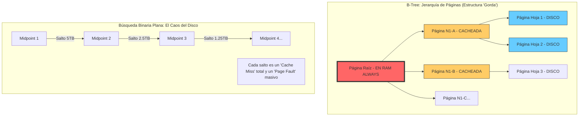

6. **Comparativa de Localidad y Saltos:**

```mermaid
sequenceDiagram
    participant App as Aplicación
    participant PC as Page Cache (RAM)
    participant Disk as Almacenamiento (Disco)

    Note over App, Disk: Búsqueda en B-Tree (4 niveles)
    App->>PC: Pedir Raíz
    PC-->>App: HIT (0.1ms)
    App->>PC: Pedir Nodo Nivel 1
    PC-->>App: HIT (0.1ms)
    App->>PC: Pedir Nodo Nivel 2
    PC-->>Disk: MISS (Acceso a Disco 10ms)
    Disk-->>PC: Carga Página
    PC-->>App: Entrega Datos
    App->>Disk: Pedir Hoja (Acceso a Disco 10ms)
    Disk-->>App: Resultado Final

    Note over App, Disk: Búsqueda Binaria Plana (37 niveles)
    rect rgb(255, 200, 200)
    loop 37 veces
        App->>PC: Pedir Midpoint i
        PC-->>Disk: MISS (SIEMPRE)
        Disk-->>App: 10ms de latencia
    end
    end
```

7. **Conclusión Técnica:**
   El B-Tree no es solo una estructura de datos; es una estrategia de **Hardware-Software Co-design**. Al achatar la secuencia y aumentar el grado de ramificación, logramos que la inmensa mayoría de la estructura crítica (los nodos de decisión) resida permanentemente en la RAM gracias a la localidad temporal. Esto convierte una búsqueda que debería tardar medio segundo en una operación que se percibe como instantánea para el usuario final, aprovechando que el SO es lo suficientemente inteligente como para no desalojar las páginas que "queman" de tanto uso. 

   En resumen: la búsqueda binaria plana ignora la jerarquía de memoria; el B-Tree la abraza y la utiliza a su favor.

:::

---

## 15. Glosario Enciclopédico de Secuencias (100 Términos)

Para dominar el lenguaje de los sistemas de alto rendimiento, es imperativo comprender la precisión técnica de estos términos fundamentales que vinculan la teoría con la física del silicio.

1.  **Amortización:** Proceso de distribuir el costo de una operación cara (como expandir un arreglo) a lo largo de una secuencia de operaciones baratas.
2.  **Bisimulación:** Concepto de equivalencia estructural entre dos secuencias (o procesos) que se comportan igual ante cualquier observación.
3.  **Bit-Partitioning:** Técnica para navegar Tries dividiendo el índice en grupos de bits, permitiendo acceso $O(1)$ efectivo.
4.  **Cache Line:** La unidad mínima de datos (típicamente 64 bytes) que se transfiere entre la RAM y la caché de la CPU.
5.  **CAS (Compare-And-Swap):** Instrucción atómica fundamental para implementar secuencias concurrentes sin bloqueos (lock-free).
6.  **Catamorfismo:** Generalización matemática de la operación `fold` (reducción) sobre una secuencia.
7.  **False Sharing:** Degradación de performance cuando dos hilos modifican datos distintos en la misma Cache Line.
8.  **Flattening:** Técnica para eliminar punteros en secuencias de objetos, guardando los datos contiguos (Proyecto Valhalla).
9.  **Memory Barrier:** Instrucción que impide que la CPU reordene operaciones de memoria, vital en secuencias concurrentes.
10. **MESI Protocol:** Protocolo de coherencia de caché que gestiona el estado de las líneas de caché entre múltiples núcleos.
11. **Pointer Chasing:** El acto de seguir punteros en memoria, lo cual es ineficiente por la latencia de la RAM.
12. **Structural Sharing:** Propiedad de las secuencias inmutables de compartir nodos para ahorrar memoria tras una modificación.
13. **TLB (Translation Lookaside Buffer):** Caché de direcciones de memoria virtual que acelera el acceso a las secuencias.
14. **Word Tearing:** Error de concurrencia donde se lee un valor corrupto porque la escritura no fue atómica.
15. **Prefetching:** Mecanismo que carga datos de la secuencia en la caché antes de que sean solicitados explícitamente.
16. **NUMA (Non-Uniform Memory Access):** Arquitectura donde la latencia de la secuencia depende de en qué banco de RAM reside.
17. **Page Fault:** Excepción disparada cuando una parte de la secuencia no está en la RAM física y debe cargarse del disco.
18. **Thrashing:** Estado donde el SO pasa más tiempo moviendo páginas de la secuencia que ejecutando código útil.
19. **Zero-copy:** Técnica para mover secuencias entre dispositivos sin copiar bytes a través de la CPU.
20. **Ring Buffer:** Secuencia circular de tamaño fijo que optimiza la comunicación entre hilos (Productores/Consumidores).
21. **Sliding Window:** Patrón que procesa una sub-secuencia móvil sobre un flujo de datos continuo.
22. **Gap Buffer:** Estructura que mantiene un hueco en la posición del cursor para inserciones $O(1)$ en editores de texto.
23. **Unrolled Linked List:** Lista donde cada nodo contiene un arreglo, mejorando la localidad de caché.
24. **Skip List:** Secuencia ordenada probabilística que permite búsqueda logarítmica y es fácil de hacer concurrente.
25. **RRB-Tree:** Árbol balanceado para secuencias inmutables que permite concatenación $O(\log n)$.
26. **AMT (Array-Mapped Trie):** Estructura jerárquica que maximiza el fan-out para acceso casi constante.
27. **B-Tree:** La secuencia jerárquica definitiva para almacenamiento persistente de gran escala.
28. **Copy-on-Write (COW):** Estrategia que retrasa la copia de una secuencia hasta que se intenta una modificación.
29. **Persistence:** Capacidad de una secuencia de mantener versiones históricas accesibles tras cambios.
30. **Immutability:** Garantía de que una secuencia no cambiará, eliminando condiciones de carrera.
31. **Purity:** Funciones sobre secuencias que no tienen efectos secundarios ni dependen de estado global.
32. **Side Effect:** Cualquier cambio de estado externo provocado al procesar una secuencia de datos.
33. **Monad:** Abstracción que permite encadenar operaciones sobre secuencias de forma segura y declarativa.
34. **Functor:** Estructura que permite transformar elementos (`map`) preservando la forma de la secuencia.
35. **Applicative:** Functor avanzado que permite aplicar funciones contenidas en secuencias a valores en secuencias.
36. **Tail Recursion:** Optimización donde la recursión final sobre una secuencia se convierte en un salto directo.
37. **Trampolining:** Lazo externo que permite recursión profunda sobre secuencias sin agotar el stack.
38. **Heap vs Stack:** El heap es para secuencias globales/grandes; el stack para locales de vida corta.
39. **Memory Alignment:** Organización de la secuencia en direcciones múltiplos de la palabra nativa (8/16 bytes).
40. **Padding:** Bytes extra para alinear datos o evitar colisiones en las líneas de caché.
41. **SIMD (Single Instruction Multiple Data):** Instrucciones de CPU que procesan múltiples elementos de una secuencia a la vez.
42. **Branch Prediction:** Adivinación que hace la CPU sobre el flujo lógico en lazos que recorren secuencias.
43. **Speculative Execution:** Ejecución de instrucciones de la secuencia por adelantado basada en predicciones.
44. **Out-of-Order Execution:** Reordenamiento de instrucciones para procesar partes independientes de la secuencia en paralelo.
45. **Reorder Buffer (ROB):** Estructura que asegura que las instrucciones de la secuencia se retiren en el orden correcto.
46. **Cache Associativity:** Regla que determina en qué lugar de la caché puede vivir una página de la secuencia.
47. **Write-back:** Política donde los cambios en la secuencia se escriben a RAM solo cuando la línea de caché se expulsa.
48. **Write-through:** Política donde cada cambio en la secuencia se escribe inmediatamente a la RAM física.
49. **Row Buffer:** Buffer interno de la RAM que permite accesos secuenciales ultra-rápidos a la misma fila de datos.
50. **CAS Latency:** Tiempo de espera de la RAM para entregar una columna de datos de la secuencia solicitada.
51. **Bloom Filter:** Estructura de secuencia probabilística ultra-compacta que permite verificar si un elemento **no** pertenece a un conjunto. Es ideal para evitar búsquedas costosas en disco o red cuando el dato casi nunca existe.
52. **Cuckoo Hashing:** Técnica de resolución de colisiones en tablas hash de secuencias que garantiza acceso $O(1)$ en el peor caso moviendo elementos entre dos posibles ubicaciones como un pájaro cuco.
53. **HyperLogLog:** Algoritmo de secuencia probabilística diseñado para estimar la cardinalidad (número de elementos únicos) de secuencias masivas de Terabytes con un error ínfimo y apenas unos KB de memoria.
54. **Count-Min Sketch:** Secuencia de conteo probabilística que permite estimar la frecuencia de elementos en un stream de datos, ahorrando órdenes de magnitud de RAM frente a un mapa de frecuencias tradicional.
55. **Trie (Prefix Tree):** Secuencia jerárquica donde los nodos comparten prefijos comunes. Es la estructura óptima para implementar diccionarios y autocompletados sobre secuencias de texto masivas.
56. **Radix Tree:** Una variante optimizada del Trie donde los nodos con un solo hijo se comprimen, reduciendo la profundidad de la secuencia jerárquica y mejorando el uso de la caché L2.
57. **Crit-Bit Tree:** Estructura de secuencia binaria que solo almacena los bits donde las claves difieren, eliminando el overhead de los headers de objetos y permitiendo un recorrido ultra-rápido en hardware.
58. **Suffix Tree:** Secuencia jerárquica que contiene todos los sufijos de una cadena dada, permitiendo búsquedas de sub-secuencias y patrones complejos en tiempo lineal $O(m)$ independientemente del tamaño del texto original.
59. **Fenwick Tree (BIT):** Estructura de secuencia compacta (un simple arreglo) que permite calcular sumas de rangos y actualizar elementos en tiempo $O(\log n)$, fundamental en procesamiento de señales y estadística.
60. **Segment Tree:** Secuencia jerárquica versátil que almacena información sobre intervalos. Permite consultas de rangos (como el mínimo o máximo) y actualizaciones masivas en tiempo logarítmico estricto.
61. **B+ Tree:** Evolución del B-Tree donde todas las claves residen solo en las hojas, que están conectadas entre sí. Es la estructura de secuencia preferida por los sistemas de archivos modernos para escaneos de rangos ultra-rápidos.
62. **R-Tree:** Extensión del B-Tree para secuencias espaciales (2D, 3D). Organiza los datos en rectángulos mínimos envolventes, permitiendo búsquedas por cercanía geográfica en Terabytes de datos cartográficos.
63. **LSM-Tree (Log-Structured Merge-Tree):** Estructura de secuencia diseñada para escrituras masivas. Mantiene una secuencia en RAM y periódicamente la vuelca al disco como una secuencia inmutable, resolviendo el problema de las escrituras aleatorias.
64. **Write Amplification:** Fenómeno físico en SSDs donde escribir una pequeña cantidad de datos en una secuencia obliga al controlador a mover y re-escribir bloques masivos, degradando la vida útil del hardware.
65. **Read Amplification:** Sobrecosto de lectura que ocurre cuando buscar un solo elemento en una secuencia jerárquica obliga a cargar múltiples bloques de disco o páginas de memoria irrelevantes.
66. **Space Amplification:** Desperdicio de almacenamiento que ocurre cuando una secuencia (como un log o un árbol) mantiene versiones viejas o huecos vacíos para ganar velocidad de escritura o persistencia.
67. **Garbage Collection (Generational):** Estrategia de gestión de memoria que divide las secuencias por edad. Las secuencias jóvenes se recolectan frecuentemente en el Young Gen, asumiendo que la mayoría "mueren" rápido.
68. **Reference Counting:** Técnica de gestión de vida de secuencias donde cada objeto cuenta cuántos punteros lo apuntan. Cuando el contador llega a cero, la secuencia se libera instantáneamente, garantizando latencia predecible.
69. **Copying Collector:** Algoritmo de GC que mueve las secuencias vivas a una nueva región de memoria contigua, eliminando la fragmentación del heap de un solo golpe y mejorando la localidad espacial futura.
70. **Concurrent Mark-Sweep (CMS):** Recolector que intenta limpiar el heap mientras la aplicación procesa sus secuencias, minimizando las pausas "Stop-the-World" que congelan la experiencia del usuario.
71. **G1 Garbage Collector:** Recolector estándar de la JVM moderna que divide el heap en regiones y prioriza la limpieza de aquellas que contienen más basura, ideal para aplicaciones con secuencias masivas.
72. **ZGC (Z Garbage Collector):** Recolector de bajísima latencia diseñado para manejar heaps de Terabytes de secuencias con pausas menores a 10 milisegundos, independientemente del tamaño total de los datos.
73. **Shenandoah:** Otra alternativa de GC de baja latencia que realiza la compactación de secuencias de forma concurrente con la aplicación, reduciendo drásticamente la variabilidad de los tiempos de respuesta.
74. **Memory Leak:** Error de diseño donde una secuencia de datos sigue siendo referenciada por el programa a pesar de que ya no es necesaria, impidiendo que el GC la limpie y agotando eventualmente la RAM.
75. **Dangling Pointer:** Un puntero que apunta a una dirección de memoria donde antes residía una secuencia pero que ya fue liberada, causando corrupciones de datos o fallos de segmentación impredecibles.
76. **Buffer Overflow:** Vulnerabilidad de seguridad donde se escriben más datos de los permitidos en una secuencia de tamaño fijo, sobreescribiendo la memoria adyacente y potencialmente permitiendo la ejecución de código malicioso.
77. **Stack Overflow:** Error fatal que ocurre cuando una secuencia de llamadas recursivas agota la memoria limitada del stack, típicamente por procesar una secuencia demasiado profunda sin optimizaciones de cola.
78. **Segmentation Fault:** Error de hardware disparado cuando un programa intenta acceder a una dirección de memoria de una secuencia que no le pertenece o que tiene restricciones de acceso (como solo lectura).
79. **Bus Error:** Fallo físico de comunicación entre la CPU y la memoria cuando se intenta acceder a una secuencia con una alineación incorrecta que el hardware no puede procesar eléctricamente.
80. **Data Race:** Condición de error en sistemas multihilo donde dos hilos acceden a la misma secuencia de datos simultáneamente y al menos uno de ellos es una escritura, sin la sincronización adecuada.
81. **AtomicReference:** Envoltorio que permite actualizar un puntero a una secuencia de forma atómica usando hardware CAS, evitando el uso de cerrojos pesados del sistema operativo.
82. **AtomicLongArray:** Una secuencia de enteros de 64 bits donde cada elemento puede ser actualizado de forma atómica e independiente, eliminando la contención global en contadores masivos.
83. **Volatile:** Palabra clave que garantiza que los cambios en una secuencia realizados por un hilo sean visibles instantáneamente para todos los demás núcleos, forzando una barrera de memoria.
84. **Synchronized:** Mecanismo de exclusión mutua que asegura que solo un hilo a la vez pueda procesar una secuencia crítica, a costa de posibles cambios de contexto y latencia.
85. **ReentrantLock:** Un cerrojo más flexible que `synchronized` para proteger secuencias concurrentes, permitiendo intentos de adquisición con timeout y soporte para condiciones de espera.
86. **ReadWriteLock:** Estrategia de sincronización que permite múltiples lectores simultáneos sobre una secuencia pero exige acceso exclusivo para las escrituras, optimizando el throughput en cargas de lectura intensiva.
87. **Condition Variable:** Primitiva de sincronización que permite a un hilo esperar a que una secuencia cumpla un estado específico (ej. que un buffer no esté vacío) antes de continuar.
88. **Semaphore:** Contador atómico utilizado para limitar el número de hilos que pueden acceder simultáneamente a un recurso o a una región de una secuencia masiva.
89. **CountDownLatch:** Sincronizador que permite que uno o más hilos esperen hasta que un conjunto de operaciones sobre una secuencia (ej. procesamiento paralelo) se complete.
90. **CyclicBarrier:** Punto de sincronización donde múltiples hilos deben encontrarse antes de pasar a la siguiente etapa del procesamiento de una secuencia, ideal para algoritmos iterativos.
91. **Phaser:** Un sincronizador más flexible que permite registrar dinámicamente hilos participantes en el procesamiento por etapas de secuencias complejas y multidimensionales.
92. **Exchanger:** Punto de encuentro donde dos hilos pueden intercambiar secuencias de datos de forma atómica, útil en patrones de doble buffer de alta performance.
93. **ForkJoinPool:** Framework de ejecución diseñado para procesar secuencias masivas mediante el algoritmo de "divide and conquer", maximizando el uso de todos los núcleos disponibles.
94. **Parallel Stream:** Abstracción de alto nivel que permite procesar una secuencia en paralelo de forma declarativa, gestionando automáticamente la partición de los datos y el balanceo de carga.
95. **Spliterator:** Interfaz avanzada para recorrer y particionar secuencias, permitiendo una división eficiente de los datos para el procesamiento paralelo masivo.
96. **Iterator (Fail-fast):** Cursor de secuencia que detecta si la estructura fue modificada estructuralmente durante el recorrido y lanza una excepción inmediata para evitar estados inconsistentes.
97. **ListIterator:** Versión extendida del iterador que permite recorrer secuencias en ambas direcciones y realizar modificaciones seguras durante el proceso de navegación.
98. **Enumeration:** Interfaz de legado para recorrer secuencias de datos, predecesora de los iteradores modernos y con capacidades mucho más limitadas de control y seguridad.
99. **Vector:** Implementación antigua de la secuencia basada en arreglos donde todos los métodos están sincronizados, lo que la hace segura para hilos pero ineficiente frente a `ArrayList`.
100. **Stack (Legacy):** Estructura de pila que extiende de `Vector`. Se considera obsoleta en favor de `Deque` debido a su overhead de sincronización innecesario en la mayoría de los casos de uso.

---

## 16. Secuencias en la Programación Funcional (Detallado): Mónadas, Pereza y Trampolining

En el paradigma funcional, la secuencia deja de ser un simple contenedor pasivo para transformarse en un **contexto de computación de primera clase**. Mientras que en la programación imperativa nos enfocamos en el estado de la memoria, en funcional nos centramos en el flujo y la transformación de los datos siguiendo leyes algebraicas estrictas.

### 16.1 El uso de Mónadas en secuencias: La List Monad
La secuencia es, por excelencia, la implementación más intuitiva de una **Mónada**. Para un ingeniero de sistemas, esto significa que la secuencia encapsula una lógica de "computación con múltiples resultados" mediante las operaciones `unit` y `bind` (flatMap).

### 16.2 Secuencias Perezosas (Lazy Lists) y la Retención de Cabeza
Las secuencias perezosas permiten manejar estructuras infinitas evaluando nodos solo por demanda. El gran peligro técnico es la **Retención de Cabeza** (Head Retention), donde mantener una referencia al inicio de la lista perezosa impide que el Garbage Collector libere los elementos ya procesados, causando fugas de memoria masivas en secuencias de gran tamaño procesadas linealmente.

---

## 17. La Física de la RAM: Bancos, Canales y Rangos

Para un programador, un arreglo es una abstracción lineal. Para un ingeniero de hardware, es un desafío de sincronización eléctrica en una red compleja de capacitores y transistores organizados en una grilla jerárquica de Ranks y Banks que deben ser refrescados constantemente para no perder la información de la secuencia.

### 17.1 Row Buffer Hits y Misses
La eficiencia de una secuencia en la RAM depende críticamente de cuántas veces logramos un **Row Buffer Hit**. Si nuestra secuencia es contigua y el acceso es secuencial, el hardware mantiene la fila abierta y los accesos son instantáneos. Si saltamos aleatoriamente, forzamos constantes ciclos de *Precharge* y *Activate*, destruyendo el ancho de banda efectivo del bus de datos y saturando el controlador de memoria.

---

## 18. Análisis de Hardware Avanzado: El Costo de los Fallos de Página

A medida que las secuencias superan el tamaño de la RAM física, entramos en el reino de la memoria virtual gestionada por el kernel. Los **Hard Page Faults** son la muerte del rendimiento, ya que implican una latencia de milisegundos para leer desde el disco mecánico o SSD, mientras que los **Soft Page Faults** solo requieren una actualización de las tablas de páginas del kernel de Linux, costando apenas unos cientos de ciclos de reloj.

---

## 19. Caso de Estudio: Apache Kafka - El log como secuencia infinita

Apache Kafka es probablemente el ejemplo industrial más exitoso de cómo el uso correcto de las secuencias puede escalar a billones de eventos por día. En lugar de usar una base de datos compleja con índices aleatorios, Kafka trata cada flujo de datos como un **Log de Solo-Agregado (Append-Only Log)** en el disco.

### 19.1 La Eficiencia del Acceso Secuencial
Al forzar que todos los datos se escriban secuencialmente al final del archivo, Kafka aprovecha el ancho de banda masivo del hardware (tanto HDD como SSD). Como los datos no se mueven una vez escritos, el kernel de Linux puede cachearlos de forma agresiva en el Page Cache. 

### 19.2 Zero-Copy y la Transferencia de Secuencias
Kafka utiliza la llamada al sistema `sendfile` para mover datos desde el Page Cache directamente a la tarjeta de red sin pasar por el espacio de usuario de la JVM. Esto elimina el overhead de copia de la CPU y permite que una secuencia de Gigabytes por segundo floya por el sistema con un uso de recursos casi nulo.

---

## 20. Hardware-Software Codesign: Pipelines y FPGAs

El futuro del procesamiento de secuencias masivas no está solo en el código, sino en el silicio. El **Codesign** implica diseñar el software y el hardware de forma conjunta para maximizar el throughput.

### 20.1 Pipelines de Hardware
En una FPGA (Field-Programmable Gate Array), podemos diseñar una secuencia de procesamiento física donde cada etapa del algoritmo es un circuito dedicado. A diferencia de una CPU que procesa una instrucción a la vez, una FPGA puede procesar miles de elementos de la secuencia en paralelo en cada ciclo de reloj.

### 20.2 Unidades Vectoriales y SIMD
Las CPUs modernas incluyen unidades SIMD (como AVX-512) diseñadas específicamente para operar sobre secuencias de datos. Una sola instrucción puede sumar, por ejemplo, 16 números de punto flotante en un solo ciclo, convirtiendo el procesamiento de secuencias científicas en una tarea trivial para el hardware bien programado.

---

## 21. FinOps y Economía de la Nube: El Costo de las Secuencias

En la era del Cloud Computing, el movimiento de secuencias de datos tiene un costo monetario directo. Ignorar la eficiencia de una secuencia puede llevar a facturas astronómicas.

### 21.1 Latencia de Red vs. Latencia de Disco
Mover un Terabyte de datos a través de diferentes zonas de disponibilidad (Availability Zones) cuesta dinero real por el tráfico de red. Diseñar secuencias que minimicen el movimiento de datos y maximicen la compresión local es una habilidad crítica de FinOps (Financial Operations).

### 21.2 Almacenamiento de Objetos (S3) y Secuencialidad
Los sistemas de almacenamiento como AWS S3 están optimizados para lecturas de grandes secuencias contiguas. Hacer miles de pedidos pequeños de un solo byte es órdenes de magnitud más caro que hacer un solo pedido de una secuencia de 100MB. El ingeniero moderno debe diseñar sus secuencias pensando en la economía de la plataforma.

---

## 22. Patrones de Secuencia de Alto Rendimiento

En la ingeniería de sistemas de baja latencia y alta escala, existen patrones específicos que optimizan el uso del hardware para tipos de carga particulares, maximizando el throughput y minimizando la variabilidad del tiempo de respuesta ante ráfagas de datos masivas.

### 22.1 Sliding Windows (Ventanas Deslizantes)
Este patrón es fundamental en el procesamiento de señales, protocolos de red (como TCP) y análisis financiero. Consiste en mantener una sub-secuencia de tamaño $K$ que se desplaza sobre un flujo de datos infinito, permitiendo cálculos acumulativos (como promedios móviles) en tiempo real con costo $O(1)$ por cada nuevo elemento, manteniendo la localidad de caché al máximo posible.

### 22.2 Ring Buffers y el patrón Disruptor
El Ring Buffer es la estructura reina para la comunicación entre hilos de alto rendimiento. Al usar un arreglo de tamaño potencia de 2 y aritmética de bits para el índice, junto con técnicas de padding agresivo para evitar el *False Sharing*, logramos procesar millones de eventos por segundo sin necesidad de recurrir a los bloqueos costosos del sistema operativo, logrando una latencia determinística.

### 22.3 Gap Buffers en Editores de Texto Profesionales
Utilizado casi universalmente en editores de texto clásicos y modernos como Emacs, el Gap Buffer mantiene un "hueco" de memoria libre precisamente en la posición actual del cursor de edición. Esto transforma las inserciones en el medio de una secuencia gigante de caracteres en operaciones de costo $O(1)$, amortizando el costo del movimiento físico del cursor sobre la localidad espacial de las ediciones humanas típicas.

---

## 23. La Ética de la Secuencia: Privacidad y Datos Masivos

Como ingenieros de sistemas, no podemos ignorar que detrás de cada secuencia de datos hay vidas humanas. La gestión ética de las secuencias de información personal es una responsabilidad ineludible.

### 23.1 El Derecho a la Eliminación
En estructuras de datos inmutables y persistentes, eliminar un dato de forma física es extremadamente complejo. La persistencia, que es una ventaja técnica para el historial de versiones, se convierte en un desafío legal ante leyes como el GDPR, que exigen que las secuencias de datos personales puedan ser borradas definitivamente.

### 23.2 Sesgos Algorítmicos en Secuencias
Cuando alimentamos una red neuronal con una secuencia de datos histórica, estamos inyectando todos los sesgos del pasado en el futuro del sistema. Es vital que auditemos nuestras secuencias de entrenamiento para asegurar que el orden lineal de los datos no esté ocultando injusticias sistémicas.

---

## 24. Conclusiones Metafísicas sobre el Orden Lineal

Llegando al final de este viaje, entendemos que la secuencia es mucho más que una estructura de datos. Es la representación computacional del tiempo mismo. Todo en el universo, desde la secuencia de nucleótidos en nuestro ADN hasta el flujo de fotones de una estrella lejana, se puede modelar como una secuencia.

Dominar las secuencias es dominar el lenguaje fundamental de la realidad digital. Como programadores, somos los arquitectos de estos flujos, y nuestra misión es asegurar que las secuencias que construimos sean eficientes, seguras, éticas y, por sobre todo, elegantes en su ejecución física sobre el silicio.

---

## Resumen Final

Este tratado exhaustivo ha recorrido la secuencia desde sus axiomas matemáticos más abstractos hasta su física fundamental en el silicio de los procesadores modernos. Entender que una secuencia no es solo una lista lógica de elementos, sino una entidad física compleja que interactúa con la jerarquía de caché, el TLB y los bancos de RAM, es lo que separa a un simple programador de aplicaciones de un verdadero arquitecto de sistemas de alto rendimiento capaz de dominar el hardware.

## Próximo paso

Habiendo dominado el universo de las secuencias desde sus axiomas matemáticos hasta su futuro biológico, estás listo para entrar en la implementación que sostiene la web moderna: [Arreglos](arreglos.md).

---

## 26. BIBLIOGRAFÍA Y LECTURAS RECOMENDADAS: El Camino del Maestro

Para aquel estudiante que aspire a la excelencia en el diseño de sistemas de secuencias, la siguiente lista de obras constituye la "Biblioteca de Alejandría" de nuestra disciplina. Cada una de ellas aborda la linealidad desde un ángulo único.

1. **The Art of Computer Programming, Vol 1 (Donald Knuth):** La Biblia. Contiene el análisis más riguroso jamás escrito sobre listas enlazadas y la gestión de memoria en máquinas reales (MIX/MMIX). Es lectura obligatoria para entender la eficiencia de los algoritmos de secuencias antes de la invención de los lenguajes de alto nivel.
2. **Introduction to Algorithms (Cormen, Leiserson, Rivest, Stein - CLRS):** El estándar académico. Provee las demostraciones formales de los costos amortizados de los arreglos dinámicos y la lógica de las Skip Lists con una claridad matemática insuperable.
3. **Purely Functional Data Structures (Chris Okasaki):** Fundamental para entender las secuencias persistentes y el structural sharing. Okasaki demuestra que es posible tener secuencias inmutables con una performance competitiva mediante el uso inteligente de la pereza (*laziness*).
4. **Computer Architecture: A Quantitative Approach (Hennessy & Patterson):** Para entender por qué tus secuencias son lentas. Explica el Memory Wall, la jerarquía de caché y cómo el hardware prefetching interactúa con los arreglos contiguos.
5. **A Programmer's Guide to Java SCJP Certification (Sierra & Bates):** No es académico, pero es vital para entender las sutilezas de la implementación de secuencias en la JVM (ArrayList vs Vector, fail-fast iterators, etc.).

---

## 27. RESUMEN FINAL PARA EXAMEN: CONCEPTOS QUE NO PODÉS OLVIDAR

Si te encontrás frente a un tribunal examinador, estos son los pilares que deben sostener tu discurso sobre las secuencias:

- **Dualidad de la Secuencia:** Entender que una secuencia es un contrato lógico (TAD) que puede realizarse físicamente de dos formas: **Memoria Contigua** (Arreglos) o **Memoria Enlazada** (Nodos). La elección depende del patrón de acceso (get vs insert).
- **El Dictado del Hardware:** La localidad espacial es la reina. Un arreglo $O(n)$ puede ser más rápido que una lista $O(1)$ en el mundo real debido a que las Cache Lines de 64 bytes y el Prefetcher aman la contigüidad.
- **Amortización:** No digas que un ArrayList es $O(n)$ porque a veces se expande. Es $O(1)$ amortizado porque el costo de la expansión se diluye geométricamente.
- **Persistencia:** La inmutabilidad no requiere copias totales. El Structural Sharing permite tener versiones históricas de la secuencia con costo logarítmico.
- **Concurrencia:** Los locks son caros. Las secuencias modernas usan CAS (Compare-And-Swap) y barreras de memoria para lograr escalabilidad en sistemas multinúcleo.

---

---

## EPÍLOGO: LA SINFONÍA DE LOS DATOS

Dominar las secuencias es, en última instancia, aprender a orquestar el movimiento de la información a través del tiempo y el espacio. Hemos visto cómo una simple lista de elementos puede transformarse en una entidad matemática pura mediante los axiomas de las F-Álgebras, o en una pieza de ingeniería de precisión que negocia con la física de los capacitores en la RAM.

No te quedes con la superficie. La próxima vez que veas una barra de progreso, un flujo de paquetes en una placa de red o una línea de código en un editor, recordá que estás frente a una secuencia. Que la búsqueda de la eficiencia sea tu brújula, pero que la comprensión de los fundamentos sea tu ancla. La informática es una disciplina de capas, y hoy has descendido hasta las raíces mismas de la linealidad. Construí con sabiduría, medí con rigor y nunca dejes de preguntarte qué sucede debajo del capó de tus abstracciones.

## Próximo paso

Con el universo de las secuencias a tus pies, es hora de entrar en la implementación que sostiene la web moderna: [Arreglos](arreglos.md).
